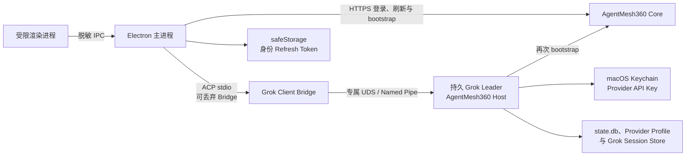

# AgentMesh360 桌面身份外壳

`desktop/` 是当前 AgentMesh360 客户端的 Electron 桌面入口。它不是旧
`/Users/ferdinandji/AgentMesh` Electron 原型的延续，也不依赖 OpenClaw。
它直接通过 ACP 管理本 Fork 构建出的 Grok Build Host。

## 当前已经实现

- 邮箱密码登录 AgentMesh360 账号；
- Access Token 仅保存在桌面主进程内存中；
- Refresh Token 使用 Electron `safeStorage` 加密后写入本机。在 macOS 上，
  加密密钥由 Keychain 保护；安全存储不可用时拒绝明文降级；
- 启动时恢复登录并轮换 Refresh Token；
- 启动、系统唤醒、窗口重新聚焦和每五分钟重新验证订阅；
- 订阅无效、过期或暂停时，只显示订阅拦截页和官网续费入口；
- 订阅有效时，必须由 Core 和本地 Host 双重确认，才显示 Agent 首页；
- 通过真实 ACP 进程列出、激活 Job Agent、Lecturecast Agent 与 Deploy Agent；
- 默认通过 AgentMesh360 专属 socket 连接持久 Grok Leader；退出桌面 UI 只断开
  ACP Bridge，后台 Host 与固定 Main Session 继续存在，重新打开后采用同一 Leader；
- Leader 崩溃后复用上游有界重连；桌面身份控制器收到重连事件后从安全存储刷新身份，
  重新校验 Core 与替代 Host，不沿用旧 Access Token；
- 正式打包版在首次激活常驻 Agent 时请求开启系统登录启动；系统登录启动不创建
  BrowserWindow/Renderer，由轻量主进程恢复身份、订阅和 Host；
- “客户端设置”可查看脱敏 Host 状态、macOS Login Item 状态并随时关闭开机恢复；
- 退出登录时删除本机 Refresh Token，并立即撤销 Host 的产品 Agent 准入状态。
- Host 已提供账户隔离的 Provider Profile CRUD 和只写秘密管理 ACP 方法；Provider
  API Key 在 macOS 进入 Host 直接访问的独立 Keychain 项，`state.db` 只保存不透明
  引用和最后四位；Host 还提供声明式 Catalog 与三层 Model Assignment 管理方法；
- Renderer 已有 Provider 设置页、Profile/Assignment 管理、三档显式 Probe 与付费
  二次确认；
- Renderer 已有 Agent Package Center，按 `packageId` 展示发现、下载、权限批准、
  reconcile 与 rollback；URL、digest、签名材料和本机路径仍只由 Host 持有；
- H2d4 已补齐 Release Manifest 消费门，但生产 Root、Trust Bundle、Registry endpoint
  和上传发布保持关闭，所以当前 Package Center 不会取得真实生产远端内容；
- 当前账号 Host Catalog 返回的所有产品 Agent 都复用固定 Main Session 文本对话：
  Renderer 只提交 `agentId` 与文本，主进程/Host 解析账户绑定的 Session，使用标准
  ACP 加载历史、发送 Prompt 和接收流式更新；Session ID、Workspace 路径、Provider
  凭据和原始 Host 错误不进入页面；
- Renderer 重建会恢复主进程中的有界安全对话 snapshot；账号切换清空旧 authority，
  Leader 重连或 Prompt 超时后可在原对话内显式重新打开。
- 标准 ACP `session/request_permission` 由主进程持有原始请求、Session、Tool 和
  Option authority；页面只显示安全工具摘要，并只能“仅本次允许”“仅本次拒绝”或
  取消。永久/未知选项以及订阅、账号、Agent、重连、Host、Prompt 和超时变化均失败
  关闭。
- 标准 ACP `tool_call` / `tool_call_update` 由主进程按当前 Session 合并，页面只显示
  本地 `activity-N`、允许列表工具类别和四态状态；最多保留 50 项，终态冻结，Host
  replay 是唯一历史来源。上游 Tool Call ID、标题、内容、位置、原始输入输出、命令
  和路径不会进入 Renderer。
- Workspace Artifact、Project State、普通 Harness 后台活动与 Session Plan 已使用
  Host-owned authority 做成有界只读投影；页面不取得路径、原始任务、Todo ID、
  Scheduler、Subagent 或业务 mutation authority。
- Gemini F0b 已在用户明确的 12 次短请求上限内使用 11 次完成真实契约验证；Catalog
  只加入实际通过的官方兼容预设，不批量声称其他 Provider 已兼容。

当前尚未实现 OAuth、Plan/Todo mutation、Scheduler、Subagent 或 Agent 专属垂直
页面；其他 Provider 的真实 E2E 仍需逐个取得凭据与费用授权，动态 Agent Package
的生产发布也仍关闭。生产 Registry 关闭意味着当前动态 Agent 泛化只有本地 fixture
证据，不代表用户已经能从远端取得新 Agent。这些能力按
[`PRODUCT_BLUEPRINT.md`](../docs/architecture/PRODUCT_BLUEPRINT.md) 的顺序继续开发。
H2d4 后的顺序复核与发布硬门见
[`PRODUCT_PLAN_AND_PRODUCTION_RELEASE_GATE.md`](../docs/architecture/PRODUCT_PLAN_AND_PRODUCTION_RELEASE_GATE.md)。
Cycle 56 的生产准备与内部 canary 计划见
[`PRODUCTION_PREPARATION_AND_INTERNAL_CANARY_PLAN.md`](../docs/architecture/PRODUCTION_PREPARATION_AND_INTERNAL_CANARY_PLAN.md)。

## 运行结构



渲染进程在用户登录输入期间会短暂接触邮箱和密码，但不得持久化或读回 Access Token、
Refresh Token、密码或 Provider API Key。它只能调用白名单 IPC，接收 `signed_out`、
`checking`、`blocked`、`unavailable` 或 `ready` 等脱敏状态。
外部跳转只允许 `https://agentmesh360.com`，窗口导航、下载和浏览器权限全部默认拒绝。

## 本地开发

```bash
cd desktop
npm install
npm run check
npm test
npm start
```

开发运行时，Host 按以下顺序查找：

1. `AGENTMESH360_HOST_BIN` 指定的二进制；
2. 打包应用中的 `Resources/bin/agentmesh360-host`；
3. 仓库内 `target/release/xai-grok-pager`；
4. 仓库内 `target/debug/xai-grok-pager`；
5. `PATH` 中的 `grok`。

Core 默认地址是 `https://api.agentmesh360.com`。本地集成测试可设置
`AGENTMESH360_CORE_URL`，该变量也会传递给 Host，确保两端校验同一个 Core。

Host 默认以 `persistent_leader` 运行，socket 为
`$AGENTMESH360_HOME/run/host.sock`（未设置 Home 时是
`~/.agentmesh360/run/host.sock`）。可以用 `AGENTMESH360_HOST_SOCKET` 指定更短的
产品专属路径。`AGENTMESH360_HOST_MODE=embedded` 会退回 `--no-leader`，只用于
隔离测试和诊断；它不是正式产品运行方式。详细生命周期与信任边界见
[`ADR_BACKGROUND_HOST_LIFECYCLE.md`](../docs/architecture/ADR_BACKGROUND_HOST_LIFECYCLE.md)。

macOS 13+ 不再依赖已经失效的 `openAsHidden`，而使用 Electron 提供的
`wasOpenedAtLogin` 判断后台启动。后台实例收到用户正常打开应用的第二实例后，才创建
窗口。若系统设置返回 `requires-approval`，客户端设置页会提示用户在“系统设置 →
通用 → 登录项”中批准。开发模式不会写入真实 Login Item。

## 验证

基础验证：

```bash
npm test
npm run check
npm audit
```

验证 Job Agent 固定 Main Session 对话界面：

```bash
npm run test:conversation-ui
```

真实 Host 契约测试会启动本地临时 Core 和实际 Rust Host，验证有效订阅放行、
三个 Agent 可见，以及订阅到期后的立即拒绝。相同命令还会验证持久 Leader 在第一个
Bridge detach 后仍存活，第二个 Bridge 恢复同一个产品 Agent Main Session；测试
Leader 会在结束时主动清理：

```bash
AGENTMESH360_REAL_HOST_BIN=../target/debug/xai-grok-pager \
  node --test tests/real-host.test.js tests/real-host-lifecycle.test.js
```

生成实际 Electron 渲染截图：

```bash
AGENTMESH360_VISUAL_STATE=ready \
AGENTMESH360_SCREENSHOT=/tmp/agentmesh360-ready.png \
  ./node_modules/.bin/electron tests/visual-smoke.js
```

验证后台启动不创建 Renderer（使用隔离的临时 `userData`）：

```bash
mkdir -p /tmp/am360-background-smoke/userData
AGENTMESH360_BACKGROUND_SMOKE_HOME=/tmp/am360-background-smoke/userData \
  ./node_modules/.bin/electron tests/background-main-smoke.js \
  --agentmesh360-background
```

验证客户端设置页视觉和开关 IPC：

```bash
AGENTMESH360_VISUAL_STATE=background \
AGENTMESH360_SCREENSHOT=/tmp/agentmesh360-background.png \
  ./node_modules/.bin/electron tests/visual-smoke.js
```

macOS 打包命令会先构建 release Host，再将它以
`Resources/bin/agentmesh360-host` 打入应用：

```bash
npm run build:mac
```

正式分发前仍需补齐 Apple Developer ID 签名、公证、自动更新与发布流水线。
签名安装包中的 macOS Login Item 注册/批准/升级、Electron 主进程自身守护以及受控
Host shutdown 仍是发布门槛；源码和开发 smoke 通过不等于生产安装链已验收。
