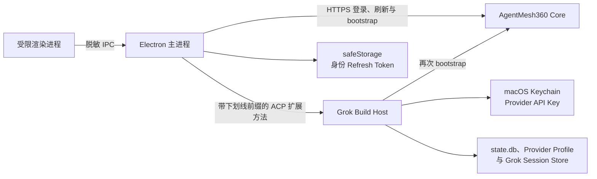

# AgentMesh360 桌面身份外壳

`desktop/` 是当前 AgentMesh360 客户端的 Electron 桌面入口。它不是旧
`/Users/ferdinandji/AgentMesh` Electron 原型的延续，也不依赖 OpenClaw。
它直接通过 ACP 管理本 Fork 构建出的 Grok Build Host。

## 当前已经实现

- 邮箱密码登录 AgentMesh360 账号；
- Access Token 仅保存在桌面主进程内存中；
- Refresh Token 使用 Electron `safeStorage` 加密后写入本机。在 macOS 上，
  加密密钥由 Keychain 保护；安全存储不可用时拒绝明文降级；
- 启动时恢复登录并轮换 Refresh Token；
- 启动、系统唤醒、窗口重新聚焦和每五分钟重新验证订阅；
- 订阅无效、过期或暂停时，只显示订阅拦截页和官网续费入口；
- 订阅有效时，必须由 Core 和本地 Host 双重确认，才显示 Agent 首页；
- 通过真实 ACP 进程列出、激活 Job Agent、Lecturecast Agent 与 Deploy Agent；
- 退出登录时删除本机 Refresh Token，并立即撤销 Host 的产品 Agent 准入状态。
- Host 已提供账户隔离的 Provider Profile CRUD 和只写秘密管理 ACP 方法；Provider
  API Key 在 macOS 进入 Host 直接访问的独立 Keychain 项，`state.db` 只保存不透明
  引用和最后四位；Host 还提供声明式 Catalog 与三层 Model Assignment 管理方法。
  这些管理能力尚未暴露给 Renderer。

本切片尚未实现 OAuth、BYOK Provider 设置 UI、Session Binding、真实模型路由、
固定对话界面、垂直业务工作区和动态 Agent Package。这些能力仍按
[`PRODUCT_BLUEPRINT.md`](../docs/architecture/PRODUCT_BLUEPRINT.md) 的顺序继续开发。

## 运行结构



渲染进程在用户登录输入期间会短暂接触邮箱和密码，但不得持久化或读回 Access Token、
Refresh Token、密码或 Provider API Key。它只能调用白名单 IPC，接收 `signed_out`、
`checking`、`blocked`、`unavailable` 或 `ready` 等脱敏状态。
外部跳转只允许 `https://agentmesh360.com`，窗口导航、下载和浏览器权限全部默认拒绝。

## 本地开发

```bash
cd desktop
npm install
npm run check
npm test
npm start
```

开发运行时，Host 按以下顺序查找：

1. `AGENTMESH360_HOST_BIN` 指定的二进制；
2. 打包应用中的 `Resources/bin/agentmesh360-host`；
3. 仓库内 `target/release/xai-grok-pager`；
4. 仓库内 `target/debug/xai-grok-pager`；
5. `PATH` 中的 `grok`。

Core 默认地址是 `https://api.agentmesh360.com`。本地集成测试可设置
`AGENTMESH360_CORE_URL`，该变量也会传递给 Host，确保两端校验同一个 Core。

## 验证

基础验证：

```bash
npm test
npm run check
npm audit
```

真实 Host 契约测试会启动本地临时 Core 和实际 Rust Host，验证有效订阅放行、
三个 Agent 可见，以及订阅到期后的立即拒绝：

```bash
AGENTMESH360_REAL_HOST_BIN=../target/debug/xai-grok-pager \
  node --test tests/real-host.test.js
```

生成实际 Electron 渲染截图：

```bash
AGENTMESH360_VISUAL_STATE=ready \
AGENTMESH360_SCREENSHOT=/tmp/agentmesh360-ready.png \
  ./node_modules/.bin/electron tests/visual-smoke.js
```

macOS 打包命令会先构建 release Host，再将它以
`Resources/bin/agentmesh360-host` 打入应用：

```bash
npm run build:mac
```

正式分发前仍需补齐 Apple Developer ID 签名、公证、自动更新与发布流水线。
