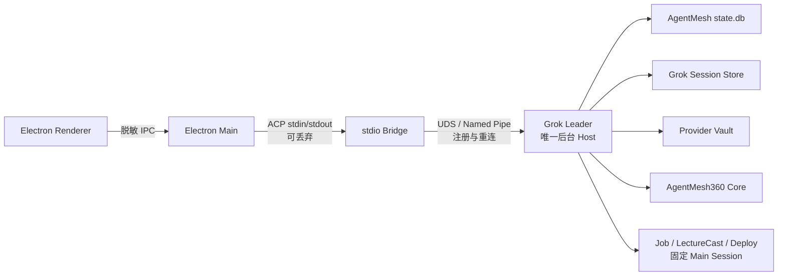
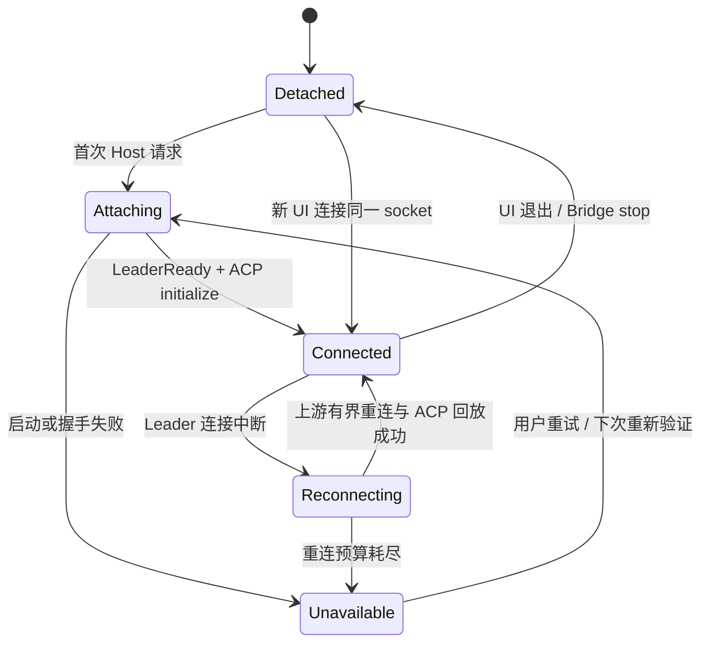

# ADR：后台 Host 生命周期与桌面重连

状态：已接受，G0 基础已实现  
日期：2026-07-24  
决策范围：AgentMesh360 桌面客户端、本 Fork 的 Grok Build Host、所有持久产品 Agent

## 背景

AgentMesh360 的 Job Agent、LectureCast Agent、Deploy Agent 和未来的产品 Agent
必须拥有长期身份、固定 Main Session 和可恢复的业务状态。用户关闭或退出桌面 UI
不应等价于销毁 Agent；重新打开客户端时，也不应创建另一份 Harness 或一段失忆的
新对话。

G0 之前，Electron 直接启动：

```text
xai-grok-pager agent --no-leader stdio
```

该进程同时承担 ACP 桥与完整 Host。Electron 退出时调用 `host.stop()`，子进程随之
终止。虽然 Session 和 Registry 已经落盘，但这条生命周期仍不满足“激活后长期在线”。

源码审计确认，Grok Build 已有完整的 Leader 子系统：

- `connect_or_spawn` 通过 socket、文件锁和 PID 协调单实例；
- Leader 以独立进程组运行，并可配置为客户端全部断开后继续运行；
- 多个 stdio 客户端可连接同一 Leader；
- 注册响应和 `LeaderReady` 构成启动握手；
- 客户端具有有界重连和 ACP initialize/session load 回放；
- Leader 协议版本过旧时，客户端可请求旧 Leader 退出并由当前二进制替换；
- 上游已有 Leader stdio、进程死亡、版本偏差和 soak 测试。

因此问题不是“缺少一个后台 Agent 框架”，而是桌面端没有使用 Fork 已经拥有的
持久 Harness 运行模式。

## 决策

### 1. 复用 Grok Leader 作为唯一后台 Host

AgentMesh360 不再另造 Node daemon、HTTP Supervisor 或每 Agent 一进程的运行时。
默认桌面启动命令改为：

```text
xai-grok-pager agent --leader stdio
```

该命令本身只是可丢弃的 ACP stdio 桥。它连接或拉起一个独立 Grok Leader；真正的
Harness、产品 Agent、Session、Provider 路由和后台任务由 Leader 持有。



Electron 拥有 Bridge，不拥有 Leader。`AcpHostClient.stop()` 在默认模式中表示
“detach Bridge”，不是“停止后台 Host”。

### 2. AgentMesh360 使用专属 socket/lock

默认运行目录：

```text
~/.agentmesh360/run/host.sock
~/.agentmesh360/run/host.lock
```

桌面端把 socket 写入 `GROK_LEADER_SOCKET`，因此上游 `connect_or_spawn` 与 Leader
会使用同一条显式路径，不会误连用户日常使用的默认 Grok Leader。

可配置项：

| 变量 | 默认值 | 用途 |
| --- | --- | --- |
| `AGENTMESH360_HOME` | `~/.agentmesh360` | Registry 与产品运行根目录 |
| `AGENTMESH360_HOST_MODE` | `persistent_leader` | `persistent_leader` 或显式诊断用 `embedded` |
| `AGENTMESH360_HOST_SOCKET` | `$AGENTMESH360_HOME/run/host.sock` | 覆盖产品 Leader socket |
| `AGENTMESH360_HOST_BIN` | 打包 Host / 仓库 Host / `grok` | 覆盖 Host 二进制 |

`embedded` 会使用 `--no-leader`，并主动移除继承的 `GROK_LEADER_SOCKET`。它只用于
隔离测试和故障诊断，不是正式产品默认值。

macOS/Linux 会在启动进程前检查 UTF-8 socket 路径长度，超过保守的 100 bytes 时
立即失败关闭并提示缩短路径，避免等到 Leader 的 IPC 绑定超时。运行目录以 `0700`
权限创建。

### 3. 生命周期语义



具体事件语义：

| 事件 | Bridge | Leader / Host | 产品 Agent 与 Session |
| --- | --- | --- | --- |
| 第一次登录并通过订阅 | 启动并 attach | 若不存在则单实例拉起 | 按 Registry 恢复 |
| 关闭窗口（macOS） | Electron 仍运行 | 不变 | 不变 |
| 退出客户端 | 被终止 | 继续运行 | 固定 Main Session 保持 |
| 再次打开客户端 | 新 Bridge attach | 采用已有 Leader | 重新 bootstrap 后恢复同一身份 |
| 退出账号 | 保持或可重建 | access 被显式 invalidate | 清除 pin，数据保留但不可访问 |
| 订阅到期 | 不决定准入 | Host 单调截止时间失败关闭 | 清除 pin，Registry/对话不删除 |
| Leader 崩溃 | 尝试有界重连 | 当前二进制重建 | 从持久存储恢复 |
| Host 版本过旧 | Bridge 发起替换 | 旧 Leader 让位，新二进制接管 | 不迁移或删除产品数据 |

客户端重连后必须再次调用账户 bootstrap。Leader 仍在运行不等于绕过订阅；Host 继续
依赖 Core 返回的 `can_enter_client`，并使用服务端时间和单调时钟截止点执行硬门禁。

### 4. 单实例与版本所有权

单实例边界是“当前操作系统用户 + AgentMesh360 专属 socket”。所有产品 Agent 共享
这个 Host；每个产品 Agent 只拥有固定 Main Session，而不是自己的 Leader 副本。

版本选择遵循 Grok Leader 的现有协议：

1. Bridge 先尝试连接 socket；
2. socket 不可用时竞争独占 lock；
3. 获得 lock 的进程负责拉起 Leader；
4. 其他 Bridge 等待并采用同一个 Leader；
5. 注册时比较 Leader/客户端协议与二进制版本门槛；
6. 不兼容的旧 Leader 被请求让位，再由当前打包二进制拉起替代实例。

AgentMesh360 不在这套机制之外再维护另一份 PID 文件或版本协议。

### 5. 诊断与秘密边界

桌面端只读生命周期诊断仅包含：

- `mode`；
- `ownership`；
- `transport`；
- Bridge 是 `connected` 还是 `detached`；
- socket 文件名，不包含完整本机路径。

诊断不得包含环境变量、Access Token、Refresh Token、Provider API Key、Provider
请求正文、对话内容或完整用户路径。Renderer 当前没有直接读取 Host 进程环境或
socket 的接口。

Provider Key 仍只由 Host Vault 持有；持久 Leader 不改变 Credential Lease、
`SessionProviderBinding` 和 `PreparedRoute` 的信任边界。

## G0 实现证据

当前实现已完成：

- `desktop/src/host/runtime.js`：默认 Leader 模式、专属 socket、路径门槛、脱敏诊断；
- `desktop/src/host/acp-client.js`：Bridge attach/detach 语义；
- 普通桌面单测：默认/embedded 模式、环境隔离、未知模式失败关闭、路径过长门槛；
- 真实 Host 生命周期测试：使用临时 HOME、临时 Grok Home、临时 AgentMesh Home
  和本地 Core，记录 Leader PID；
- 第一个 Bridge 激活 Job Agent 后 detach，Leader 继续存活；
- 第二个 Bridge 采用同一 Leader PID，并取得同一个 Job Agent Main Session；
- 测试结束后终止测试 Leader并清理全部临时目录。

G0 没有注册系统登录项，没有创建 LaunchAgent，没有读取用户真实 Provider Key，也
没有改变 Provider Vault 或 Session 数据格式。

## 未完成与下一阶段

G1 继续完成：

1. 系统登录时启动/采用同一个 AgentMesh360 Leader；
2. Electron 不运行时的 Host 健康检查、崩溃重启预算和用户可见故障状态；
3. Leader 崩溃、版本替换、系统休眠/唤醒的产品级故障注入回归；
4. 明确受管 `GROK_HOME`、Leader 日志和现有 Grok Session Store 的迁移方案，不能
   直接切目录导致用户已有产品对话“消失”；
5. 为更新、卸载和诊断提供显式的受控 Host shutdown，而不复用普通 UI 退出；
6. macOS 签名、公证、登录项权限说明和卸载清理策略。

只有上述系统生命周期闭环完成，才把“系统重启后自动恢复并长期在线”标记为已实现。

## 被否决的方案

### 每个产品 Agent 运行一份完整 Grok Build

会按 Agent 数量线性放大内存、Provider 连接、工具服务和更新复杂度，也破坏共享
Harness 的既定产品边界。

### 自建 Node/Electron Supervisor 协议

会重复实现 socket、锁、PID、版本握手、Leader Ready、重连和孤儿回收，并形成两套
相互竞争的生命周期真相。

### Electron 永不退出

只能伪装“后台运行”，无法覆盖崩溃、系统登录、客户端更新或用户明确退出 UI 的场景，
也让 UI 进程错误承担 Host ownership。

### G0 直接切换到新的 Grok Session 根目录

虽然能够进一步隔离日志与数据，但没有迁移映射时会让 Registry 引用的既有 Session
在新目录中不可见。该变化必须作为显式数据迁移实施，不能夹带在进程生命周期改动中。
