# AgentMesh360 Agent Package Authoring v1

状态：H2d0 已实现，并通过自主验证和 Kimi 独立交叉测试；H2d1 已扩展签名内嵌
Host Skill 计划，并通过双方测试；生产签名与发布仍保持关闭

本文档固定 AgentMesh360 新 Agent 的离线 Authoring 契约。目标是让一个 Agent 团队只维护
一份 Manifest 和一组真实 Skill/Workflow 源文件，即可同时得到：

1. 客户端持久 Agent 使用的确定性 `.ampkg.tar.zst`；
2. 交给外部 Ed25519 签名系统的非秘密 signing request；
3. 指向同一 Artifact、同一文件摘要的宿主 Skill 投影。

Authoring 工具不联网、不读取 Provider/账户凭据、不接收私钥，也不包含上传或发布能力。

## 1. 同源但职责分离

```mermaid
flowchart LR
    subgraph SOURCE["Agent 受版本控制的来源"]
        MANIFEST["agentmesh-agent.toml"]
        AUTHORING["agentmesh-authoring.toml"]
        WORKFLOW["Canonical Workflow"]
        ADAPTERS["Codex / Claude Code / OpenClaw Skills"]
    end

    SOURCE --> VALIDATE["严格 Schema、路径、权限、身份与大小校验"]
    VALIDATE --> PLAN["确定性 host-skills.v1.json"]
    PLAN --> INVENTORY["确定性 package-files.v1.json"]
    INVENTORY --> ARTIFACT["客户端 .ampkg.tar.zst"]
    ARTIFACT --> REQUEST["非秘密 signing request"]
    PLAN --> PROJECTION["外部 projection + Artifact/plan digest"]

    REQUEST --> SIGNER["仓库外部 Ed25519 Signer"]
    SIGNER --> RESULT["signature result + public key document"]
    ARTIFACT --> FINALIZE["本地 finalize 重新核验 Artifact digest 与 strict signature"]
    REQUEST --> FINALIZE
    RESULT --> FINALIZE
    FINALIZE --> ENVELOPE["Package signature envelope"]

    ENVELOPE -. "后续发布门" .-> REGISTRY["AgentMesh360 Package Registry"]
    ARTIFACT --> H2D1["H1 验签后 H2d1 重新导出"]
    PROJECTION --> H2D1
    H2D1 --> HOSTS["宿主 Agent Skill 发布束"]
```



`agentmesh-agent.toml` 描述产品身份、持久 Agent、模型策略、权限和 Skill 入口；
`agentmesh-authoring.toml` 只声明需要从源码根目录取哪些文件，以及每个宿主 Adapter
由哪些文件组成。它不重复 Prompt、版本或权限。

现有三个内置 Agent 的 Manifest 暂时位于 Client 仓库，Skill 文件来自各自历史源仓库，
这是迁移期布局。新 Agent 应优先把两个 TOML 与 Skill/Workflow 放在同一个 Agent
源仓库中；CLI 允许 `--definition` 与 `--source` 指向同一目录。只要 Schema/Capability
仍受当前客户端支持，未来通过生产 Registry 发布新 Agent 不应要求修改客户端源码。

## 2. Authoring 输入

定义目录必须包含：

```text
agentmesh-agent.toml
agentmesh-authoring.toml
```

Authoring v1 的严格 Schema：

```toml
schemaVersion = 1

# 除 Canonical Workflow 与 Adapter 文件外，需要进入 Package 的显式文件。
packageFiles = []

[[skillBundles]]
host = "claude-code"
files = [
  "skills/claude-code/README.md",
  "skills/claude-code/SKILL.md",
]

[[skillBundles]]
host = "openclaw"
files = ["skills/openclaw-job-agent/SKILL.md"]
```

约束如下：

- 未知字段、未知 Schema、未知权限或未知宿主类型全部拒绝；
- 每个 Manifest Adapter 必须恰好对应一个 `skillBundles`，且 bundle 必须包含该
  Adapter 的入口文件；
- 只读取 Canonical Workflow、`packageFiles` 和 bundle 中显式列出的文件；源码仓库中
  其他文件不会进入产物，也不会影响摘要；
- 输入目录、TOML、源码目录和每一级声明路径都不能是 symlink；
- 拒绝空路径、绝对路径、`.`、`..`、反斜杠、非 UTF-8、保留文件名、重复文件和
  路径穿越；
- 复用运行时上限：Artifact 32 MiB、单文件 32 MiB、解包总量 128 MiB、最多 1024
  个最终文件；
- Authoring 不接受下载 URL、Registry 原文、账户 ID、Token、Provider Key、用户数据
  或私钥。Manifest 中公开的无凭据 `sourceRepository` 仍按 Manifest v1 规则校验。

## 3. 确定性构建输出

命令：

```bash
cargo run -p xai-grok-shell --bin agentmesh360-package-author -- build \
  --definition /path/to/agent-definition \
  --source /path/to/agent-source \
  --output /new/output-directory \
  --key-id agentmesh360-publisher-key-id
```

`--output` 必须是尚不存在的新目录。Unix 上目录从创建时即为 `0700`，文件从创建时即为
`0600`；任一写入失败会清理本次不完整输出。

输出包括：

| 输出 | 作用 |
| --- | --- |
| `<package>-<version>.ampkg.tar.zst` | 客户端持久 Agent 的完整 Package |
| `<package>-<version>.signing-request.v1.json` | 交给外部签名系统的非秘密请求 |
| `<package>-<version>.host-skills.v1.json` | 外部审核 projection，绑定 Artifact 和内嵌 plan |
| stdout JSON receipt | 三个输出的路径和 SHA-256，供 CI 留证 |

可复现规则：

1. 规范路径存入 `BTreeMap`，Archive 按字节序输出；
2. `host-skills.v1.json` 先固化精确宿主文件计划，再由
   `package-files.v1.json` 覆盖该计划及每个源文件的路径、长度和小写 SHA-256；
3. tar entry 只允许普通文件，固定 mode `0600`、uid/gid/mtime 为 `0`；
4. zstd 使用固定 level `3`；
5. 输出不包含构建时间、机器名、绝对源码路径、随机数或账户信息；
6. 相同 Manifest、Authoring、源文件、工具版本和 `keyId` 产生逐字节相同的三个输出。

外部 Host Skill projection 包含完整 Artifact SHA-256、内嵌 plan SHA-256 和该 plan
的审核副本。精确 plan 已作为 `host-skills.v1.json` 进入 Artifact，记录
package/agent/version/publisher、请求权限、Canonical Workflow，以及每个宿主的入口和
文件锚点。projection 是非秘密审核索引，不是独立信任根；H2d1 只从 H1 已验签
Artifact 导出，并要求外部 projection 与签名 plan 完全一致。

## 4. 外部签名契约

Signing request 固定以下字段：

| 字段 | 约束 |
| --- | --- |
| `schemaVersion` | 当前只接受 `1` |
| `algorithm` | 只接受 `ed25519` |
| `keyId` | 外部发布密钥的公开标识 |
| `publisher/packageId/version` | 与 Manifest 完全一致，version 必须为 canonical SemVer |
| `artifactFile/artifactSha256` | 固定产物文件名和完整 Artifact SHA-256 |
| `payloadBase64/payloadSha256` | H1 签名信封确定性载荷及其摘要 |

外部签名系统返回严格 JSON `signature result`，公开密钥系统提供严格 JSON
`public key document`。两者只包含 Schema、algorithm、`keyId` 和 canonical Base64
材料；私钥永远不回到仓库或 Authoring CLI。

Finalize 命令：

```bash
cargo run -p xai-grok-shell --bin agentmesh360-package-author -- finalize \
  --request /path/to/signing-request.v1.json \
  --artifact /path/to/exact-package.ampkg.tar.zst \
  --signature-result /path/to/signature-result.v1.json \
  --public-key /path/to/publisher-public-key.v1.json \
  --output /new/path/package.signature.json
```

Finalize 会重新读取实际 Artifact，核对文件名、非空、32 MiB 上限和 SHA-256，然后重建
确定性签名载荷并执行 Ed25519 strict verification；输出文件已存在时拒绝覆盖。

这里提供的 public key 只证明“外部签名结果与这个 key 自洽”，并不自动使它成为生产
受信 Publisher。客户端运行时仍必须通过“内置 Root → root-signed Publisher Bundle
→ active Publisher key”信任链验收 Envelope。生产私钥仪式、Root/Bundle、Registry
endpoint、上传和发布启用不属于 H2d0。

## 5. 首方真实构建证据

2026-07-26 在本机使用真实源仓库完成离线构建：

| Agent | 版本 | Artifact SHA-256 |
| --- | --- | --- |
| Job Agent | `0.4.7` | `d00f374e2442c6853ff8dd39a9d832d4410b86b6027661483205c2d0fd692dd0` |
| LectureCast Agent | `0.4.0` | `229bb50b7ed095871bb282fe462519d3dcf5aa336283c2441f381f8913bce2b9` |
| Deploy Agent | `0.1.1` | `9a40f1fe4385f2c1e644cf0ad39d2d2daf0797f736dc1880b38e19ae573792ec` |

三个 Agent 均连续构建两次，Artifact、signing request 与 Host Skill projection
三者逐字节一致。H2d1 内嵌签名 plan 会改变 H2d0 历史 Artifact 字节，所以上表是
H2d1 当前源码的新基线；H2d0 文档中旧摘要仍只代表当时已关闭提交。该摘要是当前
工作区真实源文件的开发证据，不是已签名生产 Release，也不能替代 Git tag、CI
provenance 或 Registry 上线证据。

## 6. 新 Agent 接入清单

1. 在 Agent 源仓库中提交稳定 `agentId/packageId`、Manifest v1 和 canonical SemVer；
2. 提交 Canonical Workflow 与真实可维护的宿主 Skill；不存在的宿主不要虚构 Adapter；
3. 提交严格 Authoring v1，显式列出每个投影所需文件；
4. 在 CI 中连续构建两次并比较三个输出，执行 Authoring、Artifact 与运行时回归；
5. 把 signing request 交给仓库外部签名服务，使用 public key document 本地 finalize；
6. 通过 H1 Publisher 信任链验收 Artifact，再由 H2d1 生成并复验各宿主发布束；
7. 通过独立的生产供应链审计后，才生成 Trust Bundle/Registry Snapshot 并上传；
8. 客户端用户走订阅硬门禁和 Package 权限批准；宿主 Agent 用户继续走明确的一键
   Skill 安装流程。两条路径消费同一版本和同一文件摘要。

## 7. H2d1 结果与 H2d2 下一步

H2d1 已实现“已签名 Artifact → 可验证宿主 Skill 发布束”的离线门，并用一个不存在于
内置 Catalog 的 `future-agent` 证明同仓动态接入。完整信任链、bundle Schema、
篡改矩阵、首方摘要和非目标见
[`AGENT_PACKAGE_HOST_SKILL_EXPORT_V1.md`](AGENT_PACKAGE_HOST_SKILL_EXPORT_V1.md)。

下一步 H2d2 将从 H1 Artifact、Envelope 和 H2d1 receipts 生成跨渠道
`Agent Release Manifest v1`，让客户端 Package Registry 与官网/宿主安装入口绑定同一
package/version/digest 集合。仍不安装到用户真实目录，不填生产私钥、Root、Bundle
或 endpoint，也不上传或发布。
