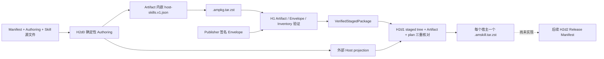

# AgentMesh360 Host Skill 可验证导出 v1

状态：H2d1 已实现，并通过自主验证和本机 Kimi 两轮独立交叉测试；生产发布仍保持关闭

本文档固定“同一 Agent 既作为客户端持久 Agent，又作为 Codex、Claude Code 或
OpenClaw Skill 发布”的 H2d1 契约。核心原则是：宿主 Skill 发布束只能从通过 H1
Publisher 信任链验收的 Agent Package Artifact 导出，不能重新读取工作区，也不能让
松散的 Host projection 决定发布文件。

## 1. 信任链与功能流程



`VerifiedStagedPackage` 是 crate 内部不可由普通调用方构造的 H1 验证结果，携带已验证
Manifest、Artifact SHA-256、文件清单 SHA-256、Publisher 签名 keyId 和临时 staging
目录。H2d1 导出入口只接收这个类型，而不接收“任意目录 + 任意公钥”。

## 2. 为什么必须把 Host 计划放进 Artifact

H2d0 的外部 projection 虽然绑定 Artifact SHA-256，但如果精确的宿主文件选择只存在于
该 JSON 中，一个被替换的 projection 仍可能尝试把签名 Package 中不属于某个宿主的
文件发布出去。仅验证“这些文件确实在 Artifact 中”还不够。

H2d1 因此把精确 `HostSkillPlan` 以 `host-skills.v1.json` 放进 Package，并由
`package-files.v1.json` 覆盖其长度和 SHA-256。外部 projection v1 改为：

```json
{
  "schemaVersion": 1,
  "artifactSha256": "<完整 Artifact SHA-256>",
  "planSha256": "<Artifact 内 host-skills.v1.json 的 SHA-256>",
  "plan": {
    "schemaVersion": 1,
    "packageId": "com.agentmesh360.example-agent",
    "agentId": "example-agent",
    "version": "1.0.0",
    "publisher": "agentmesh360",
    "requestedPermissions": ["local_files"],
    "canonicalWorkflow": {
      "path": "docs/agent-onboarding.md",
      "size": 123,
      "sha256": "<文件摘要>"
    },
    "skillBundles": []
  }
}
```

外部 projection 仍是非秘密审核产物，不是信任根。导出时必须同时满足：

1. projection 严格 Schema、1 MiB 上限且无未知字段；
2. `artifactSha256` 等于 H1 验证结果；
3. staging tree 立即按 H1 文件清单摘要重新验证；
4. 内嵌 plan 原始字节的摘要等于 `planSha256`；
5. 外部 `plan` 与内嵌 plan 结构完全相等；
6. plan 的 package/agent/version/publisher/权限/Canonical Workflow 与签名 Manifest
   完全一致；
7. 每个 Manifest Adapter 恰好有一个同 Host bundle，入口一致，所有文件记录都逐项
   等于签名 inventory；
8. 保留文件、重复 Host、重复文件、空 bundle、未知 Host、缺失入口和 inventory 外
   文件全部失败关闭。

## 3. Host Skill 发布束

每个真实 Manifest Adapter 生成一个确定性文件：

```text
<packageId>-<version>-<host>.amskill.tar.zst
```

Archive 结构：

```text
agentmesh-host-skill.v1.json
payload/<原 Package 相对路径>
payload/<原 Package 相对路径>
```

`agentmesh-host-skill.v1.json` 严格绑定：

- Schema、packageId、agentId、version、publisher；
- 源 Artifact SHA-256、内嵌 plan SHA-256、Publisher signature keyId；
- 宿主类型和 Adapter 入口；
- 每个文件在 Package 与 bundle 内的路径、长度和 SHA-256。

Archive 使用排序文件表、固定 tar mode/uid/gid/mtime 和 zstd level 3；相同的
Verified Artifact 与 projection 产生逐字节相同的发布束。Unix 输出目录从创建时即为
`0700`，文件为 `0600`；既有目录拒绝覆盖，任一中途写入失败会删除本次新建目录。
Unix 读取还使用 `O_NOFOLLOW`，并比较打开前后的 device/inode，避免 symlink 检查与
实际打开之间被替换；打开后的稳定文件描述符仍逐项执行长度和签名 SHA-256 核对。

没有 Adapter 的 Agent 不会虚构宿主 Skill。Deploy Agent 当前因此合法地产生零个
`.amskill.tar.zst`，但客户端 Artifact 仍可作为持久 Agent Package 使用。

## 4. 动态新 Agent 接入证明

测试使用 `com.agentmesh360.future-agent / future-agent / 1.0.0`，它不存在于 Client
内置 Catalog。测试只创建同仓 Manifest、Authoring 定义、Canonical Workflow 和两份
宿主 Skill，然后依次完成：

1. H2d0 确定性构建；
2. 测试 Publisher 签名；
3. H1 Artifact/Envelope/Inventory 验证；
4. H2d1 Claude Code 与 OpenClaw 发布束导出。

这证明在客户端已支持的 Manifest Schema、权限、Host 和 Harness Capability 范围内，
增加新 Agent 不需要修改内置 Catalog 或新增 Agent 专属导出代码。生产环境仍需通过
可信 Registry 分发，不能把测试 key 或本地 fixture 当成生产授权。

## 5. 自主验证证据

2026-07-26 的本机验证结果：

- H2d0 Authoring 专项 6/6；
- H2d1 Host Skill 导出专项 7/7，另有 1 个显式首方源码路径测试默认 ignore；默认
  回归已独立覆盖零 Adapter Agent 只返回空 receipt、绝不虚构 Host bundle；
- 首方源码测试已单独实跑，并对每个 Agent 连续构建两次，Artifact、signing request、
  projection 均逐字节一致；
- AgentMesh360 全量 153 项通过，1 个首方源码测试按设计默认 ignore；
- 桌面 57 项通过，2 个真实 Host 环境测试按预期 skip；
- Authoring CLI 1/1、Rust Clippy `-D warnings`、Rustfmt、JS check 与
  `git diff --check` 通过。

首方开发摘要：

| Agent | Artifact SHA-256 | Host Skill bundle SHA-256 |
| --- | --- | --- |
| Job Agent | `d00f374e2442c6853ff8dd39a9d832d4410b86b6027661483205c2d0fd692dd0` | Claude Code `a827d6d8b172fce0b9dfa6417bc17689bff1dadca3226bc4eb2e6f93a555f584`；OpenClaw `3a6f99fdde8ad57f3674d063f6230c20113375916a6cfcc81454093376b2de54` |
| LectureCast Agent | `229bb50b7ed095871bb282fe462519d3dcf5aa336283c2441f381f8913bce2b9` | Claude Code `bf17ca1c738bfbd1d5f61a5dc3f94a4169bae2b7515231291564d49dee56ad0f`；Codex `9331d69fdb4cf15e25f0f37e72c5b98890ece3190adc9720f9e9505b4e3dc7ae`；OpenClaw `03d0ec7737ad2ff983169408a507ce020e40b37d761a51bf19b129d8b7111550` |
| Deploy Agent | `9a40f1fe4385f2c1e644cf0ad39d2d2daf0797f736dc1880b38e19ae573792ec` | 无 Adapter，合法导出零个 bundle |

这些摘要来自当前源码和非生产测试 key，只是开发证据，不是已签名生产 Release、
Git tag、CI provenance、Registry 上线或网站 Skill 发布证明。

Kimi 独立交叉测试只读取本仓库内经用户授权的完整 diff 和未跟踪文件，不读取三个
外部首方源码仓库。首轮确认整体“无条件 PASS”，同时记录 Schema 常量耦合、零
Adapter 默认回归、文件打开 TOCTOU 收紧和 crate-internal 调用边界四条 Low。修复后
第二轮重新逐行审查并实际执行 Authoring 6/6、Host export 7/7、AgentMesh360
153+1 ignored、CLI 1/1、桌面 57+2 skip、Clippy `-D warnings`、Rustfmt、JS check
和 diff-check；Blocker/High/Medium/Low 最终均为零，再次给出“无条件 PASS”。

首方真实源码双构建与摘要由本轮自主测试实跑，Kimi 只核对文档内部一致性，没有声称
读取外部源码复核。两类证据在这里明确分开。

## 6. 非目标与 H2d2

H2d1 不写入用户真实 Codex、Claude Code 或 OpenClaw 目录，不生成生产私钥，不填充
生产 Root/Publisher Bundle/endpoint，不上传、不发布，也不改变 BYOK、订阅硬门禁、
Provider Vault 或稳定 Main Session。

导出器当前故意保持 crate-internal，不提供可由调用方自带任意公钥的弱 CLI。
H2d2 Release assembler 是计划中的首个非测试调用方：它必须承接 H1 验证结果，而
不能绕过 `VerifiedStagedPackage` 类型门。

下一切片 H2d2 应建立跨渠道 `Agent Release Manifest v1`：

1. 从 H1 Artifact、Publisher Envelope 和 H2d1 receipts 生成确定性、无秘密的发布
   清单，绑定客户端 Artifact 与全部宿主 bundle；
2. 让 Package Registry 和官网/宿主安装入口消费同一 package/version/digest 集合，
   防止两条产品路径漂移；
3. 加入缺 bundle、多 bundle、跨版本、摘要替换、旧 Schema、重复 Host 与非确定性
   输出的失败关闭测试；
4. 仍只做离线 assembly 与验证，不启用生产上传、Registry endpoint 或真实用户安装。
