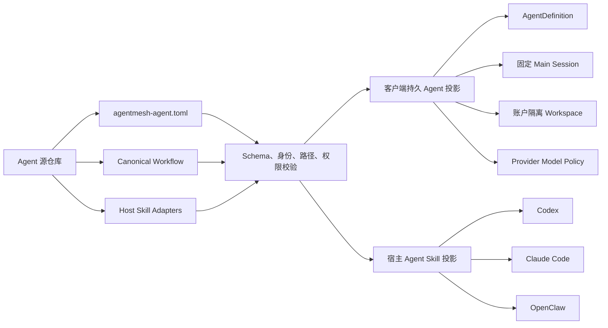

# AgentMesh360 Agent Package Manifest v1

状态：H0 与 H1 已实现；动态运行时载入和 Registry 分发待 H2

本文档固定 AgentMesh360 产品 Agent 的第一个版本化 Package 契约。它解决的核心问题
不是“把 Prompt 搬进 TOML”，而是让客户端里的持久 Agent 与用户自行安装到 Codex、
Claude Code、OpenClaw 等宿主 Agent 的 Skill，来自同一个受版本控制的产品来源。

## 1. 一个 Package，两个受控投影



两个投影共享 `packageId`、`version`、`agentId`、产品说明、Canonical Workflow、
能力声明和发布来源。宿主 Adapter 只是对同一工作流的安装/发现适配，不是另一份
Agent 实现。某个宿主没有真实 Adapter 时，Manifest 必须如实省略，不能由客户端
临时拼出一份未经测试的安装指令。

## 2. H0 已实现的 Package 布局

当前三个内置 Package 位于：

```text
crates/codegen/xai-grok-shell/src/agentmesh360/packages/
  job-agent/agentmesh-agent.toml
  lecturecast-agent/agentmesh-agent.toml
  deploy-agent/agentmesh-agent.toml
```

H0 采用编译期嵌入，目的是先验证 Schema、运行时投影和旧状态兼容性，不代表未来
新增 Agent 还需要重新发布客户端。H1/H2 会把相同 Manifest 放入已签名 Package
产物，通过本地安装目录和 Registry 动态载入。

## 3. Manifest v1 字段

| 区域 | 字段 | 作用 | H0 消费者 |
| --- | --- | --- | --- |
| Package | `schemaVersion` | Manifest Schema，v1 只接受 `1` | 失败关闭解析器 |
| Package | `packageId` | 不随版本变化的发布身份 | Package Catalog |
| Package | `version` | 严格 SemVer | Registry 元数据升级 |
| Package | `publisher` | 发布者身份；H1 与信任密钥绑定 | Catalog |
| Package | `sourceRepository` | 不含凭据和参数的 HTTPS 源仓库 | Catalog/审计 |
| Package | `requestedPermissions` | Package 请求的能力声明 | H0 校验与展示元数据 |
| Agent | `agentId` | 不随升级变化的产品 Agent 身份 | Registry、Session、路由 |
| Agent | `displayName` / `description` | 客户端产品信息 | Agent 列表、Profile |
| Agent | `sortOrder` | Catalog 稳定排序 | Agent 列表 |
| Persistence | `mainSessionStrategy` | Main Session 身份算法 | Agent Registry |
| Persistence | `workspaceStrategy` | Workspace 账户隔离规则 | Agent Registry |
| Runtime | `promptMode` / Skill 发现开关 | Grok AgentDefinition 行为 | Harness |
| Runtime | `promptBody` | 当前持久 Agent Profile | Harness |
| Model | `modelPolicy` | 工具、视觉、结构化输出等要求 | RouteCompiler |
| Skills | `canonicalWorkflow` | 产品工作流的唯一来源路径 | H1/H2 投影器 |
| Skills | `adapters[]` | 已存在且经过维护的宿主 Skill 入口 | Catalog；H2 安装器 |

`requestedPermissions` 在 H0 只是声明，不授予任何 Host、Sandbox、操作系统或云端
权限。真正授权仍由 Host 的权限策略、用户审批、操作系统边界和 Core 的订阅/credits
校验共同决定。Package 不能通过新增字符串扩权。

## 4. 当前内置目录

| Agent | Package 版本 | Canonical Workflow | 已声明宿主 Adapter |
| --- | --- | --- | --- |
| Job Agent | `0.4.7` | `docs/agent-onboarding.md` | Claude Code、OpenClaw |
| LectureCast Agent | `0.4.0` | `skills/shared/director-workflow.md` | Codex、Claude Code、OpenClaw |
| Deploy Agent | `0.1.1` | `AGENTS.md` | 暂无独立 Skill Adapter |

这些版本和路径来自三个现有 Agent 源仓库。Deploy Agent 当前只有仓库级
`AGENTS.md`，因此 H0 不虚构 Codex/Claude/OpenClaw Adapter。

## 5. 运行时投影与兼容性

Manifest 已经成为以下数据的唯一来源：

1. `product_agents` 的名称、说明、版本和排序；
2. 激活时注入 Grok Harness 的 `AgentDefinition`；
3. 账户 + `agentId` 的确定性 Main Session 策略；
4. 账户隔离 Workspace 策略；
5. 产品 Agent 的 `AgentModelPolicy`；
6. 只读 ACP `x.agentmesh360/agent-packages/catalog`。

稳定 `agentId` 保持不变，因此 Main Session UUID 算法和现有 Session 历史都不变。
旧 `state.db` 再次打开时只更新 Package 管理的目录元数据，不覆盖
`desired_state`、`runtime_state`、`main_session_id`、`workspace_dir` 或
`activated_at`。

## 6. 失败关闭规则

H0 对以下情况直接拒绝整个 Package Catalog，不使用旧硬编码回退：

- 未支持的 `schemaVersion`；
- Manifest 任意未知字段；
- 未知 `requestedPermissions`；
- 非 SemVer 版本；
- 非法或重复 `packageId`、`agentId`、`sortOrder`；
- 重复宿主 Adapter；
- 绝对路径、`.`、`..` 等不规范 Package 内路径；
- 带账号、密码、query 或 fragment 的源仓库 URL；
- 空的身份、Prompt、Workflow 或权限声明。

公开 Catalog Schema 中没有 Provider Key、Access/Refresh Token、Credential Ref、
账户 ID、Session ID、Workspace 实际路径或用户业务数据字段。Provider 密钥仍只存在
于 Host-owned Vault。

## 7. H1a 已实现的签名产物验证

H1a 定义 `.ampkg.tar.zst` 产物、外部 JSON 签名信封和包内
`package-files.v1.json`。签名信封包含：

| 字段 | 含义 |
| --- | --- |
| `schemaVersion` | 签名信封版本，当前只接受 `1` |
| `keyId` / `publisher` | 必须同时匹配 Host 内置的受信发布密钥 |
| `packageId` / `version` | 与解包后的 Manifest 身份再次交叉校验 |
| `artifactSha256` | 对完整压缩产物的 SHA-256 |
| `signature` | 对确定性文本信封的 Ed25519 签名 |

验证使用 Ed25519 strict verification，先检查完整 Artifact digest 与发布密钥，再创建
staging。Artifact 只打开一次：验签前完成摘要后 rewind 同一文件句柄，再由该句柄
解包，避免“验签一个文件、解包另一个文件”的 TOCTOU。解包后还会逐文件核对
uniquely sorted 的路径、长度与 SHA-256 清单，因此 Artifact 完整性和 Package
文件清单形成双层验证。

staging 失败关闭边界包括：

- 压缩产物最大 32 MiB、单文件最大 32 MiB、解包总量最大 128 MiB、最多 1024 个
  文件和 2048 个 Archive entry；目录 entry 也计入上限；
- 拒绝绝对路径、反斜杠、`.`、`..`、重复路径、symlink、hardlink 和其他非普通文件；
- staging 目录使用不可复用名称创建，Unix 目录为 `0700`、文件为 `0600`；
- `agentmesh-agent.toml`、文件清单、Canonical Workflow 和所有声明的 Adapter 文件
  必须真实存在；
- 校验对象离开作用域但未提交时自动删除 staging；验证失败也清理 staging；
- 未知 key、签名篡改、Artifact 篡改、清单遗漏和签名/Manifest 身份不一致全部拒绝。

生产信任根目前故意为空。正式 AgentMesh360 发布公钥和轮换方案完成独立审计之前，
外部 Package 全部拒绝；测试只使用临时目录和固定测试密钥。H1a 没有 ACP 安装入口，
不会读取网络、真实 Package 目录或用户凭据。

## 8. H1b 已实现的原子安装与回滚

H1b 最初在共享 `state.db v7` 中增加 `agent_package_registry`；独立交叉测试发现
Previous 回滚只检查身份、没有可信的已解包文件锚点后，Registry 加固为 `state.db v8`。
每个 `packageId` 只保存一个 Active 和一个 Previous 指针，并为两者保存已签名
`package-files.v1.json` 的 SHA-256。安装顺序固定为：

1. H1a 完成签名、Artifact、文件清单、Schema、引用和身份验证；
2. 比较 Active 与新 Manifest 的权限集合；首次安装按“从零权限增加”处理；
3. 没有显式批准时返回 `approval_required`，staging 自动清理；
4. 对 staging 文件执行同步，再在同一 Package 文件系统中原子 rename 到不可变版本目录；
5. 通过 SQLite `IMMEDIATE` transaction 比较并提交 Active/Previous 指针；
6. 数据库提交失败时，旧 Active 不变；已 rename 的新目录只会成为未引用 orphan；
7. 显式 rollback 先将文件清单摘要与 Registry 锚点比对，再逐项复核整棵已安装目录的
   路径、类型、数量、大小与 SHA-256；全部通过后才在单个 SQLite transaction 中交换
   Active/Previous；
8. 同 digest 的幂等重装也复核 Active 目录，不能用幂等捷径掩盖安装后篡改。

安装/升级还固定以下不变量：

- 一个 `agentId` 只能属于一个已安装 `packageId`；
- 同一 `packageId` 的升级不能改变 `agentId`；
- 相同 SemVer precedence 不能通过 build metadata 换成另一个 Artifact digest；
- 低于 Active 的版本不能伪装成普通升级，只能回到已验证的 Previous；
- Active/Previous 记录保存版本、Artifact digest、文件清单 digest、相对路径、
  已批准权限和签名 key ID；
- v6→v8 迁移不改变既有 Agent Main Session、Provider Profile、Binding 或其他状态；
  空的 v7 Package Registry 可无损升级。由于 v7 从未开放生产入口，若开发数据库中
  已存在缺少可信文件清单锚点的 v7 Package 行，迁移会保留原数据并失败关闭，要求删除
  该未发布开发记录后重新安装，绝不在迁移时从可能已篡改的目录反向“补签”摘要。

当前安装服务仍是 Host 私有模块，没有 ACP/Renderer mutation 入口；生产 Trust Store
仍为空，因此不会对真实用户目录产生动态安装。正式发布密钥、权限确认 UI 和管理入口
必须作为独立发布门槛。未引用 orphan 的安全清理也留到 H2，不影响 Active 一致性。

## 9. H2 边界

H2 负责“动态分发与双投影”：

- **H2a1 已实现**：复用 H1 的锚定文件清单复验，让本地 Registry 的 Active Package
  在 Host 启动时确定性合并进运行时 Catalog；Registry、AgentDefinition、Model
  Policy、Session/Workspace 均消费同一合并结果；
- **H2a2 已实现并通过两轮 Kimi 交叉测试**：Host 通过原子共享 Catalog 快照让 Runtime、Model
  Routing 和产品 Turn 复用同一结果；安装/回滚后可调用 Host 私有显式 refresh，失败
  保留最后可信快照与稳定 Main Session；
- 提供订阅门禁且不暴露绝对路径、digest、签名 key、账户或 Session 数据的只读
  Active/Previous/invalid/orphan 状态；用户主动读取状态会复验已安装树，但普通 Turn
  不会逐次访问 Package 文件；
- 状态存储不可读时返回固定 `status-inventory` 故障条目，Catalog 不可用时只返回固定
  公开错误；原始 anyhow/OS 诊断只进入 Host 日志；
- 从 AgentMesh360 Package Registry 获取签名元数据和产物；
- 用户确认新增权限后安装/升级；
- 生成或安装 Manifest 声明的宿主 Skill Adapter；
- 执行受版本控制的状态迁移并支持回滚；
- 让新增 Agent 在未超出已支持 Schema/Capability 时无需客户端发版。

H2 完成前，远端 Package 不会被下载、解包或执行；H1 安装服务也不会暴露给客户端
界面。运行时已经能消费通过复验的本地 Active，但生产 Trust Store 与安装入口仍为空，
所以当前三个内置 Package 继续是唯一生产可用目录。

## 10. H2b0 Publisher Trust Bundle v1（已通过交叉测试）

H2b0 把 Package 的发布密钥从单个硬编码列表升级为两级信任链：

```text
客户端内置、经审计的 Ed25519 Root Key
  -> 验证 Publisher Trust Bundle
  -> 只装载当前有效的 active Publisher Key
  -> 验证 H1 的 Package Signature Envelope
  -> 验证 Artifact 与包内文件清单
```

Trust Bundle 是最多 64 KiB 的严格 JSON：

| 字段 | 约束 |
| --- | --- |
| `schemaVersion` | 当前只接受 `1` |
| `sequence` | 正整数，不能低于调用方提供的 `minimumSequence` |
| `rootKeyId` | 必须命中客户端内置 root |
| `generatedAt` / `expiresAt` | RFC3339；显式可信时间必须位于半开区间内 |
| `keys` | 最多 64 项，按 `keyId` 严格递增 |
| `signature` | root 对确定性 v1 文本载荷的 Ed25519 strict signature |

每个 Publisher key 记录包含 `keyId`、`publisher`、固定 `ed25519` algorithm、
canonical Base64 公钥、`active/retired/revoked` 状态和 key 自身有效期。仅当前有效的
active key 会进入 `TrustedPublisherStore`；重叠 active key 支持轮换，retired/revoked
不能验证新的安装。签名载荷有固定 domain separator，key 列表逐行编码，不依赖 JSON
对象顺序。

H2b0 已完成自主测试和两轮本机 Kimi 交叉测试，但只交付验证与审计契约。生产
`TrustedRootStore` 和嵌入 Bundle 仍为空；
`minimumSequence` 尚未持久化，远端可信时间、Registry Snapshot、缓存、防回滚状态、
下载和安装入口都属于 H2b1 以后。因此当前外部 Package 仍全部拒绝，不能把本节解读为
生产密钥已经上线。

## 11. H2b1a Package Registry Snapshot v1（已通过交叉测试）

H2b1a 在 Publisher Trust Bundle 之上增加 root 签名的远端目录契约：

```text
已验证的 Publisher Trust Store（sequence + rootKeyId + active publishers）
  + 客户端内置 Root Store
  -> 验证 Package Registry Snapshot
  -> 获得只读 Verified Remote Package Records
```

Snapshot 最大 1 MiB、最多 256 条记录，包含 `schemaVersion`、`revision`、
`rootKeyId`、`trustBundleSequence`、`generatedAt`、`expiresAt`、`packages` 和
`signature`。记录按 `packageId` 严格递增，`agentId` 在整个 Snapshot 内也必须唯一。
每条记录签名绑定：

| 身份 | 远端对象 |
| --- | --- |
| `packageId`、`agentId`、canonical SemVer、`publisher` | Artifact canonical HTTPS URL 与小写 SHA-256 |
| 同一组 Package 身份 | Signature Envelope canonical HTTPS URL 与小写 SHA-256 |

自由文本字段以 canonical Base64 进入有独立 domain separator 的确定性 payload；
Snapshot root signature 复用 H2b0 的 Ed25519 strict verifier。验证器直接接收已经验证的
`TrustedPublisherStore`，要求 sequence 与 rootKeyId 完全一致，并拒绝没有 active key
的 publisher，不能由调用方传入一个裸 sequence 冒充信任事实。

H2b1a 已完成自主测试和本机 Kimi 交叉测试，但仍是纯验证层：生产 Root/Bundle 为空，
不联网、不缓存、不下载、不安装。Core 可信时间、持久最高 revision/sequence、
last-known-good 缓存和只读更新状态属于 H2b1b；Registry URL 和可能存在的 query
只能留在 Host 内部，不能投影到公开响应或日志。

## 12. H2b1b1 Core 可信时间门禁（已通过交叉测试）

生产 Trust Bundle 与 Registry Snapshot 验证都不接受本机 `Utc::now()` 或调用方构造
的裸时间。只有成功通过 `/v1/account/client-bootstrap` 的 `ClientAccess` 能提供时间锚：

```text
Core server_time + 接收时 Instant
  -> 用 Instant elapsed 单调推进
  -> 最多 10 分钟，且不超过订阅 period_end
  -> 当前 Access 仍 Granted
  -> Trust Bundle / Registry Snapshot 时间窗验证
```

接收时同时保存本机 `SystemTime`，但它只用于失败关闭：墙钟回退，或与单调时钟的
elapsed 漂移超过 2 分钟，锚立即 stale，以覆盖系统休眠或手工改钟；墙钟从不参与可信
时间计算，也不能延长 10 分钟截止点。Denied、Unverified、显式 invalidate、订阅截止
或非法 Core 时间都不能提供锚。

H2b1b1 已完成自主测试和本机 Kimi 交叉测试。Trust Bundle 与 Registry Snapshot 的
公开模块接口都直接接收当前 `ClientAccess` 并在验签当下取时间；显式
`DateTime<Utc>` 入口保持各自模块私有，仅供边界测试。未来 embedded Bundle 即使被
误填，也不会退回本机时间。H2b1b1 不持久化时间，不改数据库，不读取远端 Registry；
进程重启和时间锚过期都必须重新 bootstrap。持久签名文档、最高 sequence/revision 与
last-known-good 属于 H2b1b2。

## 13. H2b1b2/H2b1c 持久信任缓存与只读远端获取（已通过交叉测试）

H2b1b2 把签名 Trust Bundle、Registry Snapshot 和已接受的最高 sequence/revision
原文写入 `state.db v9`。写入使用单一 `IMMEDIATE` 事务；每次读取都以当前
`ClientAccess`、内置 Root 和缓存原文重新验签，而不是信任数据库中的解析结果。旧
revision 的 rollback、同 revision 不同内容的 equivocation、root/sequence 绑定错误、
缓存损坏或 Access 过期都失败关闭。

H2b1c 在该缓存之前增加 Host-owned 双文档 Fetcher，并将数据库加法升级到 v10：

- 固定生产 origin，禁止 credentials/query/fragment 和重定向；
- Trust Bundle/Registry 分别限制为 64 KiB/1 MiB，只接受 JSON 200 或 304；
- ETag/Last-Modified 仅作为非秘密条件请求优化，成功验签后才更新；
- 304 必须使用缓存原文按当前 Access 重新验签，不延长签名有效期或 Core 时间锚；
- 远端失败只能退化到可重新验签的 last-known-good，否则 unavailable；
- 状态只公开固定 outcome/reason 与脱敏 Trust Audit，不公开 URL、路径、账户、token
  或响应正文。

生产 endpoint、Root Store 和 embedded Trust Bundle 仍为空，因此真实构建不会发起
Package 网络请求或接受远端 Package。两切片均已通过自主测试和本机 Kimi 交叉测试。

## 14. H2b2a Artifact/Envelope 受限下载（已通过交叉测试）

下载器公开给内部调用方的选择输入只有 `package_id` 和当前 `ClientAccess`：

```text
ClientAccess
  -> 重新验证持久 Trust Bundle + Registry Snapshot
  -> 由签名 Registry Record 选择 URL + digest + Package 身份
  -> 下载 Envelope（64 KiB）与 Artifact（32 MiB）
  -> Registry digest
  -> Publisher Envelope 签名 + Archive/Manifest/文件库存
  -> Registry package/agent/version/publisher 身份
  -> 会自动清理的 VerifiedPackageDownload
```

生产 URL 必须属于 `https://packages.agentmesh360.com`，禁止凭据、query、fragment 和
重定向。loopback transport 映射只在测试编译中存在，签名测试记录本身仍使用生产
HTTPS URL。

每次操作创建独立的 `.downloads/download-<uuid>`；Unix 目录和文件以 `0700`、`0600`
创建，并拒绝符号链接形式的下载根目录。下载同时约束声明长度和实际 stream 字节，
逐块写入、逐块计算 SHA-256。任何传输、MIME、上限、digest、签名、Archive 或身份
错误，以及 future 被取消，都会由所有权 Drop Guard 清理本次下载；成功返回后提取
staging 仍由 `VerifiedStagedPackage` 所有。

`PackageDownloadAudit` 只包含 package/agent/version 与字节数。H2b2a 不移动到正式
versions、不修改 Active/Previous/本地 Registry/Catalog、不请求权限，也不开放
ACP/UI。它已经通过 6 项专项测试、121 项 AgentMesh360 自主测试和本机 Kimi 独立
交叉测试；Kimi 实跑相同两组测试、Clippy、Rustfmt 与 diff-check，问题分级全部为零。

## 15. H2b2b 一次性权限批准与安装窄交接（已通过交叉测试）

`PackageDeliveryService` 是下载结果进入安装事务的唯一内部入口。审批挑战公开字段只有
随机 ID、package/version、新增权限和剩余 TTL；Host 内存中的不可序列化计划还绑定
agent、Artifact digest、完整请求权限集合、当时 Active digest 与幂等状态。审批同时
绑定发起下载的订阅账户，默认十分钟、最多 32 项，并由运行时定时任务和每次请求双重
回收。

批准时 Host 会重新检查 Access、staging 文件库存和 Manifest，再按当前本地 Registry
计算新计划。只有完整计划相等时才先消费审批、再把 `VerifiedStagedPackage` 所有权
交给既有不可变 versions 与 SQLite CAS；计划检查后的并发 Active 变化继续由 CAS
拒绝。原来接收任意 artifact path、Envelope 和裸批准布尔值的安装入口已删除。

本切片已经通过 7 项 Delivery 专项、10 项 Installer 回归、128 项 AgentMesh360
自主测试和本机 Kimi 独立交叉测试；Kimi 实跑全部相同测试与静态检查，四级问题均为
零。它只提交本地 Active/Previous，不刷新 Shared Runtime Catalog，不开放 ACP/UI，
也不启用生产 endpoint/root/bundle。

## 16. H2b2c 计划：安装后的运行时原子可见性

下一切片把成功安装结果与同一 Host 的 Shared Runtime Catalog 刷新组合起来。刷新成功
后，新 Agent 或内置升级才可在后续账户列表/激活中按 Manifest 投影；刷新失败必须保留
last-known-good Catalog，并明确报告“安装已提交但尚未运行时可见”，不能伪装为安装
回滚。并发安装/刷新还需保证旧快照不能覆盖新 Active。本切片仍不开放 ACP、桌面 UI
或生产 Trust 配置。

H2b2c 已进入设计与既有 `SharedPackageCatalog` refresh gate、generation 和
last-known-good 失败语义审计。
