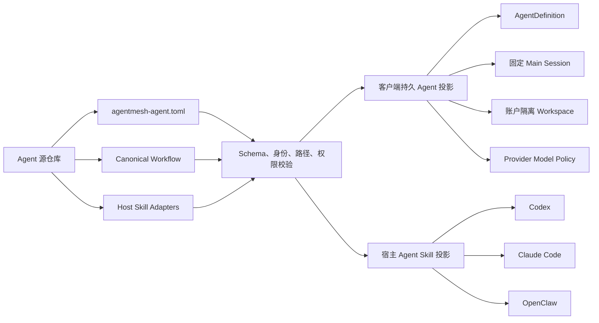

# AgentMesh360 Agent Package Manifest v1

状态：H0 与 H1a 已实现；Active 安装事务和动态分发待 H1b/H2

本文档固定 AgentMesh360 产品 Agent 的第一个版本化 Package 契约。它解决的核心问题
不是“把 Prompt 搬进 TOML”，而是让客户端里的持久 Agent 与用户自行安装到 Codex、
Claude Code、OpenClaw 等宿主 Agent 的 Skill，来自同一个受版本控制的产品来源。

## 1. 一个 Package，两个受控投影



两个投影共享 `packageId`、`version`、`agentId`、产品说明、Canonical Workflow、
能力声明和发布来源。宿主 Adapter 只是对同一工作流的安装/发现适配，不是另一份
Agent 实现。某个宿主没有真实 Adapter 时，Manifest 必须如实省略，不能由客户端
临时拼出一份未经测试的安装指令。

## 2. H0 已实现的 Package 布局

当前三个内置 Package 位于：

```text
crates/codegen/xai-grok-shell/src/agentmesh360/packages/
  job-agent/agentmesh-agent.toml
  lecturecast-agent/agentmesh-agent.toml
  deploy-agent/agentmesh-agent.toml
```

H0 采用编译期嵌入，目的是先验证 Schema、运行时投影和旧状态兼容性，不代表未来
新增 Agent 还需要重新发布客户端。H1/H2 会把相同 Manifest 放入已签名 Package
产物，通过本地安装目录和 Registry 动态载入。

## 3. Manifest v1 字段

| 区域 | 字段 | 作用 | H0 消费者 |
| --- | --- | --- | --- |
| Package | `schemaVersion` | Manifest Schema，v1 只接受 `1` | 失败关闭解析器 |
| Package | `packageId` | 不随版本变化的发布身份 | Package Catalog |
| Package | `version` | 严格 SemVer | Registry 元数据升级 |
| Package | `publisher` | 发布者身份；H1 与信任密钥绑定 | Catalog |
| Package | `sourceRepository` | 不含凭据和参数的 HTTPS 源仓库 | Catalog/审计 |
| Package | `requestedPermissions` | Package 请求的能力声明 | H0 校验与展示元数据 |
| Agent | `agentId` | 不随升级变化的产品 Agent 身份 | Registry、Session、路由 |
| Agent | `displayName` / `description` | 客户端产品信息 | Agent 列表、Profile |
| Agent | `sortOrder` | Catalog 稳定排序 | Agent 列表 |
| Persistence | `mainSessionStrategy` | Main Session 身份算法 | Agent Registry |
| Persistence | `workspaceStrategy` | Workspace 账户隔离规则 | Agent Registry |
| Runtime | `promptMode` / Skill 发现开关 | Grok AgentDefinition 行为 | Harness |
| Runtime | `promptBody` | 当前持久 Agent Profile | Harness |
| Model | `modelPolicy` | 工具、视觉、结构化输出等要求 | RouteCompiler |
| Skills | `canonicalWorkflow` | 产品工作流的唯一来源路径 | H1/H2 投影器 |
| Skills | `adapters[]` | 已存在且经过维护的宿主 Skill 入口 | Catalog；H2 安装器 |

`requestedPermissions` 在 H0 只是声明，不授予任何 Host、Sandbox、操作系统或云端
权限。真正授权仍由 Host 的权限策略、用户审批、操作系统边界和 Core 的订阅/credits
校验共同决定。Package 不能通过新增字符串扩权。

## 4. 当前内置目录

| Agent | Package 版本 | Canonical Workflow | 已声明宿主 Adapter |
| --- | --- | --- | --- |
| Job Agent | `0.4.7` | `docs/agent-onboarding.md` | Claude Code、OpenClaw |
| LectureCast Agent | `0.4.0` | `skills/shared/director-workflow.md` | Codex、Claude Code、OpenClaw |
| Deploy Agent | `0.1.1` | `AGENTS.md` | 暂无独立 Skill Adapter |

这些版本和路径来自三个现有 Agent 源仓库。Deploy Agent 当前只有仓库级
`AGENTS.md`，因此 H0 不虚构 Codex/Claude/OpenClaw Adapter。

## 5. 运行时投影与兼容性

Manifest 已经成为以下数据的唯一来源：

1. `product_agents` 的名称、说明、版本和排序；
2. 激活时注入 Grok Harness 的 `AgentDefinition`；
3. 账户 + `agentId` 的确定性 Main Session 策略；
4. 账户隔离 Workspace 策略；
5. 产品 Agent 的 `AgentModelPolicy`；
6. 只读 ACP `x.agentmesh360/agent-packages/catalog`。

稳定 `agentId` 保持不变，因此 Main Session UUID 算法和现有 Session 历史都不变。
旧 `state.db` 再次打开时只更新 Package 管理的目录元数据，不覆盖
`desired_state`、`runtime_state`、`main_session_id`、`workspace_dir` 或
`activated_at`。

## 6. 失败关闭规则

H0 对以下情况直接拒绝整个 Package Catalog，不使用旧硬编码回退：

- 未支持的 `schemaVersion`；
- Manifest 任意未知字段；
- 未知 `requestedPermissions`；
- 非 SemVer 版本；
- 非法或重复 `packageId`、`agentId`、`sortOrder`；
- 重复宿主 Adapter；
- 绝对路径、`.`、`..` 等不规范 Package 内路径；
- 带账号、密码、query 或 fragment 的源仓库 URL；
- 空的身份、Prompt、Workflow 或权限声明。

公开 Catalog Schema 中没有 Provider Key、Access/Refresh Token、Credential Ref、
账户 ID、Session ID、Workspace 实际路径或用户业务数据字段。Provider 密钥仍只存在
于 Host-owned Vault。

## 7. H1a 已实现的签名产物验证

H1a 定义 `.ampkg.tar.zst` 产物、外部 JSON 签名信封和包内
`package-files.v1.json`。签名信封包含：

| 字段 | 含义 |
| --- | --- |
| `schemaVersion` | 签名信封版本，当前只接受 `1` |
| `keyId` / `publisher` | 必须同时匹配 Host 内置的受信发布密钥 |
| `packageId` / `version` | 与解包后的 Manifest 身份再次交叉校验 |
| `artifactSha256` | 对完整压缩产物的 SHA-256 |
| `signature` | 对确定性文本信封的 Ed25519 签名 |

验证使用 Ed25519 strict verification，先检查完整 Artifact digest 与发布密钥，再创建
staging。解包后还会逐文件核对 uniquely sorted 的路径、长度与 SHA-256 清单，因此
Artifact 完整性和 Package 文件清单形成双层验证。

staging 失败关闭边界包括：

- 压缩产物最大 32 MiB、单文件最大 32 MiB、解包总量最大 128 MiB、最多 1024 个文件；
- 拒绝绝对路径、反斜杠、`.`、`..`、重复路径、symlink、hardlink 和其他非普通文件；
- staging 目录使用不可复用名称创建，Unix 目录为 `0700`、文件为 `0600`；
- `agentmesh-agent.toml`、文件清单、Canonical Workflow 和所有声明的 Adapter 文件
  必须真实存在；
- 校验对象离开作用域但未提交时自动删除 staging；验证失败也清理 staging；
- 未知 key、签名篡改、Artifact 篡改、清单遗漏和签名/Manifest 身份不一致全部拒绝。

生产信任根目前故意为空。正式 AgentMesh360 发布公钥和轮换方案完成独立审计之前，
外部 Package 全部拒绝；测试只使用临时目录和固定测试密钥。H1a 没有 ACP 安装入口，
不会读取网络、真实 Package 目录或用户凭据。

## 8. H1b/H2 边界

H1b 继续负责“可信安装”：

- 通过原子目录切换提交安装，失败时不改变 Active Package；
- 在本地 Registry 记录 Active/Previous 版本和安装审计；
- 在提交前计算权限差异，新增权限必须显式批准；
- 升级不得改变 `agentId`，降级/回滚必须是显式事务。

H2 负责“动态分发与双投影”：

- 从 AgentMesh360 Package Registry 获取签名元数据和产物；
- 用户确认新增权限后安装/升级；
- 生成或安装 Manifest 声明的宿主 Skill Adapter；
- 执行受版本控制的状态迁移并支持回滚；
- 让新增 Agent 在未超出已支持 Schema/Capability 时无需客户端发版。

H1/H2 完成前，远端 Package 不会被下载、解包、执行或写入 Active Registry。
