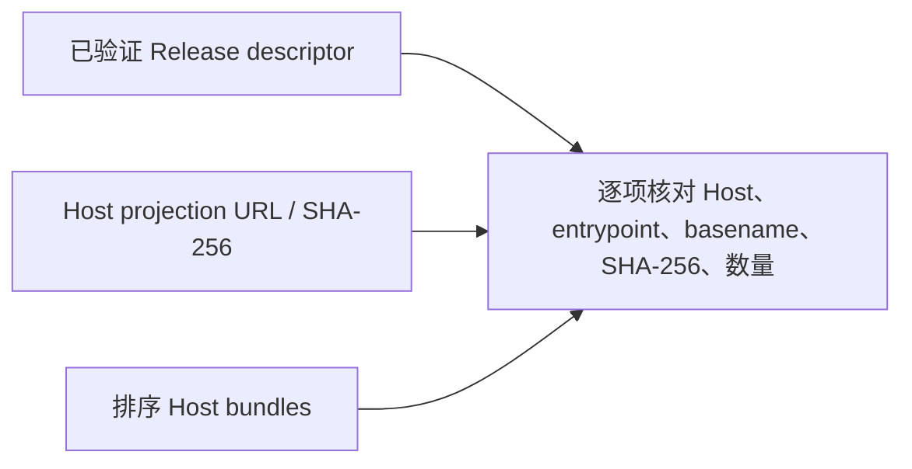

# AgentMesh360 Agent Release Consumption v1

状态：H2d4 代码、自主验证与本机 Kimi 独立交叉测试已完成；生产发布保持关闭

本文档定义客户端如何消费 H2d3 受签名 Registry v2 中的 Release reference。H2d4
只增加下载前验证门，不新增生产 endpoint、上传、网站服务、真实宿主安装或私钥处理。

## 1. 消费顺序

```mermaid
flowchart LR
    ACCESS["有效订阅 + 可信 Core 时间"]
    LKG["重新验签且未过期的 Registry v2 / LKG"]
    RELEASE_REF["Release URL + SHA-256"]
    FETCH["1 MiB bounded fetch\nHTTPS origin allowlist / no redirect"]
    STRICT["SHA-256 + canonical strict parse"]
    CLIENT_CHECK["Client projection cross-check"]
    ENVELOPE["下载 Envelope + SHA-256"]
    ARTIFACT["下载 Artifact + SHA-256"]
    H1["H1 签名、inventory、路径与 staging 验证"]
    FINAL_CHECK["fileManifestSha256 + signatureKeyId\n再次对 Release 核对"]
    APPROVAL["Verified staging → 既有权限批准门"]

    ACCESS --> LKG --> RELEASE_REF --> FETCH --> STRICT --> CLIENT_CHECK
    CLIENT_CHECK --> ENVELOPE --> ARTIFACT --> H1 --> FINAL_CHECK --> APPROVAL
```

下载器必须按以上顺序执行。Release 未通过前不能请求 Envelope 或 Artifact；任何一步
失败，临时下载目录由既有 `DownloadOperation` 清理，不能创建可批准的 staging。

## 2. Release 网络门

Release Manifest 使用与 Package 下载相同的 Host-owned HTTP client：

- URL 必须来自重新验签的 Registry Client projection；
- URL 必须属于编译期允许的 Package origin；
- 响应上限为 1 MiB，空响应和声明/实际超限均拒绝；
- 只接受 `application/json`；
- HTTP client 禁止 redirect，最终 URL 必须等于受签名 URL，状态必须为 200；
- 请求不携带订阅 token、Provider Key 或其他授权材料；
- 临时目录和文件继续使用 `0700` / `0600`，成功或失败后均清理。

生产 `Registry URL`、`Trust Bundle URL` 与 embedded Root Store 仍为空，因此本门不会
让当前生产客户端开始远端下载。

## 3. Client cross-check

Release bytes 先核对 Registry `releaseManifestSha256`，再经 H2d2 strict verifier：

1. schema 必须为 v1，JSON 必须是 canonical deterministic bytes；
2. package、agent、version、publisher 必须与 Registry record 相同；
3. Release URL basename 必须等于 Release identity 生成的文件名；
4. Artifact/Envelope URL basename 与 SHA-256 必须逐项相同；
5. Artifact 完成 H1 验证后，实际 `fileManifestSha256` 与 `signatureKeyId` 必须再次
   等于 Release 声明；
6. H1 验证出的 package identity 仍须与 Registry Client projection 相同。

因此 Root 签名 Registry、Release 文档、Envelope、Artifact inventory 和 H1 staging
之间不能各自声明不同版本、摘要或签名 key。

## 4. Host 只读投影

H2d4 复用同一 strict Release descriptor 校验官网 / Host Skill 只读投影：

当前只交付共享纯校验器和离线测试，没有创建官网服务或生产 Host 下载器。校验要求：

- Host projection basename/SHA-256 与 Release 相同；
- bundle 数量、排序、Host、entrypoint、basename 和 SHA-256 逐项相同；
- 缺失、替换、跨版本或额外 bundle 均失败；
- 零 Adapter Release 必须同时得到空 Release bundles 与空 Host projection，并通过
  同一验证器。

## 5. 失败关闭与 LKG

- 无有效订阅或可信时间时，在创建下载目录和网络连接前失败；
- Registry/Trust Bundle 已过期时，不允许把 stale LKG 当作下载 authority；
- 有效且重新验签的 LKG 可以继续提供 Release reference；
- Release 404、redirect、超限、摘要替换、非 strict JSON、跨版本 URL、Client/Host
  渠道漂移均在后续渠道消费前失败；
- Release 外层字段正确但 `fileManifestSha256` / `signatureKeyId` 与 H1 结果不同，
  仍在产生批准对象前失败并清理 staging。

## 6. 当前验证证据

2026-07-26 自主验证：

- Downloader 10/10；
- Release Registry / Client + Host cross-check 7/7；
- AgentMesh360 全量 165 项通过、1 个显式首方源码测试默认 ignore；
- 下载 → 权限批准 → 安装集成链通过；
- Host ACP 跨账户批准与 Runtime refresh 集成链通过；
- CLI 1/1、桌面 57 + 2 skip、Clippy `--lib --bins -D warnings`、Rustfmt、
  JS check 与 diff-check 通过；
- 显式首方源码测试重新实跑 Job、LectureCast、Deploy；三者既有 Artifact/Release
  摘要不变，并新增通过 Client/Host Release cross-check。

以上仍使用测试 Root、Publisher key、离线 URL 和本机源码路径，不代表生产 Registry、
真实上传、网站上线或用户可下载状态。

2026-07-26 Kimi 独立交叉测试：

- session `session_5dea9a9a-5e40-4df1-9c62-9c6a54d94c7f` 只读审查基线
  `6f25c68` 后的完整 diff 与未跟踪本文档；
- 独立实跑 Downloader 10/10、Registry 7/7、Release 5/5、Delivery 14/14、
  Trust Cache 4/4、AgentMesh360 165 + 1 ignored、CLI 1/1、桌面
  57 + 2 skip，以及 Clippy、Rustfmt、JS check 和 diff-check，全部通过；
- 按授权边界未访问外部首方仓库、未运行 ignored 首方源码测试；该项只属于自主验证；
- Blocker/High/Medium/Low 均为零，结论为无条件 PASS。

## 7. 计划边界

H2d4 是当前进展文档已批准的最后一个动态 Agent Package 切片。H2d4 关闭后应先复核
产品计划与生产发布安全门，再决定下一切片；本轮不自行命名或启动 H2d5，也不提前
生成生产 Root、配置 endpoint、上传文件、发布网站或写入用户真实宿主目录。
