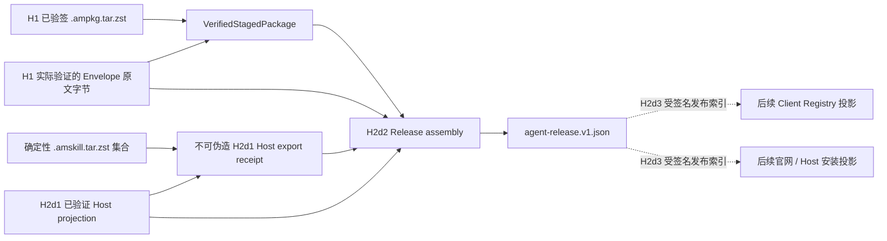

# AgentMesh360 Agent Release Manifest v1

状态：H2d2 代码、自主验证与两轮 Kimi 独立交叉测试已完成；生产发布仍保持关闭

本文档固定一个 Agent Release 如何同时绑定客户端持久 Agent Package 与 Codex、
Claude Code、OpenClaw 宿主 Skill 发布束。H2d2 只做离线、确定性的 release
assembly，不上传、不发布、不安装，也不把 Release Manifest 自身冒充为新的信任根。

## 1. 跨渠道发布单元



`VerifiedStagedPackage` 现在保留 H1 实际解析并验签的 Envelope 原文字节 SHA-256。
H2d2 必须收到逐字节相同的 Envelope；仅提供“字段语义相似”的另一个 JSON 会失败。

H2d1 receipt 的字段不再公开可写，只能由成功写出 Host bundles 的 H2d1 模块创建。
receipt 绑定 package/agent/version、Artifact、projection、签名 plan、Publisher keyId
和每个 bundle 的 Host/入口/实际文件路径/SHA-256。H2d2 以它作为不可伪造的内存能力，
不是从松散 receipt JSON 恢复 authority。

## 2. Release Manifest Schema

确定性输出文件：

```text
<packageId>-<version>.agent-release.v1.json
```

结构示例：

```json
{
  "schemaVersion": 1,
  "packageId": "com.agentmesh360.example-agent",
  "agentId": "example-agent",
  "version": "1.0.0",
  "publisher": "agentmesh360",
  "clientArtifact": {
    "fileName": "com.agentmesh360.example-agent-1.0.0.ampkg.tar.zst",
    "sha256": "<Artifact SHA-256>",
    "fileManifestSha256": "<package-files.v1.json SHA-256>",
    "signatureEnvelopeFileName": "com.agentmesh360.example-agent-1.0.0.signature.v1.json",
    "signatureEnvelopeSha256": "<H1 实际 Envelope 原文字节 SHA-256>",
    "signatureKeyId": "<Publisher keyId>"
  },
  "hostSkillPlan": {
    "projectionFileName": "com.agentmesh360.example-agent-1.0.0.host-skills.v1.json",
    "projectionSha256": "<H2d1 实际 projection SHA-256>",
    "signedPlanSha256": "<Artifact 内签名 plan SHA-256>"
  },
  "hostBundles": [
    {
      "host": "codex",
      "entrypoint": "skills/codex/SKILL.md",
      "fileName": "com.agentmesh360.example-agent-1.0.0-codex.amskill.tar.zst",
      "sha256": "<bundle SHA-256>"
    }
  ]
}
```

Manifest 不包含 URL、账户、Token、Provider Key、用户数据、生产私钥、构建机路径或
时间戳。URL 与 rollout 状态属于后续受签名 Registry/发布索引，不进入这个可复现内容
单元。

## 3. Assembly 验证门

Assembly 顺序：

1. Envelope、projection 和输出均限制为 1 MiB；
2. 复验 staging tree 与 H1 file manifest SHA-256，Manifest 必须等于 H1 结果；
3. Envelope 原文字节摘要必须等于 `VerifiedStagedPackage.envelopeSha256`，并再次核对
   schema/package/version/publisher/artifact/keyId；
4. projection 原文字节摘要必须等于 H2d1 receipt；
5. receipt 的 package/agent/version/Artifact/keyId 必须等于 H1；
6. Host receipt 必须对 Manifest Adapter 一一覆盖，Host 唯一、入口一致；
7. 每个 bundle 的 canonical 文件名、实际普通文件、32 MiB 上限和 SHA-256 必须等于
   H2d1 receipt；symlink/打开替换继续复用 H2d1 的 `O_NOFOLLOW + device/inode` 门；
8. Host 按固定字符串排序；输出使用 strict serde、canonical JSON 和 canonical
   SemVer；
9. Unix 输出目录/文件为 `0700/0600`，既有目录拒绝覆盖，失败清理本次新目录。

独立 verifier 还拒绝未知字段/Schema、非 canonical JSON、非法/超长身份与入口、
错误文件名、重复或非排序 Host、非法摘要和版本漂移。Release 身份复用 H1 的字符集
规则，入口与 H1 Manifest 统一限制为最多 512 字节，避免一个 Package 通过 H1/H2d1
后才在 H2d2 被误拒。

## 4. 零 Adapter 与动态 Agent

零 Adapter Agent 仍有合法客户端 Artifact、Envelope、projection/plan 和 Release
Manifest，只是 `hostBundles = []`。这让 Deploy Agent 可以继续作为客户端持久 Agent，
而不虚构不存在的 Codex/Claude Code/OpenClaw Skill。

未来新 Agent 在客户端已支持的 Schema/Capability 内，只需同仓 Manifest、Authoring
与真实 Skill 源文件，即可沿 H1 → H2d1 → H2d2 得到同一 Release 的两种产品投影；
不需要修改内置 Client Catalog 或增加 Agent 专属 release 代码。

## 5. 自主验证与首方摘要

2026-07-26 本机验证：

- Release assembly 专项 5/5；
- AgentMesh360 全量 158 项通过，1 个显式首方源码测试默认 ignore；
- 显式首方测试已单独实跑：三个 Agent 各做两次逐字节一致构建，经测试 Publisher
  签名、H1 verify、H2d1 export 后再完成 H2d2 release assembly；
- Authoring 6/6、Host export 7/7、桌面 57+2 skip、CLI 1/1、Clippy
  `-D warnings`、Rustfmt、JS check 与 diff-check 通过。

Kimi 首轮从基线 `e7d0b74` 独立读取完整 diff 和两个未跟踪文件，并实跑上述仓库内
命令；Blocker/High/Medium 为零，报告 3 条 Low：H1 与 H2d2 的入口长度上限和身份
字符集未共用、等数量未知 Host 的纵深防御分支缺直接测试。修复后 H1/H2d2 已共用
512 字节路径上限和身份校验器，并新增内部下划线身份、超长 H1 Adapter 路径及未知
Host receipt 的失败关闭覆盖。Kimi 第二轮再次实跑 Agent Package 9/9、Release 5/5、
Host export 7/7 + 1 ignored、AgentMesh360 158 + 1 ignored、CLI 1/1、桌面
57 + 2 skip 及全部静态检查，确认三条 Low 关闭且没有新问题，最终四档问题均为零并
给出无条件 PASS。首方 ignored 测试仍遵守授权边界未由 Kimi 运行。

| Agent | Artifact SHA-256 | Release Manifest SHA-256 |
| --- | --- | --- |
| Job Agent | `d00f374e2442c6853ff8dd39a9d832d4410b86b6027661483205c2d0fd692dd0` | `70b0ca7d60959fcad6fbf81f8fd69fb9edd9d0a9dd938d98ae238458be26f4c0` |
| LectureCast Agent | `229bb50b7ed095871bb282fe462519d3dcf5aa336283c2441f381f8913bce2b9` | `abdeefac441d4f98e87bc1bc1c8a5e8c4b35c420c77d635399c7ae1e327a5173` |
| Deploy Agent | `9a40f1fe4385f2c1e644cf0ad39d2d2daf0797f736dc1880b38e19ae573792ec` | `381101227368f93518629cbc75f7acd0c20b747dcd35121e9088e1af156c5b02` |

这些仍是当前源码和非生产测试 key 的开发证据，不是生产 Release、Git tag、CI
provenance、Registry 上线或网站发布证明。

## 6. H2d3 发布索引

Release Manifest 当前是受验证输入的确定性摘要，不自行建立新的信任根。H2d2 不修改
现有生产空 Root/Publisher Bundle/endpoint，不上传文件，不写真实宿主目录，也不改变
订阅硬门禁、BYOK、Provider Vault、credits 或稳定 Main Session。

H2d3 已让同一 Release Manifest 进入受签名 Release Registry v2，完整契约见
[`AGENT_RELEASE_REGISTRY_V2.md`](AGENT_RELEASE_REGISTRY_V2.md)：

1. Registry v2 绑定 Release Manifest URL/SHA-256、Artifact/Envelope 与全部 Host
   projection/bundle URL/SHA-256，并进入既有 Root 签名、可信时间、expiry 和反回滚；
2. Binder 只接受 H2d2 `AgentReleaseBuild`，发布方只能提供 canonical HTTPS URL；
3. 同一 record 生成客户端 Artifact 与官网/Host Skill 两种共享 Release reference
   的只读投影，缺项、重复 Host 和跨版本文件名失败关闭；
4. H2d4 已在 Artifact/Envelope 前 bounded fetch Release，完成 digest、strict parse、
   Client/Host projection 与 H1 metadata cross-check；生产 endpoint/root/bundle、
   上传和发布继续关闭。完整契约见
   [`AGENT_RELEASE_CONSUMPTION_V1.md`](AGENT_RELEASE_CONSUMPTION_V1.md)。

H2d3 已通过自主验证和两轮 Kimi 独立交叉测试。Kimi 首轮发现的 1 项 unknown-Host
测试覆盖 Low 已补入等数量、无重复但 Host 集合不匹配的精确断言；第二轮最终四档
问题全零并给出无条件 PASS。

H2d4 已完成自主验证与 Kimi 独立交叉测试，Kimi 四级问题全部为零并给出无条件
PASS；本阶段只补消费门，不改变生产关闭态。
