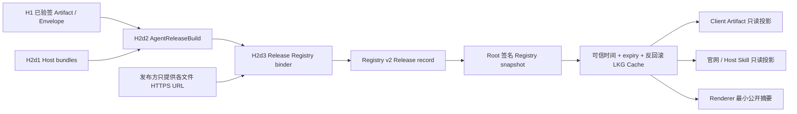

# AgentMesh360 Agent Release Registry v2

状态：H2d3 代码、自主验证与两轮本机 Kimi 独立交叉测试已完成；生产发布保持关闭

本文档定义 H2d2 `Agent Release Manifest v1` 如何进入现有
Root → Publisher Bundle → Registry 信任链，并从同一条受签名 Release 记录生成
客户端 Artifact 下载投影和官网 / Host Skill 只读投影。

H2d3 不新建旁路信任根，不上传文件，不启用生产 endpoint，也不把 URL 或 digest
暴露给桌面 Renderer。

## 1. 产品与信任结构



关键约束：

1. Registry binder 只接受 H2d2 `AgentReleaseBuild`，不接受任意 Release JSON；
2. `AgentReleaseBuild` 的字段私有，只能由 H1 `VerifiedStagedPackage` +
   H2d1 receipt 的 assembly 路径产生；
3. 发布方只能提供 URL，Artifact、Envelope、Host projection、每个 bundle 和
   Release Manifest 的 SHA-256 全部从 H2d2 build 提取，不能由调用方重填；
4. URL 文件名必须逐项等于 Release Manifest 内的 canonical 文件名；
5. 完成绑定的 Release record 进入既有 Root 签名、Publisher 信任、可信 Core 时间、
   expiry、revision 反回滚和 equivocation 检查。

## 2. Registry Snapshot Schema v2

H2d3 将旧的直接 Artifact 目录升级为 Release 目录，Schema 从 `1` 升为 `2`，
签名 domain 同步升级为：

```text
agentmesh360-package-registry-v2
```

单条记录结构：

```json
{
  "packageId": "com.agentmesh360.example-agent",
  "agentId": "example-agent",
  "version": "1.0.0",
  "publisher": "agentmesh360",
  "releaseManifestUrl": "https://packages.agentmesh360.com/com.agentmesh360.example-agent/1.0.0/com.agentmesh360.example-agent-1.0.0.agent-release.v1.json",
  "releaseManifestSha256": "<Release Manifest SHA-256>",
  "artifactUrl": "https://packages.agentmesh360.com/com.agentmesh360.example-agent/1.0.0/com.agentmesh360.example-agent-1.0.0.ampkg.tar.zst",
  "artifactSha256": "<Artifact SHA-256>",
  "envelopeUrl": "https://packages.agentmesh360.com/com.agentmesh360.example-agent/1.0.0/com.agentmesh360.example-agent-1.0.0.signature.v1.json",
  "envelopeSha256": "<H1 Envelope SHA-256>",
  "hostProjectionUrl": "https://packages.agentmesh360.com/com.agentmesh360.example-agent/1.0.0/com.agentmesh360.example-agent-1.0.0.host-skills.v1.json",
  "hostProjectionSha256": "<H2d1 projection SHA-256>",
  "hostBundles": [
    {
      "host": "codex",
      "entrypoint": "skills/codex/SKILL.md",
      "bundleUrl": "https://packages.agentmesh360.com/com.agentmesh360.example-agent/1.0.0/com.agentmesh360.example-agent-1.0.0-codex.amskill.tar.zst",
      "bundleSha256": "<Host bundle SHA-256>"
    }
  ]
}
```

Root 签名 payload 覆盖：

- Snapshot schema/revision/rootKeyId/trustBundleSequence/generatedAt/expiresAt；
- 每条 Release 的 package/agent/version/publisher；
- Release Manifest、Artifact、Envelope、Host projection 的 URL 与 SHA-256；
- Host bundle 数量，以及排序后每个 Host、入口、URL、SHA-256。

因此任意 Release digest、渠道 URL、Host 入口、bundle 数量或内容摘要的替换都会使
Registry 签名失效。Registry v1 会被 v2 verifier 明确拒绝；由于生产 Root 和
endpoint 仍为空，这次升级没有生产缓存迁移承诺，旧开发缓存按失败关闭处理。

## 3. 发布方绑定门

`bind_verified_release_record` 执行：

1. 再次验证 `AgentReleaseBuild` 内的 canonical Release 文档、build identity、
   canonical 文件名和 Release SHA-256；
2. 要求 Release Manifest、Artifact、Envelope、Host projection URL 均为 canonical
   HTTPS，且没有 credentials/query/fragment；
3. URL 最后一个 path segment 必须等于 H2d2 文件名；
4. Host URL 必须与 Release 的 Host 集合一一覆盖，拒绝缺失、重复和未知 Host；
5. Host 按固定字符串顺序输出，入口与 digest 只从 Release build 复制；
6. 零 Adapter Release 合法产生 `hostBundles = []`，但仍保留 Host projection
   URL/SHA，供官网明确展示“无宿主安装投影”。

Binder 不签名，也不持有生产私钥。生产 Root 签名仪式、CI provenance、上传和发布
仍是后续独立安全门。

## 4. 双渠道只读投影

同一条已签名 `RemotePackageRecord` 提供两种不可自行重组的投影。

客户端投影：

```text
package / agent / version / publisher
releaseManifest { url, sha256 }
artifactUrl / artifactSha256
envelopeUrl / envelopeSha256
```

官网 / Host Skill 投影：

```text
package / agent / version / publisher
releaseManifest { url, sha256 }
hostProjectionUrl / hostProjectionSha256
bundles[] { host, entrypoint, bundleUrl, bundleSha256 }
```

两个投影共享逐字段相同的 Release reference。客户端下载器现在显式从 Client
projection 读取 Artifact/Envelope，不再直接散取 Registry record 字段。

桌面 Renderer 仍只得到 packageId/agentId/version/publisher 和更新分类；
Release/Artifact/Envelope/Host 的 URL、digest、签名、Root ID 与本机路径继续由 Host
保管。官网投影是发布侧只读结构，不是当前桌面 Renderer API。

## 5. Last Known Good 与失败关闭

Registry v2 复用现有 Trust Cache：

- 必须有有效订阅提供的新鲜 Core server time；
- Publisher Bundle 与 Registry 必须绑定同一 Root 和 trust sequence；
- Registry revision 不能回退；
- 同 revision 不同文档视为 equivocation；
- 新响应失败时只允许返回重新验签、未过期的 Last Known Good；
- 缓存文档或摘要被本地篡改时整体拒绝。

H2d3 没有改变生产关闭态：

```text
PRODUCTION_TRUST_BUNDLE_URL = None
PRODUCTION_REGISTRY_URL = None
embedded Root Store = empty
```

## 6. 当前验证证据

2026-07-26 定向自主验证：

- Release Registry v2 / binder / 双投影专项 7/7；
- H2d2 Release 5/5、Host export 7/7 + 1 ignored；
- Trust Cache 5/5、Downloader 6/6、Delivery 14/14、Registry Fetcher 4/4；
- AgentMesh360 全量 161 项通过、1 个显式首方源码测试默认 ignore；
- CLI 1/1、桌面 57 + 2 skip、Clippy `--lib --bins -D warnings`、Rustfmt、
  JS check 和 diff-check 通过；
- 显式首方测试重新实跑 Job、LectureCast、Deploy：三者的
  `registryRelease` SHA-256 与 H2d2 Release Manifest SHA-256 逐项相等，Host
  bundle 数量分别为 2、3、0；
- 首方 Release 摘要保持不变：
  - Job `70b0ca7d60959fcad6fbf81f8fd69fb9edd9d0a9dd938d98ae238458be26f4c0`
  - LectureCast `abdeefac441d4f98e87bc1bc1c8a5e8c4b35c420c77d635399c7ae1e327a5173`
  - Deploy `381101227368f93518629cbc75f7acd0c20b747dcd35121e9088e1af156c5b02`

以上使用测试 key 与离线 URL，只是开发证据，不是生产 Registry、真实上传、网站上线
或用户可下载状态。

Kimi session `session_eebb7963-7cff-4505-8edd-715bf46f18d4` 首轮独立审查发现
1 项 Low：未知 Host 的失败关闭机制存在，但缺少等数量、无重复、集合不匹配的直接
测试。补入 `{Codex, ClaudeCode}` location 对 `{Codex, Openclaw}` Release 的精确
错误断言后，Kimi 第二轮确认它真正命中 `location Host is unknown` 分支，并复跑
Registry 7/7、Release 5/5、Host export 7/7 + 1 ignored、Clippy、Rustfmt 与
diff-check。最终 Blocker/High/Medium/Low 均为零，结论为无条件 PASS。

Kimi 额外执行的 `--all-targets -D warnings` 暴露了本轮未修改的旧
`provider_contract_harness.rs` dead-code 基线遗留；H2d3 的
`--lib --bins -D warnings` 门通过，该遗留不属于本轮回归。

## 7. 非目标与下一切片

H2d3 只建立受签名发布索引与双投影，不下载 Release Manifest 本身，也不在下载时
重新比对 Release 文档与 Registry projection。当前 Artifact/Envelope 下载仍依赖已
验签 Registry v2 的 Client projection；Release 文档的 bounded fetch、digest 校验、
strict 解析和下载前 cross-check 应作为 H2d4 独立门。

H2d4 建议范围：

1. 下载 Artifact 前先获取 Release Manifest，限制响应、拒绝 redirect，并核对
   Registry `releaseManifestSha256`；
2. strict 验证 Release 文档后，逐项比对 Client projection；Host 发布消费者同样
   比对 Host projection；
3. 覆盖 Release 缺失、摘要替换、跨版本、渠道漂移、过期 Registry 与 LKG；
4. 生产 endpoint/root/bundle、上传、网站发布和真实宿主安装继续关闭。
