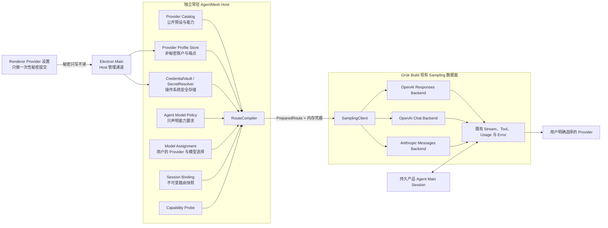

# CC Switch Provider 调研与 AgentMesh360 Provider 架构决策

状态：调研完成，切片 A/B/C 已实现，切片 D0 开发中

调研日期：2026-07-22

调研对象：CC Switch `v3.18.0`，提交
[`a377d79303bc1e592d2783d559ca5bd6b8ba1417`](https://github.com/farion1231/cc-switch/commit/a377d79303bc1e592d2783d559ca5bd6b8ba1417)

适用仓库：`AgentMesh360-Client`

> 本文档记录调研证据、推导过程和目标设计，不代表文中所有能力已经实现。
> 当前实现状态仍以
> [`PRODUCT_BLUEPRINT.md`](PRODUCT_BLUEPRINT.md) 与代码为准。

切片 A 已接受的实现决策见
[`ADR_PROVIDER_CONTROL_PLANE_VAULT.md`](ADR_PROVIDER_CONTROL_PLANE_VAULT.md)。

实现进度（2026-07-23）：切片 A/B/C 已经落地，包括共享 `state.db v5`、账户隔离的
Provider Profile Store、macOS Host Keychain Vault、声明式内置 Catalog、Capability、
Model Policy、三层 Model Assignment、非秘密 RouteCompiler，以及对应 ACP/桌面 Host
Client 方法；产品 Agent/Main Session/Workspace 已按账户隔离，不可变 Session Binding、
revision、回滚和实际 Turn Route 的可信存储接口也已实现。Turn 接口尚未接到 Sampling，
Provider UI 与真实模型路由仍是目标能力。

逐轮实施证据、计划复盘和下一轮验收条件统一记录在
[`../PROJECT_PROGRESS.md`](../PROJECT_PROGRESS.md)。

## 1. 调研背景与目标

AgentMesh360 Client 已确定采用 BYOK 作为默认推理模式。用户必须先通过
AgentMesh360 订阅硬门禁，进入客户端后再自行选择模型 Provider 并承担 Provider
侧费用；普通 BYOK 推理不消耗 AgentMesh360 credits。

最初蓝图只明确列出 OpenAI、xAI 和 Anthropic，但真实用户还会持有 Google Gemini、
DeepSeek、Kimi、智谱 GLM、通义千问、MiniMax、豆包、OpenRouter、SiliconFlow，
以及本地 Ollama、LM Studio、vLLM 等服务的凭据。若为每一家 Provider 编写一套独立
Harness，会造成重复实现、兼容性漂移和后续维护负担。

本次调研试图回答：

1. CC Switch 实际支持哪些 Provider，所谓“支持”具体发生在哪一层；
2. 各宿主工具的 Provider 配置格式有什么差异；
3. CC Switch 如何处理 Responses、Chat Completions、Anthropic Messages、Gemini 和
   Bedrock 等协议；
4. AgentMesh360 Client 的 Grok Build Fork 已经具备哪些基础；
5. 我们应该复用哪些思想、拒绝照搬哪些实现；
6. 如何让未来新增 Provider 与新增产品 Agent 都不必大改客户端。

## 2. 调研范围与证据

调研以 CC Switch GitHub 仓库和本地浅克隆源码为一手资料，没有把第三方博客或推广页
当作能力依据。

主要证据包括：

- [CC Switch README（中文）](https://github.com/farion1231/cc-switch/blob/a377d79303bc1e592d2783d559ca5bd6b8ba1417/README_ZH.md)；
- [添加 Provider 用户文档](https://github.com/farion1231/cc-switch/blob/a377d79303bc1e592d2783d559ca5bd6b8ba1417/docs/user-manual/zh/2-providers/2.1-add.md)；
- [Provider 预设目录](https://github.com/farion1231/cc-switch/tree/a377d79303bc1e592d2783d559ca5bd6b8ba1417/src/config)；
- [Codex Provider 预设](https://github.com/farion1231/cc-switch/blob/a377d79303bc1e592d2783d559ca5bd6b8ba1417/src/config/codexProviderPresets.ts)；
- [Grok Build Provider 预设](https://github.com/farion1231/cc-switch/blob/a377d79303bc1e592d2783d559ca5bd6b8ba1417/src/config/grokBuildProviderPresets.ts)；
- [统一 Provider 结构](https://github.com/farion1231/cc-switch/blob/a377d79303bc1e592d2783d559ca5bd6b8ba1417/src/config/universalProviderPresets.ts)；
- [Provider 持久化实现](https://github.com/farion1231/cc-switch/blob/a377d79303bc1e592d2783d559ca5bd6b8ba1417/src-tauri/src/database/dao/providers.rs)；
- [跨 Provider Session 限制说明](https://github.com/farion1231/cc-switch/blob/a377d79303bc1e592d2783d559ca5bd6b8ba1417/docs/guides/codex-unified-session-history-guide-zh.md)。

对兼容性边界另外核对了厂商一手文档：

- [Google Gemini API 的 OpenAI compatibility](https://ai.google.dev/gemini-api/docs/openai)；
- [Anthropic Extended Thinking](https://platform.claude.com/docs/en/docs/build-with-claude/extended-thinking)。

AgentMesh360 现状判断来自本仓库 Grok Sampling、模型配置、Electron `safeStorage`、
ACP 子进程启动与应用退出清理代码；这些证据只用于区分“已实现”和“目标”，没有把
规划中的独立 Host/Vault 当作现有能力。

- [Grok `ApiBackend` 定义](../../crates/codegen/xai-grok-sampling-types/src/types.rs)；
- [Grok 模型与认证配置](../../crates/codegen/xai-grok-shell/src/agent/config.rs)；
- [桌面 Refresh Token 安全存储](../../desktop/src/auth/secure-token-store.js)；
- [桌面 ACP Host 子进程](../../desktop/src/host/acp-client.js)；
- [桌面退出生命周期](../../desktop/src/main.js)。

## 3. 首先要澄清：宿主工具不等于模型 Provider

CC Switch 当前管理八类宿主工具：

- Claude Code；
- Claude Desktop；
- Codex；
- Gemini CLI；
- Grok Build；
- OpenCode；
- OpenClaw；
- Hermes Agent。

这些是使用模型的客户端或 Harness，不是模型 Provider。OpenAI、Anthropic、xAI、
Google、DeepSeek、Kimi 等才是 Provider。

同一个 Provider 在不同宿主工具中可能需要完全不同的配置。例如 Kimi 在 Claude Code
中可以通过 Anthropic 兼容地址接入，在 Codex 中通过 OpenAI Chat Completions 接入，
在 OpenClaw 中则表现为带模型目录和能力元数据的 Provider 对象。因此不能把
“CC Switch 支持某 Provider”简单理解为存在一个全局通用配置。

## 4. CC Switch Provider 覆盖范围

### 4.1 各宿主工具预设规模

按提交 `a377d793` 中各 `*ProviderPresets.ts` 顶层预设数组统计：

| 宿主工具 | 顶层预设条目数 | 主要配置载体 |
| --- | ---: | --- |
| Claude Code | 72 | `settings.json` 中的 `env` |
| Claude Desktop | 69 | Claude 配置与本地模型映射 |
| Codex | 66 | `auth.json` + `config.toml` |
| Gemini CLI | 21 | `.env` + `settings.json` |
| Grok Build | 38 | CC Switch 内部载体再生成 Grok 配置 |
| OpenCode | 60 | Provider SDK `options` 与模型目录 |
| OpenClaw | 60 | `baseUrl/apiKey/api/models` |
| Hermes Agent | 61 | `config.yaml` 中的 `custom_providers` |

Grok Build 的 38 是 `GROK_BUILD_PROVIDER_PRESETS` 数组条目数；应用另外注入独立的
`Grok Official` 登录项时，用户界面可见条目会是 39。本文用 38 是为了保持所有宿主
都按“顶层预设数组”这一口径统计。

这些数字包含同一家 Provider 的国内区、国际区、Coding Plan、Token Plan、OAuth、
中转站和合作伙伴变体，不应相加后宣称为独立 Provider 总数。README 对外使用
“50+ Provider 预设”是更稳妥的产品描述。

### 4.2 Provider 分类

#### 官方模型与云平台

- Anthropic / Claude；
- OpenAI；
- Google Gemini；
- xAI / Grok；
- Azure OpenAI；
- AWS Bedrock。

需要注意，“Claude Official”“OpenAI Official”“Google Official”“Grok Official”
在 CC Switch 中经常代表保留宿主工具的官方账号登录，不等同于用户填写官方 API Key。
AgentMesh360 的 BYOK Profile 必须把“API Key 账户”和“订阅 OAuth 账户”分开建模。

#### 国内官方模型与 Coding Plan

- DeepSeek；
- Kimi / Moonshot 与 Kimi For Coding；
- 智谱 GLM 与 Z.ai 国际端点；
- 阿里云百炼 / Qwen；
- 百度千帆 Coding Plan；
- StepFun；
- MiniMax；
- 豆包、火山 Agent Plan 与 BytePlus；
- 小米 MiMo；
- LongCat；
- BaiLing；
- KAT-Coder。

#### 模型托管与推理平台

- SiliconFlow；
- NVIDIA NIM；
- ModelScope；
- Novita AI；
- Together AI；
- Nous Research；
- OpenCode Go；
- AtlasCloud。

#### 聚合网关与中转服务

- OpenRouter；
- NewAPI 与自定义多协议网关；
- AiHubMix、DMXAPI、PackyCode、Cubence、AIGoCode、RightCode、
  AICodeMirror、CrazyRouter、TheRouter 等。

中转站预设数量很多，但从架构上通常只是某种标准或准标准协议的端点模板。我们不应
把商业合作伙伴清单固化成核心代码，也不应默认信任任何中转站对模型真实性、隐私或
可用性的自述。

## 5. CC Switch 实际复用的协议族

CC Switch 的广泛 Provider 覆盖并不是依靠几十套独立 Harness，而是把 Provider 映射
到少量协议族，并在必要时通过本地路由做格式转换。

| 协议族 | 典型 Provider | 主要端点 | 关键差异 |
| --- | --- | --- | --- |
| OpenAI Responses | OpenAI、xAI、Azure OpenAI、部分 Codex 中转 | `/v1/responses` | reasoning、encrypted content、Responses 事件流 |
| OpenAI Chat Completions | DeepSeek、Kimi、GLM、Qwen、MiniMax、豆包、OpenRouter、本地模型 | `/v1/chat/completions` | 厂商 reasoning 字段、tool call 流式增量差异大 |
| Anthropic Messages | Anthropic、Kimi Coding、Claude 兼容网关 | `/v1/messages` | content block、thinking/signature、cache 与 tool result 结构 |
| Gemini Native | Google Gemini 与原生 Gemini 网关 | `generateContent` / `streamGenerateContent` | role、part、function call、schema 和流式格式独立 |
| Bedrock Converse | AWS Bedrock | Converse / ConverseStream | SigV4、Region、模型 ARN/ID 与云权限体系 |

此外，Azure、Vertex 和 Bedrock 不能只当作一个不同的 `base_url`：它们分别涉及
API Version、Deployment、项目/区域、IAM 或云签名等传输和认证语义。

## 6. 各宿主工具的具体配置形态

### 6.1 Claude Code

基础形态是：

```json
{
  "env": {
    "ANTHROPIC_API_KEY": "your-api-key",
    "ANTHROPIC_BASE_URL": "https://api.example.com",
    "ANTHROPIC_MODEL": "model-id",
    "ANTHROPIC_DEFAULT_HAIKU_MODEL": "fast-model-id",
    "ANTHROPIC_DEFAULT_SONNET_MODEL": "default-model-id",
    "ANTHROPIC_DEFAULT_OPUS_MODEL": "strong-model-id"
  }
}
```

部分预设使用 `ANTHROPIC_AUTH_TOKEN` 代替 `ANTHROPIC_API_KEY`。预设元数据还可能声明：

- `apiFormat = anthropic | openai_chat | openai_responses | gemini_native`；
- `providerType = github_copilot | codex_oauth | xai_oauth`；
- OAuth 是否必需；
- 模型发现地址；
- 端点候选、测速地址和模型角色映射。

当上游不是 Anthropic Messages 时，CC Switch 的本地代理负责协议转换，不能仅靠上述
环境变量完成兼容。

### 6.2 Codex

CC Switch 为 Codex 管理两部分配置：

`~/.codex/auth.json`：

```json
{
  "OPENAI_API_KEY": "your-api-key"
}
```

`~/.codex/config.toml`：

```toml
model_provider = "custom"
model = "gpt-5.5"
model_reasoning_effort = "high"
disable_response_storage = true

[model_providers.custom]
name = "custom"
base_url = "https://api.example.com/v1"
wire_api = "responses"
requires_openai_auth = true
```

Azure OpenAI 还会加入 `query_params.api-version`。如果真实上游只有 Chat Completions，
预设会声明 `apiFormat = openai_chat`、模型目录、上下文窗口和 reasoning 方言，再由
CC Switch 将 Codex Responses 请求转换为 Chat Completions。

因此，Codex Provider 预设至少包含：认证、基础 TOML、真实上游协议、模型目录、
上下文窗口、推理能力、缓存路由和可选的 OAuth 类型。

### 6.3 Gemini CLI

基础形态是：

```json
{
  "env": {
    "GEMINI_API_KEY": "your-api-key",
    "GOOGLE_GEMINI_BASE_URL": "https://api.example.com",
    "GEMINI_MODEL": "gemini-model-id"
  }
}
```

Google 官方 OAuth、API Key 和第三方代理是不同认证模式。Gemini 预设数量明显少于
其他宿主，说明“Provider 数量”也受到宿主协议和代理生态约束。

### 6.4 OpenClaw

OpenClaw 预设已经接近我们需要的 Provider Domain：

```json
{
  "baseUrl": "https://api.example.com/v1",
  "apiKey": "",
  "api": "openai-completions",
  "models": [
    {
      "id": "model-id",
      "name": "Display Name",
      "contextWindow": 200000,
      "cost": {
        "input": 1.0,
        "output": 4.0
      }
    }
  ]
}
```

其 `api` 可以表示 `openai-completions`、`anthropic-messages`、
`bedrock-converse-stream` 等模式。模型成本属于展示和本地估算元数据，不应成为
AgentMesh360 的权威计费依据。

### 6.5 Hermes Agent

Hermes 的 Provider 结构使用 snake_case YAML：

```yaml
custom_providers:
  - name: kimi
    base_url: https://api.moonshot.cn/v1
    api_key: ""
    api_mode: chat_completions
    models:
      kimi-k2.7-code:
        context_length: 262144
```

当前 API Mode 包括：

- `chat_completions`；
- `anthropic_messages`；
- `codex_responses`；
- `bedrock_converse`。

### 6.6 Grok Build

CC Switch 的 Grok Build 预设并不是一套完整的通用 Provider 抽象。它暂时借用
Codex 风格 TOML 作为内部载体，只提取 `base_url`、`model` 和 `wire_api` 后再生成
Grok CLI 配置。

其预设源码还明确排除了不提供 Grok 模型的国内官方直连和纯模型托管站，只保留
xAI 官方登录、xAI API，以及能提供 Grok 模型的聚合或中转端点。因此不能根据
CC Switch 的 Grok Build 预设只有 38 条，就推断 Grok Build Harness 本身只能使用
这些 Provider。

## 7. CC Switch 值得借鉴的设计

### 7.1 协议族优先，而不是厂商 Adapter 优先

新增 Provider 的常规路径应是“选择已有协议 + 增加预设 + 声明模型能力”，而不是
复制一套请求客户端。只有云认证、特殊 reasoning 方言或严重不兼容行为才进入
Provider Quirk 层。

### 7.2 预设不只有名称、Key 和 Base URL

可靠预设还要包含：

- 协议族与认证类型；
- 默认端点和模型发现策略；
- 模型 ID、展示名和上下文窗口；
- Tool Call、Vision、Reasoning、Structured Output 能力；
- 厂商专属 Header、Query、路径和 User-Agent；
- Prompt Cache、reasoning 字段和流式 Tool Call 兼容信息；
- 健康检查和必要的协议探测策略。

### 7.3 通用 Provider 与应用专属映射分离

CC Switch 的 Universal Provider 只保存名称、Base URL、API Key 和各宿主模型映射，
再生成 Claude、Codex、Gemini 各自的配置。这说明“用户账户/Profile”与“宿主运行时
配置”应是两个层次。

AgentMesh360 没有必要为八个外部宿主生成配置，但仍应保留同样的分层：一个用户
Provider Profile 可以被多个产品 Agent 和多个模型角色复用。

### 7.4 模型发现只是起点，不是能力证明

CC Switch 会尝试 OpenAI 兼容的 `/v1/models`，并处理若干 Anthropic 兼容子路径。
但端点返回模型 ID，只能证明目录接口存在，不能证明：

- 流式响应可用；
- Tool Call 参数增量正确；
- Vision 或 PDF 可用；
- Structured Output 可与 Tool Call 同时使用；
- Reasoning 字段能跨轮保留；
- System/Developer Prompt 语义正确；
- 上下文窗口和缓存行为与宣传一致。

AgentMesh360 必须使用能力探测，而不是只依赖 `/models`。

## 8. 不应照搬的部分

### 8.1 不做“配置切换器”产品

CC Switch 的核心任务是把 Provider 配置写入其他宿主工具。AgentMesh360 Client 本身
就是 Harness 和产品 Agent 的宿主，应由 Host Provider Control Plane 把用户选择编译
成 Grok 现有 Sampling 数据面的运行时路由，不应先生成 Claude/Codex/Grok 配置文件，
再让子进程重新读取，也不应在 AgentMesh 层重写一套平行的 Agent Loop。

### 8.2 不把真实 API Key 存进普通 Provider JSON

CC Switch 的 `Provider.settings_config` 会整体序列化到
`~/.cc-switch/cc-switch.db` 的 TEXT 字段，并在部分路径同步到宿主配置文件。即使它是
本地存储，这也不是 AgentMesh360 既定安全要求。

AgentMesh360 必须：

- 只在本地数据库保存不可逆的 `credential_ref`；
- 真实 API Key、Refresh Token 和云凭据进入操作系统安全存储；
- Renderer 只在用户输入时短暂接触 Key，不得持久化到状态、日志、快照或崩溃报告，
  一次性提交后立即清空；
- Host 永远不向 Renderer 回传真实密钥，Agent Package、Session 文本和日志也不能读取；
- 独立常驻 Host 直接按引用从操作系统安全存储取出凭据，在内存中注入当前请求；
- 删除 Profile 时显式处理安全存储项，防止留下孤儿凭据。

如果未来要求“Renderer 连用户输入时也不能看见 Key”，就必须改用桌面主进程或原生
系统控件承载输入；普通 Web 输入框无法满足这一更强边界。

### 8.3 不默认支持第三方订阅 OAuth 复用

ChatGPT、Claude、Grok、GitHub Copilot 等订阅 OAuth 与普通 API Key 不属于同一商业
和技术契约。是否允许第三方客户端复用订阅凭据，还涉及服务条款、Token 刷新、账号
风控和上游接口稳定性。

M1 以 BYOK API Key 为主。Grok Build Fork 已有的 xAI 官方登录可以保留为独立能力，
但不能自动扩展为“默认支持所有订阅账号”。任何新增订阅 OAuth 必须单独评审。

### 8.4 不把第三方中转站默认视为可信

中转站意味着 Prompt、文件、工具上下文和输出会经过新的数据处理方。预设目录可以
提供技术连接信息，但必须明确标注官方、云平台、聚合器、中转站或本地端点，展示
数据去向，并要求用户主动选择，不能静默降级或自动换站。

## 9. AgentMesh360 当前可复用的 Grok Build 基础

当前 Fork 已原生实现三种 `ApiBackend`：

```rust
pub enum ApiBackend {
    ChatCompletions,
    Responses,
    Messages,
}
```

对应源码：
[`xai-grok-sampling-types/src/types.rs`](../../crates/codegen/xai-grok-sampling-types/src/types.rs)。

当前模型覆盖配置已经支持：

- `model`；
- `base_url` 与 `api_base_url`；
- `api_key`、`env_key` 与 `auth_provider`；
- `api_backend`；
- `extra_headers`；
- `context_window`；
- `reasoning_effort` 与可选值；
- `stream_tool_calls`；
- 温度、Top P、最大输出、超时和重试；
- Agent Type、System Prompt Label 和自动压缩阈值。

对应源码：
[`xai-grok-shell/src/agent/config.rs`](../../crates/codegen/xai-grok-shell/src/agent/config.rs)。

这意味着 OpenAI Responses、xAI Responses、OpenAI Chat Compatible 和 Anthropic
Messages 不需要从零重写推理循环。下一阶段的主要工作是把已有底层能力提升为
AgentMesh360 的安全 Profile、动态目录、能力探测和产品 UI。

当前明显缺口包括：

- Google Gemini 官方 OpenAI 兼容路径的 Harness 契约验证，以及后续是否需要
  Gemini Native/Interactions Backend 的专项评估；
- AWS Bedrock Converse/SigV4；
- Google Vertex 项目、区域和凭据链；
- Azure OpenAI Deployment/API Version 的正式 Profile；
- Host 自持的 `CredentialVault / SecretResolver`；
- Provider Profile CRUD 与模型选择 UI；
- 模型能力探测与缓存；
- Session 与 Provider 的可恢复绑定；
- 动态签名 Provider Catalog。

需要特别澄清：Grok 现有 `auth_provider` 是“执行外部命令、读取并缓存 bearer token”
的 Credential Helper 接口，不是 macOS Keychain、Windows Credential Manager 或
Linux Secret Service 抽象。为了降低上游合并冲突，AgentMesh 不应改名或复用该接口
来伪装操作系统凭据库。

## 10. AgentMesh360 目标架构



架构上必须明确区分两层：AgentMesh Host 的 Provider Control Plane 负责目录、账户、
凭据、策略、用户选择、会话绑定与路由编译；Grok Build 现有 SamplingClient 继续负责
真正的推理请求。AgentMesh 新代码尽量集中在自身模块中，只通过窄接口把
`PreparedRoute` 投影为现有 `ModelEntry / SamplingConfig`，以控制上游同步成本。

### 10.1 Provider Catalog

Provider Catalog 是不含用户秘密的公开、版本化、可签名数据：

```yaml
schema_version: 1
id: moonshot
display_name: Kimi / Moonshot
classification: official
protocol: openai_chat
auth:
  kind: bearer_api_key
endpoint:
  default_base_url: https://api.moonshot.cn/v1
  models_path: /models
models:
  - id: kimi-k2.7-code
    display_name: Kimi K2.7 Code
    context_window: 262144
    capabilities:
      tools: true
      vision: false
      reasoning: true
      structured_output: probe
quirks:
  reasoning_dialect: thinking
  reasoning_output: reasoning_content
```

Catalog 必须支持：

- 客户端内置可信基线；
- AgentMesh360 签名增量更新；
- last-known-good 缓存、单调版本、防回滚计数器和撤销策略；
- 未知字段前向兼容；
- Preset ID 稳定，显示名称和模型目录可更新；
- 分类与数据去向提示；
- Provider 下线时不删除用户 Profile，只停止推荐并显示警告。

Provider Catalog 与 Agent Package Registry 可以复用下载和验签基础设施，但必须使用
不同的签名根、对象类型、权限、版本命名空间和防回滚计数器，避免一种内容的签名被
另一种内容接受。Agent Package 不能夹带任意可执行 Provider 适配器，也不能读取
Provider 凭据。

远端 Catalog 更新还必须遵守以下约束：

- Catalog 只能承载声明式数据，不能包含脚本、动态库或其他可执行逻辑；
- 不允许秘密插值、任意认证 Header 模板或可读取本地环境的表达式；
- 签名、Schema 或回滚校验失败时，只拒绝这次新更新并继续使用内置或
  last-known-good 版本，不能中断已有 Profile 与 Session；
- Catalog 更新不能原地改变已绑定 Session 的端点、协议或模型。若预设变化影响路由，
  必须生成新的 Profile route revision，由用户显式确认迁移。

### 10.2 Provider Profile

Provider Profile 是用户设备上的一个具体账户或端点实例。一个 Provider 可以有多个
Profile，例如个人 OpenAI Key、公司 Azure Deployment 和本地 Ollama。

推荐结构：

```yaml
schema_version: 1
id: provider-profile-uuid
preset_id: moonshot
display_name: 我的 Kimi
protocol: openai_chat
base_url: https://api.moonshot.cn/v1
credential_ref: credential://vault/h_7Bv9mQ2xK4pL
auth_kind: bearer_api_key
enabled_models:
  - kimi-k2.7-code
overrides:
  headers: {}
  query: {}
  timeout_seconds: 300
route_revision: 1
last_probe:
  status: passed
  catalog_etag: example
```

数据库可以保存 Profile 的非秘密字段、Key 的最后四位、验证状态和时间；不能保存完整
API Key、Refresh Token、AWS Secret Access Key 或服务账号私钥。

`credential_ref` 必须是 Host 签发的随机不透明句柄，不能由 Profile ID、Provider ID
或用户名预测。Host 解析时必须校验当前本地用户、Profile 与句柄归属，防止调用方用
替换引用的方式读取其他 Profile 的秘密。

Provider Profile 只描述一个账户/端点实例，不承担“某个 Agent 的 main/fast/reasoning
角色选择”。Profile 发生端点、协议、认证或兼容性变更时创建新的 `route_revision`，
已有 Session 继续使用原绑定快照，不能随 Profile 编辑静默漂移。

### 10.3 Model Assignment

用户选择必须单独建模，不能混进 Agent Package 的能力要求或 Provider Profile：

```yaml
schema_version: 1
scope: agent
agent_id: job-agent
role: main
provider_profile_id: provider-profile-uuid
model_id: kimi-k2.7-code
assignment_revision: 4
```

解析优先级为 Session 显式选择 > Agent 级选择 > 全局默认。Agent Package 的
`AgentModelPolicy` 只声明 required/preferred 能力；`ModelAssignment` 记录用户的实际
选择；`SessionProviderBinding` 再把最终路由冻结为可恢复快照。三者不能合并。

### 10.4 Credential Vault

当前 Grok Build 的 `auth_provider` 是外部命令 Credential Helper：它运行用户配置的
命令，从标准输出读取 bearer token 并在进程内缓存。该接口应保持上游语义，不扩展或
重命名为 Keychain Provider。

AgentMesh360 应在 Host 自有模块增加 `CredentialVault / SecretResolver`，分别接入
macOS Keychain、Windows Credential Manager、Linux Secret Service 或受支持平台的
等价安全存储。目标 Host 独立于 Electron 常驻，因此不能依赖 Renderer 或 Electron
在每次推理时注入 Key；Electron 只在 Profile 创建/更新时通过 Host 管理通道一次性
传递明文，Host 写入 Vault 后永不回传。

凭据解析应满足：

1. 由 Host 根据 `provider_profile_id` 取凭据；
2. `RouteCompiler` 只为当前请求生成内存中的凭据租约或认证快照；
3. Profile、Session、Catalog 和持久化模型配置只保存凭据句柄，不能序列化真实值；
4. 401/403 后允许安全刷新或重新验证；
5. 日志只记录 Profile ID、Provider ID、状态码和已脱敏端点；
6. UI 只能得到 `configured/invalid/expired` 等状态，Host 不提供读取秘密的 API。

### 10.5 Sampling 数据面与协议 Backend

M1 直接复用 Grok SamplingClient 已有的三种 Backend：

```text
openai_responses
openai_chat
anthropic_messages
```

`RouteCompiler` 把 Catalog/Profile/Assignment/Binding 编译到已有 `ModelEntry` 与
`SamplingConfig`。Provider 专属差异进入受限声明式 Quirk 或窄实现；当声明式能力不足
时，才通过受审查的客户端版本增加代码。

Google 官方提供 OpenAI SDK 兼容端点，文档覆盖 Chat Completions、Streaming、
Function Calling，并映射 `reasoning_effort`。M1 可在完成 Harness 契约测试后，通过
该路径接入 Gemini；但官方也明确建议没有 OpenAI SDK 依赖的新应用直接使用 Gemini
API，且兼容端点路径仍为 `v1beta/openai`。因此 Gemini Native/Interactions 是否值得
单独实现属于专项 Spike，不是 M1 控制面的前置条件。参见
[Google Gemini OpenAI compatibility](https://ai.google.dev/gemini-api/docs/openai)。

### 10.6 Model Capability Profile

每个可选模型至少应描述：

- 上下文窗口与最大输出；
- 文本、图像、音频、PDF 输入能力；
- Tool Call 与并行 Tool Call；
- Structured Output；
- Reasoning 以及可选 effort；
- Prompt Cache；
- Streaming 与 Tool Argument Delta；
- System/Developer Prompt 语义；
- 非权威的 Agent compatibility hints，仅用于 UI 排序，不能覆盖 Package Policy 或
  Probe 结果；
- 能力来源是 `catalog`、`provider_reported`、`probe_verified` 还是 `user_override`。

冲突时不能把预设宣传值当作运行时真相。需要在 UI 中区分“声明支持”和“已验证”。

### 10.7 Agent Model Policy

Agent Package 不应绑定特定商业 Provider，而应声明能力要求：

```toml
[models.requirements]
tools = "required"
vision = "optional"
structured_output = "required"
min_context_window = 128000
reasoning = "preferred"

[models.roles]
main = "required"
fast = "optional"
vision = "optional"
```

Host 通过独立 `ModelAssignment` 按 Session、Agent、全局顺序解析用户选择。任何候选
都必须先满足能力要求；跨 Provider 发送数据必须由用户明确确认。M1 不实现自动跨
Provider 或跨模型 fallback，避免数据边界和推理状态在失败路径中变得不可预测。

## 11. 持久 Session 与 Provider 切换

这是本次调研对 AgentMesh360 最重要的额外结论之一。

Codex Responses 会话可能包含 `reasoning.encrypted_content`；Anthropic Messages 的
extended thinking block 带有 opaque signature，跨轮 Tool Use 时必须原样回传。Anthropic
官方明确说明，同一 Claude thinking signature 可以在 Anthropic API、Amazon Bedrock
和 Google Cloud Vertex AI 之间兼容，但这不代表任意 OpenAI 兼容网关或其他模型都能
接收。参见 [Anthropic extended thinking](https://platform.claude.com/docs/en/docs/build-with-claude/extended-thinking)。

因此这里不能简单写成“所有签名都只属于原 Provider”，更准确的约束是：Session 中
可能存在由特定模型/协议产生的不可见推理状态，其可移植范围必须有明确证据，不能由
客户端猜测。把同一历史直接发给未经验证的 Provider，可能导致 400、推理状态丢失或
续聊语义改变。

AgentMesh360 的固定 Main Session 不能因此丢失或被重建。推荐增加
`SessionProviderBinding`：

```yaml
session_id: stable-main-session-uuid
provider_profile_id: provider-profile-uuid
provider_preset_id: openai
protocol: openai_responses
endpoint_origin: https://api.openai.com
model_id: gpt-model-id
profile_route_revision: 2
capability_snapshot_hash: sha256-example
binding_revision: 3
bound_at: 2026-07-22T00:00:00Z
```

每个推理 Turn 还应记录实际 Provider、模型、协议和非秘密能力快照，便于恢复、审计和
成本展示。

Session Binding 必须先于 Provider 切换 UI 实现。编辑 Profile 的 endpoint、protocol、
model mapping 或认证方式时，创建新的 route revision；已有 Session 继续使用原来的
不可变路由快照，直到用户显式创建新绑定或兼容迁移，绝不能随着 Profile/Catalog 更新
静默漂移。

当用户切换 Provider 时：

1. 若历史可直接兼容，更新绑定并明确显示数据去向变化；
2. 若存在 Provider 私有推理状态，提供“继续使用原 Provider”；
3. 或创建“兼容迁移分支”：保留原 Main Session 全部历史，只把可见对话、结构化状态
   和本地生成的摘要送入新 Provider；
4. 不得删除旧历史、伪装为原地无损迁移或静默切换；
5. 即使原 Key 失效，用户仍能在订阅有效时看到本地保存的历史，并重新配置原 Provider
   或选择显式迁移。

这与订阅硬门禁并不冲突：订阅无效时仍禁止进入客户端，但本地 Session 和绑定数据不
删除，恢复订阅后可以继续处理。

## 12. 安全与信任边界

### 12.1 必须失败关闭的条件

- AgentMesh360 订阅准入无法验证；
- 当前请求所需的 Vault 凭据不存在、失效或无法读取；
- 端点发生未确认的跨域或重定向；
- Agent Package 试图请求 Provider 凭据；
- Provider 或模型不能满足 Agent 声明的强制能力。

Catalog 更新校验失败采用“拒绝新更新并回退到内置/last-known-good”，不是停止整个
客户端。已存在的 Profile、Binding 和 Session 继续工作；只有依赖这份无效新数据的
新建或迁移操作被拒绝。

### 12.2 不允许进入日志或 Session 的数据

- 完整 API Key、Refresh Token、Cookie；
- AWS Secret Access Key、Azure/Google 服务账号私钥；
- Authorization、`x-api-key` 等认证 Header 值；
- 含凭据的 URL query 或 userinfo；
- 操作系统安全存储的原始错误体；
- Provider 返回的可能包含密钥回显的诊断内容。

### 12.3 重定向策略

携带认证信息的请求默认不跨 Origin 跟随重定向。若 Provider 正常工作需要固定跳转，
应由预设显式声明允许的目标 Origin，不能接受任意 30x。

## 13. 推荐首批支持范围

### M1 Core：Host Provider Control Plane 与主流 BYOK

协议：

- OpenAI Responses；
- OpenAI Chat Completions；
- Anthropic Messages。

首批契约测试对象：

- OpenAI；
- xAI；
- Anthropic；
- 通用 OpenAI Responses Compatible；
- 通用 OpenAI Chat Compatible；
- 通用 Anthropic Messages Compatible。

M1 Core 还包括 Host 自持 Vault、Provider Profile、内置 Catalog、Capability、
Model Assignment、不可变 Session Binding、RouteCompiler、最小设置 UI 和显式
连接测试。M1 不实现自动跨 Provider/模型 fallback，也不依赖远端动态 Catalog。

### M1 Provider Expansion：声明式预设扩展

在 M1 Core 稳定后，按同一兼容契约扩展正式预设：

- Google Gemini：先通过官方 OpenAI 兼容端点接入并完成 Streaming、Tool Call、
  Reasoning、Structured Output 与 thinking 状态契约测试；
- DeepSeek；
- Kimi / Moonshot；
- 智谱 GLM；
- Qwen / DashScope；
- MiniMax；
- 豆包 / BytePlus；
- OpenRouter；
- SiliconFlow；
- NVIDIA NIM；
- Together AI。

本地 Ollama、LM Studio、vLLM 通过 OpenAI Compatible Profile 接入。兼容预设必须
逐个通过 Harness 契约测试，不能因为 `/models` 可访问就标记为“完整支持”。

“正式预设”意味着我们维护默认端点、认证类型、基础模型能力和回归测试；通用入口只
承诺协议层连接能力，不为任意自定义端点的模型质量或完整兼容性背书。

### M1.5：Azure API Key

- Azure OpenAI Deployment、API Version 与 API Key；
- 暂不包含 Entra ID、组织级策略和企业证书链。

### M2：企业云与高级认证

- Gemini Native/Interactions，以及 Google Search、Maps、Files、Live、Context Cache
  等原生能力；
- Azure Entra 认证；
- AWS Bedrock Converse、Region、Profile/IAM 与 SigV4；
- Google Vertex 项目、区域和 ADC/服务账号；
- 经单独评审的 OAuth 订阅账户；
- 组织级 Provider Policy、代理、证书和审计导出。

## 14. 实施切片与顺序

### 切片 A：先写 ADR，并完成 Host Vault 与 Profile Store

- 固化 Host/Vault 所有权、数据优先级、Session 切换和秘密 IPC 边界；
- 定义 Provider Profile、Credential Ref 与 route revision；
- 实现 Host 自持 Vault CRUD、只写管理 API、删除语义和脱敏日志；
- 在共享 ACP Gateway 日志层递归脱敏 API Key、Token 与认证字段；
- 保持 Grok 现有外部命令 `auth_provider` 不变。

### 切片 B：内置 Catalog、Capability 与 RouteCompiler

状态：**已实现（2026-07-23）**

- 建立只读内置 Catalog 基线；
- 定义 Model Capability、Agent Model Policy 和独立 Model Assignment；
- 将 Profile、Policy、Assignment 编译为非秘密 `PreparedRoute`；
- 建立数据优先级、Quirk 白名单和 Catalog 失败回退测试。

### 切片 C：先隔离账户，再实现 Session Binding

状态：**已实现（2026-07-23）**

- C0 已把产品 Agent、Main Session、Workspace 与历史可见性按账户隔离，并完成旧状态
  首次有效账号认领；
- Main Session 固化不可变 Provider Binding 与 route revision；
- 已建立每 Turn 非秘密实际路由记录的存储接口，但只允许切片 D 在 Sampling 请求提交点写入；
- Profile/Catalog 更新不改变已有 Binding；
- 实现继续原 Provider、兼容迁移分支与回滚语义。

### 切片 D：投影到 Grok 现有三协议 Backend

- D0 先清除 Sampling/subagent 中认证值片段日志，并建立 sentinel Key 泄露回归；
- 把 `PreparedRoute` 投影到现有 `ModelEntry / SamplingConfig`；
- 为 OpenAI、xAI、Anthropic 和三种 Compatible Profile 建立契约测试；
- 复用现有 Streaming、Tool Call、Usage 和错误分类；
- 不创建平行 Sampling/Agent Loop。

### 切片 E：最小 Provider UI 与分级 Probe

- 选择预设或自定义协议；
- 填写 Key、Base URL 和模型；
- Key 经桌面主进程一次性提交给 Host，提交后清空且不可读回；
- 显示 Provider 分类、数据去向、验证状态、能力和错误；
- 设置全局模型角色和 Agent 覆盖；
- 禁止静默 Provider fallback。

Probe 分成三层：本地格式/端点校验、免费模型元数据探测、用户主动触发的付费最小推理
测试。保存 Profile 不得自动发起可能产生费用的推理调用。

### 切片 F：Gemini 兼容 Spike 与预设扩展

- 对 Google 官方 OpenAI 兼容端点执行完整 Harness 契约测试；
- 验证 Streaming、Tool Call、Reasoning、Structured Output 和 thinking 状态；
- 通过后加入 Google 预设，再逐步加入 DeepSeek、Kimi、GLM、Qwen 等声明式预设；
- Native/Interactions 需求单独形成 Spike 结论，不阻塞 M1。

### 切片 G：独立后台 Host 验收

- Host 独立于 Electron 生命周期运行；
- 完成系统登录自启、UI 重连、崩溃恢复和 Vault 独立访问；
- 验证 UI 退出、系统重启、Key 失效和 Provider 下线后的恢复行为；
- 这是持久产品 Agent 与 Provider M1 的共同验收门槛。

### 切片 H：动态签名 Provider Catalog（后置）

- 内置 Catalog 基线；
- 远端签名更新、缓存、回滚和 Schema 兼容；
- 新增 Provider 原则上只更新声明式预设；
- 需要新协议或可执行 Quirk 时仍发布并审查客户端版本。

## 15. 测试与验收标准

### 安全

- Renderer 只在输入期间短暂持有 Key；Key 不进入持久状态、状态快照、SQLite、
  Registry、Session、日志或崩溃报告，并在一次性提交后立即清空；
- Host 不提供秘密读回 API，桌面管理通道和错误响应不回显 Key；
- 删除 Profile 后 Vault 项按用户选择删除；
- 认证 Header 不跨 Origin 重定向；
- Agent Package 和 Skill 无法直接读取 Provider 密钥。

### 协议

- 每个协议至少覆盖非流式、流式、Tool Call、Tool Result、错误和取消；
- 支持 reasoning 的模型覆盖跨轮状态测试；
- Structured Output 与 Tool Call 的组合行为有明确能力矩阵；
- 兼容端点的错误不会被误报为订阅或 AgentMesh credits 问题。

### 持久化

- 客户端和 Host 重启后，产品 Agent 恢复同一 Main Session 与 Provider Binding；
- Provider Key 失效不删除或替换 Session；
- 跨 Provider 迁移不修改原历史；
- Profile 或 Provider Catalog 更新不改变现有 Session 的 route revision；
- UI 退出后 Host 仍能使用自身 Vault 完成已授权的后台推理任务。

### 产品

- 用户能清楚区分 AgentMesh360 订阅、AgentMesh credits 和 Provider 自有费用；
- 用户能看见数据将发送给谁；
- 不支持的模型能力在执行前解释，不在长任务中途才随机失败；
- 新增兼容 Provider 不需要创建一套新 Harness。

## 16. 最终架构结论

1. AgentMesh360 应学习 CC Switch 的“协议族 + 声明式预设 + 能力元数据”，不复制其
   “修改外部宿主配置文件”的产品形态。
2. Grok Build Fork 已经具备 Responses、Chat Completions 和 Anthropic Messages
   三个关键 Backend；下一阶段应在 Host 增加 Provider Control Plane，并把路由投影
   到现有 Sampling 数据面，而不是重写 Agent Loop。
3. Gemini 在完成契约 Spike 后优先通过 Google 官方 OpenAI 兼容端点进入 M1 扩展；
   Gemini Native/Interactions、Bedrock、Vertex 和完整 Azure 企业认证进入后续阶段。
4. 首批产品看起来支持十余家 Provider，但代码层只维护少量协议 Adapter；其他兼容
   Provider 通过签名 Catalog 和自定义 Profile 接入。
5. Provider Catalog、Provider Profile、Credential、Model Capability、Agent Model
   Policy、Model Assignment 和 Session Provider Binding 必须是七个独立概念。
6. Provider Key 只进入操作系统安全存储；数据库、Session 和 Agent Package 只保存
   引用或非秘密元数据；Vault 归独立常驻 Host 所有，不依赖 Electron 逐请求注入。
7. 产品 Agent Package 声明能力需求，不绑定商业 Provider，不携带 Provider 凭据或
   可执行 Adapter。
8. 固定 Main Session 必须绑定实际 Provider 与模型；跨 Provider 切换采用显式兼容
   迁移，绝不能以删除历史或静默降级换取表面上的“切换成功”。
9. `/models` 只用于发现候选模型，最终兼容性必须通过能力探测和协议回归测试确认。
10. Provider Catalog 可以动态更新，但新协议、云认证或可执行兼容逻辑仍必须通过受审查
    的客户端版本发布。

## 17. ADR 状态与尚待确认的问题

本轮已经确认、应在切片 A 固化为 ADR 的决策：

- OS 安全凭据库由独立 Host 的 `CredentialVault / SecretResolver` 直接访问；
- Electron 只负责 Profile 创建/更新时的一次性秘密提交，Host 不回传秘密；
- Grok 现有 `auth_provider` 保留外部命令 Helper 语义；
- Session 绑定不可变 route revision，Provider 切换和 Profile 迁移必须显式；
- M1 不做跨 Provider/模型自动 fallback；
- Provider Catalog 与 Agent Package 使用不同签名根、权限和防回滚计数器。

以下问题仍可在对应切片开始前确认：

- Provider Catalog 是否由现有 Package Registry 复用同一下载 API，还是使用独立
  endpoint；
- Google 官方兼容端点的契约测试结果是否足以覆盖 M1；何种产品能力会触发
  Gemini Native/Interactions 实现；
- 能力探测的费用上限、超时和是否允许用户跳过；
- Session 兼容迁移采用本地摘要器、原 Provider 摘要，还是由用户选择目标 Provider
  生成摘要；
- Provider 定价元数据的来源、更新时间和免责声明；
- M2 是否允许用户建立同一数据边界内、预先授权的 fallback policy。

M1 可以先完成不依赖这些答案的 Host Vault、Profile、内置 Catalog、Assignment、
Session Binding、RouteCompiler 和现有三协议 Backend 接入。

## 18. 技术架构子 Agent 独立审查记录

审查日期：2026-07-22

审查角色：`technical_architect`（只读技术架构子 Agent）

审查结论：**有条件通过，完成下列修订后可作为下一阶段实现依据。**

子 Agent 独立阅读了本文、`PRODUCT_BLUEPRINT.md`、`PERSISTENT_PRODUCT_AGENTS.md`、
当前 Grok Sampling/配置源码、桌面进程与 Host 生命周期代码，以及 CC Switch 的
Provider 预设和持久化实现。主 Agent 又补充了 Electron `safeStorage`、ACP 子进程和
应用退出时 Host 停止的实际证据，并就“谁拥有 Provider 秘密”和 Gemini 路径进行
往返确认。

最终采纳的调整包括：

1. 用“Host Provider Control Plane + Grok 现有 Sampling 数据面”替代模糊的
   “Provider Kernel 重写 Adapter”表达；
2. 不复用 Grok 外部命令 `auth_provider`，新增 Host 自持 Vault；
3. 将 `ModelAssignment` 从 Agent Policy 与 Provider Profile 中分离；
4. 把不可变 Session Binding 提前到 Provider UI 之前；
5. 将 Renderer 安全边界改为“可短暂输入、不可持久化和读回”；
6. Catalog 校验失败只拒绝新更新并回退，不影响已有 Session；
7. Gemini M1 改为官方 OpenAI 兼容路径的契约 Spike，Native 能力后置；
8. 分级能力探测，保存 Profile 不自动触发付费推理；
9. 独立后台 Host、自启动和重连成为 M1 验收条件；
10. 远端签名 Catalog 后置到本地基线和运行时契约稳定之后。

子 Agent 没有直接修改仓库文件；上述意见由主 Agent 统一整合，以避免并发编辑同一
架构文档造成冲突。

整合后，子 Agent 又对三份文档进行了第二轮只读复核。最终结果为
`BLOCKER: NONE`，`VERDICT: 通过`；当前版本可以作为下一阶段实现依据。
