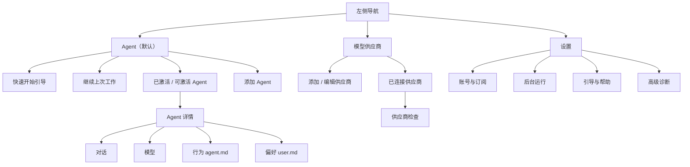

# AgentMesh360 Client 信息架构 v1

状态：已实现并通过本轮回归
确认日期：2026-07-31
联合评审：主 Agent + KimiCLI 0.26.0（三轮只读、脱敏源码审查）

## 1. 决策

客户端一级导航只保留：

1. **Agent**：默认落点；查看、激活、打开和管理持久 Agent；
2. **模型供应商**：接入和维护 BYOK Provider；
3. **设置**：账号与订阅、后台运行、引导与帮助、高级诊断。

不设置独立“首页”。当前只有少量核心 Agent，也没有跨会话未读/最近摘要接口；单独
首页会重复 Agent 列表并诱发假数据或过度设计。“默认落点、首次引导、恢复工作”的
需求由 Agent 列表页直接承担。

不设置一级“当前对话”。对话属于具体 Agent 的固定 Main Session，是 Agent 详情的
默认页签。

不设置一级“Agent Package”。原 Package Center 迁入 Agent 页内的“添加 Agent”；
Registry、revision、digest 等信息只进入“高级与审计”折叠区域。

## 2. 页面地图

## 3. 左侧导航合同

- Agent、模型供应商、设置固定按上述顺序出现；
- Agent 是登录准入成功后的默认页；
- active 态只能有一个；
- 侧栏底部显示 Host 三态：
  - 已连接；
  - 正在恢复；
  - 需要处理；
- Host 状态点击后进入“设置 > 后台运行”，主导航不显示 socket、Leader、
  Host Authority 等技术术语；
- 账户区继续放在底部，登出不混入普通设置控件。

## 4. Agent 列表

Agent 页按以下顺序组织：

1. 显示轻量三步路径，并根据 Host 当前事实给出唯一下一步行动：
   - 接入模型供应商；
   - 激活 Agent；
   - 完成第一次对话；
2. 必要时显示 Host、订阅或 Agent 模型失效横幅；
3. 老用户显示“继续上次工作”；
4. `needs_input` Agent 进入“正在等待你”区，但它是运行状态，不是未读；
5. 已激活 Agent；
6. 可激活 Agent；
7. “添加 Agent”入口。

卡片只显示用户需要的内容：名称、公开描述、运行状态、当前 Provider/模型摘要和主要
操作。Package、Session ID、Workspace 路径、role、Assignment、Binding、revision
不进入卡片。

## 5. Agent 激活

点击“设置并激活”后进入 Agent 内的显式确认区，避免额外弹层遮挡权限与模型信息：

1. 展示 Agent 公开描述和权限摘要；
2. Provider 只列已保存、已测试的 Profile；
3. 模型只列当前 Profile 的 `enabledModels`；
4. 只有一个 Profile 时可以预选，但用户仍需点击“确认并激活”；
5. 多个 Profile 时不预选；
6. 没有 Profile 时阻止激活，提供“去添加模型供应商”；
7. 取消不写绑定、不激活、不创建半状态。

## 6. Agent 详情

详情头部包含返回 Agent 列表、Agent 名称、状态和当前模型摘要。

### 6.1 对话

现有 Conversation View 迁入此页签，继续使用同一个确定性 Main Session；项目、
计划、后台任务、活动、产物、消息、权限确认和草稿合同不变。

### 6.2 模型

- 显示当前 Provider、模型、状态和来源；
- Provider 下拉只列已验证 Profile；
- 模型下拉严格级联，不提供自由文本；
- 切换前明确：
  - 历史对话保留；
  - 正在进行的回复由旧模型完成；
  - 新模型从下一条用户消息开始；
- Provider 删除、模型失效或凭据缺失时，Composer 失败关闭并引导用户重新选择；
- 不提供静默 fallback 或“一键默认修复”。

旧 `global/main` Assignment 只用于升级兼容：Host 将其映射为各 Agent 当前设置，详情
页一次性提示“已沿用原来的模型设置”。新 UI 不再暴露 Global/role/路由矩阵。

### 6.3 行为 agent.md

`agent.md` 是该用户、该 Agent 的本机行为补充，不是签名 Package 的基础 Prompt。

- UI 只显示 Package 名、版本和公开描述，不展示内部 Prompt 全文；
- 用户补充最多 8000 个 Unicode 字符；
- 保存后从下一条消息生效，不打断当前回复，不改写历史；
- 未保存草稿跨页恢复；
- 恢复默认只清空用户补充，不修改 Package；
- Package 更新、回滚和重装继续保留用户补充；
- 官方安全规则优先，个人补充不能解除权限限制。

### 6.4 偏好 user.md

`user.md` 是该用户、该 Agent 的本机偏好，包括称呼、语言、习惯和相关背景；本版不做
全局 user.md。它与 `agent.md` 独立存储、独立 revision、独立草稿。

## 7. 覆盖层安全与并发

- 覆盖层由 Host 持久化，Renderer 不提交或获得文件路径；
- 每次更新携带 revision，使用乐观锁；冲突时禁止静默覆盖；
- UI 提供“保留我的版本”和“放弃并重载”；
- Host 拒绝明显的 Authorization/Bearer 值、私钥块和典型 API Key 值；
- 任何拒绝都不写入部分内容；
- 保存成功不改变正在运行的 Turn；模型、行为和偏好编辑器在生成期间锁定，Host 在下一条
  Prompt 前按 revision 重建 Agent，确保新内容只从下一条消息生效。

## 8. 模型供应商页

只保留：

- 选择供应商；
- 官方自动连接配置；
- 高级兼容接口设置；
- Key 输入；
- 动态模型发现；
- 模型选择；
- 连接测试；
- 安全保存；
- 已连接供应商列表；
- 编辑、删除和与该供应商直接相关的三档检查。

删除：

- Assignment 编辑器；
- 模型角色；
- Global/Agent/Session scope；
- 当前路由矩阵；
- Host Authority、Profiles、Assignments 等控制面统计。

删除正在被 Agent 使用的 Provider 前，必须列出受影响 Agent；确认删除后相关 Agent
进入可理解的模型失效状态，不静默换到其他 Provider。

## 9. 添加 Agent 与设置

“添加 Agent”当前只展示内置/已安装 Agent，并明确“在线添加暂未开放”；不显示看似
可用但实际禁用的远端下载表单。生产 Registry 未开放前不能承诺在线商店。

设置二级固定为：

1. 账号与订阅；
2. 后台运行；
3. 引导与帮助；
4. 高级诊断。

高级诊断只读，不成为主路径前置条件。

## 10. 本轮边界

本轮实现上述导航、页面职责、Agent Provider/模型绑定、覆盖层 Host 接口与运行时
生效。

本轮不实现：

- 停用或移除 Agent；
- 删除对话历史；
- 全局 user.md；
- needs_input 已读标记；
- 多对话聚合页；
- 在线 Agent 商店；
- role 级路由 UI；
- Package 内部基础 Prompt 展示；
- Provider 价格、余额或自动 fallback。
