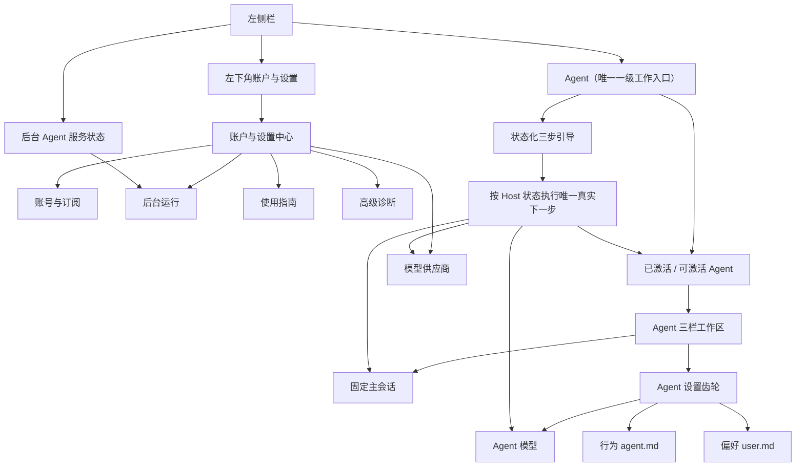

# AgentMesh360 Client 信息架构 v2

状态：当前实现

确认日期：2026-08-05

## 1. 当前决策

客户端日常一级导航只保留 **Agent**。Agent 是产品目的，也是登录准入成功后的默认落点；
模型供应商、订阅、后台恢复、引导和诊断都是低频配置，统一收进左下角“账户与设置”。

不设置独立首页、当前对话、Agent Package 或通用设置一级入口。打开常驻 Agent 后仍直接进入
它的固定 Main Session；该 Agent 的模型、`agent.md` 和 `user.md` 仍只从对话右上角齿轮进入，
不能混进客户端账户设置。

## 2. 页面地图

## 3. 左侧栏合同

- `.nav-item` 恰好一个：Agent；不存在公开的模型供应商、设置或 Package 一级入口；
- 账户区域整体是 button，显示头像、名称、邮箱与进入箭头，中文可访问名称为“打开账户与设置”；
- 点击账户区域进入设置中心，不直接退出登录；退出只在“账号与订阅”中显式执行；
- 设置中心打开时账户入口具有唯一 active 状态，Agent 仍是随时可见的返回路径；
- Host 状态保留已连接、正在恢复、需要处理三态，点击只深链“账户与设置 > 后台运行”；
- 普通导航、窗口聚焦与身份静默复验不使用全屏 loading，不清空 Provider/Agent/对话草稿。

## 4. 账户与设置中心

设置中心使用“账户摘要 + 内部垂直菜单 + 当前内容”的稳定结构，内部固定五项：

1. 账号与订阅：当前账号、订阅、credits、最近验证与明确退出按钮；
2. 模型供应商：Provider 独立管理页，仍为已配置列表优先，配置和编辑进入模态窗口；
3. 后台运行：Host 与登录启动状态；
4. 使用指南：复用 Agent 首页同一个 Host 权威状态机和真实 CTA；
5. 高级诊断：默认折叠的只读技术状态。

内部菜单必须恰好一个 `aria-current="page"`，支持鼠标与键盘；入口切换后焦点进入当前项。
用户需要阅读或点击的标题不小于 13px、说明不小于 12px、点击区不小于 44px。

Provider 只有首次进入对应内部项时才读取完整公开 Snapshot；Agent 首页只使用非秘密 Overview。
Provider 草稿跨 Agent/设置普通导航保留，账号切换或退出时清理。Provider 保存、删除或修复后
重新读取 Overview，使三步引导和 Agent 模型状态回到 Host 权威结果。

## 5. 深链与恢复合同

- 零 Provider：三步引导直接进入“账户与设置 > 模型供应商”；
- 有 Provider、无常驻 Agent：聚焦真实可激活 Agent；
- 常驻 Agent 模型失效：已有可用 Provider 时进入该 Agent 的模型页；没有可用 Provider 时先
  进入模型供应商；
- 正常常驻 Agent：打开或继续明确命名的 Main Session；
- Host 状态：进入后台运行；
- 未知旧 Renderer 路由回退 Agent，不出现空页、重复入口或技术错误正文。

## 6. 视口与测试合同

- 1180×760、1280×768、1280×800、1440×900 和 720×760 不得水平溢出；主内容自行滚动；
- 自动化覆盖唯一一级导航、头像键盘入口、五项菜单、唯一 active/`aria-current`、Provider 懒加载、
  Host/引导/Agent 恢复深链、草稿保留、账号切换清理和显式退出；
- 安装包动态验收使用当前入口，不发送消息、不执行 Provider 推理、不消耗 credits；
- 首次用户、订阅失败和账号切换继续使用隔离 fixture，不要求第二个真实付费账号，也不修改
  owner 真实账号的 Provider、credits 或持久会话。

## 7. 非目标

本修订只收敛入口层级，不新增 Provider、Agent、多会话、在线 Package、自动 fallback、P7/P8、
签名、公证或在线发布，也不改变订阅硬门、BYOK、Vault、Agent Binding 或 Grok Harness authority。
