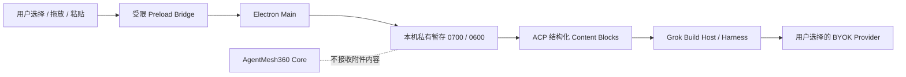

# Grok-first 多内容 Composer V1

状态：已实现并通过内部包完整性验收；等待 owner 手动安装 UAT
日期：2026-08-02
适用范围：AgentMesh360 Client 持久 Agent 主会话

## 1. 产品决定

AgentMesh360 的对话输入不再被定义为“一个文本框”，而是当前持久 Agent 的工作入口。
用户仍然从一个紧凑 Composer 发起工作，但可以同时提交文字、图片、文档和网页链接。

首版保持一个主要入口：输入框左侧的“＋”。点击后只有两个普通用户能理解的动作：

1. 添加图片或文件；
2. 添加网页链接。

同一能力同时支持 Finder 拖放和剪贴板粘贴。不会把 Grok Build 的所有内部参数、模式、
工具或协议名堆到输入框旁边；模型、`agent.md` 与 `user.md` 仍属于右上角齿轮中的 Agent
设置。

## 2. 用户心智与交互流程

### 2.1 普通文字

用户输入文字并发送。消息进入当前 Agent 的固定 Main Session，历史和原有 Provider 路由
合同不变。

### 2.2 图片或文档

用户可以：

- 点击“＋ → 图片或文件”打开系统文件选择器；
- 把 Finder 文件拖到 Composer；
- 用 `Command + V` 粘贴截图或已复制的文件。

选择成功后，附件以单行 Chip 出现在输入区上方，显示类型、名称、大小和删除按钮。最多
10 个 Chip 横向滚动，不通过不断增高 Composer 挤压对话区。用户可以同时输入说明，也
可以只发送附件；只发送附件时客户端补充一条安全的最小文本提示。

### 2.3 网页链接

用户点击“＋ → 网页链接”，输入完整的 `http` 或 `https` 地址后添加。链接成为当前消息
的结构化上下文。添加链接不等于客户端提前抓取网页，也不承诺目标站点一定可访问；是否
进一步读取由当前 Agent、工具权限与网络能力决定。

### 2.4 失败与重试

- 添加阶段失败：在 Composer 内显示稳定中文原因，已经成功添加的其他附件仍保留；
- Provider/模型处理失败：文字草稿与附件都保留，可换模型或修改后重试；
- 发送成功：本条消息使用的附件从 Desktop 暂存区销毁；
- 注销或切换账号：清理该账号未发送的附件；
- 普通页面切换、Agent 设置往返或切换 Agent：各 Agent 的未发送附件独立保留，不串线；
- 应用下一次冷启动：先清除上次异常退出遗留的暂存文件，不把附件变成长期文件库。

## 3. 与 Grok Build Harness 的合同

Grok Build 当前 ACP Prompt Parser 支持以下内容块：

| 用户内容 | ACP 内容块 | V1 行为 |
| --- | --- | --- |
| 文字 | `Text` | 文本是第一块，并附带不含本机路径的附件摘要 |
| 图片 | `Image` | Base64 + 受限 MIME，交给支持视觉输入的模型 |
| 网页链接 | `ResourceLink` | 保留 URL，并带 AgentMesh360 用户链接元数据 |
| 文本/代码 | `EmbeddedResource(TextResourceContents)` | UTF-8 内容内嵌 |
| PDF/Office 等二进制 | `EmbeddedResource(BlobResourceContents)` | Base64 二进制交给 Harness 暂存/读取链路 |

Host 的初始化能力同步声明 `image=true` 与 `embeddedContext=true`。Desktop 不建立第二套
Sampling HTTP 栈，也不绕过 Grok Harness；最终推理仍走当前 Agent 已冻结的 BYOK
Provider Route。

Grok Build 基础 `read_file` 已覆盖文本、代码、PDF、PPTX、Notebook 和图片等格式；DOCX、
XLSX 在 V1 可以作为二进制资源传递，但不把“专用富解析一定可用”写成产品承诺。后续如需
稳定的 Word/Excel 结构化理解，应作为独立解析能力切片设计和测试。

## 4. 安全与数据边界

安全规则：

- Renderer 只获得随机 `attachmentId`、类型、文件名、大小和用户自己填写的链接，不获得
  源路径、暂存路径、Base64、Session ID 或 Workspace authority；
- 文件选择、路径解析、读取、类型检查和私有暂存只在 Preload/Main 中进行；
- 普通文件必须是明确支持的文档/文本/代码类型，图片同时校验扩展/MIME 与文件签名；
- 只接受不含账号密码的 `http`/`https` 链接；
- 单个文件不超过 20 MiB，一条消息最多 10 个附件，合计不超过 50 MiB；
- 暂存文件使用随机名称和仅当前用户可读权限；应用启动清理异常退出遗留内容；
- 附件不上传 AgentMesh360 Core。用户发送后，为完成推理，内容会进入本机 Grok Harness，
  并按当前 Provider 的 API 合同交给用户选择的 BYOK Provider；
- 客户端不静默切换模型或 Provider。图片模型不兼容时显示明确提示，附件保留供用户处理。

## 5. 支持范围

V1 支持：

- PNG、JPEG、WebP、GIF 图片；
- PDF、DOCX、XLSX、PPTX、IPYNB；
- Markdown、纯文本、CSV/TSV、JSON/JSONL、YAML、XML、HTML/CSS；
- 常见 JavaScript/TypeScript、Python、Rust、Go、Java、Kotlin、Swift、C/C++、Shell、SQL、
  TOML 文件；
- `http`、`https` 网页链接。

V1 明确不支持：

- 音频或视频作为 Prompt 输入；
- 文件夹、压缩包、可执行文件和任意未知二进制；
- 客户端云文件库或附件跨冷启动长期保存；
- DOCX/XLSX 专用富解析保证；
- 自动网页抓取保证；
- 自动 Provider fallback、消息队列/Interjection 或真正多会话。

## 6. 布局规则

- “＋”按钮点击区为 40×40px，菜单使用客户端自己的深色视觉组件；
- 附件 Chip 只占一行，高度小于 55px，超过可用宽度时横向滚动；
- Composer 仍固定在主内容底部，只有 Transcript 滚动；
- 1280×768 下放满 10 个附件和长回复时，Composer、Textarea、发送按钮必须完整位于视口；
- 附件错误、链接输入和菜单属于 Composer 的次级状态，不与对话标题或 Agent 设置同级。
- 面向用户的隐私文案只表达“发送时交给当前模型、不会上传到 AgentMesh360”；Core、
  Host、Bridge 等名称仅允许出现在技术架构文档和高级诊断中，不进入普通工作区。

## 7. 验收映射

- 存储、边界、类型、大小、账号/Agent 隔离：`TC-CONV-014`；
- 选择、拖放、粘贴、链接、Chip 与删除：`TC-CONV-013`；
- ACP 结构化块、Grok 能力和 BYOK 失败提示：`TC-CONV-015`；
- 成功销毁、失败保留和重试：`TC-CONV-016`；
- 13 寸长内容与 10 附件布局：`TC-CONV-012`。

后续任何新增内容类型必须先扩展本文的用户承诺、ACP 能力声明、安全限制和相应测试用例，
不能只在 Renderer 增加一个看起来可点的按钮。
