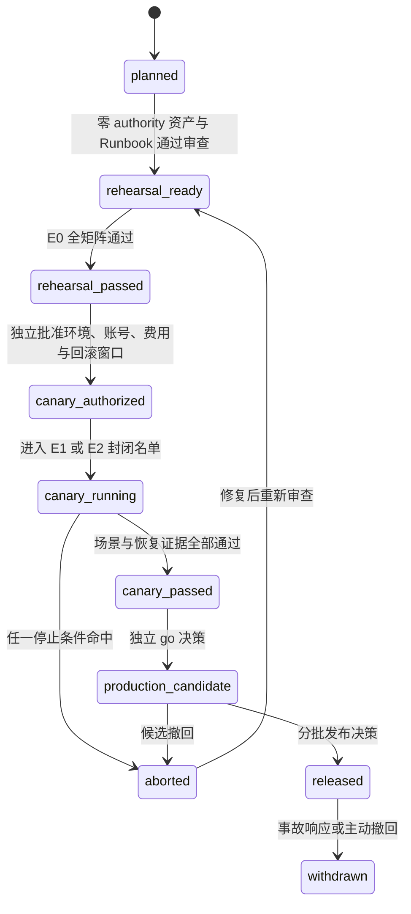
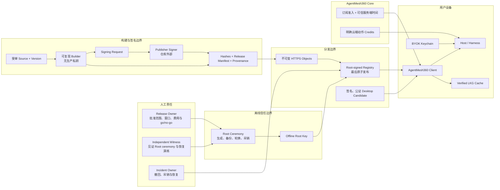
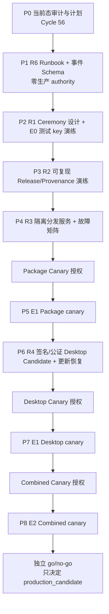

# AgentMesh360 Client 生产准备与内部 Canary 计划

状态：Cycle 56 的 P0 计划、Cycle 57 的 P1 R6 本地基线、Cycle 58 的 P2
无 authority preflight 与 Cycle 59 的 P2 E0 测试 key 技术演练均已完成自主验证和
本机 Kimi 四级清零；Cycle 60 的 P3 零新 key provenance preflight 也已完成双方
验证与 Kimi 四级清零；
生产 R1-R6 仍未关闭，尚未进入 P3 实际双构建/测试签名、生产 key ceremony、
E1/E2、内部 canary 或生产候选

本文档把
[`PRODUCT_PLAN_AND_PRODUCTION_RELEASE_GATE.md`](PRODUCT_PLAN_AND_PRODUCTION_RELEASE_GATE.md)
中的 R1-R6 拆成可执行、可审计、可回滚的工作包。它同时覆盖两条独立发布链：

1. Agent Package 的签名、分发、动态安装与宿主 Skill 投影；
2. AgentMesh360 桌面客户端的签名、公证、升级、登录启动与卸载。

本文不是发布授权，也不是 canary 通过报告。Cycle 59 只在本机隔离临时目录生成并
销毁 E0 测试 Root/Publisher；没有生成或保留生产 key，没有配置 production/staging
endpoint，没有上传 Artifact、发布 Registry、签名或公证桌面安装包，也没有调用
Provider、消耗 credits 或写用户真实宿主目录。

## 1. 当前基线与计划结论

### 1.1 源码与仓库事实

| 范围 | 当前源码事实 | 对计划的约束 |
| --- | --- | --- |
| 生产 Root | `TrustedRootStore::embedded()` 返回空 Store | 外部 Package 必须继续失败关闭，不能先填 endpoint |
| Publisher Trust | `EMBEDDED_PUBLISHER_TRUST_BUNDLE = None` | 必须先完成 Root ceremony、Bundle 生成与独立验签 |
| 远端 Package 元数据 | `PRODUCTION_TRUST_BUNDLE_URL = None`、`PRODUCTION_REGISTRY_URL = None` | Package Center 不能声称已有生产目录 |
| 远端拉取 | 已有 HTTPS origin 固定、无重定向、响应大小限制、可信时间、expiry、反回滚与 LKG | R3 应复用并验证现有消费者，不重造下载协议 |
| Release 工具 | H2d0-H2d4 已有确定性 Artifact、外部签名契约、Host bundles、Release Manifest、Registry 投影与消费核对 | R2 应把现有离线工具接入受控发布流程，不另建旁路格式 |
| 桌面构建 | `desktop/package.json` 只有本地 `build:mac`，输出 DMG/ZIP | 本地可构建不等于 R4 |
| 桌面签名与更新 | 没有仓库自有 Developer ID/公证配置、自动更新客户端或发布工作流；仓库没有 `.github/workflows` | 必须先设计凭据边界与可恢复更新链，不能把手工 DMG 当正式分发 |
| 登录启动 | 已有 packaged app Login Item 源码，开发模式拒绝真实写入 | 必须在签名、公证安装包上验证注册、批准、禁用与升级 |
| 退出 | `before-quit` 会发起 Controller shutdown，但当前不是“等待 Host 完整退出后再结束”的发布级证据 | R4/R5 必须验证受控 shutdown、强退恢复和卸载清理 |
| 订阅与 BYOK | Core、Host、桌面硬门禁已完成；BYOK 是默认推理模式 | canary 必须使用专用内部账号、有效订阅和专用测试 Key，并单独批准费用上限 |

结论：

- R0 继续是“已满足（开发验证）”，不代替生产发布门；
- R1-R6 仍未满足；
- P1 已完成零生产 authority 的 R6 Schema、Runbook、证据模板和 E0 tabletop；
- P2 已完成无 authority preflight 与获批的 E0 测试 key 技术演练；16 个场景、
  sequence 1-5、六个失败关闭输入及私钥销毁均有 retention-safe receipt；
- P2 的 E0 子项通过不满足生产 R1；真实 custody、双人生产 ceremony 和生产 key
  仍需另一张批准卡；
- P3 零新 key preflight 已机器固定 source/toolchain freeze、双构建、Agent 矩阵、
  provenance 输出与 signer 批准边界；实际执行仍等待新 test-signing authority；
- 真正的内部 canary 不是下一条命令，而是 R1-R4/R6 相应前置证据通过后的受控阶段；
- Package 与桌面可以分别形成 canary 证据，合并开放必须再通过共同 canary。

### 1.2 三种不能混写的 canary

| 名称 | 运行对象 | 进入条件 | 能关闭的证据 |
| --- | --- | --- | --- |
| Package canary | 受签 Package、Registry、安装/权限/rollback | R0、R1、R2、R3、R6 的相应前置项已通过 | R5 的 Package 子集 |
| Desktop canary | 签名、公证的桌面候选及升级链 | R0、R4、R6 的相应前置项已通过 | R5 的 Desktop 子集 |
| Combined canary | 正式候选桌面消费正式候选 Package，并执行真实订阅 + BYOK | R0-R4 与 R6 前置项均已通过 | R5 共同项；只产生“生产候选”资格 |

某一条 canary 通过不能替代另一条。Combined canary 通过也不自动代表公开发布，
还必须由发布负责人根据完整证据作出独立 go/no-go 决定。

## 2. 环境与状态模型

### 2.1 四级环境

| 级别 | 环境 | 信任与外部影响 | 允许的动作 | 禁止的声称 |
| --- | --- | --- | --- | --- |
| E0 | 本地确定性演练 | 临时测试 key、loopback/离线 URL、临时目录 | 构建、签名格式演练、故障注入、可复现比较 | staging、canary、生产 |
| E1 | 隔离内部 staging | 独立非生产 Root、隔离 HTTPS origin、专用内部账号与 BYOK | 端到端分发、安装、恢复与有限费用测试 | 生产信任、生产 canary |
| E2 | 封闭生产候选 | 生产 authority、生产候选 endpoint、明确内部名单 | Package/Desktop/Combined canary 与 rollback 演练 | 对外发布、普遍可用 |
| E3 | 正式生产 | 经批准的公开 cohort | 分批扩大范围、监控与事故响应 | 未经批准的全量开放 |

E0 成功只说明工具链可演练；E1 成功只说明隔离环境链路成立；E2 canary 通过只说明
候选具备进入发布决策的资格。任一环境的证据都不能自动升级为下一环境。

### 2.2 发布状态机



状态必须写入发布证据摘要，不能仅靠聊天记录推断。`rehearsal_passed`、
`canary_passed`、`production_candidate` 和 `released` 是四个不同事实。

## 3. Authority 与信任架构



固定边界：

1. Root 私钥不进入仓库、客户端、普通 CI、桌面构建机、日志或证据包；
2. Builder 只产生非秘密 signing request，不能持有生产 Publisher 私钥；
3. Publisher Signer 不能修改 Artifact、Manifest、版本或摘要；
4. Registry 必须最后发布，只能引用已存在的不可变内容；
5. 客户端只消费内置/已审核 Root 下的受签文档，调用方不能注入 URL、digest、
   Root、Publisher 或“已批准”布尔值；
6. Core 只负责订阅准入、可信时间与明确的云端 credits 动作；BYOK Key 只留在用户
   设备安全存储，Package 服务不能读取；
7. 生产 Root ceremony、生产 endpoint、Publisher 签名、公证、canary 费用和 cohort
   扩大分别需要独立批准，不能由一次笼统“发布”授权覆盖。

## 4. R1-R6 进入门与退出证据

### R1：Root 与 Publisher authority

进入前：

- 指定 Release Owner、独立见证人和 Incident Owner；
- 固定 key ID、algorithm、有效期、备份介质、保管位置和访问记录格式；
- 先在 E0 使用测试 key 演练完整 ceremony，不接触生产常量。

必须产出：

- 经双人核对的 ceremony Runbook 与逐步 receipt；
- Root public document、首个 Publisher Bundle 及 canonical 签名载荷摘要；
- active、retired、revoked 三态和 sequence 单调递增规则；
- Root/Publisher 轮换、丢失、泄漏、过期与紧急吊销演练结果；
- 私钥未进入仓库、日志、客户端、普通 CI 和证据摘要的检查记录。

退出判定：

- 独立实现或独立工具能复验签名和 canonical payload；
- 旧 sequence、同 sequence 不同文档、未知 Root、过期 Bundle、被吊销 Publisher
  全部失败关闭；
- 生产私钥恢复与销毁流程已有负责人、操作窗口和明确停止条件。

### R2：Release provenance

进入前：

- R1 的 Publisher authority 可用；
- 固定源码 commit、版本、构建工具链和依赖锁文件；
- H2d0-H2d4 的 Schema/工具版本已冻结为本次候选输入。

必须产出：

- 相同输入至少两次隔离构建的逐字节一致性；
- Artifact、file manifest、Envelope、Host projection、每个 Host bundle、
  Release Manifest 和 Registry record 的完整 SHA-256 绑定；
- signing request、外部签名 result 和 finalize receipt；
- 源 commit、构建机/工具版本、锁文件摘要和执行者；
- 三个首方 Agent 以及一个不在内置 Catalog 的动态 Agent 的同源双渠道核对。

退出判定：

- 任一文件、版本、Publisher、Host 集合、入口或摘要改变都会失败；
- Website/Host Skill 与 Client projection 指向同一个 Release reference；
- 证据能从发布候选反向追到源码和签名 receipt，但不含私钥、Token、本机敏感路径或
  用户内容。

### R3：分发服务

进入前：

- R1/R2 已通过；
- 固定 production-equivalent origin、TLS、对象命名、缓存与原子发布策略；
- 明确服务 owner、访问权限和撤回方式。

必须产出：

- 不可变 Artifact/Envelope/Release/Host bundles 的上传 receipt；
- Trust Bundle 与 Registry 的 bounded response、正确 content type、禁止 redirect、
  无 credentials/query/fragment 的验证；
- “先上传全部内容，最后原子发布 Registry”的可复核顺序；
- 404、超时、截断、超限、错误 MIME、坏摘要、坏签名、过期、回退与 equivocation
  的故障注入；
- LKG 仍有效时的可用性，以及 LKG 无效/过期时的失败关闭。

退出判定：

- 半发布内容不会被客户端发现；
- 已发布版本内容不可原地替换；
- Registry 撤回不会删除已有本地用户数据，也不会静默降级到不受信版本；
- 服务日志与对象元数据不含用户账号、BYOK、Prompt、响应或本机路径。

### R4：桌面正式分发

进入前：

- 固定桌面版本、bundle ID、构建输入和发布渠道；
- Developer ID、notarization 凭据与权限边界获得单独批准；
- 自动更新、失败恢复和卸载策略通过审查。

必须产出：

- 从固定 commit 产生的签名、公证 DMG/ZIP 和摘要；
- 首次安装、系统验证、打开、二次打开与签名完整性；
- macOS Login Item 注册、系统批准、关闭、重新开启和升级后的状态；
- 有窗口、无窗口后台启动、第二实例唤醒、Host 崩溃与 App 重启恢复；
- 正常退出、强制退出、升级、卸载时的 Host 与 Login Item 清理；
- 自动更新检查、下载、验证、安装、重启和失败回滚；更新链不得接受未签名版本。

退出判定：

- 干净受支持 macOS 环境完成安装、升级、rollback 与卸载矩阵；
- 应用退出不会留下失控 Host，意外崩溃又能恢复固定 Main Session；
- 更新失败保留可启动的最后良好桌面版本和用户状态；
- 执行时以 Apple 官方当时要求为准，不在本计划中硬编码可能过期的公证细节。

### R5：灰度与恢复

R5 是 canary 的退出门，不是 canary 准备的循环前置条件。进入某条 canary 时，
该发布链的 R1-R4 相应项和共同 R6 前置项必须已经通过。

必须产出：

- 明确的内部账号、设备、操作人、时间窗、版本和 cohort；
- 真实有效订阅与专用 BYOK；每个 Provider 的模型、请求次数/费用上限和停止开关；
- Package 安装、权限不变、权限扩张拒绝/批准、更新、rollback、reconcile；
- Root/Publisher 轮换和吊销、Registry 撤回/回滚、LKG 恢复；
- Desktop 安装、Login Item、Host 恢复、自动更新、受控 shutdown 与卸载；
- Combined canary 中固定 Main Session、对话/项目/产物/计划恢复，以及 Package
  更新前后身份不变；
- 每项失败后的恢复时长、数据完整性和下一次重试是否安全。

退出判定：

- 所有必测场景通过，所有停止条件均未触发；
- rollback 已实际演练，不是只存在命令或文档；
- 没有重复执行不可逆 mutation，没有静默 Provider fallback，没有突破费用上限；
- canary 结束后专用凭据已轮换或撤销，临时数据与日志按 Runbook 处理；
- Release Owner 和 Incident Owner 共同签署 `canary_passed`，但不自动发布。

### R6：可观测与事故响应

R6 的 Runbook 和最小事件 Schema 必须在任何真实 authority 或外部服务启用前完成。

允许记录的最小字段：

- `releaseId`、公开版本、package/agent ID；
- `environment`、`stage`、`gate`、`eventType`、`outcome`；
- 固定错误码、UTC 时间、构建/Registry revision；
- 内部 canary 的非个人化设备别名和操作 receipt ID。

禁止记录：

- API Key、Access/Refresh Token、Authorization、Cookie、签名私钥；
- Prompt、模型响应、Tool 输入输出、用户文件内容；
- 电子邮件、真实账户 ID、本机绝对路径；
- 完整下载 URL、query、Header、Registry/Trust 原文或签名原文。

必须产出：

- 版本撤回、Publisher/Root 吊销、Registry 冻结和客户端最低版本 Runbook；
- 严重级别、响应人、通知路径、停止发布和恢复发布的批准边界；
- 观测缺失、事件重复、时钟异常与存储不可用时的失败策略；
- 一次完整 tabletop 和一次 E1/E2 技术演练；
- 对外状态说明模板与内部证据摘要模板。

退出判定：

- 任一发布候选可以被定位、撤回和阻止继续扩大 cohort；
- 事件中不含秘密或用户内容，且能区分 planned/rehearsal/canary/released；
- “最低版本”不会把无法安全更新的客户端永久锁死，恢复安装路径已验证。

## 5. Canary 场景矩阵

### 5.1 准入与 Provider

| 场景 | 预期结果 |
| --- | --- |
| 订阅有效 | 进入工作区，Core 与 Host 结论一致 |
| 订阅过期/暂停 | 立即回到订阅拦截，Agent/Package/Provider 动作失败关闭 |
| 账户切换 | 旧账户 Agent、Session、Package、Provider 不可见 |
| BYOK 正常 | 只使用明确选择的 Provider/模型 |
| Provider 401/403 | 不重试泄漏凭据，不静默切换 Provider |
| Provider 429/5xx/超时/离线 | 给出固定安全错误；可重试动作由用户明确发起 |
| 模型能力不匹配 | 调用前失败，不猜测支持 |
| 请求或费用达到上限 | 停止本轮 canary，不自动追加额度 |

### 5.2 Package

| 场景 | 预期结果 |
| --- | --- |
| 新 Agent 安装 | 签名、Release、权限和当前账户全部验证后原子激活 |
| 同权限更新 | 保持固定产品身份与 Main Session |
| 权限扩张拒绝 | 保留旧版本，无半安装状态 |
| 权限扩张批准 | 仅应用本次精确 plan，不接受 Renderer 注入权限 |
| Artifact/Envelope/Release 任一篡改 | 下载或安装前失败 |
| Registry revision 回退/同 revision 异文 | 拒绝新响应，只有有效 LKG 可继续 |
| Trust Bundle 过期/Publisher 吊销 | 新安装/更新失败关闭，已有用户数据不删除 |
| 安装中断 | 重启后 reconcile 到旧 active 或完整新版本 |
| rollback | 回到已验证旧版本，审计与 Agent 状态一致 |
| Host Skill 投影 | 与 Client Release reference、版本和摘要完全一致 |

### 5.3 Desktop 与持久 Agent

| 场景 | 预期结果 |
| --- | --- |
| 首次签名安装 | 系统验证通过，应用可启动 |
| Login Item 未批准 | UI 明确状态，前台仍可用，不伪装已后台恢复 |
| Login Item 已批准 | 无窗口启动 Host，不创建多份 Leader |
| 关闭窗口 | Agent/Host 继续按产品策略运行，可随时重新打开 |
| 正常退出 | 受控停止 Host，不留下失控进程 |
| Electron/Host 强退 | 恢复后固定 Main Session 与账户隔离不变 |
| 自动更新成功 | 新版本恢复 Agent、Session、Provider Binding 与 Package 状态 |
| 自动更新失败 | 旧版本仍可启动，不损坏用户状态 |
| 卸载 | 按明确策略清理 Login Item/Host；用户数据保留或删除必须由产品策略明确 |
| 离线重启 | 不伪造订阅新鲜度；不可验证动作失败关闭 |

## 6. 停止条件、成功标准与回滚

### 6.1 立即停止

命中任一项即把本轮状态设为 `aborted`，停止 cohort 扩大：

- 签名、Root、Publisher、Release 或 Registry 验证可被绕过；
- 跨账户看到或执行其他账户的 Agent、Session、Provider、Package 或 Artifact；
- 日志、Renderer、证据包或崩溃报告出现秘密、Prompt/响应、用户内容或本机敏感路径；
- 同一个未知结果 mutation 被自动重试，造成重复安装、扣费、批准或状态变更；
- Provider 被静默切换，或请求/费用突破批准上限；
- Package/Desktop rollback 失败，或最后良好版本无法启动；
- 自动更新接受未签名/不匹配候选；
- Root/Publisher 吊销后仍可安装该 key 签名的新内容；
- 无法确认当前 cohort、版本、Registry revision 或事故负责人。

### 6.2 通过标准

- 适用场景 100% 有可复核结果，安全停止条件为零；
- 所有失败注入都产生预期的失败关闭或有效 LKG，而不是不确定状态；
- rollback、撤回、吊销和恢复均实际执行；
- 用户持久状态在正常升级、失败升级和 Host 恢复后保持一致；
- 可观测记录足以定位 release/stage/outcome，但不含秘密或用户内容；
- 主 Agent 自主验证与本机 Kimi 独立复核都达到 Blocker/High/Medium/Low 全零；
- Release Owner 只根据本轮证据批准下一状态，不沿用旧聊天中的笼统授权。

回滚目标时限、允许的数据恢复点和可接受的短时不可用窗口，必须在每次 canary 授权卡
中填写；本计划不凭空设定未经业务负责人确认的数字。

## 7. 工作包与固定顺序



| 工作包 | 交付物 | 是否需要新授权 |
| --- | --- | --- |
| P0 当前态审计与计划 | 本文、蓝图/发布门/进展同步、文档验证、Kimi 四级清零 | 本轮已授权继续开发；不含外部动作 |
| P1 R6 基线 | **已完成**：Runbook、最小事件 Schema、证据模板、静态 secret/content 检查与 E0 tabletop | 未创建外部资源；不等于完整 R6 关闭 |
| P2 R1 E0 | **已完成 E0 技术演练**：preflight、receipt Schema/验证器、隔离 worker/runner、16 场景、sequence 1-5、失败关闭与销毁证据 | 只关闭 E0 子项；生产 custody/key/ceremony 仍需独立批准 |
| P3 R2 E0 | **零新 key preflight 已实现，实际演练未执行**：固定 commit/toolchain/lock、双隔离 build root、四 Agent、十类输出与新 signer 批准边界 | 不得使用 P2 已销毁材料或生产 Publisher；实际测试签名前单独批准 |
| P4 R3 E1 | 隔离 origin、对象存储/Registry、故障注入和清理 | 需要创建外部资源与 staging 凭据授权 |
| P5 Package canary | 专用内部账号、BYOK 预算、安装/权限/rollback/rotation | 需要真实订阅、Provider 请求/费用和 cohort 授权 |
| P6 R4 | Developer ID、公证、自动更新、签名安装恢复矩阵 | 需要 Apple 凭据、签名/公证和分发渠道授权 |
| P7 Desktop canary | 内部设备安装/升级/Login Item/shutdown/卸载 | 需要设备/cohort 与更新窗口授权 |
| P8 Combined canary | 正式候选桌面 + Package + 订阅 + BYOK 全链恢复 | 需要生产候选 authority、费用与 cohort 授权 |

P0/P1 与 P2 E0 完成后仍不能跳到 P4-P8。P3 只能使用重新批准的 E0 测试签名
authority，不能复用已销毁的 P2 私钥或生成生产 key；生产 key 仍需另一张独立批准卡。

## 8. 明确批准卡

每次批准只对卡片中精确范围有效：

```text
Action:
Environment: E0 / E1 / E2 / E3
Release/Package/Desktop version:
External resources:
Credentials involved:
Provider and model:
Maximum requests / credits / currency cost:
Canary accounts/devices/cohort:
Start and stop window:
Rollback target:
Abort owner:
Evidence retention location:
Approved by / approved at:
```

至少需要独立卡片：

1. 测试 key ceremony；
2. 生产 Root/Publisher key ceremony；
3. 创建隔离 staging 服务与凭据；
4. 使用真实订阅和 BYOK 执行 Package canary；
5. Developer ID 签名与公证；
6. 发布或撤回候选 Registry；
7. Desktop/Combined canary；
8. 从 `production_candidate` 扩大到任何外部 cohort。

旧 Provider 测试授权、免费额度授权、GitHub 推送授权或“继续开发”都不能替代这些卡片。

## 9. 证据与秘密处理

建议的非秘密证据索引：

```text
release-evidence/<release-id>/
  00-scope-and-approval.md
  01-source-and-build.json
  02-signing-receipts.json
  03-distribution-checks.json
  04-canary-scenarios.json
  05-rollback-and-recovery.json
  06-kimi-independent-review.md
  07-go-no-go.md
```

这里描述的是结构。Cycle 57 只创建默认 `blocked` / `NO_GO` 的模板目录，不创建真实
Release 证据。生产原始 receipt、凭据位置、
完整日志和可能含内部身份的信息应放在受访问控制的发布系统；仓库只保存经过脱敏的
摘要、Schema、Runbook 和可公开复验的 digest。

每轮完成前至少检查：

- 仓库、Git 历史、diff、日志、截图、`/tmp` 和构建产物中没有秘密；
- 证据没有 Prompt、响应、用户文件、电子邮件、账户 ID 或绝对本机路径；
- `target/` 不留在仓库根，临时构建目录按本轮约定清理；
- 明确记录哪些测试由主 Agent 执行、哪些由 Kimi 独立执行、哪些未执行；
- 本地通过、提交、推送、staging、canary、production candidate 与正式发布分别陈述。

## 10. Cycle 56 验收与非目标

本轮验收：

- 计划与当前源码关闭态、R1-R6 和原产品顺序一致；
- 两条发布链、三种 canary、四级环境和状态机不混淆；
- 每个门都有进入条件、证据、退出判定和停止条件；
- 明确下一切片是 P1，而不是 key、endpoint、签名、公证、上传或 canary；
- 文档相对链接、Markdown、Mermaid 文本与 `git diff --check` 通过；
- Kimi 独立核对源码事实、发布边界和计划完整性，四级问题全部清零；
- 更新产品蓝图、发布门和项目进展后提交并推送 `main`。

本轮自主验证已确认五份文档相对链接全部存在、`git diff --check` 通过、生产四个
关闭常量仍为空、仓库根 `target/` 不存在。Kimi session
`session_858d2a9f-0fcb-4333-93ee-184a41399e9d` 只读核对完整 diff、新计划、相关
源码、R1-R6、三种 canary、P0-P8、相对链接与 Markdown/Mermaid 文本；没有读取
Keychain、调用 Provider、运行构建或创建 `target`。最终
Blocker/High/Medium/Low 全部为零并给出 PASS。

本轮非目标：

- 不实现新的 Agent、Provider、Scheduler、Subagent 或 Agent 专属 UI；
- 不修改 Package/Provider/Desktop 运行时代码；
- 不创建 CI/CD、对象存储、DNS、证书或云端服务；
- 不生成任何测试或生产签名 key；
- 不调用真实 Provider，不消耗 credits 或费用；
- 不构建、签名、公证、上传、安装或发布桌面/Package 候选；
- 不把计划完成写成 rehearsal、canary 或生产完成。

## 11. Cycle 57 P1 R6 本地基线检查点

已经完成：

- Release Event v1 严格 JSON Schema，固定 E0-E3、状态、R0-R6、事件类型与非秘密
  字段；
- 有界证据目录、默认 `blocked` / `NO_GO` 模板，以及跨 JSONL、JSON、Markdown 的
  Release 身份绑定；
- 无依赖 Node 验证器，拒绝未知字段、重复 JSON key、跨 Release、乱序、非法 UTC、
  非 canonical SemVer、symlink、未知/缺失/超限/非 UTF-8 文件，以及 URL、绝对路径、
  secret/content key/value；
- 发布事故 Runbook，覆盖 Registry 异文、Publisher/Root compromise、Desktop
  最低版本锁死、证据泄漏和 BYOK/订阅失控；
- 一次无 key、无外部资源的 E0 release-integrity tabletop。该 tabletop 只关闭
  P1 的本地子项，不能代替 R6 要求的 E1/E2 技术演练。

验证与复核：

- 主 Agent 的 Node 回归、CLI 模板/事件验证、JSON/JSONL 解析、文档链接、
  `git diff --check` 与根 `target/` 检查全部通过；
- Kimi CLI session `session_0b7c8012-f3fb-4f08-b4d0-d520b79605ec` 首轮发现
  1 Medium / 5 Low，修复目录身份绑定、fs 错误脱敏、路径/URL 与 JSON key 扫描、
  重复 JSON key 和 tabletop 时间后复核四级全零并 PASS；
- Kimi 未运行 Cargo/npm/Electron，未读取 Keychain/Provider，未创建外部资源或
  仓库根 `target`。

下一顺序：

- Cycle 58 已实现不生成 key 的 P2 ceremony 工具/清单设计；
- 生成临时测试 key、执行轮换/丢失/泄漏/过期/吊销/恢复演练前必须获得第 8 节的
  测试 key 精确批准卡；
- P3-P8 与各自外部 authority 继续保持关闭，不能用本轮 PASS 推断已发布或已 canary。

## 12. Cycle 58 P2 无 authority ceremony 预检检查点

已经完成：

- `agentmesh360-key-ceremony-preflight-v1` 严格 JSON Schema 与默认模板固定
  `environment=e0`、`authority=none`、`approvalStatus=not_approved`、
  `executionStatus=blocked` 和 `algorithm=ed25519`；
- 模板只预留一个 Root 与两个 Publisher 的 planned key ID；private material 在
  Repository、Client、普通 CI 和 evidence 中全部固定为 `false`；
- custody 的备份份数、介质、保管角色、恢复窗口和销毁方式分别保持
  `requires_approval`；批准卡的窗口与 receipt 继续保持未批准/不存在；
- 16 个机器固定场景覆盖 Bundle expiry，Publisher/Root 的生成、丢失、泄漏、过期、
  overlap rotation、retire/revoke/emergency revoke，以及测试材料销毁；
- 无依赖 Node 验证器拒绝 symlink、非 regular/空/超 128 KiB/非 UTF-8/非法 JSON、
  重复 object key、未知/缺失字段、ID 冲突/乱序、非单调 sequence 和任何 authority
  升级；CLI 错误不输出绝对路径或文件内容；
- 中文操作清单只描述获批后的顺序与停止条件，不包含 key-generation 命令。

验证与复核：

- P2 定向 Node 测试 10/10、与 P1 release-evidence 联合回归 28/28 通过；
- 两个 P2 MJS `node --check`、默认模板 CLI 验证与 `git diff --check` 通过；
- Kimi CLI session `session_987108f4-dbd2-4252-aa62-aa8c6876afa4` 首轮发现
  1 Medium / 2 Low：机器清单缺 Root rotation/compromise 与 Bundle expiry，批准卡
  缺版本映射，custody 待批准维度未逐项表达；
- 修复并增加回归后，同一 session 重新读取完整 diff、执行 Node/CLI/diff 检查，
  最终 Blocker/High/Medium/Low 全部为零并 PASS；
- 同步 Cycle 58 进展、发布门、产品蓝图和桌面 README 后，同一 session 第三轮复核
  最终 10 文件 diff，独立复跑 P2 10/10、联合 28/28、链接/fence/JSON、生产关闭
  常量与根 `target/` 检查，仍为四级全零并 PASS；
- Kimi 未编辑文件、运行 Cargo/npm/Electron、创建 `target`、读取 Keychain/
  Provider、调用外部服务或执行任何 key 操作。

边界与下一顺序：

- 本检查点只关闭 P2 的无 authority 设计子项，不代表 key ceremony 已获批、key
  已生成、E0 rehearsal 已通过或 R1 已满足；
- 顶层状态必须继续是 `blocked`；不得把模板改写为真实批准 receipt；
- 下一步只有在第 8 节测试 key ceremony 精确批准卡生效后，才执行 P2 E0 实际演练；
  P3-P8、生产 key、外部资源、费用、Apple 凭据与 cohort 继续保持关闭。

## 13. Cycle 59 P2 E0 测试 key 技术演练检查点

实际执行：

- 用户批准 `approval_p2_e0_20260728_0001`，范围只包含本机隔离临时目录中的测试
  Root/Publisher 生成、轮换、丢失、泄漏、过期、吊销、恢复与销毁；
- runner 绑定 source commit
  `c68c2d133a8ab3fa30cc57f783fbaa8311eee5ec`，不调用外部服务、Provider，不消耗
  requests、credits 或费用；
- 初始一个 Root 和 Publisher A/B 之外，只为 Root rotation 在同一窗口生成一个
  transient successor Root；四份私钥均在 receipt 写入前销毁；
- sequence 1-4 复用当前 Rust canonical Trust payload 和 Publisher
  active/overlap/retired/revoked 契约；sequence 5 验证继任 Root 接棒；
- 过期 active Publisher、过期 Bundle、revoked Publisher、sequence rollback、
  same-sequence equivocation 和 unknown Root 均失败关闭；
- Publisher A 与初始 Root 都完成备份、删除、恢复、重新签名与独立验签；
- 第一次启动在生成 key 前被 scanner 自指 PEM marker 误报中止；修复与回归确认
  没有临时目录、receipt 或 key 后，才执行唯一一次真实 key 生成。

保留证据与验证：

- 新增 strict `agentmesh360-key-ceremony-receipt-v1` Schema、无依赖验证器、隔离
  key worker、E0 runner 与 retention 扫描器；
- 机器 receipt：
  [`../operations/tabletops/2026-07-28-p2-key-ceremony-e0.json`](../operations/tabletops/2026-07-28-p2-key-ceremony-e0.json)；
- 可读报告：
  [`../operations/tabletops/2026-07-28-p2-key-ceremony-e0.md`](../operations/tabletops/2026-07-28-p2-key-ceremony-e0.md)；
- receipt 不含私钥、公钥/签名原文、个人身份、绝对路径或原始命令；只保留 ID、
  类型化 `sha256:` digest、sequence、结果码与清理证明；digest 输入与场景发生性
  明确不是 receipt 的 standalone proof，必须结合获审计 runner 和独立复核；
- worker 执行覆盖、fsync、unlink，runner 再删除并验证整个临时目录；由于
  APFS/SSD 限制，不声称 forensic secure erase；
- Kimi 首轮提出的 worker symlink-parent、bare 64-hex、场景自证、PEM 覆盖、
  locale 排序、宽松时间与 Ed25519 点校验均已进入代码/测试闭环；
- 生产 Root Store、Bundle 与 Registry URL 常量保持空，Trust 恢复为空；
- 主 Agent 与 Kimi 均独立通过 receipt/runner 13/13、preflight 10/10 与 P1
  release-evidence 18/18，联合 41/41；
- Kimi CLI session `session_e8117ef9-14a9-4879-bb86-58fdf529830d` 首轮报告
  3 Medium / 4 Low：worker symlink-parent/测试缺口、hex digest 信任限制、场景
  自证，以及 PEM、排序、时间与 Ed25519 点校验；
- 全部落入代码、测试和机器可读 review limitations 后，同一 session 第二轮独立
  复跑 41/41、receipt/preflight CLI、JSON、link/fence、diff、生产 `None` 常量、
  临时目录、根 `target/` 和泄漏扫描，最终 Blocker/High/Medium/Low 全零并 PASS。

边界与下一顺序：

- 本检查点只关闭 P2 E0 测试密钥技术执行，不关闭生产 R1；
- 本机 role alias 与 Kimi 交叉复核不能冒充生产双人 custody ceremony；
- P2 测试私钥已全部销毁，不能在 P3 复用；
- 下一步严格按序评估 P3 R2 E0，但生成任何新的测试 Publisher 或执行外部测试签名
  前必须取得与 P3 范围匹配的 authority；P4-P8、生产 key、外部资源、费用、Apple
  凭据与 cohort 继续关闭。

## 14. Cycle 60 P3 零新 key provenance preflight 检查点

已经实现：

- strict `agentmesh360-release-provenance-preflight-v1` Schema、默认 blocked 模板、
  无依赖 Node validator 与中文操作清单；
- 顶层固定 `environment=e0`、`workPackage=p3_r2`、`authority=none`、
  `not_approved` 与 `blocked`，不能填入 execution commit/digest/toolchain；
- source freeze 固定 clean tree、`Cargo.lock` typed digest、Rust toolchain，
  并逐项绑定 Rust 实现的 11 个数值 Schema version 与 2 个 canonical payload
  ID，不使用不存在的聚合 Schema 名称；
- 执行角色固定为相互分离的 `build_operator`、`test_signer_operator` 与
  `independent_reviewer` 非个人 alias；
- 两个仓库外隔离 build root、逐字节一致、仓库根 `target/` 禁止，以及 Artifact、
  file manifest、signing request/result、Envelope、finalize receipt、Host
  projection/bundles、Release Manifest、Registry record 十类输出；
- `deploy-agent`、`job-agent`、`lecturecast-agent` 与既有 H2d1
  `future-agent / com.agentmesh360.future-agent / 1.0.0` 四项矩阵，防止把“动态
  Agent”退化成内置 Catalog 特例；
- Ed25519 signer authority 继续为 none，P2 private material 不可复用，production
  key 与 Repository/Builder/evidence 私钥全部禁止；
- 新 P3 批准卡固定 source/version、一个新测试 Publisher、signer mode/存储/销毁、
  窗口、零 Provider/requests/credits/费用和 rollback。

当前验证与边界：

- P3 preflight 定向 Node 12/12、模板 CLI、Node check、JSON 与 diff 已通过；
- 本轮没有运行 Cargo、创建 build root/`target`、生成/读取 key、签名、finalize、
  构造候选 Registry、上传、发布或调用外部服务；
- P1/P2/P3 Node 联合回归 53/53；同一 Kimi session 两轮审查中，首轮 1 Medium /
  2 Low 已修复，第二轮独立复跑和 10 类负向验证后四级 findings 全零并 PASS；
- preflight 通过只建立 `rehearsal_ready` 前的阻断结构，不代表 P3/R2 已完成；
- 实际 P3 仍等待新的 test-signing authority，P4-P8 继续关闭。

## 15. Cycle 61 P3 离线 Release assembly executor 与证据 runner 检查点

用户已把 P3 R2 E0 的 authority 精确限定为 commit `e1ef8db...`、一个临时测试
Publisher、四 Agent 双构建和本机非秘密 provenance。执行前复核发现原有 CLI 只能
构建 Artifact 和 finalize 外部签名，无法从公开命令组装 H2d1-H2d3；直接调用
`#[cfg(test)]` helper 又会带入既有硬编码测试 key。因此新增一个单独冻结、单独记录
commit/digest 的离线 executor：

- `assemble-release` 不接收私钥，只读取签名结果和公开 key；
- 先执行 H2d0 finalize 与 H1 复验，再复用正式 H2d1-H2d3 实现生成 Host bundles、
  Release Manifest 和未发布 Registry record；
- Trust 仅是进程内、单 key、无 Root/expiry/cache 的离线验证 store，不修改客户端
  embedded/cached Trust；
- 输出目录必须全新；失败删除整个目录，成功删除验证 staging；
- Registry location 只允许 HTTPS，正式 E0 runner 将使用 `.invalid` 地址且不访问
  网络；
- 动态 `future-agent` 使用文件 fixture 进入同一 CLI 路径，不能靠内置 Catalog
  特判。

该 executor 的定向测试、80 项 Package 回归、fmt、Clippy 和 Node syntax 已通过。
Kimi 首轮提出 signer TOCTOU Low 后，worker 改为 `O_NOFOLLOW + fstat`，并增加
不生成 key 的 symlink/mode/size/absent 负向测试；测试同时修复 macOS `/var` 与
`/private/var` canonical alias 导致的合法 target 误拒。当前仍未生成 P3 key。

同时新增 strict execution receipt/validator 与 fail-closed runner。runner 的顺序
固定为：

1. 校验显式 ack、候选/执行器/三份首方 source commit、clean tree、lock、
   生产关闭常量和根 `target/`；
2. 在两个仓库外 Cargo target 中顺序构建执行器，每次复制完成即删除该 target，
   避免两个约十余 GiB 的目录同时占盘；
3. 四 Agent 分别完成 A/B `artifact/signing_request/host_projection`，在生成 key
   前逐字节比较；
4. 唯一一次生成 Publisher，执行 8 次签名与 8 次 assemble/H1 复验；
5. 比较每个 Agent 的十类输出，销毁私钥、移除 detached worktree/两个 build root/
   完整临时 boundary，最后才写非秘密 receipt。

执行准备期间 Deploy 源仓库 clean HEAD 从冻结的 `781599f...` 前进到
`d92cc44...`，仅修改同仓库 CreatorCut RC11 文件，Deploy 打包输入 `AGENTS.md`
未变。为避免把并发产品提交悄悄写入 P3，runner 不更新 source freeze，而是为
Deploy、Job、LectureCast 分别从原冻结 commit 创建临时 detached source worktree；
receipt 前三者连同 candidate worktree 一起移除。

preflight、receipt/runner 与 worker 无 key 联合测试 25/25。Kimi 修复复核因其账户
周期额度 403 暂时不能完成，本机无第二个 Kimi provider。用户随后明确决定：在
Kimi 恢复并另行通知前，停止调用 Kimi，由主 Agent 使用完整 diff 审计、负向测试、
执行前门禁和执行后 receipt/清理证据进行加强自主复核；Kimi 恢复后再恢复交叉门禁。
该决定不允许改动 P3 的密钥、外部资源、费用或销毁范围。

必须先完成上述加强自主复核并冻结 executor commit，之后才开始获批的双构建与
唯一一次 Publisher 生成。该检查点不关闭 P3/R2，也不开放 P4-P8 或任何生产
authority。
