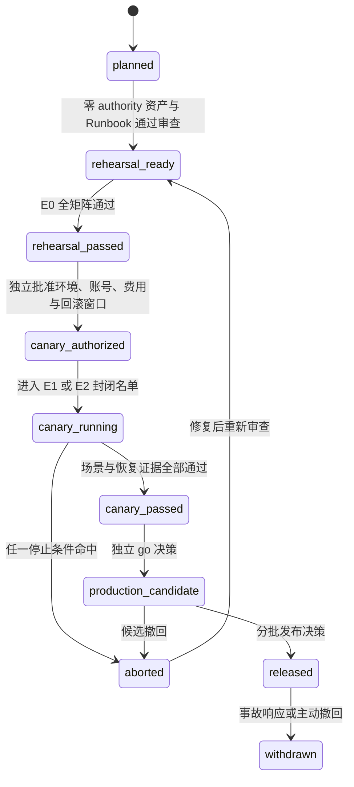
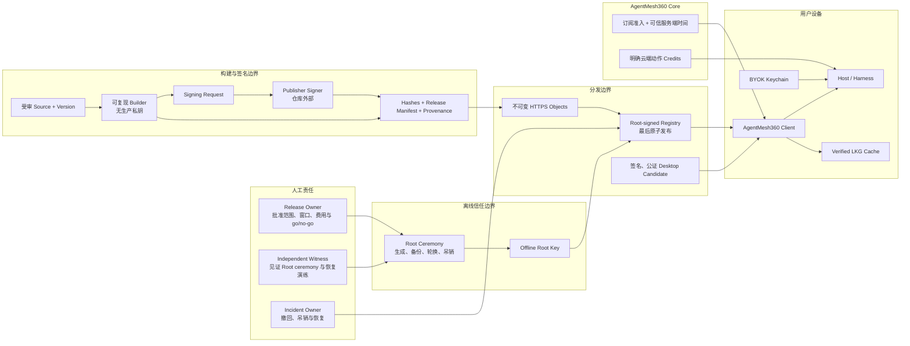
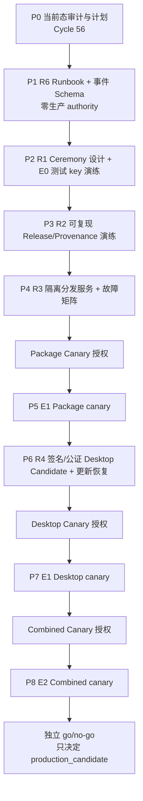

# AgentMesh360 Client 生产准备与内部 Canary 计划

状态：P0/P1 基线、P2 key ceremony E0、P3 四 Agent provenance E0、P4
分发服务 E1 隔离演练与 P5 no-authority preflight 均已完成。Cycle 63-85 在精确 72 小时、`3 USD` 硬上限授权
内完成隔离 Spaces/Origin、四 Agent 双构建、Trust/Registry-last 发布、14 项
故障矩阵、Registry-first 撤回、Root/Publisher 与全部云端/本机资源销毁。

P4 E1 状态为 `isolated_distribution_rehearsal_passed`；生产 R1-R6 仍未关闭，
生产 Trust/Registry 常量保持为空。Cycle 86 把 P5 前置门、21 项场景和批准卡
固化为默认 blocked 契约；Cycle 87 的批准卡错误假定已有专用内部测试账号。
Cycle 92 在用户纠正该账号并不存在后，于订阅复验、Keychain 写入、Package
mutation 和云端资源创建前中止 P5 E1，并销毁隔离客户端、构建缓存和 worktree。
Cycle 93 已取得账号所有者对其现有线上账号的直接授权，并新建严格 v2 授权链；
旧 v1 继续保持 aborted。E2、生产候选和 Apple 签名公证均未授权。

本文档把
[`PRODUCT_PLAN_AND_PRODUCTION_RELEASE_GATE.md`](PRODUCT_PLAN_AND_PRODUCTION_RELEASE_GATE.md)
中的 R1-R6 拆成可执行、可审计、可回滚的工作包。它同时覆盖两条独立发布链：

1. Agent Package 的签名、分发、动态安装与宿主 Skill 投影；
2. AgentMesh360 桌面客户端的签名、公证、升级、登录启动与卸载。

本文不是发布授权，也不是 canary 通过报告。Cycle 59 只在本机隔离临时目录生成并
销毁 E0 测试 Root/Publisher；没有生成或保留生产 key，没有配置 production/staging
endpoint，没有上传 Artifact、发布 Registry、签名或公证桌面安装包，也没有调用
Provider、消耗 credits 或写用户真实宿主目录。

## 1. 当前基线与计划结论

### 1.1 源码与仓库事实

| 范围 | 当前源码事实 | 对计划的约束 |
| --- | --- | --- |
| 生产 Root | `TrustedRootStore::embedded()` 返回空 Store | 外部 Package 必须继续失败关闭，不能先填 endpoint |
| Publisher Trust | `EMBEDDED_PUBLISHER_TRUST_BUNDLE = None` | 必须先完成 Root ceremony、Bundle 生成与独立验签 |
| 远端 Package 元数据 | `PRODUCTION_TRUST_BUNDLE_URL = None`、`PRODUCTION_REGISTRY_URL = None` | Package Center 不能声称已有生产目录 |
| 远端拉取 | 已有 HTTPS origin 固定、无重定向、响应大小限制、可信时间、expiry、反回滚与 LKG | R3 应复用并验证现有消费者，不重造下载协议 |
| Release 工具 | H2d0-H2d4 已有确定性 Artifact、外部签名契约、Host bundles、Release Manifest、Registry 投影与消费核对 | R2 应把现有离线工具接入受控发布流程，不另建旁路格式 |
| 桌面构建 | `desktop/package.json` 只有本地 `build:mac`，输出 DMG/ZIP | 本地可构建不等于 R4 |
| 桌面签名与更新 | 没有仓库自有 Developer ID/公证配置、自动更新客户端或发布工作流；仓库没有 `.github/workflows` | 必须先设计凭据边界与可恢复更新链，不能把手工 DMG 当正式分发 |
| 登录启动 | 已有 packaged app Login Item 源码，开发模式拒绝真实写入 | 必须在签名、公证安装包上验证注册、批准、禁用与升级 |
| 退出 | `before-quit` 会发起 Controller shutdown，但当前不是“等待 Host 完整退出后再结束”的发布级证据 | R4/R5 必须验证受控 shutdown、强退恢复和卸载清理 |
| 订阅与 BYOK | Core、Host、桌面硬门禁已完成；BYOK 是默认推理模式 | canary 必须使用专用内部账号、有效订阅和专用测试 Key，并单独批准费用上限 |

结论：

- R0 继续是“已满足（开发验证）”，不代替生产发布门；
- R1-R6 仍未满足；
- P1 已完成零生产 authority 的 R6 Schema、Runbook、证据模板和 E0 tabletop；
- P2 已完成无 authority preflight 与获批的 E0 测试 key 技术演练；16 个场景、
  sequence 1-5、六个失败关闭输入及私钥销毁均有 retention-safe receipt；
- P2 的 E0 子项通过不满足生产 R1；真实 custody、双人生产 ceremony 和生产 key
  仍需另一张批准卡；
- P3 已在精确批准下完成 E0 四 Agent 双构建、一个临时测试 Publisher、8 次签名、
  十类输出逐字节复验、销毁与 retention-safe receipt；该 E0 PASS 不关闭生产 R2；
- P4 已完成 E1 隔离四 Agent Release Set、非生产 Trust、Registry-last、14 项
  故障矩阵、Registry-first 撤回与完整资源销毁；该 E1 PASS 不关闭生产 R3；
- 真正的内部 canary 不是下一条命令，而是 R1-R4/R6 相应前置证据通过后的受控阶段；
- Package 与桌面可以分别形成 canary 证据，合并开放必须再通过共同 canary。

### 1.2 三种不能混写的 canary

| 名称 | 运行对象 | 进入条件 | 能关闭的证据 |
| --- | --- | --- | --- |
| Package canary | 受签 Package、Registry、安装/权限/rollback | R0、R1、R2、R3、R6 的相应前置项已通过 | R5 的 Package 子集 |
| Desktop canary | 签名、公证的桌面候选及升级链 | R0、R4、R6 的相应前置项已通过 | R5 的 Desktop 子集 |
| Combined canary | 正式候选桌面消费正式候选 Package，并执行真实订阅 + BYOK | R0-R4 与 R6 前置项均已通过 | R5 共同项；只产生“生产候选”资格 |

某一条 canary 通过不能替代另一条。Combined canary 通过也不自动代表公开发布，
还必须由发布负责人根据完整证据作出独立 go/no-go 决定。

## 2. 环境与状态模型

### 2.1 四级环境

| 级别 | 环境 | 信任与外部影响 | 允许的动作 | 禁止的声称 |
| --- | --- | --- | --- | --- |
| E0 | 本地确定性演练 | 临时测试 key、loopback/离线 URL、临时目录 | 构建、签名格式演练、故障注入、可复现比较 | staging、canary、生产 |
| E1 | 隔离内部 staging | 独立非生产 Root、隔离 HTTPS origin、专用内部账号与 BYOK | 端到端分发、安装、恢复与有限费用测试 | 生产信任、生产 canary |
| E2 | 封闭生产候选 | 生产 authority、生产候选 endpoint、明确内部名单 | Package/Desktop/Combined canary 与 rollback 演练 | 对外发布、普遍可用 |
| E3 | 正式生产 | 经批准的公开 cohort | 分批扩大范围、监控与事故响应 | 未经批准的全量开放 |

E0 成功只说明工具链可演练；E1 成功只说明隔离环境链路成立；E2 canary 通过只说明
候选具备进入发布决策的资格。任一环境的证据都不能自动升级为下一环境。

### 2.2 发布状态机



状态必须写入发布证据摘要，不能仅靠聊天记录推断。`rehearsal_passed`、
`canary_passed`、`production_candidate` 和 `released` 是四个不同事实。

## 3. Authority 与信任架构



固定边界：

1. Root 私钥不进入仓库、客户端、普通 CI、桌面构建机、日志或证据包；
2. Builder 只产生非秘密 signing request，不能持有生产 Publisher 私钥；
3. Publisher Signer 不能修改 Artifact、Manifest、版本或摘要；
4. Registry 必须最后发布，只能引用已存在的不可变内容；
5. 客户端只消费内置/已审核 Root 下的受签文档，调用方不能注入 URL、digest、
   Root、Publisher 或“已批准”布尔值；
6. Core 只负责订阅准入、可信时间与明确的云端 credits 动作；BYOK Key 只留在用户
   设备安全存储，Package 服务不能读取；
7. 生产 Root ceremony、生产 endpoint、Publisher 签名、公证、canary 费用和 cohort
   扩大分别需要独立批准，不能由一次笼统“发布”授权覆盖。

## 4. R1-R6 进入门与退出证据

### R1：Root 与 Publisher authority

进入前：

- 指定 Release Owner、独立见证人和 Incident Owner；
- 固定 key ID、algorithm、有效期、备份介质、保管位置和访问记录格式；
- 先在 E0 使用测试 key 演练完整 ceremony，不接触生产常量。

必须产出：

- 经双人核对的 ceremony Runbook 与逐步 receipt；
- Root public document、首个 Publisher Bundle 及 canonical 签名载荷摘要；
- active、retired、revoked 三态和 sequence 单调递增规则；
- Root/Publisher 轮换、丢失、泄漏、过期与紧急吊销演练结果；
- 私钥未进入仓库、日志、客户端、普通 CI 和证据摘要的检查记录。

退出判定：

- 独立实现或独立工具能复验签名和 canonical payload；
- 旧 sequence、同 sequence 不同文档、未知 Root、过期 Bundle、被吊销 Publisher
  全部失败关闭；
- 生产私钥恢复与销毁流程已有负责人、操作窗口和明确停止条件。

### R2：Release provenance

进入前：

- R1 的 Publisher authority 可用；
- 固定源码 commit、版本、构建工具链和依赖锁文件；
- H2d0-H2d4 的 Schema/工具版本已冻结为本次候选输入。

必须产出：

- 相同输入至少两次隔离构建的逐字节一致性；
- Artifact、file manifest、Envelope、Host projection、每个 Host bundle、
  Release Manifest 和 Registry record 的完整 SHA-256 绑定；
- signing request、外部签名 result 和 finalize receipt；
- 源 commit、构建机/工具版本、锁文件摘要和执行者；
- 三个首方 Agent 以及一个不在内置 Catalog 的动态 Agent 的同源双渠道核对。

退出判定：

- 任一文件、版本、Publisher、Host 集合、入口或摘要改变都会失败；
- Website/Host Skill 与 Client projection 指向同一个 Release reference；
- 证据能从发布候选反向追到源码和签名 receipt，但不含私钥、Token、本机敏感路径或
  用户内容。

### R3：分发服务

进入前：

- R1/R2 已通过；
- 固定 production-equivalent origin、TLS、对象命名、缓存与原子发布策略；
- 明确服务 owner、访问权限和撤回方式。

必须产出：

- 不可变 Artifact/Envelope/Release/Host bundles 的上传 receipt；
- Trust Bundle 与 Registry 的 bounded response、正确 content type、禁止 redirect、
  无 credentials/query/fragment 的验证；
- “先上传全部内容，最后原子发布 Registry”的可复核顺序；
- 404、超时、截断、超限、错误 MIME、坏摘要、坏签名、过期、回退与 equivocation
  的故障注入；
- LKG 仍有效时的可用性，以及 LKG 无效/过期时的失败关闭。

退出判定：

- 半发布内容不会被客户端发现；
- 已发布版本内容不可原地替换；
- Registry 撤回不会删除已有本地用户数据，也不会静默降级到不受信版本；
- 服务日志与对象元数据不含用户账号、BYOK、Prompt、响应或本机路径。

### R4：桌面正式分发

进入前：

- 固定桌面版本、bundle ID、构建输入和发布渠道；
- Developer ID、notarization 凭据与权限边界获得单独批准；
- 自动更新、失败恢复和卸载策略通过审查。

必须产出：

- 从固定 commit 产生的签名、公证 DMG/ZIP 和摘要；
- 首次安装、系统验证、打开、二次打开与签名完整性；
- macOS Login Item 注册、系统批准、关闭、重新开启和升级后的状态；
- 有窗口、无窗口后台启动、第二实例唤醒、Host 崩溃与 App 重启恢复；
- 正常退出、强制退出、升级、卸载时的 Host 与 Login Item 清理；
- 自动更新检查、下载、验证、安装、重启和失败回滚；更新链不得接受未签名版本。

退出判定：

- 干净受支持 macOS 环境完成安装、升级、rollback 与卸载矩阵；
- 应用退出不会留下失控 Host，意外崩溃又能恢复固定 Main Session；
- 更新失败保留可启动的最后良好桌面版本和用户状态；
- 执行时以 Apple 官方当时要求为准，不在本计划中硬编码可能过期的公证细节。

### R5：灰度与恢复

R5 是 canary 的退出门，不是 canary 准备的循环前置条件。进入某条 canary 时，
该发布链的 R1-R4 相应项和共同 R6 前置项必须已经通过。

必须产出：

- 明确的内部账号、设备、操作人、时间窗、版本和 cohort；
- 真实有效订阅与专用 BYOK；每个 Provider 的模型、请求次数/费用上限和停止开关；
- Package 安装、权限不变、权限扩张拒绝/批准、更新、rollback、reconcile；
- Root/Publisher 轮换和吊销、Registry 撤回/回滚、LKG 恢复；
- Desktop 安装、Login Item、Host 恢复、自动更新、受控 shutdown 与卸载；
- Combined canary 中固定 Main Session、对话/项目/产物/计划恢复，以及 Package
  更新前后身份不变；
- 每项失败后的恢复时长、数据完整性和下一次重试是否安全。

退出判定：

- 所有必测场景通过，所有停止条件均未触发；
- rollback 已实际演练，不是只存在命令或文档；
- 没有重复执行不可逆 mutation，没有静默 Provider fallback，没有突破费用上限；
- canary 结束后专用凭据已轮换或撤销，临时数据与日志按 Runbook 处理；
- Release Owner 和 Incident Owner 共同签署 `canary_passed`，但不自动发布。

### R6：可观测与事故响应

R6 的 Runbook 和最小事件 Schema 必须在任何真实 authority 或外部服务启用前完成。

允许记录的最小字段：

- `releaseId`、公开版本、package/agent ID；
- `environment`、`stage`、`gate`、`eventType`、`outcome`；
- 固定错误码、UTC 时间、构建/Registry revision；
- 内部 canary 的非个人化设备别名和操作 receipt ID。

禁止记录：

- API Key、Access/Refresh Token、Authorization、Cookie、签名私钥；
- Prompt、模型响应、Tool 输入输出、用户文件内容；
- 电子邮件、真实账户 ID、本机绝对路径；
- 完整下载 URL、query、Header、Registry/Trust 原文或签名原文。

必须产出：

- 版本撤回、Publisher/Root 吊销、Registry 冻结和客户端最低版本 Runbook；
- 严重级别、响应人、通知路径、停止发布和恢复发布的批准边界；
- 观测缺失、事件重复、时钟异常与存储不可用时的失败策略；
- 一次完整 tabletop 和一次 E1/E2 技术演练；
- 对外状态说明模板与内部证据摘要模板。

退出判定：

- 任一发布候选可以被定位、撤回和阻止继续扩大 cohort；
- 事件中不含秘密或用户内容，且能区分 planned/rehearsal/canary/released；
- “最低版本”不会把无法安全更新的客户端永久锁死，恢复安装路径已验证。

## 5. Canary 场景矩阵

### 5.1 准入与 Provider

| 场景 | 预期结果 |
| --- | --- |
| 订阅有效 | 进入工作区，Core 与 Host 结论一致 |
| 订阅过期/暂停 | 立即回到订阅拦截，Agent/Package/Provider 动作失败关闭 |
| 账户切换 | 旧账户 Agent、Session、Package、Provider 不可见 |
| BYOK 正常 | 只使用明确选择的 Provider/模型 |
| Provider 401/403 | 不重试泄漏凭据，不静默切换 Provider |
| Provider 429/5xx/超时/离线 | 给出固定安全错误；可重试动作由用户明确发起 |
| 模型能力不匹配 | 调用前失败，不猜测支持 |
| 请求或费用达到上限 | 停止本轮 canary，不自动追加额度 |

### 5.2 Package

| 场景 | 预期结果 |
| --- | --- |
| 新 Agent 安装 | 签名、Release、权限和当前账户全部验证后原子激活 |
| 同权限更新 | 保持固定产品身份与 Main Session |
| 权限扩张拒绝 | 保留旧版本，无半安装状态 |
| 权限扩张批准 | 仅应用本次精确 plan，不接受 Renderer 注入权限 |
| Artifact/Envelope/Release 任一篡改 | 下载或安装前失败 |
| Registry revision 回退/同 revision 异文 | 拒绝新响应，只有有效 LKG 可继续 |
| Trust Bundle 过期/Publisher 吊销 | 新安装/更新失败关闭，已有用户数据不删除 |
| 安装中断 | 重启后 reconcile 到旧 active 或完整新版本 |
| rollback | 回到已验证旧版本，审计与 Agent 状态一致 |
| Host Skill 投影 | 与 Client Release reference、版本和摘要完全一致 |

### 5.3 Desktop 与持久 Agent

| 场景 | 预期结果 |
| --- | --- |
| 首次签名安装 | 系统验证通过，应用可启动 |
| Login Item 未批准 | UI 明确状态，前台仍可用，不伪装已后台恢复 |
| Login Item 已批准 | 无窗口启动 Host，不创建多份 Leader |
| 关闭窗口 | Agent/Host 继续按产品策略运行，可随时重新打开 |
| 正常退出 | 受控停止 Host，不留下失控进程 |
| Electron/Host 强退 | 恢复后固定 Main Session 与账户隔离不变 |
| 自动更新成功 | 新版本恢复 Agent、Session、Provider Binding 与 Package 状态 |
| 自动更新失败 | 旧版本仍可启动，不损坏用户状态 |
| 卸载 | 按明确策略清理 Login Item/Host；用户数据保留或删除必须由产品策略明确 |
| 离线重启 | 不伪造订阅新鲜度；不可验证动作失败关闭 |

## 6. 停止条件、成功标准与回滚

### 6.1 立即停止

命中任一项即把本轮状态设为 `aborted`，停止 cohort 扩大：

- 签名、Root、Publisher、Release 或 Registry 验证可被绕过；
- 跨账户看到或执行其他账户的 Agent、Session、Provider、Package 或 Artifact；
- 日志、Renderer、证据包或崩溃报告出现秘密、Prompt/响应、用户内容或本机敏感路径；
- 同一个未知结果 mutation 被自动重试，造成重复安装、扣费、批准或状态变更；
- Provider 被静默切换，或请求/费用突破批准上限；
- Package/Desktop rollback 失败，或最后良好版本无法启动；
- 自动更新接受未签名/不匹配候选；
- Root/Publisher 吊销后仍可安装该 key 签名的新内容；
- 无法确认当前 cohort、版本、Registry revision 或事故负责人。

### 6.2 通过标准

- 适用场景 100% 有可复核结果，安全停止条件为零；
- 所有失败注入都产生预期的失败关闭或有效 LKG，而不是不确定状态；
- rollback、撤回、吊销和恢复均实际执行；
- 用户持久状态在正常升级、失败升级和 Host 恢复后保持一致；
- 可观测记录足以定位 release/stage/outcome，但不含秘密或用户内容；
- 主 Agent 自主验证与本机 Kimi 独立复核都达到 Blocker/High/Medium/Low 全零；
- Release Owner 只根据本轮证据批准下一状态，不沿用旧聊天中的笼统授权。

回滚目标时限、允许的数据恢复点和可接受的短时不可用窗口，必须在每次 canary 授权卡
中填写；本计划不凭空设定未经业务负责人确认的数字。

## 7. 工作包与固定顺序



| 工作包 | 交付物 | 是否需要新授权 |
| --- | --- | --- |
| P0 当前态审计与计划 | 本文、蓝图/发布门/进展同步、文档验证、Kimi 四级清零 | 本轮已授权继续开发；不含外部动作 |
| P1 R6 基线 | **已完成**：Runbook、最小事件 Schema、证据模板、静态 secret/content 检查与 E0 tabletop | 未创建外部资源；不等于完整 R6 关闭 |
| P2 R1 E0 | **已完成 E0 技术演练**：preflight、receipt Schema/验证器、隔离 worker/runner、16 场景、sequence 1-5、失败关闭与销毁证据 | 只关闭 E0 子项；生产 custody/key/ceremony 仍需独立批准 |
| P3 R2 E0 | **已完成 E0 技术演练**：固定 commit/toolchain/lock、双隔离 build root、四 Agent、一个临时测试 Publisher、8 次签名、十类输出逐字节复验、销毁与非秘密 receipt | 只关闭 E0 子项；生产 R2、生产 Publisher、外部分发与 P4-P8 仍需分别批准 |
| P4 R3 E1 | **隔离演练已通过并清场**：四 Agent 双构建、Trust/Registry-last、14 项故障矩阵、Registry-first 撤回、云端和本机资源归零 | 只关闭 E1 演练；生产 R3 未关闭，P5 仍需独立授权 |
| P5 Package canary | **v2 执行中**：隔离客户端、真实 Host、owner OAuth/订阅、Gemini BYOK、真实 Agent Turn Route、失败关闭、加密重启恢复与 Release Chain 无网络预检通过；旧内部账号 v1 保持 aborted | 下一门先实现、测试并冻结 P5 专用 Release/21 场景/清场执行器；之后才创建唯一隔离 staging，完整清场前不推进 P6 |
| P6 R4 | Developer ID、公证、自动更新、签名安装恢复矩阵 | 需要 Apple 凭据、签名/公证和分发渠道授权 |
| P7 Desktop canary | 内部设备安装/升级/Login Item/shutdown/卸载 | 需要设备/cohort 与更新窗口授权 |
| P8 Combined canary | 正式候选桌面 + Package + 订阅 + BYOK 全链恢复 | 需要生产候选 authority、费用与 cohort 授权 |

P0/P1 与 P2 E0 完成后仍不能跳到 P4-P8。P3 只能使用重新批准的 E0 测试签名
authority，不能复用已销毁的 P2 私钥或生成生产 key；生产 key 仍需另一张独立批准卡。

## 8. 明确批准卡

每次批准只对卡片中精确范围有效：

```text
Action:
Environment: E0 / E1 / E2 / E3
Release/Package/Desktop version:
External resources:
Credentials involved:
Provider and model:
Maximum requests / credits / currency cost:
Canary accounts/devices/cohort:
Start and stop window:
Rollback target:
Abort owner:
Evidence retention location:
Approved by / approved at:
```

至少需要独立卡片：

1. 测试 key ceremony；
2. 生产 Root/Publisher key ceremony；
3. 创建隔离 staging 服务与凭据；
4. 使用真实订阅和 BYOK 执行 Package canary；
5. Developer ID 签名与公证；
6. 发布或撤回候选 Registry；
7. Desktop/Combined canary；
8. 从 `production_candidate` 扩大到任何外部 cohort。

旧 Provider 测试授权、免费额度授权、GitHub 推送授权或“继续开发”都不能替代这些卡片。

## 9. 证据与秘密处理

建议的非秘密证据索引：

```text
release-evidence/<release-id>/
  00-scope-and-approval.md
  01-source-and-build.json
  02-signing-receipts.json
  03-distribution-checks.json
  04-canary-scenarios.json
  05-rollback-and-recovery.json
  06-kimi-independent-review.md
  07-go-no-go.md
```

这里描述的是结构。Cycle 57 只创建默认 `blocked` / `NO_GO` 的模板目录，不创建真实
Release 证据。生产原始 receipt、凭据位置、
完整日志和可能含内部身份的信息应放在受访问控制的发布系统；仓库只保存经过脱敏的
摘要、Schema、Runbook 和可公开复验的 digest。

每轮完成前至少检查：

- 仓库、Git 历史、diff、日志、截图、`/tmp` 和构建产物中没有秘密；
- 证据没有 Prompt、响应、用户文件、电子邮件、账户 ID 或绝对本机路径；
- `target/` 不留在仓库根，临时构建目录按本轮约定清理；
- 明确记录哪些测试由主 Agent 执行、哪些由 Kimi 独立执行、哪些未执行；
- 本地通过、提交、推送、staging、canary、production candidate 与正式发布分别陈述。

## 10. Cycle 56 验收与非目标

本轮验收：

- 计划与当前源码关闭态、R1-R6 和原产品顺序一致；
- 两条发布链、三种 canary、四级环境和状态机不混淆；
- 每个门都有进入条件、证据、退出判定和停止条件；
- 明确下一切片是 P1，而不是 key、endpoint、签名、公证、上传或 canary；
- 文档相对链接、Markdown、Mermaid 文本与 `git diff --check` 通过；
- Kimi 独立核对源码事实、发布边界和计划完整性，四级问题全部清零；
- 更新产品蓝图、发布门和项目进展后提交并推送 `main`。

本轮自主验证已确认五份文档相对链接全部存在、`git diff --check` 通过、生产四个
关闭常量仍为空、仓库根 `target/` 不存在。Kimi session
`session_858d2a9f-0fcb-4333-93ee-184a41399e9d` 只读核对完整 diff、新计划、相关
源码、R1-R6、三种 canary、P0-P8、相对链接与 Markdown/Mermaid 文本；没有读取
Keychain、调用 Provider、运行构建或创建 `target`。最终
Blocker/High/Medium/Low 全部为零并给出 PASS。

本轮非目标：

- 不实现新的 Agent、Provider、Scheduler、Subagent 或 Agent 专属 UI；
- 不修改 Package/Provider/Desktop 运行时代码；
- 不创建 CI/CD、对象存储、DNS、证书或云端服务；
- 不生成任何测试或生产签名 key；
- 不调用真实 Provider，不消耗 credits 或费用；
- 不构建、签名、公证、上传、安装或发布桌面/Package 候选；
- 不把计划完成写成 rehearsal、canary 或生产完成。

## 11. Cycle 57 P1 R6 本地基线检查点

已经完成：

- Release Event v1 严格 JSON Schema，固定 E0-E3、状态、R0-R6、事件类型与非秘密
  字段；
- 有界证据目录、默认 `blocked` / `NO_GO` 模板，以及跨 JSONL、JSON、Markdown 的
  Release 身份绑定；
- 无依赖 Node 验证器，拒绝未知字段、重复 JSON key、跨 Release、乱序、非法 UTC、
  非 canonical SemVer、symlink、未知/缺失/超限/非 UTF-8 文件，以及 URL、绝对路径、
  secret/content key/value；
- 发布事故 Runbook，覆盖 Registry 异文、Publisher/Root compromise、Desktop
  最低版本锁死、证据泄漏和 BYOK/订阅失控；
- 一次无 key、无外部资源的 E0 release-integrity tabletop。该 tabletop 只关闭
  P1 的本地子项，不能代替 R6 要求的 E1/E2 技术演练。

验证与复核：

- 主 Agent 的 Node 回归、CLI 模板/事件验证、JSON/JSONL 解析、文档链接、
  `git diff --check` 与根 `target/` 检查全部通过；
- Kimi CLI session `session_0b7c8012-f3fb-4f08-b4d0-d520b79605ec` 首轮发现
  1 Medium / 5 Low，修复目录身份绑定、fs 错误脱敏、路径/URL 与 JSON key 扫描、
  重复 JSON key 和 tabletop 时间后复核四级全零并 PASS；
- Kimi 未运行 Cargo/npm/Electron，未读取 Keychain/Provider，未创建外部资源或
  仓库根 `target`。

下一顺序：

- Cycle 58 已实现不生成 key 的 P2 ceremony 工具/清单设计；
- 生成临时测试 key、执行轮换/丢失/泄漏/过期/吊销/恢复演练前必须获得第 8 节的
  测试 key 精确批准卡；
- P3-P8 与各自外部 authority 继续保持关闭，不能用本轮 PASS 推断已发布或已 canary。

## 12. Cycle 58 P2 无 authority ceremony 预检检查点

已经完成：

- `agentmesh360-key-ceremony-preflight-v1` 严格 JSON Schema 与默认模板固定
  `environment=e0`、`authority=none`、`approvalStatus=not_approved`、
  `executionStatus=blocked` 和 `algorithm=ed25519`；
- 模板只预留一个 Root 与两个 Publisher 的 planned key ID；private material 在
  Repository、Client、普通 CI 和 evidence 中全部固定为 `false`；
- custody 的备份份数、介质、保管角色、恢复窗口和销毁方式分别保持
  `requires_approval`；批准卡的窗口与 receipt 继续保持未批准/不存在；
- 16 个机器固定场景覆盖 Bundle expiry，Publisher/Root 的生成、丢失、泄漏、过期、
  overlap rotation、retire/revoke/emergency revoke，以及测试材料销毁；
- 无依赖 Node 验证器拒绝 symlink、非 regular/空/超 128 KiB/非 UTF-8/非法 JSON、
  重复 object key、未知/缺失字段、ID 冲突/乱序、非单调 sequence 和任何 authority
  升级；CLI 错误不输出绝对路径或文件内容；
- 中文操作清单只描述获批后的顺序与停止条件，不包含 key-generation 命令。

验证与复核：

- P2 定向 Node 测试 10/10、与 P1 release-evidence 联合回归 28/28 通过；
- 两个 P2 MJS `node --check`、默认模板 CLI 验证与 `git diff --check` 通过；
- Kimi CLI session `session_987108f4-dbd2-4252-aa62-aa8c6876afa4` 首轮发现
  1 Medium / 2 Low：机器清单缺 Root rotation/compromise 与 Bundle expiry，批准卡
  缺版本映射，custody 待批准维度未逐项表达；
- 修复并增加回归后，同一 session 重新读取完整 diff、执行 Node/CLI/diff 检查，
  最终 Blocker/High/Medium/Low 全部为零并 PASS；
- 同步 Cycle 58 进展、发布门、产品蓝图和桌面 README 后，同一 session 第三轮复核
  最终 10 文件 diff，独立复跑 P2 10/10、联合 28/28、链接/fence/JSON、生产关闭
  常量与根 `target/` 检查，仍为四级全零并 PASS；
- Kimi 未编辑文件、运行 Cargo/npm/Electron、创建 `target`、读取 Keychain/
  Provider、调用外部服务或执行任何 key 操作。

边界与下一顺序：

- 本检查点只关闭 P2 的无 authority 设计子项，不代表 key ceremony 已获批、key
  已生成、E0 rehearsal 已通过或 R1 已满足；
- 顶层状态必须继续是 `blocked`；不得把模板改写为真实批准 receipt；
- 下一步只有在第 8 节测试 key ceremony 精确批准卡生效后，才执行 P2 E0 实际演练；
  P3-P8、生产 key、外部资源、费用、Apple 凭据与 cohort 继续保持关闭。

## 13. Cycle 59 P2 E0 测试 key 技术演练检查点

实际执行：

- 用户批准 `approval_p2_e0_20260728_0001`，范围只包含本机隔离临时目录中的测试
  Root/Publisher 生成、轮换、丢失、泄漏、过期、吊销、恢复与销毁；
- runner 绑定 source commit
  `c68c2d133a8ab3fa30cc57f783fbaa8311eee5ec`，不调用外部服务、Provider，不消耗
  requests、credits 或费用；
- 初始一个 Root 和 Publisher A/B 之外，只为 Root rotation 在同一窗口生成一个
  transient successor Root；四份私钥均在 receipt 写入前销毁；
- sequence 1-4 复用当前 Rust canonical Trust payload 和 Publisher
  active/overlap/retired/revoked 契约；sequence 5 验证继任 Root 接棒；
- 过期 active Publisher、过期 Bundle、revoked Publisher、sequence rollback、
  same-sequence equivocation 和 unknown Root 均失败关闭；
- Publisher A 与初始 Root 都完成备份、删除、恢复、重新签名与独立验签；
- 第一次启动在生成 key 前被 scanner 自指 PEM marker 误报中止；修复与回归确认
  没有临时目录、receipt 或 key 后，才执行唯一一次真实 key 生成。

保留证据与验证：

- 新增 strict `agentmesh360-key-ceremony-receipt-v1` Schema、无依赖验证器、隔离
  key worker、E0 runner 与 retention 扫描器；
- 机器 receipt：
  [`../operations/tabletops/2026-07-28-p2-key-ceremony-e0.json`](../operations/tabletops/2026-07-28-p2-key-ceremony-e0.json)；
- 可读报告：
  [`../operations/tabletops/2026-07-28-p2-key-ceremony-e0.md`](../operations/tabletops/2026-07-28-p2-key-ceremony-e0.md)；
- receipt 不含私钥、公钥/签名原文、个人身份、绝对路径或原始命令；只保留 ID、
  类型化 `sha256:` digest、sequence、结果码与清理证明；digest 输入与场景发生性
  明确不是 receipt 的 standalone proof，必须结合获审计 runner 和独立复核；
- worker 执行覆盖、fsync、unlink，runner 再删除并验证整个临时目录；由于
  APFS/SSD 限制，不声称 forensic secure erase；
- Kimi 首轮提出的 worker symlink-parent、bare 64-hex、场景自证、PEM 覆盖、
  locale 排序、宽松时间与 Ed25519 点校验均已进入代码/测试闭环；
- 生产 Root Store、Bundle 与 Registry URL 常量保持空，Trust 恢复为空；
- 主 Agent 与 Kimi 均独立通过 receipt/runner 13/13、preflight 10/10 与 P1
  release-evidence 18/18，联合 41/41；
- Kimi CLI session `session_e8117ef9-14a9-4879-bb86-58fdf529830d` 首轮报告
  3 Medium / 4 Low：worker symlink-parent/测试缺口、hex digest 信任限制、场景
  自证，以及 PEM、排序、时间与 Ed25519 点校验；
- 全部落入代码、测试和机器可读 review limitations 后，同一 session 第二轮独立
  复跑 41/41、receipt/preflight CLI、JSON、link/fence、diff、生产 `None` 常量、
  临时目录、根 `target/` 和泄漏扫描，最终 Blocker/High/Medium/Low 全零并 PASS。

边界与下一顺序：

- 本检查点只关闭 P2 E0 测试密钥技术执行，不关闭生产 R1；
- 本机 role alias 与 Kimi 交叉复核不能冒充生产双人 custody ceremony；
- P2 测试私钥已全部销毁，不能在 P3 复用；
- 下一步严格按序评估 P3 R2 E0，但生成任何新的测试 Publisher 或执行外部测试签名
  前必须取得与 P3 范围匹配的 authority；P4-P8、生产 key、外部资源、费用、Apple
  凭据与 cohort 继续关闭。

## 14. Cycle 60 P3 零新 key provenance preflight 检查点

已经实现：

- strict `agentmesh360-release-provenance-preflight-v1` Schema、默认 blocked 模板、
  无依赖 Node validator 与中文操作清单；
- 顶层固定 `environment=e0`、`workPackage=p3_r2`、`authority=none`、
  `not_approved` 与 `blocked`，不能填入 execution commit/digest/toolchain；
- source freeze 固定 clean tree、`Cargo.lock` typed digest、Rust toolchain，
  并逐项绑定 Rust 实现的 11 个数值 Schema version 与 2 个 canonical payload
  ID，不使用不存在的聚合 Schema 名称；
- 执行角色固定为相互分离的 `build_operator`、`test_signer_operator` 与
  `independent_reviewer` 非个人 alias；
- 两个仓库外隔离 build root、逐字节一致、仓库根 `target/` 禁止，以及 Artifact、
  file manifest、signing request/result、Envelope、finalize receipt、Host
  projection/bundles、Release Manifest、Registry record 十类输出；
- `deploy-agent`、`job-agent`、`lecturecast-agent` 与既有 H2d1
  `future-agent / com.agentmesh360.future-agent / 1.0.0` 四项矩阵，防止把“动态
  Agent”退化成内置 Catalog 特例；
- Ed25519 signer authority 继续为 none，P2 private material 不可复用，production
  key 与 Repository/Builder/evidence 私钥全部禁止；
- 新 P3 批准卡固定 source/version、一个新测试 Publisher、signer mode/存储/销毁、
  窗口、零 Provider/requests/credits/费用和 rollback。

当前验证与边界：

- P3 preflight 定向 Node 12/12、模板 CLI、Node check、JSON 与 diff 已通过；
- 本轮没有运行 Cargo、创建 build root/`target`、生成/读取 key、签名、finalize、
  构造候选 Registry、上传、发布或调用外部服务；
- P1/P2/P3 Node 联合回归 53/53；同一 Kimi session 两轮审查中，首轮 1 Medium /
  2 Low 已修复，第二轮独立复跑和 10 类负向验证后四级 findings 全零并 PASS；
- preflight 通过只建立 `rehearsal_ready` 前的阻断结构，不代表 P3/R2 已完成；
- 该 Cycle 60 检查点时，实际 P3 仍等待新的 test-signing authority，P4-P8
  继续关闭。

## 15. Cycle 61 P3 离线 Release assembly executor 与证据 runner 检查点

用户已把 P3 R2 E0 的 authority 精确限定为 commit `e1ef8db...`、一个临时测试
Publisher、四 Agent 双构建和本机非秘密 provenance。执行前复核发现原有 CLI 只能
构建 Artifact 和 finalize 外部签名，无法从公开命令组装 H2d1-H2d3；直接调用
`#[cfg(test)]` helper 又会带入既有硬编码测试 key。因此新增一个单独冻结、单独记录
commit/digest 的离线 executor：

- `assemble-release` 不接收私钥，只读取签名结果和公开 key；
- 先执行 H2d0 finalize 与 H1 复验，再复用正式 H2d1-H2d3 实现生成 Host bundles、
  Release Manifest 和未发布 Registry record；
- Trust 仅是进程内、单 key、无 Root/expiry/cache 的离线验证 store，不修改客户端
  embedded/cached Trust；
- 输出目录必须全新；失败删除整个目录，成功删除验证 staging；
- Registry location 只允许 HTTPS，正式 E0 runner 将使用 `.invalid` 地址且不访问
  网络；
- 动态 `future-agent` 使用文件 fixture 进入同一 CLI 路径，不能靠内置 Catalog
  特判。

该 executor 的定向测试、80 项 Package 回归、fmt、Clippy 和 Node syntax 已通过。
Kimi 首轮提出 signer TOCTOU Low 后，worker 改为 `O_NOFOLLOW + fstat`，并增加
不生成 key 的 symlink/mode/size/absent 负向测试；测试同时修复 macOS `/var` 与
`/private/var` canonical alias 导致的合法 target 误拒。当前仍未生成 P3 key。

同时新增 strict execution receipt/validator 与 fail-closed runner。runner 的顺序
固定为：

1. 校验显式 ack、候选/执行器/三份首方 source commit、clean tree、lock、
   生产关闭常量和根 `target/`；
2. 在两个仓库外 Cargo target 中顺序构建执行器，每次复制完成即删除该 target，
   避免两个约十余 GiB 的目录同时占盘；
3. 四 Agent 分别完成 A/B `artifact/signing_request/host_projection`，在生成 key
   前逐字节比较；
4. 唯一一次生成 Publisher，执行 8 次签名与 8 次 assemble/H1 复验；
5. 比较每个 Agent 的十类输出，销毁私钥、移除 detached worktree/两个 build root/
   完整临时 boundary，最后才写非秘密 receipt。

执行准备期间 Deploy 源仓库 clean HEAD 从冻结的 `781599f...` 前进到
`d92cc44...`，仅修改同仓库 CreatorCut RC11 文件，Deploy 打包输入 `AGENTS.md`
未变。为避免把并发产品提交悄悄写入 P3，runner 不更新 source freeze，而是为
Deploy、Job、LectureCast 分别从原冻结 commit 创建临时 detached source worktree；
receipt 前三者连同 candidate worktree 一起移除。

preflight、receipt/runner 与 worker 无 key 联合测试 25/25。Kimi 修复复核因其账户
周期额度 403 暂时不能完成，本机无第二个 Kimi provider。用户随后明确决定：在
Kimi 恢复并另行通知前，停止调用 Kimi，由主 Agent 使用完整 diff 审计、负向测试、
执行前门禁和执行后 receipt/清理证据进行加强自主复核；Kimi 恢复后再恢复交叉门禁。
该决定不允许改动 P3 的密钥、外部资源、费用或销毁范围。

必须先完成上述加强自主复核并冻结 executor commit，之后才开始获批的双构建与
唯一一次 Publisher 生成。该检查点不关闭 P3/R2，也不开放 P4-P8 或任何生产
authority。

首次正式执行在两个 Cargo build 完成后，于首个 Deploy Package build fail-close；
尚未调用 `generate`。runner 成功移除临时 boundary、四个 detached worktree 与两个
build root，且未写 receipt。该尝试暴露固定错误 label 无法诊断的 Low；修复后只
返回最后一条、路径脱敏、320 字符上限的诊断，Node 回归更新为 26/26。必须先冻结
修复后的 executor commit，再进行新的单次执行。

第二次执行的 bounded diagnostic 将失败定位到 CLI 参数合约：runner 误用
`--definition-dir/--source-root`，而正式 Build 子命令只接受
`--definition/--source`。该 Medium 发生于 `generate` 前，清理结果再次通过且累计
key 生成数仍为 0。修复后增加纯 argv 合约测试，Node 回归更新为 27/27；须再次冻结
executor commit 后再执行。

第三次执行冻结 executor
`5d97f0bf4c48de6e2ac40a3ed4066b5455361294` 后成功：

- 四 Agent 均完成 A/B 双构建、2 份 signing request、2 次签名复验和十类输出
  10/10 逐字节一致；
- 全窗口只生成 1 个临时测试 Publisher，签名操作共 8 次，完成后私钥已销毁；
- 两个 build root、candidate worktree、三个 source worktree 与完整临时 boundary
  均已移除，Trust 恢复为空，仓库根 `target/` 与生产常量保持为空；
- receipt validator、Node 27/27、秘密/原始签名/绝对路径扫描和清理复验全部通过；
- 机器 receipt 与中文记录见
  [`../operations/tabletops/2026-07-28-p3-release-provenance-e0.json`](../operations/tabletops/2026-07-28-p3-release-provenance-e0.json)
  和
  [`../operations/tabletops/2026-07-28-p3-release-provenance-e0.md`](../operations/tabletops/2026-07-28-p3-release-provenance-e0.md)。

Cycle 61 只关闭 P3 R2 E0 技术演练，生产 R2 仍未满足。下一步按序评估 P4 R3 E1；
创建隔离 HTTPS origin、对象存储、Registry 或 staging 凭据属于新的外部 authority，
没有精确批准不得执行。P4-P8、生产 key、Provider、credits、费用与发布继续关闭。

## 16. Cycle 62 P4 R3 E1 零外部资源 preflight 检查点

本轮没有把“继续开发”解释为创建外部基础设施。新增 strict Schema、默认 blocked
模板、validator、16 项负向/契约测试与中文 Runbook：

- P4 固定 `authority=none`、`approvalStatus=not_approved`、
  `executionStatus=blocked`、`externalResourcesAllowed=false`；
- P3 receipt/commit 被绑定为来源证据，但明确 `p3ArtifactsRetained=false`、
  `productionR2Closed=false`；未来 E1 必须新建获批 Release Set；
- P2/P3 私钥不可复用，production key 禁止，staging Root/Publisher/Client Trust
  注入与所有外部资源均为 `requires_approval`；
- 现有 Rust 消费者的 origin、redirect、URL、response limit、MIME、timeout、
  trusted time 与 LKG 契约被直接源码测试固定，不另建宽松协议；
- 五类 Release 对象必须不可变、上传后回读核对，Trust Bundle 在 Registry 前，
  Registry 必须最后原子发布且不可原地覆盖；
- 14 项故障矩阵覆盖 404、timeout、截断、超限、错误 MIME、redirect、摘要/签名、
  expiry、rollback、equivocation、LKG 与半发布不可发现；
- 撤回不删除用户本地数据、不允许 unsigned fallback；日志/evidence 不记录账号、
  BYOK、Prompt、响应、凭据、endpoint URL、原始 Trust/Registry 或本机路径。

自主验证中首先发现 Artifact MIME 少记录 `application/x-zstd`，以及 expired
remote metadata 的 LKG 预期表述错误；最终审计又补充真实 P3 receipt 字节摘要与
candidate/executor commit 绑定。修复后 P4 CLI、Node 17/17、syntax、
Schema/template JSON 与 diff check 全部通过。Kimi 仍按用户要求暂停，本轮使用
加强自主复核，不声明 Kimi PASS。

Cycle 62 只关闭 P4 no-authority preflight，不关闭 E1 或生产 R3。下一步必须等待
精确 P4 批准卡，至少固定新的 E1 Release Set、非生产 Trust、隔离 origin/DNS/TLS、
对象存储/Registry、最小凭据、网络请求上限、执行/清理窗口与 evidence retention。
未获批前 P5-P8、生产 Trust/Registry 常量、Provider、credits、费用与发布保持关闭。

## 17. Cycle 63 P4 R3 E1 精确授权与预算检查点

用户已批准 72 小时执行窗口、预计 `1.15 USD`、硬上限 `3 USD`，并允许复用现有
DigitalOcean 账号、SGP1 区域和部署能力。授权不允许复用现有生产或其他产品 staging
Droplet，不允许生产 key、Provider、credits、CDN、备份、快照、扩容或自动延期。

新增 strict Schema、机器 JSON、validator、13 项测试和中文授权记录，固定：

- 一个 `s-1vcpu-1gb` Droplet、两个 Spaces bucket、一个 staging DNS 和隔离 origin，
  外部资源最多五项；
- P3 receipt 和 Deploy/Future/Job/Lecturecast 四 Agent 的冻结来源、版本及 E1
  A/B 双构建；
- 一个本机临时非生产 Root 和 Publisher，P2/P3/生产 key 不可复用，生产常量为空；
- 最多 500 个外部网络请求、零 Provider 请求、零 credits；
- Trust-before-Registry、Registry last、14 项故障矩阵、先撤回后销毁和非秘密留存。

预算公式为 `0.00893 × 72 + 5 × 72 / 720 = 1.14296 USD`。validator 会拒绝窗口、
预算、资源、生产复用或留存安全漂移。Node 13/13、CLI、P3 receipt 摘要绑定通过。
Kimi 仍按用户要求暂停，由主 Agent 完成加强自主复核。

当前只关闭 `approval_missing`：尚未创建付费资源、生成 E1 key、重建 Release Set、
上传 Registry 或运行故障矩阵。下一步先冻结推送执行器 commit，再按授权完成资源、
签名、发布、故障注入和销毁；任一失败必须先清理，不能跳到 P5。

## 18. Cycle 64 P4 R3 E1 Spaces 与凭据检查点

付费 mutation 在授权 commit `635b87b` 推送后开始。已在 SGP1 创建两个 Standard
Storage bucket，CDN 关闭；Spaces subscription 页面小时价约 `0.007 USD`，72 小时
约 `0.50 USD`。它仍符合 `1.15 USD` 预计成本和 `3 USD` 硬上限。

凭据分离为：

- Publisher：只限两个 E1 bucket，Read/Write/Delete，本机 mode `0600`；
- Origin Reader：只限两个 E1 bucket，Read，未来只以 mode `0600` 注入 Droplet。

初次 Reader key 的 access ID/secret S3 复验失败，已永久撤销后重建。最终实际探针
通过 Publisher PUT/GET、Reader GET、Reader PUT 403 deny 和 Publisher DELETE，
且探针对象已移除。

新增 SigV4 client 和 Droplet boundary runner；后者固定本机临时 SSH、Ubuntu
24.04 cloud-init、passwordless SSH、UFW 22/80/443、SGP1 `s-1vcpu-1gb`、无 backup/
monitoring、executor clean commit、cloud-init/key digest、pending cleanup state
和销毁时私钥清除。Node 定向 25/25 与 diff check 通过；Kimi 继续暂停，主 Agent
完成加强自主复核。

当前 E1 active 状态只有两个 bucket 和两组 limited key，尚无 Droplet/DNS/origin。
下一步先冻结推送 Cycle 64 executor，再创建唯一 Droplet、Cloudflare staging DNS、
Caddy TLS 和 Spaces-backed origin；之后才允许进入 Release Set/Trust/Registry/
故障矩阵。生产 R3、P5-P8 继续关闭。

## 19. Cycle 65 P4 R3 E1 Droplet、DNS 与 origin executor 检查点

Cycle 64 commit `028fc9f` 推送后创建唯一 active SGP1 `s-1vcpu-1gb` Droplet；
API 复验 1 GiB、1 vCPU、25 GiB、无 backup/monitoring。Cloudflare staging A
record 明确为 DNS-only，不通过 edge proxy；生产 DNS/主机均未修改。

新增 origin/deploy executor：

- Node origin 只监听 `127.0.0.1:8791`，Caddy 管理公网 TLS；
- metadata 与 immutable release objects 分 bucket，固定响应大小/MIME；
- 14 项 fault route 受临时 token 保护；
- 日志只有 method/route class/status，无 URL、IP、bucket、credential；
- systemd 独立无登录用户、`NoNewPrivileges`、只读系统、空 capability；
- 远端只接收 Reader key，Publisher key 仍留本机。

首次实际部署在 SSH 前因 Droplet/origin executor commit 混用而 fail-close；现已
分离两段 provenance 并补回归，没有产生远端配置漂移。

origin/deploy 10/10、既有 E1 25/25，联合 35/35；P4 preflight 17/17。当前小时成本
约 `0.01593 USD`，72 小时模型仍为约 `1.14296 USD`。下一步冻结推送本 executor，
完成 Caddy/TLS/HTTPS health 后再进入 Release Set/Trust/Registry/故障矩阵。
生产 R3、P5-P8 继续关闭。

## 20. Cycle 66 P4 R3 E1 Fake-IP DNS 预检检查点

Cloudflare 控制台仍显示 staging A record 精确指向批准 Droplet、DNS-only；本机
TUN 则把公共和权威 UDP/53 A 查询统一改写为 RFC 2544 `198.18.0.0/15`，使原
部署预检在 SSH 前 fail-close。该现象不是生产或 staging DNS 被修改。

部署器现只在系统 DNS 不精确匹配时执行 Cloudflare HTTPS DNS 复验；请求不跟随
redirect，连接/总时长和输出均有限，只接受查询 hostname 的精确 IPv4 A answer。
HTTPS DNS、JSON、状态、hostname 或 IP 任一异常仍 fail-close。实际 staging
复验返回精确匹配，origin deploy boundary 11/11、E1 联合定向 40/40。

本轮不关闭 P4/R3。下一步先冻结推送该修复，再完成唯一隔离 Droplet 上的
Caddy/TLS/HTTPS origin；成功后才进入 Release Set/Trust/Registry/故障矩阵。

## 21. Cycle 67 P4 R3 E1 SSH operator 恢复检查点

DNS 复验通过后，镜像接受临时 SSH key，但 root 首次改密策略阻止非交互命令；
部署在 cloud-init 检查前中止，Reader key、origin 文件和 Caddy 均未进入远端。
空载 Droplet 已销毁，API 复验资源不存在，旧临时 SSH 私钥已销毁。

cloud-init 现禁用 root SSH，改建密码锁定、仅临时公钥的独立 operator；所有远端
特权命令显式通过 `sudo --`，SCP 只写 `/tmp`。一次性 DNS 状态动作从批准名称
推导 hostname，替代实例只能在 active Droplet 为 0 后创建。

本轮不关闭 P4/R3。下一步冻结该修复，重建唯一 1 GiB Droplet、更新同一 staging
DNS 并完成 TLS/health；Release Set 与故障矩阵顺序不变，P5-P8 继续关闭。

## 22. Cycle 68 P4 R3 E1 替代实例恢复检查点

Cycle 67 commit `be108f4` 推送后，在 active E1 Droplet 为 0 时创建唯一替代
实例；API 复验 SGP1、1 GiB、1 vCPU、25 GiB、无 backups。同一 DNS-only
staging A record 只更新 content，Cloudflare UI 和 HTTPS DNS 均精确匹配。
新的 mode `0600` cleanup state 已记录，部署器固定接受 `be108f4` provenance。

本轮只恢复隔离基础设施，不关闭 P4/R3。下一步冻结当前 executor，完成
operator SSH、Caddy/TLS/HTTPS origin 后再进入 Release Set，P5-P8 继续关闭。

## 23. Cycle 69 P4 R3 E1 Origin 目录权限检查点

替代实例上的 operator SSH、cloud-init、Caddy 安装和文件传输均成功；Reader
配置以 `0600` 写入 service user，Publisher 未出本机。origin 未激活是
cloud-init 的 `0700 root:root` 父目录阻止非特权服务穿越，HTTPS health 和
deployed state 均未通过。

部署器现于 service user 创建后固定代码目录 `0755 root:root`、配置目录
`0750 root:agentmesh-e1`；配置文件继续 `0600`，目录不可由服务用户写入，
systemd hardening 不变。下一步冻结修复并幂等重跑 Origin，P4/R3/P5-P8 不变。

## 24. Cycle 70 P4 R3 E1 Transport/health 检查点

operator 身份探针正常，但多个短 SSH 连接中出现瞬时 connection closed。部署器
现在只对明确的 transport closed/reset/refused、kex reset、timeout 最多重试
3 次；认证、sudo 或远端命令错误不重试。公网 health 使用 HTTPS-only、
no redirect、有界 curl，并只接受精确 200/JSON/body。

本轮不增加资源或权限，Origin 仍未 PASS。下一步冻结修复并幂等重跑，成功后才
进入四 Agent Release Set；P4/R3/P5-P8 状态不变。

## 25. Cycle 71 P4 R3 E1 HTTPS Origin 检查点

Cycle 70 commit `8a76380` 推送后，幂等部署收敛。Origin 与 Caddy 均 active，
live state 已记录 deployed/executor/Caddy-managed TLS；公网 health 返回精确
200/JSON/body，未发布 Trust 为 404，query 请求为 400。

本轮只关闭 P4 Origin/TLS 子项。下一步按授权重建四 Agent A/B Release Set，
生成一个临时 E1 Root/Publisher，按 Trust-first、objects、Registry-last 发布并
执行 14 项故障矩阵；生产 R3 与 P5-P8 仍关闭。

## 26. Cycle 72 P4 R3 E1 Release Set builder 检查点

既有 P3 runner 新增 opt-in E1 retain 模式，默认 E0 成功销毁语义不变。E1 仍需
两个独立 Cargo target、四 Agent 双 build、8 次签名、十类输出逐字节比较；仅
完整成功时保留一个临时 Publisher 和 A 组 Release，失败自动销毁。Release URL
必须来自已部署、DNS-only、Caddy TLS 的 E1 Origin。

本轮未生成 E1 key、Release Set 或上传对象。下一步冻结执行器后运行双构建，再
进入 Root/Trust/Registry；P4/R3/P5-P8 状态不变。

## 27. Cycle 73 P4 R3 E1 源码工作区隔离检查点

首次 E1 build 在 key/boundary 生成前因 Deploy 源仓库含用户 CreatorCut 未提交
改动而 fail-close。该工作区不属于 P4，未被清理、暂存或提交。P3 E0 默认继续
要求源根目录 clean；仅 E1 retain 路径允许根目录 dirty，但实际输入必须由精确
冻结 commit 创建 detached worktree，并重新通过 commit/clean 复验。

本轮未生成 key、Release Set 或 upload。下一步冻结修复后重试双构建；
P4/R3/P5-P8 状态不变。

## 28. Cycle 74 P4 R3 E1 Release Set 双构建检查点

四 Agent A/B build 全部通过，单一临时 Publisher 完成 8 次签名和复验；每个
Agent 的十类发布输出逐字节一致。临时 boundary/state/key 权限为
`0700/0600/0600`，source worktree 和 builder target 已移除，根 `target/`
不存在，用户 dirty 工作区未修改。

Root/Trust/Registry 和上传尚未执行。下一步组装并本地验证 E1 metadata，再按
Trust-first、immutable objects、Registry-last 发布；R3/P5-P8 继续关闭。

## 29. Cycle 75 P4 R3 E1 发布执行器检查点

执行器在生成 Root 前复验 clean commit、生产空常量、四 Agent state/bytes、
Registry URLs/digests/Host bundles。Trust/Registry canonical payload 与 Rust
同序，临时 Root 签名后由 Node 和既有 Trust verifier 双重复验。上传固定为
Trust、27 immutable Release objects、6 fault fixtures、Registry last；每个对象
执行 HEAD absence、Publisher PUT、Reader GET digest。首个 PUT 前写 pending
cleanup inventory，允许半发布安全撤回。

本轮未生成 Root 或上传。下一步冻结执行器后实际发布并公网复验；
P4/R3/P5-P8 状态不变。

## 30. Cycle 76 P4 R3 E1 实际不可变发布检查点

Cycle 75 commit `354f4a0` 推送后才执行云端 publication。35 个对象完整发布并
回读：27 个 Release 对象、Trust、6 个签名 fault fixture、Registry；Registry
为最后一个对象。Publisher PUT 与 Origin Reader digest receipt 为 35/35，公网
Trust/Registry 及 27/27 Release 对象均通过 HTTPS 回读。

生产 Trust/Registry 常量继续为空，Provider/credits/生产 mutation 为 0。本轮只
关闭发布 happy path；下一步严格执行 14 项故障矩阵，通过后先撤 Registry 再清场。
P5-P8 继续关闭。

## 31. Cycle 77 P4 R3 E1 故障矩阵执行器检查点

执行器精确固定 14 场景，要求 clean/frozen executor 与生产空常量，先验证当前
Trust/Registry 的 Root、sequence、revision、时效和签名。fault token 只经 curl
stdin 传入；HTTPS/no-redirect/size/timeout/retry 均有界；receipt 不保留任何
hostname、URL、IP、bucket、token、key 或 signature。

定向 9/9 和 diff check 通过。下一步只在冻结 commit 上执行真实 staging 14/14；
未全通过前不写 E1 PASS，不进入 P5。

## 32. Cycle 78 P4 R3 E1 fault-token 运行态一致性检查点

真实矩阵在 timeout 场景收到 404 后立即中止，未生成 PASS receipt。只读比对证明
live state、本地 config 与远端磁盘 config 一致；根因是幂等部署覆盖新 token 后
仅执行 `systemctl enable --now`，已 active 的 Origin 没有 restart，内存仍持有
旧 token。

修复改为 daemon-reload、enable、无条件 restart Origin，并在正常 HTTPS health
之后增加 direct-to-approved-IP 的受保护 fault probe；token 仅经 curl stdin，
不进 argv。定向 20/20。下一步冻结后幂等重部署，再从头重跑 14/14；P5-P8 关闭。

## 33. Cycle 79 P4 R3 E1 真实故障矩阵检查点

`4dbb6ea` 推送后，同一 Origin 幂等重部署并同时通过 service active、正常 health
和受保护 token probe。完整矩阵从第 1 项重新运行，14/14 全部通过；非秘密 receipt
固定 16 个逻辑 HTTPS 请求、最多 64 次 transport 尝试，Provider/credits 为 0。

build、publication、fault matrix 已完成，但 cleanup 仍是 P4 验收的一部分。
下一步先撤 Registry 并验证 404，再删除其余对象、临时 key 与全部 E1 云资源；
P5-P8 继续关闭。

## 34. Cycle 80 P4 R3 E1 Registry-first 清场执行器检查点

清场执行器严格绑定 clean/frozen executor、生产空常量、14/14 fault receipt 和
35-object Registry-last inventory。它先 DELETE Registry 并经 HTTPS Origin
确认 404，再逆序删除其余 34 个对象，每项用只读 principal HEAD=404；pending
state 支持同 executor 幂等恢复。

对象全部 absent 后，隔离 signer 覆盖删除临时 Root/Publisher，再删除 Release
boundary。定向 10/10，实际 inventory 预检通过。下一步冻结后执行；之后才允许
删除 DNS/Droplet/limited key/bucket，P5-P8 关闭。

## 35. Cycle 81 P4 R3 E1 对象与私钥实际清理检查点

`cd1f2df` 推送后执行：Registry 先删且 Origin 404；35/35 对象均 DELETE 并由
Reader HEAD=404；公网 Registry/Trust 为 404；临时 Root/Publisher 私钥由隔离
signer 覆盖删除，Release boundary absent。非秘密 cleanup receipt 已固化。

下一步删除 DNS、唯一 Droplet、两组 limited key、两个空 bucket 和不再需要的
Spaces subscription，再清本机 secret state。全部完成前 P4/P5-P8 继续关闭。

## 36. Cycle 82 P4 R3 E1 云基础设施实际清场检查点

Cloudflare E1 record absent；精确 E1 Droplet count=0 且 operator 私钥 absent；
两组 limited key absent；两个 0-item bucket 均进入永久删除队列，Provider 明确
标注不再计费且操作 link/menu absent。账户没有其他 Spaces bucket，未触碰无关资源。

含首台短命 Droplet的保守运行成本上界 `0.05 USD`，最终 invoice 尚未结算。
下一步只销毁本机临时 credential/state/boundary，再做全量回归；P5-P8 关闭。

## 37. Cycle 83 P4 R3 E1 本机 finalizer 检查点

finalizer 绑定 clean executor、生产空常量、cloud/object/fault receipts 和精确
7-entry `/private/tmp` inventory。两个 boundary 必须是 mode `0700` 直接子目录；
regular files 通过 `O_NOFOLLOW` 随机覆盖、fsync、unlink，symlink/特殊文件/路径
扩张均 fail-close。结束必须 E1 temp count=0。

定向 2/2，实际 7/7 inventory 预检通过。下一步冻结后执行，再做完整回归；
P5-P8 关闭。

## 38. Cycle 84 P4 R3 E1 finalizer 临时根修复检查点

首次执行在删除前因 inventory=0 fail-close；7 个实际 entry 均仍完整。macOS
`os.tmpdir()` 指向用户级 `/var/folders/.../T`，与本轮批准并实际使用的
`/private/tmp` 不同。finalizer 现显式固定批准根 `/private/tmp`，不允许 TMPDIR
改写；boundary realpath/direct-child 约束不变。定向 3/3，下一步冻结后重跑。

## 39. Cycle 85 P4 R3 E1 最终验收

finalizer 在 `cda215c` 推送后完成：本机 7-entry E1 inventory 归零。最终外部
复验 DNS/Droplet/limited key/bucket 均为 0。Node 工具 151/151；Rust Trust/
Cache 8/8、Registry Snapshot 7/7、Registry Fetcher/LKG 4/4。隔离 Cargo target
与仓库根 `target/` 均 absent，生产 Package 三个常量为空。

P4 E1 结论为隔离分发演练 PASS，不是生产 R3。下一项按计划为 P5 Package canary，
但专用账号、真实订阅、BYOK Provider/费用、cohort 和停止窗口尚无独立授权；
因此 P5-P8 保持关闭。

## 40. Cycle 86 P5 no-authority preflight

新增 strict P5 Schema、默认 blocked 模板、中文清单和无依赖 validator/CLI。模板绑定
P4 acceptance 的真实字节摘要，同时固定当前只有 R1/R2 E0 演练、R3 E1 演练、
R6 本地基线，P4 资源/私钥未保留且生产常量为空；它不把 E1 预检升级成 E2 或
生产门关闭。

预检固定现有 Package delivery 的订阅/账户二次检查、600 秒一次性权限批准、
权限扩张确认、rollback/reconcile、LKG 和稳定 Main Session 契约；21 项
Subscription、Provider、预算、Package、Trust/Registry 与恢复场景全部保持
`blocked`。P5 定向 18/18、全仓库 Node 169/169、JSON/secret/diff 检查通过。

本轮 network、Provider、credits、Keychain、外部资源和费用均为 0。真实 P5 必须
先提供针对本次 E1 release chain 的适用 R1/R2/R3/R6 证据，再取得专用账号、有效订阅、BYOK Provider/模型、
四类预算、cohort、窗口、rollback、Abort Owner 和清场的独立批准；P6-P8 不变。

## 41. Cycle 87 P5 E1 精确授权

新增 strict authorization Schema、留存安全 receipt 和 validator/CLI。授权固定
1 个专用内部账号、1 台 Mac、72 小时；已保存在受控进程环境中的 Gemini 测试 Key，
`gemini-3.5-flash-lite` 最多 12 次、0 AgentMesh credits、Provider `$1`；
DigitalOcean SGP1 隔离基础设施预计 `$1.15`、硬上限 `$3`。

Release chain 重新构建 P4 frozen 四 Agent 并增加 Job Agent 同权限/权限扩张 canary
版本；使用全新 2 Root/2 Publisher，生产 key 和 P4 私钥不可复用。Package mutation
仅能发生在隔离 state home；结束 Registry-first 并销毁云端资源、临时 key、
binding、临时 Keychain credential 和 canary state，已保存的源测试 Key不删除。

Cycle 88 的只读基线确认产品 Keychain 当前为空，测试 Key 实际通过
`GEMINI_API_KEY` 注入当前受控执行环境。授权工件因此纠正为：客户端只可把该值
临时写入一个 canary Keychain 项，清场必须删除临时项并保留源 Key。请求、费用、
账号、设备、窗口和生产权限边界均不变；纠正 commit 推送且本机 baseline 通过前，
不创建 E1 资源。

Cycle 89 增加留存安全的本机 baseline capture。它要求执行器已推送、工作区干净、
窗口有效且为单 Mac；正常状态只通过 SQLite immutable 模式和受限 Package tree
摘要读取，前后不得变化。receipt 只含 alias、计数、布尔值与 typed digest，
写入 `/private/tmp` 的 `0600` 临时文件。该门即使 PASS 也不授权云资源，下一道门
仍是专用账号的实时订阅复验和隔离客户端/临时 Keychain 装配。定向测试 18/18；
全仓库 Node 在仅放开本机 loopback 的复跑中 187/187。冻结 executor
`a236a84...` 上的真实 capture 已 PASS：源测试 Key存在、产品 Keychain 为空、
正常 Package/Profile/Trust 均为 0 且读取前后未变化；脱敏 receipt 已入库。

Cycle 90 新增 P5 专用隔离客户端 runtime/assembler。普通桌面启动完全不变；只有
固定 flag、授权 ID、executor commit、`0700` boundary/state/userData 和 `0600`
零 mutation marker 同时匹配，Electron 才会在读取 identity/启动 Host 前切换到
隔离 `userData`，Host state 也被固定在同一 boundary 内。assembler 不具备网络、
Keychain 或 Provider 能力，异常删除部分装配。当前尚未找到专用测试账号的客户端
refresh-token/本地凭据，管理端登录不能替代专用账号，因此实时订阅门继续关闭，
云资源仍为 0。定向 Node 22/22、Desktop 105/105（3 项真实 Host 条件跳过）、
全仓库 Node 191/191。冻结 executor `308ee14...` 上的真实隔离装配已 PASS，
boundary/state/userData 均为 `0700`、marker 为 `0600`，且网络、Keychain、
Provider、Package mutation 和云资源均为 0；脱敏 assembly receipt 已入库。

Cycle 91 在同一 boundary 内构建 `grok 0.2.106 (308ee14)` 真实 Host，根
`target/` 保持 absent；3 个真实 Host 契约全部通过。隔离 Electron 已启动并显示
登录页，但 canary refresh token 和 Provider Keychain 均为空。该轮误把专用账号
当成等待登录的现有资产；Cycle 92 已确认账号并不存在，不能继续要求登录，也不能
使用管理员个人账号替代。

## 42. Cycle 92 P5 E1 错误前提纠正与中止

用户纠正当前没有专用内部测试账号后，P5 立即按异常停止条款中止。历史批准卡仍保留
为审计记录，但其中 `existing_dedicated_internal_account` 前提已被
`2026-07-29-p5-e1-abort.json` 判定为不成立，原授权不可继续执行。

隔离 Electron 已停止；detached worktree、隔离 state/userData、临时 baseline
原件及约 10 GiB build cache 已销毁。正常 state 仍为 schema v10，账号作用域、
Provider Profile、Package Registry、Trust Cache、Registry Fetch 均为 0，产品
Provider Keychain 项 absent。Provider 请求、credits、Keychain/Package/账号/
订阅 mutation、云资源、费用和生产 mutation 全部为 0。

P5 保持 `aborted_missing_prerequisite`，不进入 P6。下一步必须先取得新的账号策略
授权并准备真实存在的专用测试账号与有效订阅；原授权禁止创建账号和修改订阅，
管理员个人账号也不得代替专用 cohort。

P5 定向测试 22/22、全部留存 JSON 解析、文档一致性、secret 与 diff 检查通过。
下一轮保持 pending，直到账号策略和订阅准备获得新的明确授权。

## 43. Cycle 93 P5 E1 owner 线上账号 v2 重新授权

账号所有者直接授权 P5 使用其现有线上账号。v2 receipt 只保留脱敏 alias，不保留
邮箱或账号 ID，并逐字节绑定旧 v1 authorization 与 abort receipt。旧授权不回写，
也不能复活。

v2 继续固定单账号、单 Mac、原 72 小时停止点、Gemini BYOK 最多 12 次、Provider
`$1`、基础设施 `$3`、AgentMesh credits 0 和零生产权限。用户允许 credits 不代表
测试必须消耗，BYOK happy path 仍是默认执行方式。

validator 可按 schemaVersion 严格选择 v1/v2；assembler 只接受 v2 和重新捕获的
匹配 baseline，旧 v1 即使带旧 baseline 也失败关闭。Electron marker 同步升级为
schema v2 和新 authorization/boundary ID，普通客户端不受影响。首次 v2 baseline
在零 mutation 下发现 receipt ID 仍沿用 v1，已阻断并改为 schema 对应的 `...0002`。

P5 定向 23/23、Electron canary 4/4、Desktop 105/105（真实 Host 3 项按环境门跳过）；
本轮账号登录、Provider、credits、Keychain、Package、云资源和费用均为 0。下一步
冻结推送 v2，再重做只读 baseline 与隔离装配。

## 44. Cycle 94 P5 E1 owner 账号只读 baseline

冻结 v2 上的真实 capture 已通过。错误 executor 输入会在写文件前失败关闭；精确
HEAD/origin/main 三者一致后，生成 `...baseline...0002` receipt。源 Gemini Key
present、产品 Provider Keychain empty；正常 schema v10 的账号作用域、Provider
Profile、Package Registry、Trust Cache 和 Registry Fetch 均为 0，Package tree
absent，读取前后未变化。

receipt 不含邮箱、真实账号 ID、路径或 secret，临时 `0600` 原件与入库文件逐字节
相同。本轮账号/订阅、Keychain、Provider、credits、Package、云资源、费用和生产
mutation 均为 0。下一步冻结 baseline 后重建 v2 隔离客户端，实时订阅双门前不
进入 E1 release chain。

## 45. Cycle 95 P5 E1 v2 真实 Host 与 owner 登录门

冻结 baseline 后，v2 boundary/state/userData 以 `0700`、marker 以 `0600`
重建；detached worktree 和约 10 GiB Cargo target 都只在可销毁 boundary，仓库根
`target/` absent。`grok 0.2.106 (1bc4bb2)` dev Host 构建成功，435,634,896 bytes
及 typed digest 已留存。

真实 Host 测试首次仅因沙箱不允许 `127.0.0.1` 监听而 3 项 `EPERM`；放开本机
loopback 后 Desktop 108/108，通过 subscription、Session replay、persistent
Leader recovery 三个真实合同。

隔离 Electron 已停在正确的源码登录页。owner 邮箱字段按直接授权填入，但 evidence
不保留邮箱；密码为空，未由自动化读取、输入或提交。随后确认 owner 账号由 Google
OAuth 创建，不存在必须可用的邮箱密码。Cycle 95 的下一门已纠正为补齐桌面 OAuth，
不能要求账号所有者寻找不存在的密码。refresh token 与产品 Provider Keychain 均
absent，Core/Provider/credits/Package/云资源/费用仍为 0。

## 46. Cycle 96 桌面 OAuth 前置能力

本轮是用户明确纠正后的最小身份前置修复，不改变 P5 的预算、账号、Provider、
Package 或生产 authority。Core/Client 使用 RFC 8252 loopback 与 S256 PKCE：

1. Client 在 `127.0.0.1` 随机端口监听随机 callback path，生成随机 state 和 verifier；
2. 系统浏览器只打开 Core 固定 HTTPS OAuth start；Google/GitHub 仍回调 Core；
3. Core 签发 90 秒、只存 SHA-256 摘要的一次性 code，绑定用户、精确 loopback 与
   challenge；
4. loopback URL 只带 code/state，Renderer、浏览器 URL 和日志不取得长期 token；
5. Client 主进程提交 verifier 兑换 token pair，Refresh Token 仍只写 `safeStorage`，
   然后复用原 Core/Host 双订阅门。

本地 Core 300/3、共享注册表 4/4 和登录页视觉 smoke 已通过；Desktop 复用隔离
真实 Grok Host 后为 117/117，不再保留真实 Host skip。Core 已通过 build
`30423443698`、最终 deploy `30423914020` 发布；中间 deploy `30423565215`
因 image/fallback 锁不一致在部署前失败关闭。最终全产品 live regression 20/20。

## 47. Cycle 97 P5 owner Google 登录与恢复门

使用官方 assembler 在冻结 Client `19e9121...` 上重建 v2 隔离客户端；新的
`grok 0.2.106 (19e9121)` Host 为 435,634,896 bytes，SHA-256
`7828dcdc...17db`，三项真实 Host 合同 3/3。仓库根 `target/` absent，约 10 GiB
构建缓存只在可销毁 boundary 中保留。

系统浏览器完成用户授权 Google 账号登录，Core/Host 返回 `ready`、
`active_subscription`、可进入客户端和 3 个 Agent；新进程随后只依赖操作系统
加密保存的 Refresh Token 得到同一结果。证据不保留真实邮箱、token、余额、
endpoint 或绝对路径。

本门 Provider 推理、AgentMesh credits、Provider/基础设施费用、
Package/账号/订阅 mutation 均为 0。P5 仍是 executing，不等于 Package canary
完成；下一门严格为已批准的 Gemini BYOK happy path，通过前不创建 E1 云资源、
不进入 release chain、不推进 P6。

## 48. Cycle 98 P5 owner Gemini BYOK 门

在同一 v2 boundary 中创建唯一官方 Gemini Profile 与 global `main` Assignment。
零网络 Vault Probe、付费确认门和未启用模型调用前拒绝通过；明确确认后，
`gemini-3.5-flash-lite` minimal inference 返回非空响应。一个产品 Agent 的固定
Main Session 完成真实短 Turn，Host 的 Turn Route 精确绑定所选 Profile/Preset/模型。

故障矩阵同时验证无效凭据和隔离 loopback 429 均返回固定失败且没有 fallback；
两个故障 Profile/凭据立即删除。新 Electron 进程在不增加推理请求的情况下恢复
active 订阅、Profile/Assignment、系统加密凭据、固定 Main Session 历史与 Turn Route。

本门共 4 次推理操作，其中 3 次为外部 Provider 尝试、1 次为本机 fault，低于
12 次上限；AgentMesh credits 和基础设施费用为 0。客户端不能读取 Provider 账单，
因此只记录没有观察到 `$1` cap breach，不写虚假的精确费用。

P5 临时主 Profile、Assignment、Binding 和 Keychain 凭据按批准保留给后续门；
完整清场仍为强制退出条件。下一门按序重建 frozen E1 Release Chain 并创建唯一
隔离 staging，不复用生产 Droplet/Trust、不改生产常量、不推进 P6。

## 49. Cycle 99 P5 E1 Release Chain 无网络预检

冻结执行器 `7a46455124edf28efe397f45605d31240403b813` 已推送并在 clean
`main == origin/main` 上通过真实预检。预检逐字节绑定 P5 v2 授权、owner OAuth/
订阅和 Gemini BYOK receipt，同时确认授权仍在 72 小时窗口、仓库根 `target/`
absent、生产 Trust/Registry 常量为空。

输出固定两代全新临时 Root/Publisher、四 Agent baseline、Job Agent 同权限与
`process_execution` 权限扩张版本、21 项场景、`$3` 基础设施硬上限和
Registry-first 清场。首次错误 commit 输入在输出前失败关闭；精确 commit 生成的
`0600` 原件与入库非秘密 receipt 一致。

定向 17/17、完整 Node 310/3/0、语法/diff/秘密扫描通过。Kimi 继续按用户指示暂停，
由主 Agent 完成加强自主复核。本轮没有网络、Provider、credits、Keychain、
Package 或云 mutation，也没有新增费用。

本门只关闭 Release Chain 的执行前证据，不关闭 Release Chain、21 场景或 P5。
下一步必须先实现、测试并冻结 P5 专用 Release/场景/清场执行器；冻结前不得创建
Droplet、Spaces bucket 或 Cloudflare DNS，不复用 P4 私钥或生产资源，不推进 P6。
