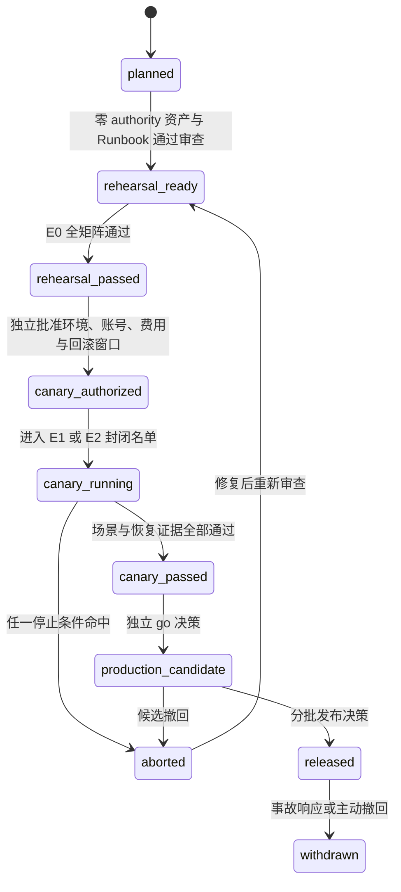
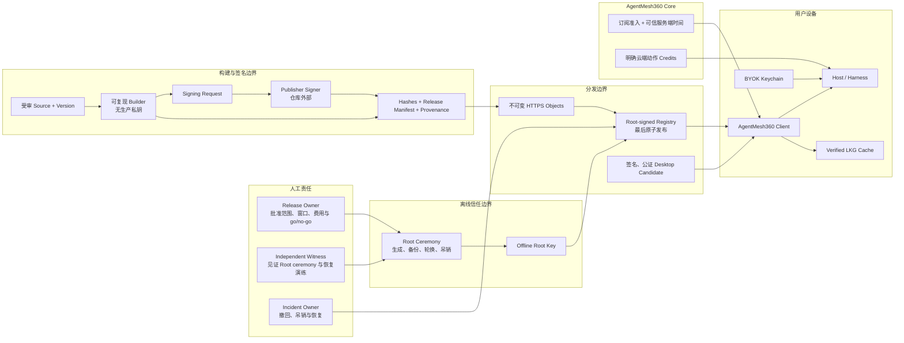
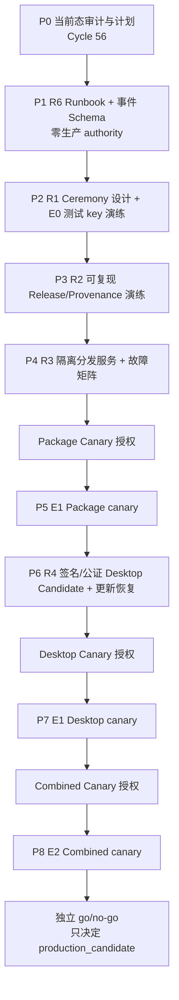

# AgentMesh360 Client 生产准备与内部 Canary 计划

状态：Cycle 56 计划、自主静态验证与本机 Kimi 独立复核已完成；尚未进入演练、
内部 canary 或生产候选

本文档把
[`PRODUCT_PLAN_AND_PRODUCTION_RELEASE_GATE.md`](PRODUCT_PLAN_AND_PRODUCTION_RELEASE_GATE.md)
中的 R1-R6 拆成可执行、可审计、可回滚的工作包。它同时覆盖两条独立发布链：

1. Agent Package 的签名、分发、动态安装与宿主 Skill 投影；
2. AgentMesh360 桌面客户端的签名、公证、升级、登录启动与卸载。

本文不是发布授权，也不是 canary 通过报告。本轮没有生成任何 Root/Publisher key，
没有配置生产或 staging endpoint，没有上传 Artifact、发布 Registry、签名或公证
桌面安装包，也没有调用 Provider、消耗 credits 或写用户真实宿主目录。

## 1. 当前基线与计划结论

### 1.1 源码与仓库事实

| 范围 | 当前源码事实 | 对计划的约束 |
| --- | --- | --- |
| 生产 Root | `TrustedRootStore::embedded()` 返回空 Store | 外部 Package 必须继续失败关闭，不能先填 endpoint |
| Publisher Trust | `EMBEDDED_PUBLISHER_TRUST_BUNDLE = None` | 必须先完成 Root ceremony、Bundle 生成与独立验签 |
| 远端 Package 元数据 | `PRODUCTION_TRUST_BUNDLE_URL = None`、`PRODUCTION_REGISTRY_URL = None` | Package Center 不能声称已有生产目录 |
| 远端拉取 | 已有 HTTPS origin 固定、无重定向、响应大小限制、可信时间、expiry、反回滚与 LKG | R3 应复用并验证现有消费者，不重造下载协议 |
| Release 工具 | H2d0-H2d4 已有确定性 Artifact、外部签名契约、Host bundles、Release Manifest、Registry 投影与消费核对 | R2 应把现有离线工具接入受控发布流程，不另建旁路格式 |
| 桌面构建 | `desktop/package.json` 只有本地 `build:mac`，输出 DMG/ZIP | 本地可构建不等于 R4 |
| 桌面签名与更新 | 没有仓库自有 Developer ID/公证配置、自动更新客户端或发布工作流；仓库没有 `.github/workflows` | 必须先设计凭据边界与可恢复更新链，不能把手工 DMG 当正式分发 |
| 登录启动 | 已有 packaged app Login Item 源码，开发模式拒绝真实写入 | 必须在签名、公证安装包上验证注册、批准、禁用与升级 |
| 退出 | `before-quit` 会发起 Controller shutdown，但当前不是“等待 Host 完整退出后再结束”的发布级证据 | R4/R5 必须验证受控 shutdown、强退恢复和卸载清理 |
| 订阅与 BYOK | Core、Host、桌面硬门禁已完成；BYOK 是默认推理模式 | canary 必须使用专用内部账号、有效订阅和专用测试 Key，并单独批准费用上限 |

结论：

- R0 继续是“已满足（开发验证）”，不代替生产发布门；
- R1-R6 仍未满足；
- 当前只允许完成零生产 authority 的准备工作；
- 真正的内部 canary 不是下一条命令，而是 R1-R4/R6 相应前置证据通过后的受控阶段；
- Package 与桌面可以分别形成 canary 证据，合并开放必须再通过共同 canary。

### 1.2 三种不能混写的 canary

| 名称 | 运行对象 | 进入条件 | 能关闭的证据 |
| --- | --- | --- | --- |
| Package canary | 受签 Package、Registry、安装/权限/rollback | R0、R1、R2、R3、R6 的相应前置项已通过 | R5 的 Package 子集 |
| Desktop canary | 签名、公证的桌面候选及升级链 | R0、R4、R6 的相应前置项已通过 | R5 的 Desktop 子集 |
| Combined canary | 正式候选桌面消费正式候选 Package，并执行真实订阅 + BYOK | R0-R4 与 R6 前置项均已通过 | R5 共同项；只产生“生产候选”资格 |

某一条 canary 通过不能替代另一条。Combined canary 通过也不自动代表公开发布，
还必须由发布负责人根据完整证据作出独立 go/no-go 决定。

## 2. 环境与状态模型

### 2.1 四级环境

| 级别 | 环境 | 信任与外部影响 | 允许的动作 | 禁止的声称 |
| --- | --- | --- | --- | --- |
| E0 | 本地确定性演练 | 临时测试 key、loopback/离线 URL、临时目录 | 构建、签名格式演练、故障注入、可复现比较 | staging、canary、生产 |
| E1 | 隔离内部 staging | 独立非生产 Root、隔离 HTTPS origin、专用内部账号与 BYOK | 端到端分发、安装、恢复与有限费用测试 | 生产信任、生产 canary |
| E2 | 封闭生产候选 | 生产 authority、生产候选 endpoint、明确内部名单 | Package/Desktop/Combined canary 与 rollback 演练 | 对外发布、普遍可用 |
| E3 | 正式生产 | 经批准的公开 cohort | 分批扩大范围、监控与事故响应 | 未经批准的全量开放 |

E0 成功只说明工具链可演练；E1 成功只说明隔离环境链路成立；E2 canary 通过只说明
候选具备进入发布决策的资格。任一环境的证据都不能自动升级为下一环境。

### 2.2 发布状态机



状态必须写入发布证据摘要，不能仅靠聊天记录推断。`rehearsal_passed`、
`canary_passed`、`production_candidate` 和 `released` 是四个不同事实。

## 3. Authority 与信任架构



固定边界：

1. Root 私钥不进入仓库、客户端、普通 CI、桌面构建机、日志或证据包；
2. Builder 只产生非秘密 signing request，不能持有生产 Publisher 私钥；
3. Publisher Signer 不能修改 Artifact、Manifest、版本或摘要；
4. Registry 必须最后发布，只能引用已存在的不可变内容；
5. 客户端只消费内置/已审核 Root 下的受签文档，调用方不能注入 URL、digest、
   Root、Publisher 或“已批准”布尔值；
6. Core 只负责订阅准入、可信时间与明确的云端 credits 动作；BYOK Key 只留在用户
   设备安全存储，Package 服务不能读取；
7. 生产 Root ceremony、生产 endpoint、Publisher 签名、公证、canary 费用和 cohort
   扩大分别需要独立批准，不能由一次笼统“发布”授权覆盖。

## 4. R1-R6 进入门与退出证据

### R1：Root 与 Publisher authority

进入前：

- 指定 Release Owner、独立见证人和 Incident Owner；
- 固定 key ID、algorithm、有效期、备份介质、保管位置和访问记录格式；
- 先在 E0 使用测试 key 演练完整 ceremony，不接触生产常量。

必须产出：

- 经双人核对的 ceremony Runbook 与逐步 receipt；
- Root public document、首个 Publisher Bundle 及 canonical 签名载荷摘要；
- active、retired、revoked 三态和 sequence 单调递增规则；
- Root/Publisher 轮换、丢失、泄漏、过期与紧急吊销演练结果；
- 私钥未进入仓库、日志、客户端、普通 CI 和证据摘要的检查记录。

退出判定：

- 独立实现或独立工具能复验签名和 canonical payload；
- 旧 sequence、同 sequence 不同文档、未知 Root、过期 Bundle、被吊销 Publisher
  全部失败关闭；
- 生产私钥恢复与销毁流程已有负责人、操作窗口和明确停止条件。

### R2：Release provenance

进入前：

- R1 的 Publisher authority 可用；
- 固定源码 commit、版本、构建工具链和依赖锁文件；
- H2d0-H2d4 的 Schema/工具版本已冻结为本次候选输入。

必须产出：

- 相同输入至少两次隔离构建的逐字节一致性；
- Artifact、file manifest、Envelope、Host projection、每个 Host bundle、
  Release Manifest 和 Registry record 的完整 SHA-256 绑定；
- signing request、外部签名 result 和 finalize receipt；
- 源 commit、构建机/工具版本、锁文件摘要和执行者；
- 三个首方 Agent 以及一个不在内置 Catalog 的动态 Agent 的同源双渠道核对。

退出判定：

- 任一文件、版本、Publisher、Host 集合、入口或摘要改变都会失败；
- Website/Host Skill 与 Client projection 指向同一个 Release reference；
- 证据能从发布候选反向追到源码和签名 receipt，但不含私钥、Token、本机敏感路径或
  用户内容。

### R3：分发服务

进入前：

- R1/R2 已通过；
- 固定 production-equivalent origin、TLS、对象命名、缓存与原子发布策略；
- 明确服务 owner、访问权限和撤回方式。

必须产出：

- 不可变 Artifact/Envelope/Release/Host bundles 的上传 receipt；
- Trust Bundle 与 Registry 的 bounded response、正确 content type、禁止 redirect、
  无 credentials/query/fragment 的验证；
- “先上传全部内容，最后原子发布 Registry”的可复核顺序；
- 404、超时、截断、超限、错误 MIME、坏摘要、坏签名、过期、回退与 equivocation
  的故障注入；
- LKG 仍有效时的可用性，以及 LKG 无效/过期时的失败关闭。

退出判定：

- 半发布内容不会被客户端发现；
- 已发布版本内容不可原地替换；
- Registry 撤回不会删除已有本地用户数据，也不会静默降级到不受信版本；
- 服务日志与对象元数据不含用户账号、BYOK、Prompt、响应或本机路径。

### R4：桌面正式分发

进入前：

- 固定桌面版本、bundle ID、构建输入和发布渠道；
- Developer ID、notarization 凭据与权限边界获得单独批准；
- 自动更新、失败恢复和卸载策略通过审查。

必须产出：

- 从固定 commit 产生的签名、公证 DMG/ZIP 和摘要；
- 首次安装、系统验证、打开、二次打开与签名完整性；
- macOS Login Item 注册、系统批准、关闭、重新开启和升级后的状态；
- 有窗口、无窗口后台启动、第二实例唤醒、Host 崩溃与 App 重启恢复；
- 正常退出、强制退出、升级、卸载时的 Host 与 Login Item 清理；
- 自动更新检查、下载、验证、安装、重启和失败回滚；更新链不得接受未签名版本。

退出判定：

- 干净受支持 macOS 环境完成安装、升级、rollback 与卸载矩阵；
- 应用退出不会留下失控 Host，意外崩溃又能恢复固定 Main Session；
- 更新失败保留可启动的最后良好桌面版本和用户状态；
- 执行时以 Apple 官方当时要求为准，不在本计划中硬编码可能过期的公证细节。

### R5：灰度与恢复

R5 是 canary 的退出门，不是 canary 准备的循环前置条件。进入某条 canary 时，
该发布链的 R1-R4 相应项和共同 R6 前置项必须已经通过。

必须产出：

- 明确的内部账号、设备、操作人、时间窗、版本和 cohort；
- 真实有效订阅与专用 BYOK；每个 Provider 的模型、请求次数/费用上限和停止开关；
- Package 安装、权限不变、权限扩张拒绝/批准、更新、rollback、reconcile；
- Root/Publisher 轮换和吊销、Registry 撤回/回滚、LKG 恢复；
- Desktop 安装、Login Item、Host 恢复、自动更新、受控 shutdown 与卸载；
- Combined canary 中固定 Main Session、对话/项目/产物/计划恢复，以及 Package
  更新前后身份不变；
- 每项失败后的恢复时长、数据完整性和下一次重试是否安全。

退出判定：

- 所有必测场景通过，所有停止条件均未触发；
- rollback 已实际演练，不是只存在命令或文档；
- 没有重复执行不可逆 mutation，没有静默 Provider fallback，没有突破费用上限；
- canary 结束后专用凭据已轮换或撤销，临时数据与日志按 Runbook 处理；
- Release Owner 和 Incident Owner 共同签署 `canary_passed`，但不自动发布。

### R6：可观测与事故响应

R6 的 Runbook 和最小事件 Schema 必须在任何真实 authority 或外部服务启用前完成。

允许记录的最小字段：

- `releaseId`、公开版本、package/agent ID；
- `environment`、`stage`、`gate`、`eventType`、`outcome`；
- 固定错误码、UTC 时间、构建/Registry revision；
- 内部 canary 的非个人化设备别名和操作 receipt ID。

禁止记录：

- API Key、Access/Refresh Token、Authorization、Cookie、签名私钥；
- Prompt、模型响应、Tool 输入输出、用户文件内容；
- 电子邮件、真实账户 ID、本机绝对路径；
- 完整下载 URL、query、Header、Registry/Trust 原文或签名原文。

必须产出：

- 版本撤回、Publisher/Root 吊销、Registry 冻结和客户端最低版本 Runbook；
- 严重级别、响应人、通知路径、停止发布和恢复发布的批准边界；
- 观测缺失、事件重复、时钟异常与存储不可用时的失败策略；
- 一次完整 tabletop 和一次 E1/E2 技术演练；
- 对外状态说明模板与内部证据摘要模板。

退出判定：

- 任一发布候选可以被定位、撤回和阻止继续扩大 cohort；
- 事件中不含秘密或用户内容，且能区分 planned/rehearsal/canary/released；
- “最低版本”不会把无法安全更新的客户端永久锁死，恢复安装路径已验证。

## 5. Canary 场景矩阵

### 5.1 准入与 Provider

| 场景 | 预期结果 |
| --- | --- |
| 订阅有效 | 进入工作区，Core 与 Host 结论一致 |
| 订阅过期/暂停 | 立即回到订阅拦截，Agent/Package/Provider 动作失败关闭 |
| 账户切换 | 旧账户 Agent、Session、Package、Provider 不可见 |
| BYOK 正常 | 只使用明确选择的 Provider/模型 |
| Provider 401/403 | 不重试泄漏凭据，不静默切换 Provider |
| Provider 429/5xx/超时/离线 | 给出固定安全错误；可重试动作由用户明确发起 |
| 模型能力不匹配 | 调用前失败，不猜测支持 |
| 请求或费用达到上限 | 停止本轮 canary，不自动追加额度 |

### 5.2 Package

| 场景 | 预期结果 |
| --- | --- |
| 新 Agent 安装 | 签名、Release、权限和当前账户全部验证后原子激活 |
| 同权限更新 | 保持固定产品身份与 Main Session |
| 权限扩张拒绝 | 保留旧版本，无半安装状态 |
| 权限扩张批准 | 仅应用本次精确 plan，不接受 Renderer 注入权限 |
| Artifact/Envelope/Release 任一篡改 | 下载或安装前失败 |
| Registry revision 回退/同 revision 异文 | 拒绝新响应，只有有效 LKG 可继续 |
| Trust Bundle 过期/Publisher 吊销 | 新安装/更新失败关闭，已有用户数据不删除 |
| 安装中断 | 重启后 reconcile 到旧 active 或完整新版本 |
| rollback | 回到已验证旧版本，审计与 Agent 状态一致 |
| Host Skill 投影 | 与 Client Release reference、版本和摘要完全一致 |

### 5.3 Desktop 与持久 Agent

| 场景 | 预期结果 |
| --- | --- |
| 首次签名安装 | 系统验证通过，应用可启动 |
| Login Item 未批准 | UI 明确状态，前台仍可用，不伪装已后台恢复 |
| Login Item 已批准 | 无窗口启动 Host，不创建多份 Leader |
| 关闭窗口 | Agent/Host 继续按产品策略运行，可随时重新打开 |
| 正常退出 | 受控停止 Host，不留下失控进程 |
| Electron/Host 强退 | 恢复后固定 Main Session 与账户隔离不变 |
| 自动更新成功 | 新版本恢复 Agent、Session、Provider Binding 与 Package 状态 |
| 自动更新失败 | 旧版本仍可启动，不损坏用户状态 |
| 卸载 | 按明确策略清理 Login Item/Host；用户数据保留或删除必须由产品策略明确 |
| 离线重启 | 不伪造订阅新鲜度；不可验证动作失败关闭 |

## 6. 停止条件、成功标准与回滚

### 6.1 立即停止

命中任一项即把本轮状态设为 `aborted`，停止 cohort 扩大：

- 签名、Root、Publisher、Release 或 Registry 验证可被绕过；
- 跨账户看到或执行其他账户的 Agent、Session、Provider、Package 或 Artifact；
- 日志、Renderer、证据包或崩溃报告出现秘密、Prompt/响应、用户内容或本机敏感路径；
- 同一个未知结果 mutation 被自动重试，造成重复安装、扣费、批准或状态变更；
- Provider 被静默切换，或请求/费用突破批准上限；
- Package/Desktop rollback 失败，或最后良好版本无法启动；
- 自动更新接受未签名/不匹配候选；
- Root/Publisher 吊销后仍可安装该 key 签名的新内容；
- 无法确认当前 cohort、版本、Registry revision 或事故负责人。

### 6.2 通过标准

- 适用场景 100% 有可复核结果，安全停止条件为零；
- 所有失败注入都产生预期的失败关闭或有效 LKG，而不是不确定状态；
- rollback、撤回、吊销和恢复均实际执行；
- 用户持久状态在正常升级、失败升级和 Host 恢复后保持一致；
- 可观测记录足以定位 release/stage/outcome，但不含秘密或用户内容；
- 主 Agent 自主验证与本机 Kimi 独立复核都达到 Blocker/High/Medium/Low 全零；
- Release Owner 只根据本轮证据批准下一状态，不沿用旧聊天中的笼统授权。

回滚目标时限、允许的数据恢复点和可接受的短时不可用窗口，必须在每次 canary 授权卡
中填写；本计划不凭空设定未经业务负责人确认的数字。

## 7. 工作包与固定顺序



| 工作包 | 交付物 | 是否需要新授权 |
| --- | --- | --- |
| P0 当前态审计与计划 | 本文、蓝图/发布门/进展同步、文档验证、Kimi 四级清零 | 本轮已授权继续开发；不含外部动作 |
| P1 R6 基线 | Runbook、最小事件 Schema、证据模板、静态 secret/content 检查 | 不创建外部资源时可作为独立代码/文档切片；实施前仍需复核 |
| P2 R1 E0 | ceremony 工具/清单、临时测试 key、轮换/吊销演练 | 生成测试 key 前单独确认范围；生产 key 另行批准 |
| P3 R2 E0 | 固定 commit 的双构建、provenance、外部测试签名与复验 | 不得使用生产 Publisher key |
| P4 R3 E1 | 隔离 origin、对象存储/Registry、故障注入和清理 | 需要创建外部资源与 staging 凭据授权 |
| P5 Package canary | 专用内部账号、BYOK 预算、安装/权限/rollback/rotation | 需要真实订阅、Provider 请求/费用和 cohort 授权 |
| P6 R4 | Developer ID、公证、自动更新、签名安装恢复矩阵 | 需要 Apple 凭据、签名/公证和分发渠道授权 |
| P7 Desktop canary | 内部设备安装/升级/Login Item/shutdown/卸载 | 需要设备/cohort 与更新窗口授权 |
| P8 Combined canary | 正式候选桌面 + Package + 订阅 + BYOK 全链恢复 | 需要生产候选 authority、费用与 cohort 授权 |

P0 完成后不能跳到 P4-P8。P1 是下一项最小可执行切片，但其实现、测试、Kimi 复核和
提交必须作为新的开发循环单独关闭。

## 8. 明确批准卡

每次批准只对卡片中精确范围有效：

```text
Action:
Environment: E0 / E1 / E2 / E3
Release/Package/Desktop version:
External resources:
Credentials involved:
Provider and model:
Maximum requests / credits / currency cost:
Canary accounts/devices/cohort:
Start and stop window:
Rollback target:
Abort owner:
Evidence retention location:
Approved by / approved at:
```

至少需要独立卡片：

1. 测试 key ceremony；
2. 生产 Root/Publisher key ceremony；
3. 创建隔离 staging 服务与凭据；
4. 使用真实订阅和 BYOK 执行 Package canary；
5. Developer ID 签名与公证；
6. 发布或撤回候选 Registry；
7. Desktop/Combined canary；
8. 从 `production_candidate` 扩大到任何外部 cohort。

旧 Provider 测试授权、免费额度授权、GitHub 推送授权或“继续开发”都不能替代这些卡片。

## 9. 证据与秘密处理

建议的非秘密证据索引：

```text
release-evidence/<release-id>/
  00-scope-and-approval.md
  01-source-and-build.json
  02-signing-receipts.json
  03-distribution-checks.json
  04-canary-scenarios.json
  05-rollback-and-recovery.json
  06-kimi-independent-review.md
  07-go-no-go.md
```

这里描述的是结构，不在 Cycle 56 创建真实证据目录。生产原始 receipt、凭据位置、
完整日志和可能含内部身份的信息应放在受访问控制的发布系统；仓库只保存经过脱敏的
摘要、Schema、Runbook 和可公开复验的 digest。

每轮完成前至少检查：

- 仓库、Git 历史、diff、日志、截图、`/tmp` 和构建产物中没有秘密；
- 证据没有 Prompt、响应、用户文件、电子邮件、账户 ID 或绝对本机路径；
- `target/` 不留在仓库根，临时构建目录按本轮约定清理；
- 明确记录哪些测试由主 Agent 执行、哪些由 Kimi 独立执行、哪些未执行；
- 本地通过、提交、推送、staging、canary、production candidate 与正式发布分别陈述。

## 10. Cycle 56 验收与非目标

本轮验收：

- 计划与当前源码关闭态、R1-R6 和原产品顺序一致；
- 两条发布链、三种 canary、四级环境和状态机不混淆；
- 每个门都有进入条件、证据、退出判定和停止条件；
- 明确下一切片是 P1，而不是 key、endpoint、签名、公证、上传或 canary；
- 文档相对链接、Markdown、Mermaid 文本与 `git diff --check` 通过；
- Kimi 独立核对源码事实、发布边界和计划完整性，四级问题全部清零；
- 更新产品蓝图、发布门和项目进展后提交并推送 `main`。

本轮自主验证已确认五份文档相对链接全部存在、`git diff --check` 通过、生产四个
关闭常量仍为空、仓库根 `target/` 不存在。Kimi session
`session_858d2a9f-0fcb-4333-93ee-184a41399e9d` 只读核对完整 diff、新计划、相关
源码、R1-R6、三种 canary、P0-P8、相对链接与 Markdown/Mermaid 文本；没有读取
Keychain、调用 Provider、运行构建或创建 `target`。最终
Blocker/High/Medium/Low 全部为零并给出 PASS。

本轮非目标：

- 不实现新的 Agent、Provider、Scheduler、Subagent 或 Agent 专属 UI；
- 不修改 Package/Provider/Desktop 运行时代码；
- 不创建 CI/CD、对象存储、DNS、证书或云端服务；
- 不生成任何测试或生产签名 key；
- 不调用真实 Provider，不消耗 credits 或费用；
- 不构建、签名、公证、上传、安装或发布桌面/Package 候选；
- 不把计划完成写成 rehearsal、canary 或生产完成。
