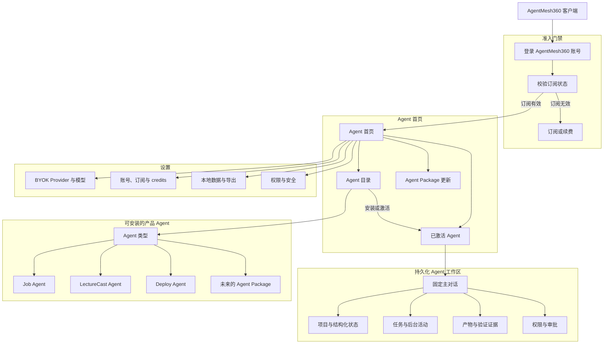
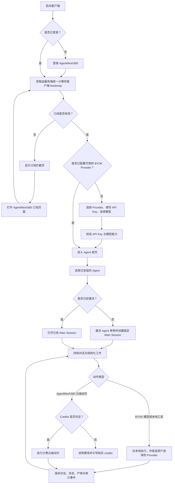
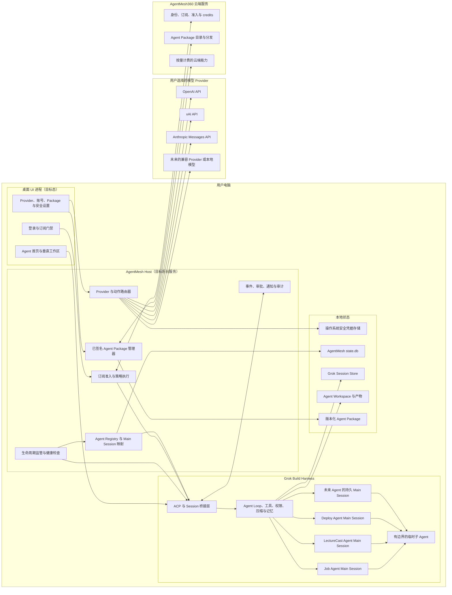
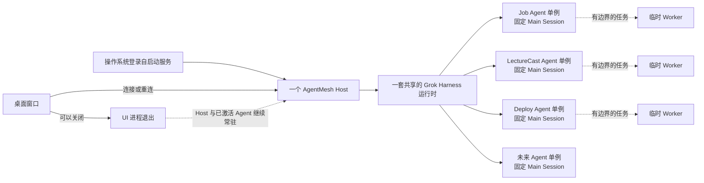
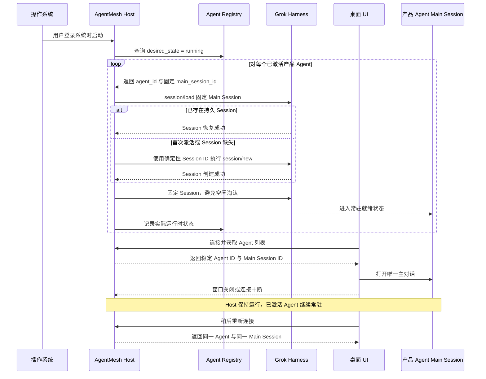
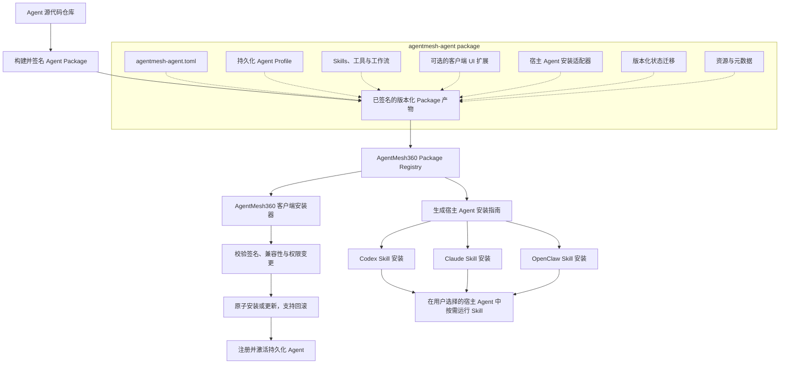
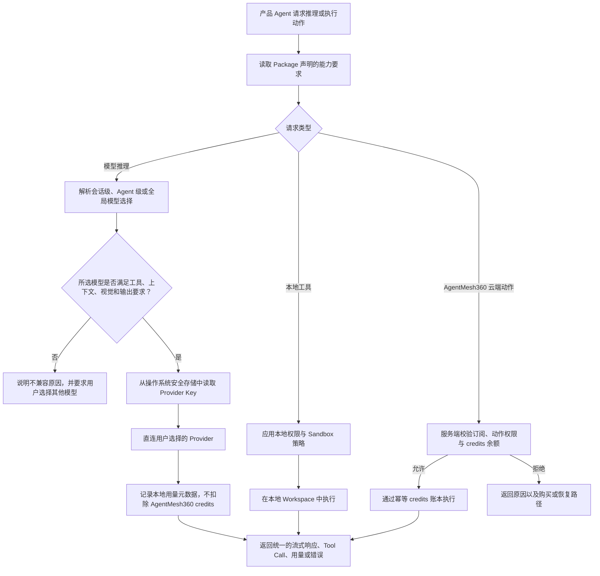
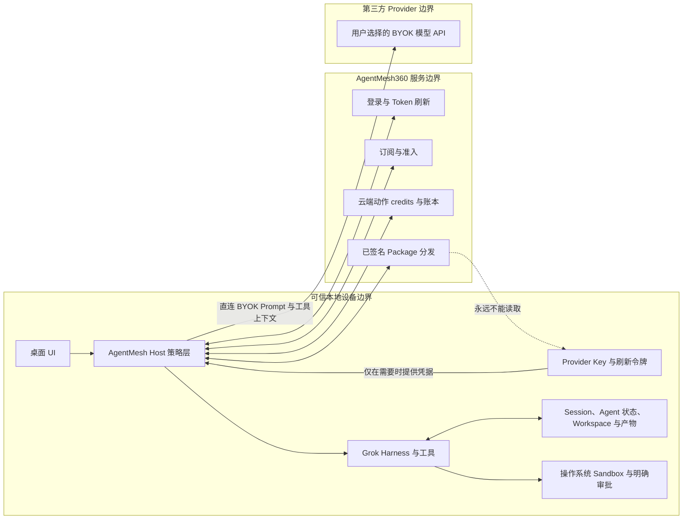

# AgentMesh360 Client 产品蓝图

状态：目标架构，持久化基础能力已实现
建立日期：2026-07-22

本文档是 AgentMesh360 桌面客户端在产品与工程层面的共同地图。它描述的是
完整目标产品，而不只是第一阶段的 Rust 实现。标记为**已实现**的能力已经存在
于当前 Fork 分支中；标记为**目标**的能力是仍待实现的设计约束。

为避免翻译造成工程歧义，文档保留以下产品与技术术语：Agent、Main Session、
Host、Harness、BYOK、Provider、Agent Package、ACP。

## 已确定的产品决策

- AgentMesh360 订阅是进入客户端的硬门槛。用户登录后，如果订阅无效、已过期
  或被暂停，只能看到账号与订阅引导页面，不能进入 Agent 工作区。
- BYOK 是默认推理模式。用户明确选择模型 Provider，并自行承担 Provider 侧的
  模型费用。首批目标是 OpenAI、xAI 和 Anthropic；Claude Opus 使用 Anthropic
  API Key。
- BYOK 模型调用不消耗 AgentMesh360 credits。Credits 只用于明确标识的
  AgentMesh360 云端动作。
- Job Agent、LectureCast Agent、Deploy Agent 以及未来的产品 Agent，都是单例、
  持久化的产品身份。每个已激活 Agent 只有一个固定 Main Session；它会持续常驻，
  并在系统重启后恢复。
- 所有产品 Agent 共享一套受监管的 Grok Build Harness，而不是分别运行完整
  运行时的副本。Grok 子 Agent 只承担有边界的临时任务。
- 未来以 Agent Package 作为桌面客户端安装和宿主 Agent Skill 安装的唯一来源。
  新增产品 Agent 不应要求发布新版客户端。

## 1. 产品结构图



订阅拦截页属于最小登录外壳，不属于客户端工作区。历史数据可以继续保留在本地，
但订阅无效时，用户不能进入用于浏览或运行这些数据的客户端界面。

## 2. 核心功能流程图



客户端 bootstrap 必须是服务端给出的单一准入结论。客户端不能自行组合订阅日期、
credits 余额和产品标记来推断用户是否有权进入。

当前已经落地 Core `GET /v1/account/client-bootstrap` 与 Host
`x.agentmesh360/account/bootstrap`。Host 在准入成功前不会恢复持久 Agent，并在产品
Main Session 的创建、加载、Prompt 和携带 Session ID 的扩展调用入口重复校验。
JWT 仅用于内存中的 HTTPS 请求，不写入 Registry 或对话。桌面登录、Refresh Token、
Keychain、定时 / 唤醒重验和订阅拦截页面仍由后续桌面外壳切片实现。

## 3. 技术架构图



### 职责边界

| 层级 | 负责 | 不应负责 |
| --- | --- | --- |
| 桌面 UI | 导航、对话、垂直业务界面、设置、审批 | 密钥、权威准入结论或 Agent 生命周期真相 |
| AgentMesh Host | 订阅执行、生命周期、Registry、Package、路由与安全策略 | 写死在 Host 二进制中的模型专属产品行为 |
| Grok Harness | Agent Loop、Session、工具、记忆、压缩与临时 Worker | AgentMesh 订阅和 Package 商业策略 |
| 产品 Agent Package | 身份、Prompt/Profile、Skills、UI 扩展、能力声明与迁移 | Provider 密钥或权威定价 |
| AgentMesh360 Core | 身份、订阅、准入、credits 与云端动作账本 | BYOK 推理流量或 Provider 原始密钥 |
| 模型 Provider | BYOK 推理与 Provider 侧计费 | AgentMesh 订阅准入决策 |

## 4. 运行时与内存拓扑图



这一拓扑避免了“每个 Agent 运行一套完整 Grok 进程”造成的内存开销，同时保证
每个已激活产品 Agent 都具有持续在线的身份和固定对话。

## 5. 持久化 Agent 生命周期时序图



## 6. 动态 Agent Package 分发图

同一个 Agent Package 同时支持两种产品入口，不需要维护两套 Agent 实现。



推荐的 Package 目录结构：

```text
agentmesh-agent.toml
profile.md
skills/
tools/
ui/
adapters/
  codex/INSTALL.md
  claude/INSTALL.md
  openclaw/INSTALL.md
migrations/
assets/
```

稳定的 `agent_id` 在 Package 升级后保持不变，因此更新 Agent 行为不会重置其固定
Main Session。Package 可以声明云端动作标识与能力要求，但访问权限和 credits 成本
仍由 AgentMesh360 Core 决定。

## 7. BYOK Provider 与动作路由图



客户端不做静默 Provider 降级。切换 Provider 可能改变用户数据的发送位置，因此必须
由用户明确选择。Provider Adapter 负责统一流式输出、Tool Call、结构化输出、用量、
能力和错误，同时保留必要的 Provider 专属行为。

## 8. 信任与数据边界图



订阅、Package 签名、权限与 Sandbox 等关键策略，必须由 AgentMesh Host 和操作系统
执行。Harness Hook 可以提供可观测性与便利功能，但不能作为失败时默认放行的关键
安全边界。

## 9. 实施路线图

| 能力切片 | 状态 | 具体范围 |
| --- | --- | --- |
| 持久化产品身份 | **已实现：基础能力** | SQLite Agent Registry、确定性 Main Session、激活 ACP 方法、Session 固定、启动恢复 |
| 订阅硬门禁 | **Core + Host 基础已实现** | 已完成服务端 bootstrap、恢复门禁、产品 Session 强制校验与周期截止；待登录、Token 刷新、Keychain、定时重验、订阅界面和官网跳转 |
| BYOK Provider 层 | **下一阶段目标** | 安全凭据、OpenAI/xAI/Anthropic Adapter、能力校验、模型选择、统一流式响应与错误 |
| 动态 Agent Package | **目标** | Manifest、签名、目录、安装器、迁移、权限变更、回滚、宿主 Skill Adapter |
| 桌面产品外壳 | **目标** | Agent 首页、固定对话、垂直工作区、活动、产物、审批与设置 |
| 后台 Host | **目标** | 登录自启动、IPC/ACP 桥接、崩溃恢复、健康检查、通知、审计与离线行为 |

当前硬编码的 Job Agent、LectureCast Agent 和 Deploy Agent 目录，只是验证持久化
契约的脚手架。在迁移具体 Agent 成为常规集成路径之前，必须用动态 Agent Package
Registry 替换它。
