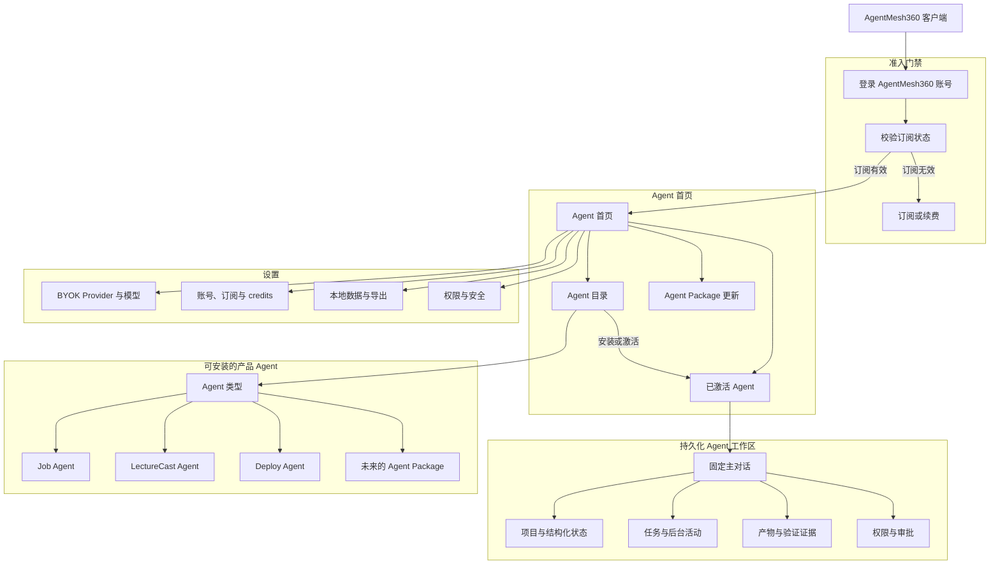
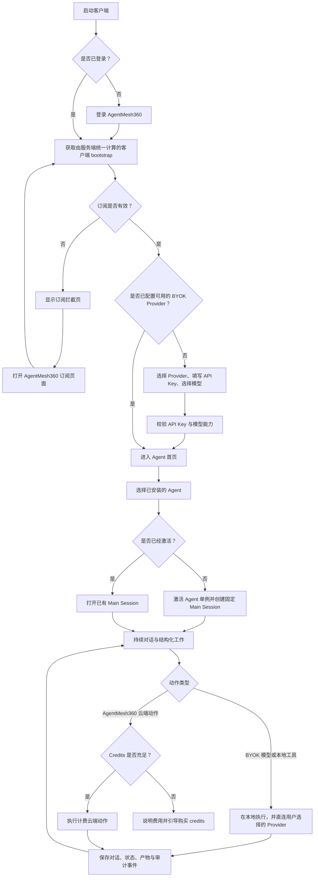
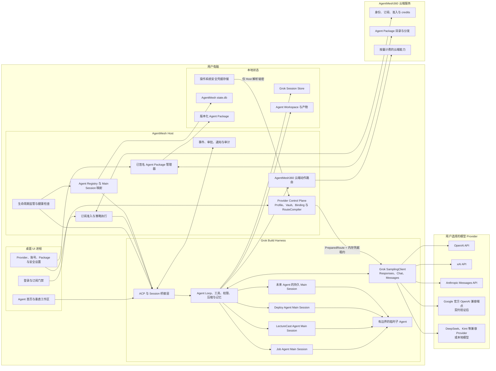
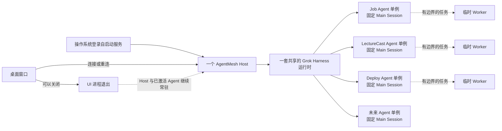
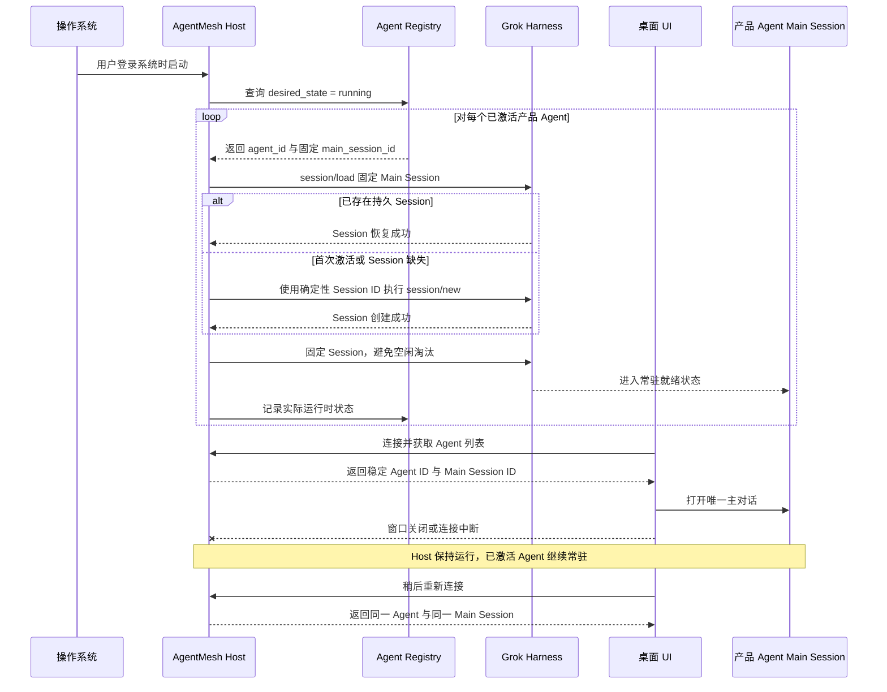
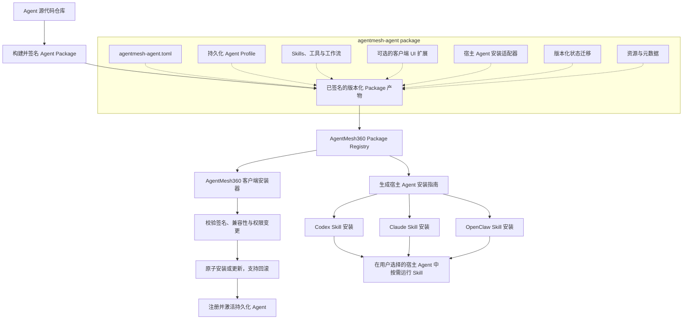
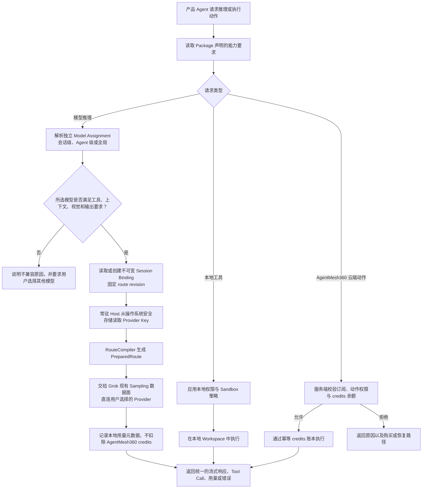
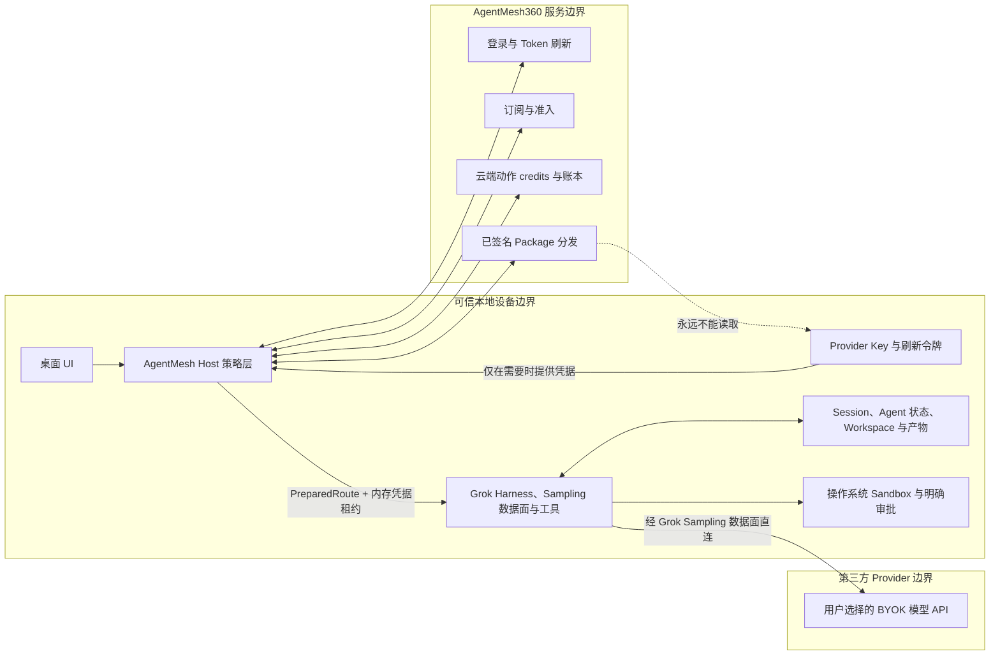

# AgentMesh360 Client 产品蓝图

状态：目标架构，桌面身份外壳与持久化基础能力已实现
建立日期：2026-07-22

本文档是 AgentMesh360 桌面客户端在产品与工程层面的共同地图。它描述的是
完整目标产品，而不只是第一阶段的 Rust 实现。标记为**已实现**的能力已经存在
于当前 Fork 分支中；标记为**目标**的能力是仍待实现的设计约束。

为避免翻译造成工程歧义，文档保留以下产品与技术术语：Agent、Main Session、
Host、Harness、BYOK、Provider、Agent Package、ACP。

Provider 覆盖、CC Switch 源码证据、配置差异和经过技术架构复核的实施顺序，详见
[`CC_SWITCH_PROVIDER_RESEARCH.md`](CC_SWITCH_PROVIDER_RESEARCH.md)。
Provider Control Plane 与 Host Vault 的已接受决策见
[`ADR_PROVIDER_CONTROL_PLANE_VAULT.md`](ADR_PROVIDER_CONTROL_PLANE_VAULT.md)。
账户隔离的产品 Agent 与不可变 Session Binding 决策见
[`ADR_ACCOUNT_SCOPED_SESSIONS_AND_BINDINGS.md`](ADR_ACCOUNT_SCOPED_SESSIONS_AND_BINDINGS.md)。
后台 Host、Leader 单实例与桌面重连决策见
[`ADR_BACKGROUND_HOST_LIFECYCLE.md`](ADR_BACKGROUND_HOST_LIFECYCLE.md)。
Agent Package v1 Schema、双投影与 H1/H2 信任边界见
[`AGENT_PACKAGE_MANIFEST_V1.md`](AGENT_PACKAGE_MANIFEST_V1.md)。
H2d0 Authoring 与 H2d1 已验签 Host Skill 导出契约分别见
[`AGENT_PACKAGE_AUTHORING_V1.md`](AGENT_PACKAGE_AUTHORING_V1.md) 和
[`AGENT_PACKAGE_HOST_SKILL_EXPORT_V1.md`](AGENT_PACKAGE_HOST_SKILL_EXPORT_V1.md)。
H2d2 跨客户端/宿主发布单元见
[`AGENT_RELEASE_MANIFEST_V1.md`](AGENT_RELEASE_MANIFEST_V1.md)。
H2d3 受签名发布索引与双渠道投影见
[`AGENT_RELEASE_REGISTRY_V2.md`](AGENT_RELEASE_REGISTRY_V2.md)。
H2d4 后的产品顺序复核与生产发布硬门见
[`PRODUCT_PLAN_AND_PRODUCTION_RELEASE_GATE.md`](PRODUCT_PLAN_AND_PRODUCTION_RELEASE_GATE.md)。
Cycle 56 的生产准备、三种内部 canary、R1-R6 证据与 P0-P8 顺序见
[`PRODUCTION_PREPARATION_AND_INTERNAL_CANARY_PLAN.md`](PRODUCTION_PREPARATION_AND_INTERNAL_CANARY_PLAN.md)。
Cycle 57 的 P1 Release Event 与事故响应基线分别见
[`RELEASE_EVENT_SCHEMA_V1.md`](RELEASE_EVENT_SCHEMA_V1.md) 和
[`../operations/RELEASE_INCIDENT_RESPONSE_RUNBOOK_V1.md`](../operations/RELEASE_INCIDENT_RESPONSE_RUNBOOK_V1.md)。
Cycle 58 的 P2 无 authority ceremony 预检见
[`../operations/KEY_CEREMONY_PREFLIGHT_V1.md`](../operations/KEY_CEREMONY_PREFLIGHT_V1.md)。
Cycle 59 的 P2 E0 测试 key 技术演练见
[`../operations/tabletops/2026-07-28-p2-key-ceremony-e0.md`](../operations/tabletops/2026-07-28-p2-key-ceremony-e0.md)。
Cycle 60 的 P3 零新 key provenance preflight 见
[`../operations/RELEASE_PROVENANCE_PREFLIGHT_V1.md`](../operations/RELEASE_PROVENANCE_PREFLIGHT_V1.md)。
当前实现证据、逐轮计划复盘和下一轮工作见
[`../PROJECT_PROGRESS.md`](../PROJECT_PROGRESS.md)。

## 已确定的产品决策

- AgentMesh360 订阅是进入客户端的硬门槛。用户登录后，如果订阅无效、已过期
  或被暂停，只能看到账号与订阅引导页面，不能进入 Agent 工作区。
- BYOK 是默认推理模式。用户明确选择模型 Provider，并自行承担 Provider 侧的
  模型费用。M1 Core 复用 Grok 已有的 OpenAI Responses、OpenAI Chat Completions
  和 Anthropic Messages 三种 Backend；OpenAI、xAI、Anthropic 及通用兼容端点先
  完成契约测试。Google Gemini 已在专项真实验证后通过官方 OpenAI 兼容端点进入
  声明式预设，Native/Interactions 能力后置。
- BYOK 模型调用不消耗 AgentMesh360 credits。Credits 只用于明确标识的
  AgentMesh360 云端动作。
- Job Agent、LectureCast Agent、Deploy Agent 以及未来的产品 Agent，都是单例、
  持久化的产品身份。每个已激活 Agent 只有一个固定 Main Session；它会持续常驻，
  并在系统重启后恢复。
- 所有产品 Agent 共享一套受监管的 Grok Build Harness，而不是分别运行完整
  运行时的副本。Grok 子 Agent 只承担有边界的临时任务。
- Agent Package v1 已成为三个内置 Agent 的桌面持久身份和宿主 Skill 元数据的
  唯一来源；未来动态安装仍需完成签名产物、安装事务和 Registry 分发。
  当新 Agent 未超出现有 Package Schema 与 Host Capability 时，不应要求发布新版
  客户端；新增可执行能力、协议或安全权限仍必须通过受审查的客户端版本发布。

## 1. 产品结构图



订阅拦截页属于最小登录外壳，不属于客户端工作区。历史数据可以继续保留在本地，
但订阅无效时，用户不能进入用于浏览或运行这些数据的客户端界面。

## 2. 核心功能流程图



客户端 bootstrap 必须是服务端给出的单一准入结论。客户端不能自行组合订阅日期、
credits 余额和产品标记来推断用户是否有权进入。

当前已经落地 Core `GET /v1/account/client-bootstrap` 与 Host
`x.agentmesh360/account/bootstrap`。Host 在准入成功前不会恢复持久 Agent，并在产品
Main Session 的创建、加载、Prompt 和携带 Session ID 的扩展调用入口重复校验。
桌面身份外壳已经实现 Google/GitHub 系统浏览器登录、邮箱密码兼容登录、Refresh Token
轮换、操作系统安全存储、启动 / 唤醒 / 窗口聚焦 / 每五分钟重验、订阅拦截页与官网续费
跳转。桌面 OAuth 采用 loopback + S256 PKCE 一次性交接；Access Token 只存在于桌面
主进程内存，并通过 HTTPS Authorization Header 传递，不会进入渲染进程、Registry、
浏览器 URL 或对话。有效订阅必须同时得到 Core 与 Host 确认，才会展示 Agent 首页。

## 3. 技术架构图



### 职责边界

| 层级 | 负责 | 不应负责 |
| --- | --- | --- |
| 桌面 UI | 导航、对话、垂直业务界面、设置、审批 | 密钥、权威准入结论或 Agent 生命周期真相 |
| AgentMesh Host | 订阅执行、生命周期、Registry、Package、路由与安全策略 | 写死在 Host 二进制中的模型专属产品行为 |
| Grok Harness | Agent Loop、Session、工具、记忆、压缩与临时 Worker | AgentMesh 订阅和 Package 商业策略 |
| 产品 Agent Package | 身份、Prompt/Profile、Skills、UI 扩展、能力声明与迁移 | Provider 密钥或权威定价 |
| AgentMesh360 Core | 身份、订阅、准入、credits 与云端动作账本 | BYOK 推理流量或 Provider 原始密钥 |
| 模型 Provider | BYOK 推理与 Provider 侧计费 | AgentMesh 订阅准入决策 |

## 4. 运行时与内存拓扑图



这一拓扑避免了“每个 Agent 运行一套完整 Grok 进程”造成的内存开销，同时保证
每个已激活产品 Agent 都具有持续在线的身份和固定对话。

## 5. 持久化 Agent 生命周期时序图



## 6. 动态 Agent Package 分发图

同一个 Agent Package 同时支持两种产品入口，不需要维护两套 Agent 实现。



目标签名产物的 Package 目录结构：

```text
agentmesh-agent.toml
runtime/
  profile.md
skills/
tools/
ui/
adapters/
  codex/SKILL.md
  claude-code/SKILL.md
  openclaw/SKILL.md
migrations/
assets/
```

H0 内置 Package 为降低迁移变量，暂时把 Profile 内联在 Manifest，并引用现有 Agent
源仓库中的 Canonical Workflow/Adapter 路径；H1 构建签名产物时再固定文件清单和
外部 Profile 的摘要规则。

稳定的 `agent_id` 在 Package 升级后保持不变，因此更新 Agent 行为不会重置其固定
Main Session。Package 可以声明云端动作标识与能力要求，但访问权限和 credits 成本
仍由 AgentMesh360 Core 决定。

## 7. BYOK Provider 与动作路由图



客户端不做静默 Provider 降级。切换 Provider 可能改变用户数据的发送位置，因此必须
由用户明确选择。Profile 或 Catalog 更新不能改变已有 Session 的 route revision。
Host Provider Control Plane 负责 Profile、Vault、能力、Assignment、Binding 与路由
编译；Grok 现有 Sampling 数据面继续负责流式输出、Tool Call、结构化输出、用量、
错误和必要的 Provider 专属行为。

## 8. 信任与数据边界图



订阅、Package 签名、权限与 Sandbox 等关键策略，必须由 AgentMesh Host 和操作系统
执行。Harness Hook 可以提供可观测性与便利功能，但不能作为失败时默认放行的关键
安全边界。

## 9. 实施路线图

| 能力切片 | 状态 | 具体范围 |
| --- | --- | --- |
| 持久化产品身份 | **已实现：账户隔离基础能力** | SQLite Agent Registry、账户级确定性 Main Session/Workspace、旧状态认领、跨账户隐藏、激活 ACP 方法、Session 固定、启动恢复 |
| 订阅硬门禁 | **Core + Host + 桌面身份外壳已实现并完成生产真实验收** | 服务端 bootstrap、Google/GitHub 系统浏览器登录、邮箱密码兼容登录、loopback + S256 PKCE 一次性交接、Refresh Token 轮换、系统安全存储、启动 / 唤醒 / 聚焦 / 定时重验、订阅拦截和官网跳转；owner Google 账号已通过 Core/Host 双 active 和新进程加密恢复 |
| BYOK Provider 层 | **切片 A/B/C/D0/D1/E1/E2/E3/F0a/F0b 已完成；P5 owner canary 已真实通过** | 已实现共享 state.db v10（v7/v8 加固本地 Package Registry，v9 增加远端签名元数据缓存，v10 增加非秘密条件请求状态）、Provider Profile/Vault、声明式 Catalog、Capability、Model Policy、三层 Model Assignment、非秘密 RouteCompiler、账户隔离产品 Agent、不可变 Session Binding、Turn Route 可信存储接口、管理 ACP、凭据诊断安全门槛、Host Credential Lease、三协议投影、actor 接收后写 Turn Route、同一 Turn 多调用复用、产品主 Prompt与全部已确认 Session 辅助消费者接入；产品 subagent 使用不可伪造的 Host-only `subagent` Authority，不继承 Grok credential/AuthManager，父→子→父本机 mock Provider E2E、专用模型/main fallback 与失败门槛均已覆盖；离线 Trace classifier 已确认不属于产品 Session 数据面；Renderer 已获得订阅门禁、输入校验、输出脱敏的 Host Provider 管理窄桥，并提供 Profile/Catalog/global-agent Assignment 设置页；E3 已加入 Host-owned 本地/元数据/最小推理 Probe、付费双重确认与非秘密历史；F0a/F0b 验证 Gemini Streaming、Function Calling、Structured Output、Reasoning 与重启 Tool Loop；P5 又用真实 owner 订阅验证 Profile/Assignment、Agent Main Turn Route、无 fallback 失败和加密重启恢复 |
| 动态 Agent Package | **H0/H1 至 H2d4 已通过自主验证与 Kimi 独立交叉测试；P1 R6 本地基线、P2 E0 与 P3 零新 key preflight 已推进** | H2d4 已在 Artifact/Envelope 前 bounded fetch Release Manifest，核对 Registry SHA、canonical strict 文档、Client/Host projection 与 H1 metadata。P1/P2 已有本地事件、ceremony 与销毁证据；P3 preflight 固定双构建、四 Agent、十类 provenance 与 signer authority 边界，但尚未执行实际双构建/测试签名。生产 Root、Publisher Bundle、endpoint、上传和发布仍关闭 |
| 桌面产品外壳 | **身份外壳、Agent 首页、Provider/Package/客户端设置，以及 Host Catalog 全部 Agent 的固定 Main Session 文本对话、恢复通路、标准 ACP 单次权限审批、安全只读工具活动、通用 Workspace Artifact/Project State、Harness 后台活动与 Session Plan 安全投影已实现；P1/P2 E0 本地安全基线已推进** | 三个首方 Agent 已通过真实 detach/Leader 替换恢复；动态 Agent 只有本地通用化 fixture，生产 Registry 仍关闭。Artifact/Project State 使用通用 Manifest 与 Renderer 白名单；后台活动和 Session Plan 分别由 TerminalBackend 与 Main Session Resources 提供 authority，均不硬编码 Agent 类型。P2 测试私钥已销毁，生产 R1 未关闭；Scheduler、Subagent、Agent 专属 UI、生产 key 与生产 authority 不自动启动 |
| 后台 Host | **持久 Leader、重连、崩溃恢复与隐藏登录启动源码已实现** | 默认采用 AgentMesh360 专属 socket/lock 的 Grok Leader；真实测试已验证 detach 后同一 PID/Main Session，以及 Leader SIGKILL 后新 PID、Refresh Token 轮换、Core/Host 双重 bootstrap 与同一 Main Session；G2 已加入无 Renderer 的系统登录启动、第二实例开窗、首次激活注册和用户设置开关；签名安装包 Login Item E2E、主进程自身守护、受控 shutdown、通知与完整审计仍是发布目标 |

Job Agent、LectureCast Agent 和 Deploy Agent 已从相同的 Manifest v1 载入，不再
分别硬编码 Registry 元数据与 Agent Profile。Host 现在会在启动时复验并合并本地
Active Package；安装成功现在会在同一 Host 的顺序门内刷新共享 Catalog，刷新失败则
保留 last-known-good 并返回脱敏 `refresh_pending`。由于生产 Trust Store、管理
ACP/UI 与发布配置仍关闭，真实用户目录当前仍只会使用三个内置 Package。H2b2c 已
通过自主测试和本机 Kimi 交叉测试；H2b2d 已补齐 rollback/恢复的一致性并通过双方
测试。H2c1 已建立订阅门禁的 Host 管理 ACP 和桌面主进程按 ID 窄 Client，并通过
自主测试和 Kimi 独立交叉测试；H2c2 Package Center 已完成账户绑定、白名单投影、
显式权限批准、未知结果不重试和生产关闭态，并通过双方测试。H2c3 已实现 Host
验签远端目录的最小公开摘要、精确 SemVer 分类和新 Agent/可用更新 UI，并通过自主
测试和 Kimi 独立交叉测试。H2d0 已加入不处理私钥的离线 Authoring：相同
Manifest/Skill 来源可复现生成客户端 Artifact、外部 signing request 和带 Artifact
摘要的宿主 Skill 投影，三个真实首方源仓库已完成构建，并通过自主验证与 Kimi
独立交叉测试。H2d1 进一步把精确 Host Skill plan 放进签名 Artifact，只接受 H1
`VerifiedStagedPackage`，并在复验 staging、Artifact/plan 双摘要、Manifest
身份/权限、Adapter 和文件 inventory 后生成确定性 `.amskill.tar.zst`。一个不在内置
Catalog 的 `future-agent` 已完成同仓动态 onboarding smoke，三个首方真实源仓库也已
通过双构建和 H1 后导出。H2d1 已通过自主验证和 Kimi 两轮独立交叉测试，最终四级
问题全零并获得无条件 PASS。H2d2 已将 H1 实际 Envelope 原文字节、
Artifact/inventory、H2d1 projection/plan 和不可伪造 Host receipt 绑定为同一个
canonical Release Manifest，缺失/重复/未知 Host、跨版本、摘要替换和顺序漂移全部
失败关闭；两轮 Kimi 审查最终同样四档全零。下一步 H2d3 让同一 Release Manifest
进入受签名发布索引并生成客户端/官网两种只读投影；生产 Trust Store、私钥仪式、
endpoint 与发布启用继续作为独立安全门。

H2d3 进一步把 H2d2 Release 纳入既有 Root 签名 Registry、可信时间、expiry、
revision 反回滚和 LKG 链；发布 binder 只接受 H2d2 `AgentReleaseBuild`，调用方只能
提供 canonical HTTPS URL，不能重填 digest。同一 record 派生 Client Artifact 与
官网/Host Skill 两个共享 Release reference 的投影。H2d3 尚未下载 Release Manifest，
这项消费侧 cross-check 属于 H2d4。H2d3 已通过自主验证和两轮 Kimi 交叉测试，首轮
唯一 unknown-Host 测试覆盖 Low 修复后最终四档全零；生产 root/bundle/endpoint、
上传和发布继续关闭。

H2d4 已把 Release Manifest 设为客户端下载的第一道网络门：1 MiB bounded fetch、
禁止 redirect、Registry SHA 与 canonical strict parse 通过后，才能消费
Artifact/Envelope；H1 结果还要回对 Release 的 file-manifest 摘要与签名 key。同一
验证器覆盖官网/Host projection 与零 Adapter，但没有创建生产官网或 Host 下载服务。
H2d4 已通过自主验证与 Kimi 独立交叉测试，最终 Blocker/High/Medium/Low 全部为零；
下一轮先复核产品计划与生产发布安全门，不自行启动 H2d5。
完整契约见
[`AGENT_RELEASE_CONSUMPTION_V1.md`](AGENT_RELEASE_CONSUMPTION_V1.md)。

2026-07-27 的循环 43-54 已依次完成固定 Main Session 文本对话、多 Agent 恢复、
标准 ACP `session/request_permission` 单次权限边界、ToolCall 安全只读活动投影，
Workspace Artifact、Project State authority 审计和通用最小只读实现，以及普通
Harness 后台活动与 Session Plan 的 authority 审计和安全最小投影。
Main 独占 Session、Request、Tool、Option 与私有 Tool Call authority，Renderer 只
得到有界安全投影；永久/未知审批选项、原始工具标题、内容、路径和输入输出均失败
关闭。Artifact 由 Host 根据当前账户 Registry 从 Workspace Manifest 逐次验证，
Renderer 只见通用 ID、标题、类别和大小；Project State 只见标题、四态摘要与固定
步骤，路径、文件内容和 mutation 仍关闭。后台活动由当前 Main Session 通知与
Host-owned 安全快照共同对账，Renderer 只见本地 ID、固定类型与四态；原始
`x.ai/task/list`、命令、cwd、输出、日志、Scheduler 和 Subagent 均未暴露或混入。
Session Plan 只从当前 Main Session Resources 的 canonical `TodoState` 读取
content/四态；ACP Plan 仅作为刷新信号，Renderer 明确区分模型计划和业务进度。
循环 50、循环 52 与循环 54 均已完成自主验证和 Kimi 独立复核，最终四级问题全零。
通用工作区增量后的 Gemini F0b 已在用户明确授权下完成双方验证和 Kimi 四级清零，
普通功能路线已走到生产准备门前。生产 Package 与桌面发布继续受独立 R0-R6
安全门约束。Cycle 56 已把生产准备拆成 P0-P8，并区分 Package、Desktop 与
Combined canary；Cycle 57 已完成零生产 authority 的 P1 R6 本地基线，Cycle 58
已完成 P2 preflight，Cycle 59 已在精确批准下完成 P2 E0 测试 key 技术执行与销毁。
这不关闭生产 R1-R6；下一步只能按序评估 P3，新的测试签名 authority、生产 key 与
P4-P8 继续关闭。Cycle 60 只完成 P3 的零新 key preflight；实际双构建/测试签名仍
等待新的精确批准。
完整结论见
[`PRODUCT_PLAN_AND_PRODUCTION_RELEASE_GATE.md`](PRODUCT_PLAN_AND_PRODUCTION_RELEASE_GATE.md)
与
[`PRODUCTION_PREPARATION_AND_INTERNAL_CANARY_PLAN.md`](PRODUCTION_PREPARATION_AND_INTERNAL_CANARY_PLAN.md)。
