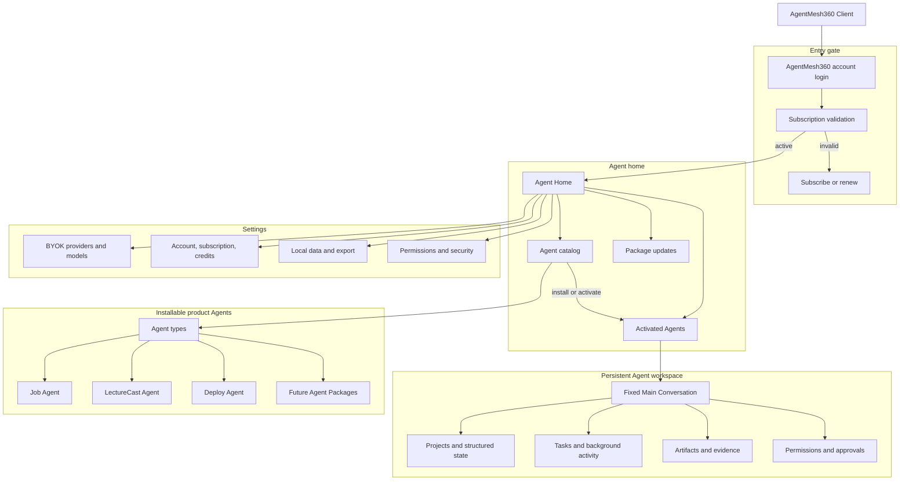
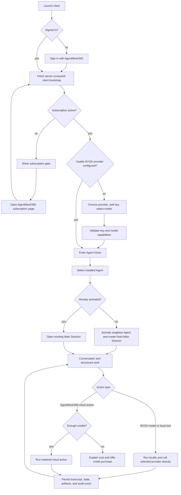
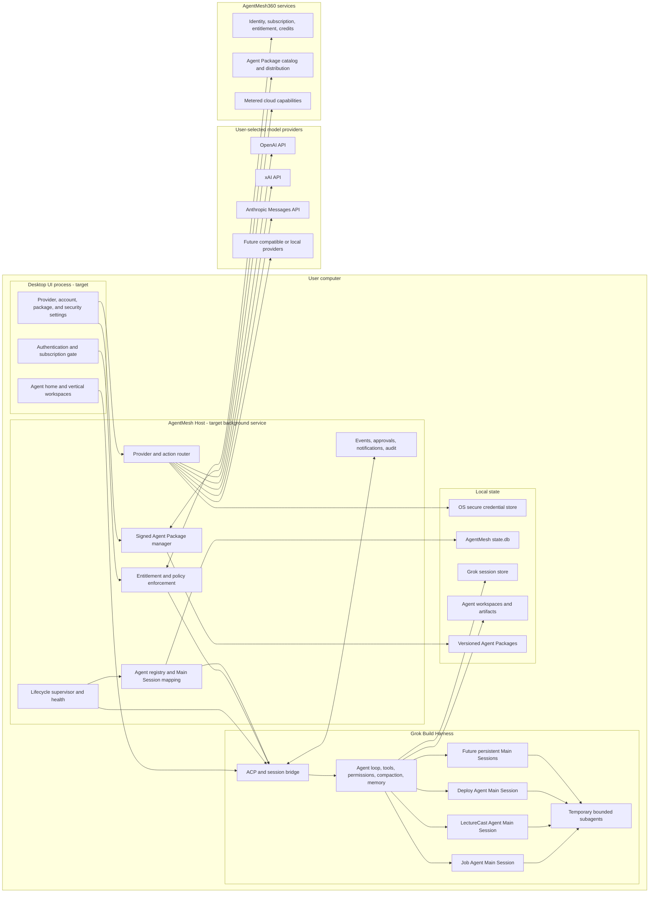
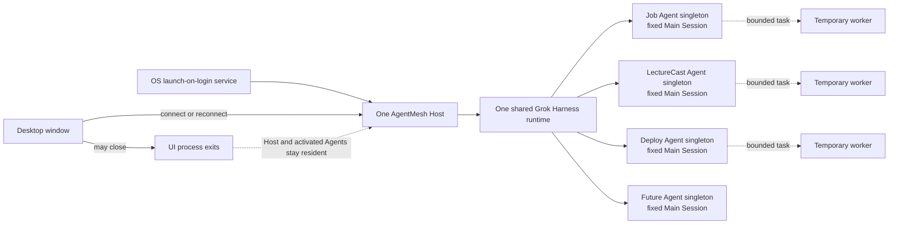
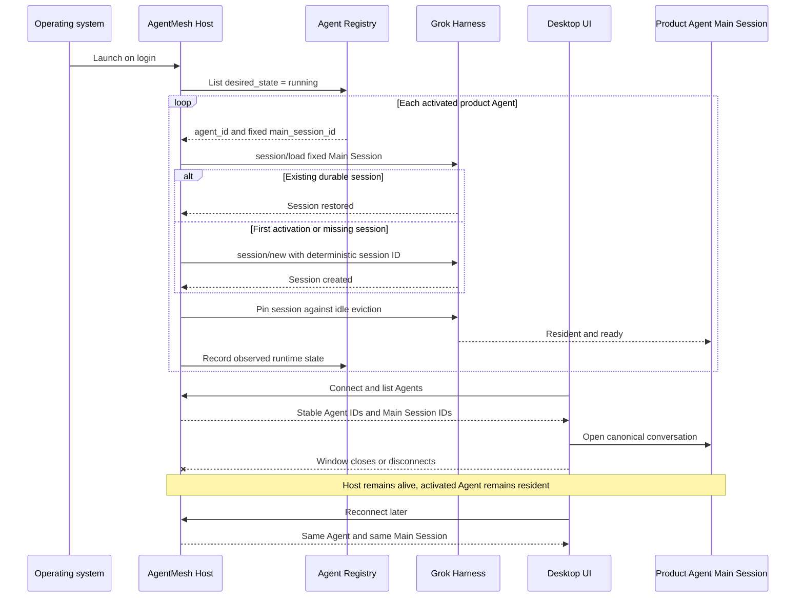
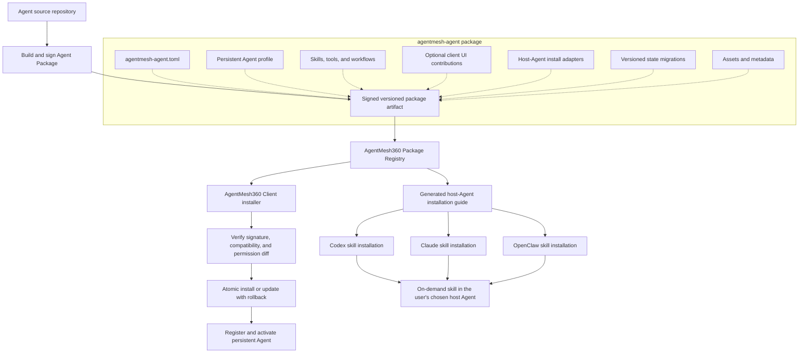
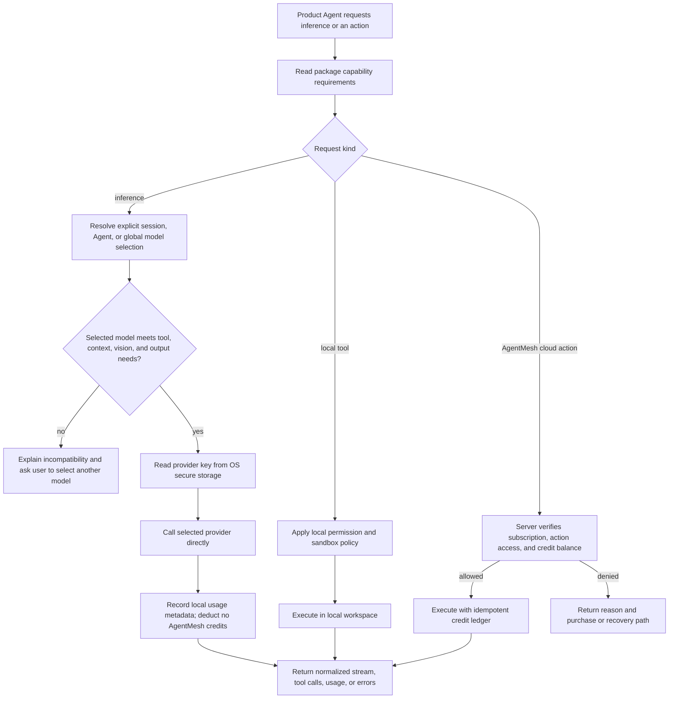
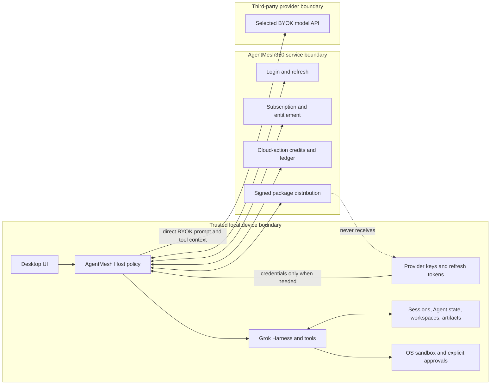

# AgentMesh360 Client Product Blueprint

Status: target architecture with an implemented persistence foundation
Established: 2026-07-22

This document is the shared product and engineering map for the AgentMesh360
desktop client. It describes the target product, not just the first Rust
implementation slice. Boxes marked **implemented** exist in the current fork;
boxes marked **target** are design commitments that still need implementation.

## Fixed product decisions

- The AgentMesh360 subscription is a hard client-entry gate. A signed-in user
  with an invalid, expired, or suspended subscription can only see the account
  and subscription gate; they cannot enter the Agent workspace.
- BYOK is the default inference mode. Users explicitly select and pay their
  model provider. Initial targets are OpenAI, xAI, and Anthropic; Claude Opus is
  selected with an Anthropic API key.
- BYOK model calls do not consume AgentMesh360 credits. Credits apply only to
  clearly identified AgentMesh360 cloud actions.
- Job Agent, LectureCast Agent, Deploy Agent, and future product agents are
  singleton persistent product identities. Each activated Agent has one fixed
  Main Session that remains resident and is restored after restart.
- Product Agents share one supervised Grok Build Harness. They are not separate
  copies of the complete runtime. Bounded Grok subagents remain temporary task
  workers.
- A future Agent Package is the single source for both desktop installation and
  host-Agent skill installation. Adding a product Agent must not require a new
  client release.

## 1. Product structure



The paywall is part of the minimum authentication shell, not the client
workspace. Local history may remain on disk, but an invalid subscription does
not unlock the UI used to browse or run it.

## 2. Core functional flow



The bootstrap response must be a single server decision. The client must not
infer access by independently combining subscription dates, balances, and
product flags.

## 3. Technical architecture



### Ownership boundaries

| Layer | Owns | Must not own |
| --- | --- | --- |
| Desktop UI | Navigation, conversations, vertical views, setup, approvals | Secrets, authoritative entitlement, or Agent lifecycle truth |
| AgentMesh Host | Subscription enforcement, lifecycle, registry, packages, routing, security policy | Model-specific product behavior embedded in the host binary |
| Grok Harness | Agent loop, sessions, tools, memory, compaction, workers | AgentMesh subscription and package-commerce policy |
| Product Agent Package | Identity, prompt/profile, skills, UI contributions, capabilities, migrations | Provider secrets or authoritative pricing |
| AgentMesh360 Core | Identity, subscription, entitlement, credits, cloud-action ledger | BYOK inference traffic or raw provider keys |
| Model provider | BYOK inference and provider billing | AgentMesh subscription decisions |

## 4. Runtime and memory topology



This topology prevents the memory cost of running one complete Grok process per
Agent while preserving a continuously available identity and conversation for
each activated product Agent.

## 5. Persistent Agent lifecycle



## 6. Dynamic Agent Package distribution

One package supports two product entry points without maintaining two Agent
implementations.



Recommended package layout:

```text
agentmesh-agent.toml
profile.md
skills/
tools/
ui/
adapters/
  codex/INSTALL.md
  claude/INSTALL.md
  openclaw/INSTALL.md
migrations/
assets/
```

The stable `agent_id` survives package upgrades, so an update changes behavior
without resetting the Agent's fixed Main Session. The package may declare cloud
action identifiers and required capabilities, but AgentMesh360 Core remains the
authority for access and credit cost.

## 7. BYOK provider and action routing



There is no silent provider fallback. Changing provider can change where user
data is sent, so fallback requires an explicit user choice. Provider adapters
normalize streaming, tool calls, structured output, usage, capabilities, and
errors while preserving provider-specific behavior where needed.

## 8. Trust and data boundaries



Critical subscription, package-signature, permission, and sandbox policy must
be enforced by AgentMesh Host and the operating system. Harness hooks may add
observability and convenience, but they are not the fail-closed security
boundary.

## 9. Implementation map

| Slice | Status | Concrete scope |
| --- | --- | --- |
| Persistent product identity | **Implemented foundation** | SQLite Agent registry, deterministic Main Session, activation ACP methods, pinning, startup restoration |
| Subscription hard gate | **Target next** | Login, refresh, server bootstrap, Host enforcement, subscription UI, website handoff |
| BYOK provider layer | **Target next** | Secure credentials, OpenAI/xAI/Anthropic adapters, capability checks, model selection, normalized streams and errors |
| Dynamic Agent Packages | **Target** | Manifest, signing, catalog, installer, migrations, permission diff, rollback, host-skill adapters |
| Desktop product shell | **Target** | Agent home, fixed conversations, vertical workspaces, activity, artifacts, approvals, settings |
| Background Host | **Target** | Launch-on-login, IPC/ACP bridge, crash recovery, health, notifications, audit, offline behavior |

The current hardcoded Job, LectureCast, and Deploy catalog is scaffolding for
the persistence contract. It must be replaced by the dynamic Agent Package
registry before concrete Agent migration becomes the normal integration path.
