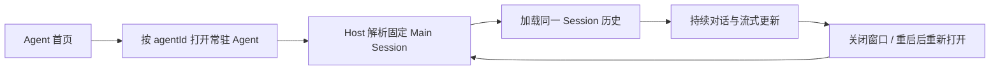
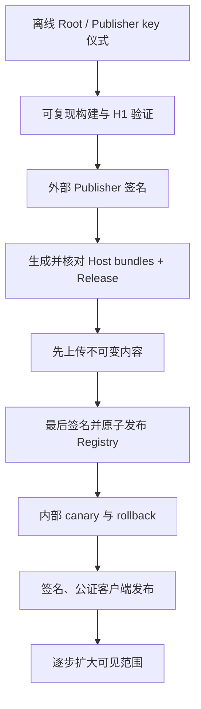

# AgentMesh360 Client 产品计划复核与生产发布安全门

状态：2026-07-28 固定 Main Session 对话、多 Agent 恢复、标准 ACP 单次权限审批、
安全只读工具活动、Workspace Artifact、通用 Project State、Harness 后台活动与
Session Plan 安全投影已完成双方验证并四级清零；Gemini F0b 也已完成自主验证与
本机 Kimi 四级清零；Cycle 56 已形成生产准备与内部 canary 的分层计划，Cycle 57
已关闭 P1 R6 本地基线，Cycle 58 已关闭 P2 无 authority ceremony 预检设计；
Cycle 59 已完成 P2 E0 测试 key 技术演练、自主验证与本机 Kimi 四级清零；生产
R1-R6 与所有生产发布能力仍保持关闭；Cycle 60 已完成 P3 零新 key provenance
preflight，Cycle 61 已完成获批的 P3 R2 E0 四 Agent 双构建、测试签名、复验、
销毁与非秘密 evidence；Cycle 62 已完成 P4 R3 E1 零外部资源阻断式 preflight；
Cycle 63 已固定用户批准的 72 小时、`1.15 USD` 预计成本和 `3 USD` 硬上限；
Cycle 64 已创建两个隔离 Spaces bucket、最小权限 Publisher/Reader 并通过实际
S3 探针；Cycle 65 已创建唯一 Droplet 和 DNS-only 记录，并完成 origin executor
本地验证；生产 R2/R3 与 E1 完成态仍保持关闭

本文档是 H2d4 关闭后的计划复核结果。它回答两个问题：

1. 按既定产品蓝图，客户端下一项应开发什么；
2. 哪些条件全部满足后，才可以单独决定是否启用生产 Agent Package 与桌面分发。

Cycle 56 只审计和排定顺序；Cycle 57 只新增 Release Event、证据模板、静态验证器、
事故 Runbook 与 E0 tabletop；Cycle 58 只新增无 authority 的 key ceremony Schema、
默认 blocked 模板、静态验证器与清单；Cycle 59 在独立批准下生成并销毁本机 E0
测试 Root/Publisher。没有生成或保留生产 key，不配置生产 endpoint，不上传
Artifact，不发布 Registry，不签名或公证桌面安装包，也不写用户真实宿主目录。
R1-R6 的可执行工作包、三种 canary 与证据边界见
[`PRODUCTION_PREPARATION_AND_INTERNAL_CANARY_PLAN.md`](PRODUCTION_PREPARATION_AND_INTERNAL_CANARY_PLAN.md)。

## 1. 结论

### 1.1 不直接启动新的 Package 生产切片

H0/H1 至 H2d4 已经建立了 Manifest、签名 Artifact、原子安装、权限批准、Trust
Bundle、Registry、Authoring、Host Skill、Release Manifest、双投影和消费前交叉核对。
这些能力证明本地信任链设计可工作，但不等于生产发布系统已经存在。

当前仍明确关闭：

```text
PRODUCTION_TRUST_BUNDLE_URL = None
PRODUCTION_REGISTRY_URL = None
TrustedRootStore::embedded() = empty
EMBEDDED_PUBLISHER_TRUST_BUNDLE = None
```

因此不能把 H2d4 后的下一步自动解释为“填入常量并上线”，也不自行命名 H2d5。

### 1.2 产品主路径已推进：持久对话、Harness 边界与通用产物索引

产品蓝图的核心流程是：



循环 43-54 已完成这一流程的文本对话、多 Agent 通用化、最小权限确认、只读活动、
通用产物/项目状态、普通 Harness 后台活动与 Session Plan：

- 用户从任意当前账号 Host Catalog Agent 卡片进入真实固定主对话；
- Renderer 仍看不到 `mainSessionId` 与本机路径，只提交 `agentId` 和文本；
- Electron 主进程通过独立 Controller 持有临时 Session authority；
- `AcpHostClient` 复用标准 `session/load`、`session/prompt` 与 `session/update`；
- 历史和 live update 只投影有界的用户/Agent 文本，订阅、账户、重连与超时均失败
  关闭；
- Renderer reload 可恢复安全 snapshot，三个首方 Agent 在真实 detach/Leader 替换
  后保持各自唯一 Main Session。
- 标准 ACP `session/request_permission` 只向 Renderer 投影安全标题、工具类型与本地
  生成的选项标识；原始 Request/Session/Tool/Option authority 留在主进程；
- 用户只能“仅本次允许”“仅本次拒绝”或取消，永久选项与未知上游选项失败关闭；
  订阅、账户、Agent、重连、Host 和超时生命周期都会撤销待处理权限。
- 标准 ACP `tool_call` / `tool_call_update` 只投影本地活动 ID、允许列表工具类别和
  四态状态；私有 Tool Call ID、标题、内容、原始输入输出、命令和路径不进入 Renderer；
  Host replay 是唯一历史来源，投影最多 50 项且终态冻结。
- 原始 ToolCall 内容不作为产物来源；每个 Agent 使用同一
  `.agentmesh360/artifacts-v1.json`，Host 从当前账户 Registry 解析 Workspace 并
  严格验证清单和真实文件；
- Renderer 最多只见 100 项 `artifactId/title/kind/sizeBytes`，不见路径、URL、摘要、
  账户、Session 或原始错误；清单失败不会关闭文本对话，但会显示固定的只读错误状态。
- 普通后台命令和 Monitor 继续以当前 Main Session 的 TerminalBackend 为实时
  authority；Main 消费 `task_backgrounded` / `task_completed`，并通过 Host-owned
  安全快照补齐 bootstrap 提前恢复造成的通知时序缺口；
- Renderer 最多只见 50 项本地 ID、`command|monitor` 与四态，不见私有 task ID、
  命令、cwd、输出、路径、signal 或 exit code；Scheduler、ACP Plan/Todo 与
  Subagent 没有混入该投影。
- Session Plan 的 authority 是固定 Main Session Resources 的 canonical
  `State<TodoState>`；标准 ACP Plan 只触发合并刷新，replay 和原始
  content/priority/meta 不被消费；
- Renderer 最多只见本地 `plan-N`、安全 content 与四态，并明确模型工作计划不等于
  业务进度；Todo ID、priority、meta、Session、账户和路径全部留在可信边界。

动态 `future-agent` 的本地 fixture 证明用户层不需要 Agent 专属代码，但生产 Registry
仍关闭，不能写成真实远端动态 Agent 已交付。循环 47 已先完成产物 authority 审计，
循环 48 才进入通用最小只读实现，没有硬编码 Job/LectureCast/Deploy 类型。循环 49
继续按原计划完成独立“项目状态”的 authority 与恢复语义审计：Agent 自有业务存储
保持权威，Workspace 只保存通用安全 read model。循环 50 已实现固定公共状态卡，
没有铺开 Agent 专属垂直 UI。循环 51-52 又先审计并只实现普通后台进程最小投影；
循环 53-54 先审计并只实现 canonical Session Plan 最小只读投影，没有直接实现
Scheduler、Subagent 或 Agent 专属 UI。通用工作区增量至此按计划闭环。循环 55 在
用户明确提供隔离测试凭据、模型、12 次短请求上限与费用授权后执行 Gemini F0b，
实现、自主验证与 Kimi 四级清零已完成；普通功能路线现已走到生产准备门前。

## 2. 当前能力核对

| 能力 | 当前事实 | 结论 |
| --- | --- | --- |
| 订阅准入 | Core、Host、桌面三层失败关闭，订阅无效不能进入工作区 | 已有产品基础 |
| 持久身份 | 账户隔离 Agent Registry、固定 Main Session、Leader detach/reconnect/恢复 | 开发链已验证 |
| BYOK | Provider Profile/Vault、Assignment、Binding、路由、设置页、Probe，以及 Gemini F0b thought state/重启 Tool Loop 与官方预设已完成双方验证 | F0b 已关闭；其他 Provider 仍需逐个真实验收 |
| Agent Package | H0/H1 至 H2d4 的本地信任、发布描述与消费门已通过双方测试 | 生产 authority 仍为空 |
| Package Center | 发现、下载、批准、回滚、reconcile 的安全 UI/Host 接口已实现 | 因生产 Registry 关闭而无真实远端内容 |
| 固定主对话 | Host Catalog 全部当前账号 Agent 已复用桌面文本对话、历史 replay、live update、安全重开与 Renderer reload 恢复；三个首方 Agent 已通过真实 Host 恢复 | 文本通路已关闭 |
| Harness 单次权限 | 标准 ACP `session/request_permission` 已接入 Main-owned authority，只投影一次性允许/拒绝与取消，生命周期失败关闭 | 最小用户确认边界已关闭；不是完整 Harness |
| Harness 工具活动 | 标准 ACP ToolCall 只投影本地 ID、允许列表类别与四态状态；Host replay、50 项上限、终态冻结和生命周期清理已验证 | 安全只读可观察性已关闭；不含工具控制或产物 |
| Harness 后台活动 | 当前 Main Session 通知与 Host-owned 安全快照共同对账，Renderer 只见最多 50 项本地 ID、固定类型与四态 | 普通后台命令/Monitor 最小可观察性已通过自主验证与 Kimi 复核；不含控制、日志、Scheduler、Plan/Todo 或 Subagent |
| Session Plan | 当前 Main Session Resources 的 canonical `TodoState` 是 authority；ACP Plan 只触发刷新，Renderer 只见本地 ID、content 与四态 | 最小只读投影已完成自主验证与 Kimi 四级清零；不含 Todo mutation、Plan Mode、Goal、Scheduler 或 Subagent |
| Workspace 产物 | 通用 Manifest v1、Host 账户/路径/文件验证、打开/Prompt 刷新、100 项安全 Renderer 投影与只读面板已实现 | 最小发现与展示链已通过自主验证与 Kimi 复核；不含打开、预览、导出、分享或删除 |
| 垂直工作区 | 通用项目状态与 Session Plan 只读卡已实现；Agent 专属结构化界面仍为目标 | 不自动铺开专属字段；扩展必须等待受签 Package 展示契约与独立产品切片 |
| 桌面正式分发 | 可构建本地 DMG/ZIP | 未签名、未公证、无自动更新发布链 |

## 3. 已关闭第一切片的边界

循环 43 的“固定 Main Session 对话入口第一切片”属于现有桌面产品外壳路线，不属于
新的 Agent Package 阶段；以下边界已经由源码、自主测试和 Kimi 交叉测试验证。

### 必须包含

1. Renderer 仍只以 `agentId` 打开 Agent，不取得可伪造的 Session authority、本机
   cwd 或 Workspace 路径；
2. Electron 主进程和 Host 根据已验证账户、Agent Registry 与 `agentId` 解析唯一
   Main Session；
3. 复用标准 ACP `session/load`、`session/prompt` 和 `session/update`，不另造聊天
   数据库或第二套 Harness 协议；
4. 加载历史与发送 Prompt 前重复执行订阅和账户归属检查；
5. 页面关闭、Bridge detach 或 Leader 重连后，重新打开仍指向同一个 Main Session；
6. 只向 Renderer 投影对话所需的消息、流式状态和安全错误，不暴露 Token、Provider
   Key、路径、环境变量、原始 Host 错误或其他账户 Session；
7. Job、LectureCast、Deploy 和 Host Catalog 后续动态 Agent 使用同一通用路径；
   动态 Agent 的生产远端交付仍受 Package 发布门约束。

### 本切片不包含

- 不启用生产 Package Registry；
- 不实现新的 Provider 协议或静默 Provider fallback；
- 不扩展为完整项目、活动、产物和垂直业务工作区；
- 不实现 OAuth；
- 不生成、导入或调用生产签名私钥；
- 不做 Apple 公证、自动更新或正式发布。

## 4. 生产发布安全门（Agent Package 与桌面分发）

两条发布链分别评审，不能用另一条链的完成状态代替：

- **Agent Package 生产启用**：R0、R1、R2、R3、R5、R6；
- **桌面客户端正式分发**：R0、R4、R5、R6；
- **两者一起向用户开放**：R0-R6 全部关闭。

任一适用门未满足，都不能只靠填入 endpoint、公钥常量或签名环境变量绕过。可以先做
不对用户开放的基础设施演练，但不能把它写成生产启用。

| 门 | 适用发布链 | 当前状态 | 启用前必须具备 |
| --- | --- | --- | --- |
| R0 产品可用性 | 共同 | 已满足（开发验证） | 文本对话、多 Agent、用户可见 reload/重连恢复、标准 ACP 单次权限边界，以及订阅失效、重启与账户切换隔离均已通过开发验证；此状态不替代 R1-R6 或生产验收 |
| R1 Root 与 Publisher authority | Agent Package | 未满足（P2 preflight 与 E0 测试 key 技术演练已完成） | 独立审查的生产 Root key ceremony；生产私钥不进入仓库、客户端、日志或普通 CI；批准的 custody、轮换、retire、revoke 流程演练 |
| R2 Release provenance | Agent Package | 未满足（P3 R2 E0 技术演练已完成） | 已有四 Agent 双构建、测试签名与十类输出可复验证据；仍需生产 Publisher authority、受控生产发布流水线及与 R3/R6 联动的生产证据 |
| R3 分发服务 | Agent Package | 未满足（P4 preflight/授权、隔离 Origin/TLS 子项已完成） | 已通过 bucket-scoped 权限探针、唯一 1 GiB origin 主机、DNS-only staging、Caddy TLS 和 HTTPS health；仍需实际 Release Set、非生产 Trust/Registry、故障注入与完整清理 |
| R4 桌面正式分发 | 桌面客户端 | 未满足（P6 no-authority preflight 已完成） | Developer ID 签名与公证；签名安装包 Login Item 注册/批准/升级 E2E；自动更新、卸载和受控 Host shutdown |
| R5 灰度与恢复 | 共同 | 未满足 | 内部账户 canary；真实订阅与 BYOK；Package 安装/权限扩张/rollback；Root/Publisher 轮换与 Registry 回滚故障演练 |
| R6 可观测与响应 | 共同 | 未满足（P1 本地基线已完成） | Release Event/证据模板/静态扫描/Runbook/E0 tabletop 已有；仍需 E1/E2 技术演练、真实观测存储、撤回/吊销/最低版本与官方安装器恢复 |

## 5. 生产发布顺序约束

未来即使获得单独授权，也必须遵守：



- Registry 不得先于它引用的全部不可变内容发布；
- 生产签名不得由客户端或普通工作区直接完成；
- 客户端不得接受调用方注入 URL、digest、Root 或批准布尔值；
- 自动更新、自动批准和自动 rollback 仍需各自的产品策略，不因信任链存在而默认开启；
- 生产启用必须有独立变更、审查、canary 和回滚证据，不能与普通功能提交混在一起。

## 6. 按原产品计划的后续顺序

1. **固定 Main Session 对话入口第一切片（已完成）**：Job Agent 已完成首页到真实
   固定文本对话的最小闭环；
2. **对话恢复与多 Agent 通用化（已完成）**：重启、重连、账户切换、三个首方 Agent
   和动态 Agent 使用同一通路；
3. **最小 Harness 单次权限（已完成）**：接入标准 ACP 反向请求，由主进程持有
   authority，只允许一次性选择并在全部身份/生命周期变化时失败关闭；
4. **工作区增量（已完成双方验证）**：安全只读工具活动、通用 Workspace Artifact、
   Project State、普通 Harness 后台活动与 Session Plan 已依次完成 authority
   审计、最小只读投影和 Kimi 独立复核；继续不实现 Scheduler、Subagent、任务控制
   或 Agent 专属页面；
5. **凭据依赖的真实 Provider E2E（F0b 已完成）**：用户已明确提供
   测试凭据、指定模型、12 次短请求上限和费用授权；实际使用 11 次，真实 Gemini
   Streaming、Function Calling、Structured Output、Reasoning 与重启后 Tool Loop
   已通过，并完成 Kimi 四级清零；
6. **桌面与 Package 生产准备计划（Cycle 56-86 已按门禁推进）**：
   已经拆分 E0 本地演练、E1 隔离 staging、E2 封闭
   生产候选与 E3 正式生产，并区分 Package、Desktop 和 Combined canary；P1 已建立
   R6 基线，P2/P3 已完成 E0 技术演练，P4 已完成 E1 隔离 Release Set、非生产
   Trust、Registry-last、14 项故障矩阵和完整清场；P5 已完成零权限阻断式
   preflight。其 E1 历史批准卡错误假定已有专用内部测试账号；用户纠正后已在
   订阅复验、Keychain/Package mutation 和云资源创建前中止并完整清场。账号所有者
   随后直接授权改用其现有线上账号，v2 授权链、baseline、隔离客户端、owner
   OAuth/订阅、Gemini BYOK、双代 Release Chain、21/21 Package canary、
   Registry-first 撤回以及云端/本机资源归零均已通过，旧 v1 保持 aborted。
   P5 已完成但不关闭生产门；P6 no-authority preflight 已固定当前 unsigned
   打包差距、R4 合同、18 项场景和未来批准卡。下一步真实候选的 Developer ID、
   Apple 签名/公证、自动更新渠道和恢复矩阵仍各自等待独立授权。

这一路线优先完成用户真正能持续使用的客户端，再进入不可逆、需要私钥和外部服务的
生产发布阶段。

## 7. 循环 42 计划审计验收（历史）

- 计划结论必须能由当前源码和既有文档直接支持；
- 不修改任何生产常量、信任根、endpoint、签名配置或上传逻辑；
- `git diff --check` 与 Markdown/Mermaid 基础检查通过；
- 桌面 57 项通过、2 项按既有真实 Host 环境门槛 skip，`npm run check` 通过；
- 本机 Kimi 独立复核结论、边界和下一步顺序；
- 更新 `PROJECT_PROGRESS.md`、`PRODUCT_BLUEPRINT.md`、桌面 README 与持久 Agent 文档，
  消除已经过时的实现状态描述。

Kimi session `session_82ff5b58-3839-4ea5-849a-acf563f07bb6` 首轮逐项核对生产
常量、Trust Store、Electron IPC/Preload/AcpHostClient、Provider/Package UI、
Session Binding、辅助 Provider 路由与 electron-builder 配置，确认计划主结论和
源码事实一致；唯一 Low 是 §4 把 Package 与桌面正式分发放在“Agent Package 门”
标题下，容易误解 R4 是否阻断独立 Package 评审。

修复后 §4 明确两条发布链及其适用集合，表格增加“适用发布链”列；进展文档与产品
蓝图同步相同集合。Kimi 第二轮重新检查完整修复 diff、表格、链接、Mermaid 与
`git diff --check`，最终 Blocker/High/Medium/Low 全部为零并给出无条件 PASS。

## 8. 循环 43 实施检查点

- 功能提交：`818e98c feat: add persistent agent conversation entry`；
- 桌面 `npm test`：67 pass、0 fail、2 个真实 Host 环境门 skip；
- Conversation、Package、Provider、Visual 四组 Electron smoke 全部通过；
- 真实 Host `real-host.test.js` 与 `real-host-lifecycle.test.js`：2/2 通过；
- Kimi session `session_c6129f01-8b1a-4f0c-9f51-c7e8a203244c` 首轮发现 3 项 Low，
  修复后第二轮 Blocker/High/Medium/Low 全部为零并给出无条件 PASS；
- R0 继续保持未满足，下一轮只进入对话恢复与多 Agent 通用化，不启动生产发布。

## 9. 循环 44 实施检查点

- 功能提交：`271f99d feat: generalize persistent conversations across agents`；
- 桌面 `npm test`：69 pass、0 fail、2 个真实 Host 环境门 skip；
- Conversation、Package、Provider、Visual 四组 Electron smoke 全部通过；
- 真实 Host 2/2 通过，Job、LectureCast、Deploy 的 Main Session ID 唯一，并在
  Bridge detach 与 Leader 替换后保持原 ID 且可重新加载；
- Kimi CLI 可恢复 session `session_5f61347a-4131-4611-afc4-fb3f015e481e`
  （报告内部审查 ID `7d082017-4814-481c-891d-98bcd7d27a56`）首轮发现 1 项
  Medium、2 项 Low，全部修复后第二轮四级全零并无条件 PASS；
- R0 继续保持未满足，下一轮只进入最小 Harness 交互/权限审批边界。

## 10. 循环 45 实施检查点

- 功能提交：`cb5a8e9 feat: add one-time harness permission approval`；
- 切换 Agent 修复提交：`c4610ae fix: cancel permission when switching agents`；
- 桌面 `npm test`：81 pass、0 fail、2 个真实 Host 环境门 skip；
- Conversation、Package、Provider、Visual 四组 Electron smoke 全部通过；
- 真实 Host 2/2 回归通过，但没有触发真实工具权限请求，不能据此声称权限工具循环
  已完成真实 Host E2E；
- Main 独占原始请求、Session、Tool 与 Option authority；Renderer 只见本地生成的
  安全投影，且只接受上游当前一次性允许/拒绝的精确 ID + kind 组合；
- Kimi session `session_09709815-0885-4f57-acab-4896184226fa` 首轮发现 5 项 Low，
  全部修复后第二轮 Blocker/High/Medium/Low 全零并无条件 PASS；
- 文档收口复核发现切换 Agent 未立即取消旧 Host 请求的 1 项 Medium，以及 3 项文档
  精度 Low；代码、回归测试与措辞均已修复；最终复核独立运行 83 项 Node 测试、
  四组 Electron smoke 和 Agent A→B 对抗脚本，Blocker/High/Medium/Low 全零并
  无条件 PASS；
- R0 按既定判定项更新为“已满足（开发验证）”，但 R1-R6 和完整 Harness/垂直工作区
  不因此关闭；下一轮只进入安全、只读的 Harness 工具活动状态投影。

## 11. 循环 46 实施检查点

- 功能提交：`6d1dbf1 feat: add safe harness activity projection`；
- 桌面 `npm test`：83 pass、0 fail、2 个真实 Host 环境门 skip；
- Conversation、Package、Provider、Visual 四组 Electron smoke 全部通过；
- Main 只用私有 Tool Call ID 合并通知，Renderer 只见 `activity-N`、允许列表工具
  类别与 `pending/in_progress/completed/failed`；投影最多 50 项、终态冻结；
- 订阅、账户、Agent、重连、Host 退出、Prompt 超时和旧 Session 晚到边界全部有
  回归测试；Renderer 还有独立白名单，不读取上游标题、内容、路径或原始输入输出；
- Kimi session `session_818e5746-4cc2-48bc-b0da-9d89384e67cb` 独立审查完整 diff，
  运行 85 项 Node 测试、检查与四组 Electron smoke；核对真实测试职责后最终
  Blocker/High/Medium/Low 全零并 PASS；
- 两个真实 Host 环境 skip 验证的是 Leader/Agent 恢复与订阅/账户契约，不触发真实
  工具活动；本轮没有重建已清理的 Rust target，也不把源码审计写成真实工具 E2E；
- R0 仍是“已满足（开发验证）”，R1-R6 与生产门保持原状。下一轮只审计产物/垂直
  状态的 authority 和恢复来源，不启动 Package H2d5 或生产发布。

## 12. 循环 47-48 产物检查点

- 循环 47 先审计标准 ACP、Grok Session、Agent Package 与 Workspace，确认 ToolCall
  原始字段只是 Harness 遥测，不能承担稳定产品产物 authority；结论固化为
  [`WORKSPACE_ARTIFACT_MANIFEST_V1.md`](WORKSPACE_ARTIFACT_MANIFEST_V1.md)；
- 循环 48 才实现 `x.agentmesh360/agents/artifacts/list`：Host 根据当前有效账户和
  `agentId` 从 Registry 取得已激活 Workspace，不接受 Renderer 路径或 Session；
- Manifest 为 64 KiB 严格 JSON、正 revision、最多 100 项；ID、标题、类别、相对
  路径、重复项、同一真实文件别名、符号链接、中间目录、最终普通文件与安全整数大小
  全部失败关闭；
- Main Controller 在打开固定对话及每个成功 Prompt 后刷新，并在订阅、账户、Agent、
  重连、Host 退出、关闭与 Prompt 超时时清空；无效清单只产生固定安全错误，不关闭
  文本对话；
- Renderer 二次白名单后只渲染只读 `artifactId/title/kind/sizeBytes` 卡片；C0/C1
  控制字符失败关闭，索引错误只传 `ready/unavailable` 语义状态；路径、URL、摘要、
  原始 ToolCall、打开/预览/导出/分享/删除均不在本切片；
- 自主验证与 Kimi 第二轮复核均完成 6 项 Rust 边界测试、89 项 Node 测试
  （87 pass、0 fail、2 个默认 real-host skip）、四组 Electron smoke，以及显式
  真实 Host 2/2；
- Kimi session `session_27552d78-9fe0-45e4-acfc-a16cebe7a26e` 首轮 4 项 Low
  已以真实文件身份去重、C0/C1 双层白名单、语义状态和账户异常传播关闭；第二轮
  Blocker/High/Medium/Low 全部为零并 PASS；
- R0 与 R1-R6 状态不变；下一轮只审计项目状态 authority，不启动 Package H2d5、
  生产 Root/endpoint、签名、公证或发布。

## 13. 循环 49-52 项目状态与后台活动检查点

- 循环 49 先确认 Job round、LectureCast project、Deploy run/status 等 Agent 自有
  存储仍是业务 authority；Workspace 只允许保存安全派生的通用 Project State；
- 循环 50 实现 `.agentmesh360/project-state-v1.json` 与
  `x.agentmesh360/agents/project-state/get`，只投影标题、四态摘要和最多 20 个
  固定步骤，不接受路径、任意 blocks、业务对象 ID 或 mutation；
- 循环 51 区分普通后台进程、Scheduler、ACP Plan/Todo 与 Subagent，确认原始
  `x.ai/task/list` 含命令、cwd、输出和路径，不能直接成为 Renderer 接口；
- 循环 52 实现
  `x.agentmesh360/agents/background-activities/list`：Host 根据有效账户与 Registry
  解析固定 Main Session，只返回私有任务 ID、固定类型和四态；Main 再映射为本地 ID；
- `task_backgrounded` / `task_completed` 与 Host-owned 安全快照共同对账，覆盖常驻
  Main Session 在 Controller 订阅前完成冷启动恢复的时序；只对 replay 恢复且已从
  实时快照消失的 running 任务收口，避免一次快照竞态误停新任务；
- 自主验证已完成 99 项 Node（96 pass、0 fail、3 个默认 real-host skip）、新增
  Rust 3/3、Workspace 回归 37/37、显式真实 Host 3/3、四组 Electron smoke 与
  fmt/check/diff-check；默认 skip 未被写成真实 Host 执行；
- Kimi session `session_66414c27-6bb2-4ee6-8040-b6fcae2482fd` 独立复跑同一验证
  矩阵并核对 Host/Controller/Renderer authority，最终 Blocker/High/Medium/Low
  全部为零、无条件 PASS；
- 循环 52 已关闭；R0 与 R1-R6 状态不变，不启动 Scheduler、Subagent、Agent 专属
  UI、Package H2d5 或生产发布。

## 14. 循环 53-55 Session Plan 与 Gemini F0b 检查点

- 循环 53 先审计 TodoState、ACP Plan、Resources 恢复、旧 Plan 与 Plan Mode
  authority；循环 54 才实现通用 Session Plan 安全只读投影并经双方验证四级清零；
- 循环 55 严格回到原顺序的“凭据依赖真实 Provider E2E”，只在用户明确授权 Key、
  模型、最多 12 次短请求和费用风险后开始，最终只使用 11 次；
- Gemini 真实基础契约与重启模拟 Tool Loop 通过；thought signature 以类型化、
  16 KiB 有界、不打印值的状态贯通 stream、Conversation、JSONL 和精确回放；
- 仅精确 Google 官方 HTTPS endpoint 与相同 model ID 可消费该状态；其他 Provider、
  origin 和模型全部剥离，未引入任意 `extra_body` 或静默 fallback；
- Catalog 只加入已真实验证的 `google-gemini` / `gemini-3.5-flash-lite`；没有顺带
  加入其他未测 Provider、Native/Interactions、内置工具、Scheduler、Agent 专属 UI
  或 Package 生产能力；
- 自主验证已覆盖完整 Rust 类型/Conversation/Sampler 回归、Shell 定向回归、JSONL
  重启、Catalog、Clippy、Rustfmt、104 项桌面测试、真实 Host 3/3 与四组 Electron
  smoke；
- Kimi session `session_839105d3-70b3-4373-943c-8263c12bc8db` 独立执行 Types
  279、Sampler 189、Chat State 339、零费用 Provider 3/2 ignored、JSONL 1/1、
  Catalog 4/4、桌面 101/3 skip、四组 Electron smoke 与格式/diff 检查；唯一 Low
  注释修复后四级全零、无条件 PASS；
- Kimi 的重复完整 Shell target 达 18.8 GiB 后为保护磁盘被主动终止并删除，没有
  冒充成功或代码失败；完整 Shell 182 项与 Clippy 只由主 Agent 自主验证，双方结果
  边界保持清楚；
- F0b 清零不改变 R1-R6：下一步只能先形成内部 canary/生产准备独立计划并等待单独
  授权，不能自动生成 Root/Publisher key、配置 endpoint、上传、签名、公证或发布。

## 15. 循环 56 生产准备与内部 Canary 计划检查点

- 重新核对生产常量、Root/Publisher Trust Store、H2d0-H2d4、远端 bounded fetch、
  LKG/反回滚、Electron builder、Login Item、shutdown 和仓库发布工作流；
- 确认生产 Root、Publisher Bundle 与两个 Registry endpoint 仍为空；桌面只有本地
  `build:mac`，没有仓库自有自动更新、Developer ID/公证配置或发布工作流；
- 新计划明确 Package、Desktop、Combined 三种 canary，以及 E0 本地演练、E1 隔离
  staging、E2 封闭生产候选、E3 正式生产四种环境；
- R5 被定义为 canary 的退出门：Package canary 进入前必须先有 R1/R2/R3/R6 前置
  证据，Desktop canary 进入前必须先有 R4/R6 前置证据，Combined canary 不能拿
  单链证据代替；
- R1-R6 均补齐 authority、进入条件、证据、退出判定、停止条件、rollback 与明确
  批准卡；旧 Provider 测试授权、GitHub 推送授权或笼统“继续开发”不能替代生产授权；
- 固定 P0-P8 顺序：本轮只关闭 P0 计划，下一独立开发切片是 P1 R6 Runbook 与最小
  事件 Schema；不会跳到 key ceremony、外部服务、真实 canary、签名、公证或发布；
- 自主静态验证确认五份文档链接、diff-check、生产关闭常量和根 `target/` 边界；
  Kimi session `session_858d2a9f-0fcb-4333-93ee-184a41399e9d` 独立核对源码事实、
  R1-R6、三种 canary、P0-P8 与文档一致性，没有构建、读取 Keychain 或调用
  Provider，最终 Blocker/High/Medium/Low 全零并 PASS；
- 完整结构化计划见
  [`PRODUCTION_PREPARATION_AND_INTERNAL_CANARY_PLAN.md`](PRODUCTION_PREPARATION_AND_INTERNAL_CANARY_PLAN.md)。

## 16. 循环 57 P1 R6 本地基线检查点

- 新增严格 Release Event v1 Schema 和无依赖 Node 验证器；目录只接受九个固定文件，
  跨 JSONL、01-05 JSON 与 00/06/07 Markdown 绑定同一 Release 身份；
- 验证器拒绝重复 JSON key、非法/乱序/跨 Release 事件、symlink、未知/缺失/超限/
  非 UTF-8 文件，以及 URL、绝对路径、秘密字段和值；所有 CLI 错误保持路径脱敏；
- 新增默认 `blocked` / `NO_GO` 证据模板、发布事故 Runbook 和一次 E0
  release-integrity tabletop；
- 主 Agent Node/CLI/文档/JSON/diff/`target` 检查全部通过；Kimi session
  `session_0b7c8012-f3fb-4f08-b4d0-d520b79605ec` 首轮 1 Medium / 5 Low 全部修复，
  复核 Blocker/High/Medium/Low 全零并 PASS；
- P1 只关闭 R6 本地基线，R1-R6 仍未满足。下一步是 P2 无 key ceremony
  工具/清单；任何临时测试 key 生成和轮换/吊销演练继续等待精确批准卡。

## 17. 循环 58 P2 无 authority ceremony 预检检查点

- 新增严格 `agentmesh360-key-ceremony-preflight-v1` Schema、默认 blocked 模板、
  无依赖 Node 验证器与中文操作清单；
- Schema 固定 E0、Ed25519、`authority=none`、`not_approved`、`blocked`，只允许
  planned key ID 与公开状态，不允许 private material、真实 receipt 或调用方放行；
- 16 个机器场景覆盖 R1 要求的 Root/Publisher 轮换、丢失、泄漏、过期、吊销与恢复；
  custody 五个业务维度和批准卡窗口继续固定为 `requires_approval`；
- 主 Agent P2 10/10、联合 28/28、CLI/check/diff 检查全部通过；Kimi session
  `session_987108f4-dbd2-4252-aa62-aa8c6876afa4` 首轮 1 Medium / 2 Low 全部修复，
  同会话复核 Blocker/High/Medium/Low 全零并 PASS；
- P2 无 authority 设计只证明安全预检结构成立，不代表 key ceremony 已批准或执行；
  P2/R1 仍未满足。下一步必须等待正式计划第 8 节测试 key ceremony 精确批准卡，
  生产 key、P3-P8 与所有外部 authority 继续关闭。

## 18. 循环 59 P2 E0 测试 key 技术演练检查点

- 精确批准 `approval_p2_e0_20260728_0001` 只授权 E0 本机测试 key、零外部服务、
  零 Provider、零 credits/费用，并要求销毁私钥与恢复空 Trust；
- 新增 receipt Schema/validator、隔离 key worker 与 E0 runner；主进程只接触公开
  key/signature 的短生命周期值，仓库 receipt 只保留 SHA-256 和状态；
- 一个初始 Root、两个 Publisher 与一个只用于 Root overlap 的 transient successor
  Root 完成 sequence 1-5、备份/丢失恢复、retire/revoke、expiry、compromise 与
  emergency revocation；
- rollback、same-sequence equivocation、unknown Root、过期 Bundle/Publisher 和
  revoked Publisher 六个失败输入全部拒绝；
- 四份私钥及备份先覆盖/fsync/unlink，再删除并验证整个临时目录；空 Trust 和三个
  生产关闭常量再次确认；
- 主 Agent 与 Kimi 均通过 receipt/runner 13/13、preflight 10/10 与 P1
  release-evidence 18/18，联合 41/41；
- Kimi session `session_e8117ef9-14a9-4879-bb86-58fdf529830d` 首轮
  3 Medium / 4 Low 全部进入 worker realpath/负测试、typed digest/review
  limitations、checkpoint binding、PEM/排序/时间/Ed25519 点校验闭环；
- 同一 session 第二轮复核最终 Blocker/High/Medium/Low 全零并 PASS；
- 本轮只关闭 P2 E0 技术子项，生产 R1 仍未满足。P3 如果需要新的测试 Publisher
  authority，必须另行精确批准；不得复用已销毁材料或跳到 P4-P8。

## 19. 循环 60 P3 零新 key provenance preflight 检查点

- 新增 strict Schema、默认 blocked 模板、Node validator 与中文清单；
- 固定 clean commit/lock/toolchain capture、两个隔离 build root、根 `target/`
  禁止、四 Agent 矩阵与十类 R2 provenance 输出；
- signer 固定 `authority=none`，P2 私钥不可复用，production key 和
  Repository/Builder/evidence 私钥全部禁止；
- 模板把新 test Publisher、signer mode、存储/销毁和执行窗口留给独立 P3 批准卡；
- 主 Agent P3 定向 12/12、P1/P2/P3 联合 53/53、CLI/check/JSON/diff 已通过；
- 同一 Kimi session 首轮 1 Medium / 2 Low 已修复，第二轮独立复跑与 10 类负向
  验证后 Blocker/High/Medium/Low 全零并 PASS；
- 本轮不执行双构建、签名、finalize、Registry candidate、外部服务或发布；P3/R2
  仍未满足，P4-P8 继续关闭。

## 20. 循环 61 P3 离线装配执行器与证据 runner 检查点

- 用户已批准固定 `e1ef8db...` 候选、一个临时测试 Publisher 和四 Agent 双构建；
- 正式执行前发现 CLI 缺少 H2d1-H2d3 的无私钥装配入口，不能用带硬编码测试 key
  的 crate 测试替代；
- 新增 `assemble-release`，复用现有 finalize/H1/H2d1/H2d2/H2d3 实现，Trust
  仅在进程内用于当前公开 key 的离线复验，失败清理完整输出；
- Kimi 首轮 signer TOCTOU Low 已通过 `O_NOFOLLOW + fstat` 修复；无 key 负向测试
  也修复了 macOS 临时目录 canonical alias 的合法 target 误拒；
- 新增 strict receipt/validator 和 fail-closed runner；runner 在唯一 `generate`
  前完成 commit/clean/lock/空生产常量/根 target 门禁、两个顺序隔离 Cargo build
  及四 Agent 的前三类输出比较，异常不写 PASS receipt；
- 无 key Node 联合测试 25/25，14 GiB 临时开发 target 已清理；正式 A/B target
  将顺序驻留和删除，避免重复占满磁盘；
- Deploy 仓库并发前进到仅含 CreatorCut RC11 变更的新 HEAD；P3 不改写 freeze，
  三个首方 source 均从原冻结 commit 建临时 detached worktree，避免其他产品提交
  进入 Agent Artifact；
- executor 与候选 commit 分开冻结和记录；它不能修改候选定义，也不能接触私钥；
- 该检查点的定向测试、Package 回归、fmt、Clippy 和 Node syntax 已通过；当时
  P3 key 尚未生成；
- Kimi 修复复核因账户周期额度 403 暂停；用户明确决定在其恢复前停止调用 Kimi，
  临时改用主 Agent 的完整 diff、负向测试、执行前后证据加强复核，恢复后再启用
  Kimi 交叉门禁；
- 下一步只允许先完成加强自主复核和 executor commit，再进入已批准的双构建、
  唯一临时 Publisher、签名复验和销毁；P4-P8 继续关闭。
- 首次执行完成两个隔离 Cargo build 后在 Deploy Package build 失败，发生于
  `generate` 前；boundary/worktree/build root 已清理且无 receipt。过度脱敏的固定
  error label 已改为 bounded/path-redacted 诊断并通过 Node 26/26，修复 commit
  冻结前不重跑。
- 第二次执行用 bounded diagnostic 定位到 runner 的 Build argv 与真实 Clap 合约
  不一致；在 `generate` 前再次 fail-close 并完整清理。现改用
  `--definition/--source` 并新增纯参数合约测试，Node 更新为 27/27。
- 第三次执行在冻结 executor `5d97f0b...` 后通过：四 Agent 均完成 A/B 双构建，
  十类输出 10/10 逐字节一致；全窗口只生成 1 个临时测试 Publisher，完成 8 次
  签名和复验后销毁；
- 两个 build root、四个临时 worktree 与完整 boundary 已移除，Trust 恢复为空；
  receipt validator、Node 27/27、秘密/路径扫描和生产常量复验通过；
- 证据见
  [`../operations/tabletops/2026-07-28-p3-release-provenance-e0.md`](../operations/tabletops/2026-07-28-p3-release-provenance-e0.md)；
- 本轮只关闭 P3 R2 E0 技术演练，生产 R2 仍未满足。下一步按序评估 P4 R3 E1，
  但任何隔离 origin、对象存储、Registry、staging 凭据或外部资源必须另行批准；
  P4-P8 继续关闭。

## 21. 循环 62 P4 R3 E1 零外部资源 preflight 检查点

- 新增 strict P4 Schema、默认 blocked 模板、validator 与中文 Runbook；
- P3 receipt/commit 只作为来源 evidence，明确 P3 Artifact 与测试私钥均未保留；
  E1 必须使用另行批准的新 Release Set 和非生产 Trust；
- 固定现有 Rust 消费者的 HTTPS exact-origin、无 redirect、无 URL credential/
  query/fragment、trusted time、response size、MIME、timeout 和 LKG 契约；
- 固定五类不可变对象、上传后回读摘要验证、Trust Bundle 先于 Registry，以及
  Registry 最后原子发布、禁止原地覆盖；
- 固定 14 项 404/timeout/truncation/size/MIME/redirect/digest/signature/expiry/
  rollback/equivocation/LKG/半发布故障矩阵；
- 日志和 evidence 禁止账号、BYOK、Prompt、响应、凭据、endpoint URL、原始
  Trust/Registry 与本机路径；
- 自主复核发现并修正 `application/x-zstd` MIME 漏项和 expired remote metadata
  的 LKG 预期，并补充真实 P3 receipt 字节摘要与 candidate/executor commit 绑定；
  P4 CLI、Node 17/17、syntax、JSON 与 diff check 通过；
- Kimi 按用户要求继续暂停，本轮使用加强自主复核，不冒充 Kimi PASS；
- 本轮只关闭 P4 no-authority preflight，不关闭 E1 或生产 R3。实际 P4 必须另行
  批准 E1 Release Set、staging Trust、origin/DNS/TLS、对象存储/Registry、凭据、
  请求上限、执行/清理窗口和 evidence retention；P5-P8 继续关闭。

## 22. 循环 63 P4 R3 E1 精确授权检查点

- 用户已精确批准 72 小时、预计 `1.15 USD`、硬上限 `3 USD` 的 DigitalOcean
  SGP1 隔离演练；不得自动延长、扩容或复用生产/其他 staging；
- 新 strict authorization Schema/receipt 固定一个 1 GiB Droplet、两个 Spaces、
  最多五项外部资源、500 个网络请求、零 Provider/credits；
- Release Set 固定 P3 receipt 与四个冻结 Agent，要求 E1 A/B 双构建，不冒充已经
  删除的 P3 Artifact；
- Trust 固定一个本机临时非生产 Root/Publisher、test-only E1 注入、云端无私钥、
  结束销毁并复验生产 Trust/Registry 为空；
- validator 拒绝 budget/window/resource/production 漂移和 retention-unsafe 内容；
  Node 13/13 与 CLI 通过；
- 当前尚未创建付费资源或写 E1 PASS。下一步只在本 commit 冻结推送后执行批准的
  隔离资源、构建签名、不可变发布、14 项故障矩阵和完整销毁；P5-P8 继续关闭。

## 23. 循环 64 P4 R3 E1 Spaces 与最小权限检查点

- 授权 commit `635b87b` 推送后，创建两个 SGP1 Standard Spaces bucket，CDN
  关闭；一个 subscription 的页面小时价约 `0.007 USD`，预算仍成立；
- active 凭据严格为一个 bucket-scoped Read/Write/Delete Publisher 和一个
  Read-only Origin Reader，均不接触生产 bucket；
- 初次 Reader key 的 S3 secret 配对失败，已永久撤销并重建；实际探针最终验证
  Publisher 写/读/删、Reader 读和 Reader 写被 403 拒绝，探针对象已删除；
- 新 SigV4 client 与 Droplet runner 固定 endpoint/region/bucket、mode `0600`
  凭据、secret-safe error、临时 SSH、cloud-init/UFW、1 GiB/无 backup/monitoring、
  executor freeze 和 fail-closed cleanup state；
- 定向 Node 25/25 和实际 probe PASS；Kimi 继续暂停，使用加强自主复核；
- 当前 E1 只关闭 Spaces/credential 子项，不关闭 R3。下一步按序创建唯一 Droplet、
  DNS/TLS/origin，再进入四 Agent Release Set/Trust/Registry/故障矩阵；P5-P8
  继续关闭。

## 24. 循环 65 P4 R3 E1 Droplet、DNS 与 origin executor 检查点

- `028fc9f` 推送后只创建一个 active SGP1 1 GiB Droplet；无 backup/monitoring，
  临时 SSH 私钥只在 mode `0600` cleanup boundary；
- Cloudflare staging A record 为 DNS-only，不启用 proxy；生产记录未修改；
- 新 origin 只在 loopback 服务，由 Caddy TLS 反代；两个 Spaces bucket 分离
  immutable object 与 metadata；
- 路由固定响应大小、MIME、no query/fragment/redirect；14 个 fault route 受临时
  token 保护，日志不含 URL/IP/bucket/credential；
- systemd 独立用户、只读系统、无 capability；部署器只把 Reader key 注入远端；
- 首次部署在 SSH 前暴露 Droplet/origin executor commit 混用并 fail-close；现已
  分离 provenance 和补测试，未产生远端配置漂移；
- origin/deploy 10/10，全部 E1 定向 35/35，P4 preflight 17/17；
- 当前成本模型仍约 `1.14296 USD/72h`。下一步只冻结 origin executor 并完成实际
  Caddy/TLS/health；之后才能进入 Release Set/Trust/Registry/故障矩阵，P5-P8 关闭。

## 25. 循环 66 P4 R3 E1 Fake-IP DNS 预检检查点

- Cloudflare UI 中 staging A record 精确指向批准 Droplet、DNS-only，生产记录未改；
- 本机 TUN 将 UDP/53 结果改写为 `198.18.0.0/15`，原部署预检在 SSH 前正确
  fail-close，但把本地 Fake-IP 误判为权威记录漂移；
- 部署器现在只识别 RFC 2544 Fake-IP，并在系统 DNS 不精确匹配时通过有限时、
  有限输出、无 redirect 的 Cloudflare HTTPS DNS 复验；
- HTTPS DNS 仍只接受精确 hostname 的 IPv4 A answer，任何异常继续 fail-close；
- 实际 staging 精确复验通过；origin deploy boundary 11/11、E1 联合 40/40；
- R3 状态不变。下一步只冻结本修复并完成唯一隔离 Origin 的 Caddy/TLS/HTTPS
  health，再按序进入四 Agent Release Set，不启动 P5-P8。

## 26. 循环 67 P4 R3 E1 SSH operator 恢复检查点

- DNS 通过后首次 SSH 已接受临时 key，但镜像要求 root 首次改密，所有安装前
  fail-close；
- 无 Reader 传输、Caddy 安装或 origin 状态；空载 Droplet 与 SSH 私钥已销毁；
- cloud-init 改为禁用 root SSH、创建密码锁定且仅公钥的独立 operator，远端
  特权命令统一显式 `sudo --`；
- 新增从批准 Droplet 名称推导、仅能记录一次的 DNS cleanup state；
- 当前 active E1 Droplet 为 0；替代实例只能在本修复冻结后创建，仍保持最多一个；
- R3/P5-P8 状态不变。下一步重建唯一 Droplet、更新同一 DNS、完成 TLS/health。

## 27. 循环 68 P4 R3 E1 替代实例恢复检查点

- `be108f4` 冻结后才创建替代实例，创建前 active E1 Droplet 为 0；
- API 复验当前只有一个 SGP1 1 GiB/1 vCPU/25 GiB、无 backups 的 E1 Droplet；
- 原 staging A record 只更新 content，DNS-only/TTL/hostname 和生产 DNS 不变；
- Cloudflare UI 与 HTTPS DNS 均精确匹配替代实例；
- deploy runner 只接受替代 Droplet provenance，不接受已销毁实例；
- R3 仍未满足。下一步只冻结当前 executor 并完成 Caddy/TLS/HTTPS health。

## 28. 循环 69 P4 R3 E1 Origin 目录权限检查点

- operator SSH、cloud-init、Caddy/文件安装通过，root 登录问题已关闭；
- Reader 配置以 service user `0600` 进入隔离机，Publisher 保持本机；
- origin 未激活是父目录仍为 cloud-init 的 `0700 root:root`，不是文件缺失；
- 修复固定代码目录 `0755 root:root`、配置目录 `0750 root:agentmesh-e1`，配置
  文件仍 `0600`，service user 无写权限；
- HTTPS health/deployed state 尚未通过，R3 不变；下一步冻结修复并幂等重跑。

## 29. 循环 70 P4 R3 E1 Transport/health 检查点

- operator 只读探针成功，但短 SSH 会话出现可恢复 connection closed；
- 仅对明确 transport closed/reset/refused、kex reset、timeout 最多重试 3 次；
- publickey、sudo 和远端命令错误不重试；
- 公网 health 改为 HTTPS-only、no redirect、有界 curl，并要求精确
  200/JSON/body；
- 资源、权限和产品顺序不变；Origin 尚未 PASS，R3/P5-P8 继续关闭。

## 30. 循环 71 P4 R3 E1 HTTPS Origin 检查点

- `8a76380` 冻结后幂等部署成功，未新增资源或权限；
- Origin 与 Caddy systemd 服务 active，live state 已记录 deployed/executor/TLS；
- 公网 health 精确 200/JSON/body，Trust 未发布时 404，query 请求 400；
- Origin/TLS 子项关闭但 R3 不关闭；
- 下一步严格进入四 Agent A/B Release Set、临时 E1 Trust、Registry-last 和故障矩阵。

## 31. 循环 72 P4 R3 E1 Release Set builder 检查点

- P3 runner 增加 opt-in E1 retain 模式，默认 E0 销毁语义不变；
- 仍执行四 Agent 双 build、8 次签名、十类输出逐字节比较；
- 只有完整成功才在 E1 临时边界保留单一 Publisher 与 A 组 Release，失败即销毁；
- Release URL 绑定已部署的 DNS-only/Caddy HTTPS Origin；
- 本轮只完成执行器，未生成 key/Release Set 或上传；下一步冻结后执行双构建。

## 32. 循环 73 P4 R3 E1 源码工作区隔离检查点

- 首次 build 在 key 生成前因 Deploy 源仓库含用户 CreatorCut 改动而停止；
- 不清理、不暂存、不提交用户改动；
- P3 E0 继续要求源根目录 clean；
- 仅 E1 retain 路径从精确冻结 commit 创建 detached worktree，并对 worktree
  再做 commit/clean 复验；
- 未生成 key/Release/upload；下一步冻结隔离修复后重试双构建。

## 33. 循环 74 P4 R3 E1 Release Set 双构建检查点

- 四 Agent 均完成 A/B build、8 次临时 Publisher 签名与复验；
- 每个 Agent 十类发布输出逐字节一致；
- 临时边界/state/key 分别为 `0700/0600/0600`；
- source worktree、builder target 已移除，根 `target/` absent；
- 用户 dirty 工作区未修改；
- 尚无 Root/Trust/Registry/upload，R3/P5-P8 不变；下一步组装 E1 metadata。

## 34. 循环 75 P4 R3 E1 发布执行器检查点

- 发布前固定 clean executor 与生产空 Trust/Registry；
- 严格复验四 Agent 本地 bytes、Registry URLs/digests/Host bundles；
- 生成唯一临时 Root，Trust/Registry canonical payload 与 Rust 同序并本地验签；
- 顺序固定 Trust → 27 immutable objects → 6 fault fixtures → Registry last；
- 每对象 HEAD absence、PUT、Reader GET digest；首个 PUT 前留 pending inventory；
- 本轮未生成 Root/upload；下一步冻结执行器后实际发布，R3/P5-P8 不变。

## 35. 循环 76 P4 R3 E1 实际不可变发布检查点

- 在 `354f4a0` 冻结推送后生成唯一临时 Root 并执行 publication；
- 27 个 Release 对象、Trust、6 个签名 fault fixture 与 Registry 共 35 个对象
  全部通过 absence、PUT、Reader digest 回读；
- Registry 最后发布，公网 Trust/Registry 与 27/27 Release 对象复验通过；
- 生产 Trust/Registry 常量为空，Provider/credits/生产 mutation 为 0；
- happy path 不等于 E1 PASS；下一步只执行 14 项故障矩阵，P5-P8 关闭。

## 36. 循环 77 P4 R3 E1 故障矩阵执行器检查点

- 精确固定 14 场景与顺序；
- 要求当前仓库等于 clean 40 位 executor commit，并再检查生产空常量；
- baseline 验证 Root、Trust sequence、Registry revision/时效/排序/签名；
- token 仅经 curl stdin，HTTPS/no-redirect/size/timeout/retry 有界；
- receipt 只留非秘密 evidence code 与有界请求计数；
- 定向 9/9；下一步冻结后执行真实 staging 14/14，未通过不进入清场结论或 P5。

## 37. 循环 78 P4 R3 E1 fault-token 运行态一致性检查点

- 首次真实矩阵在 timeout 场景 fail-close，未生成 PASS receipt；
- state、本地 config、远端磁盘 config 一致，漂移发生在未重启的常驻进程内；
- 幂等 deploy 由 `enable --now` 改为 enable 后无条件 restart Origin；
- HTTPS health 后新增绕过代理、直连批准 IP 的受保护 fault probe；
- token 仍只经 curl stdin；定向 20/20；
- 下一步冻结后重部署并从头重跑 14/14，P5-P8 继续关闭。

## 38. 循环 79 P4 R3 E1 真实故障矩阵检查点

- `4dbb6ea` 推送后只重部署同一 Origin，无新增资源或权限；
- Origin/Caddy active、正常 health、受保护 token probe 同时通过；
- 14 场景从头执行并 14/14 通过；
- 非秘密 receipt 固定 16 个逻辑请求、最多 64 次传输尝试；
- Provider/credits/生产 mutation 为 0；
- 下一步先撤 Registry，再清对象、key、DNS、Droplet、bucket；清场前 P5-P8 关闭。

## 39. 循环 80 P4 R3 E1 Registry-first 清场执行器检查点

- 绑定 clean executor、生产空常量、14/14 receipt 与 35-object inventory；
- 先删 Registry 并经 Origin 验 404；
- 其余 34 项逆序删，每项只读 HEAD=404；
- mode `0600` pending state 支持同 executor 幂等恢复；
- 全部 absent 后覆盖删除 Root/Publisher，再移除 Release boundary；
- 定向 10/10、实际 inventory 预检通过；
- 下一步冻结后执行，再清 DNS/Droplet/key/bucket，P5-P8 关闭。

## 40. 循环 81 P4 R3 E1 对象与私钥实际清理检查点

- `cd1f2df` 推送后实际执行 Registry-first cleanup；
- Registry 先删并经 Origin 404；
- 35/35 对象 DELETE + Reader HEAD 404；
- 公网 Registry/Trust 404；
- Root/Publisher 私钥和 Release boundary absent；
- 下一步清 DNS/Droplet/limited key/bucket/subscription 与本机秘密；
- 完整清场前 P4/P5-P8 继续关闭。

## 41. 循环 82 P4 R3 E1 云基础设施实际清场检查点

- Cloudflare E1 DNS record absent；
- 精确 E1 Droplet count=0，operator 私钥 absent；
- 两组 limited key count=0；
- 两个 0-item bucket 已排队永久删除并停止计费；
- 账户无其他 Spaces bucket，生产/其他 staging 未修改；
- 保守运行成本上界 `0.05 USD`，final invoice 未结算；
- 下一步只清本机 secret/state 并全量回归，P5-P8 关闭。

## 42. 循环 83 P4 R3 E1 本机 finalizer 检查点

- 绑定 clean executor、生产空常量和完整 cleanup/fault evidence；
- `/private/tmp` 只接受精确 7 个 E1 entry；
- 两个 boundary 必须 mode `0700`、direct child、non-symlink；
- regular files 随机覆盖、fsync、unlink；
- symlink、特殊文件、路径扩张全部 fail-close；
- 结束要求 E1 temp count=0；定向 2/2、实际 inventory 7/7；
- 下一步冻结后执行并全量回归，P5-P8 关闭。

## 43. 循环 84 P4 R3 E1 finalizer 临时根修复检查点

- 首次运行在任何删除前 fail-close，7 个 entry 均保留；
- macOS `os.tmpdir()` 与批准的 `/private/tmp` 不同；
- finalizer 显式固定 `/private/tmp`，不接受 TMPDIR 漂移；
- direct-child/mode/symlink/精确 inventory 约束不变；
- 定向 3/3；下一步冻结后重跑，P5-P8 关闭。

## 44. 循环 85 P4 R3 E1 最终验收

- finalizer 完成，本机 E1 temp entry=0；
- DNS、Droplet、limited key、bucket 最终计数均为 0；
- 四 Agent 双构建、35-object Registry-last、14/14 fault、Registry-first
  35/35 absence 与临时私钥销毁全部有去秘密 evidence；
- Node 151/151；
- Rust Trust/Cache 8/8、Registry Snapshot 7/7、Fetcher/LKG 4/4；
- 隔离 Cargo target 与仓库根 `target/` absent；
- 生产 Trust/Registry 常量为空，Provider/credits/生产 mutation 为 0；
- P4 E1 隔离演练 PASS，但生产 R3 未关闭；
- P5 需要专用账号、真实订阅、BYOK/费用、cohort 与停止窗口独立批准，本轮不启动。

## 45. 循环 86 P5 Package Canary 阻断式预检

- 新增 strict P5 Schema、默认 blocked 模板、中文清单和无依赖 CLI；
- 绑定 P4 acceptance receipt，固定当前只有 R1/R2 E0、R3 E1 和 R6 本地演练
  证据，且生产门未关闭；
- 固定订阅/账户二次校验、一次性权限批准、rollback/reconcile、LKG 和稳定
  Main Session consumer 契约；
- 固定 21 项 Subscription、BYOK/Provider、预算、Package、Trust/Registry 和恢复
  场景，全部为 `blocked`；
- P5 定向 18/18、全仓库 Node 169/169；
- network、Provider、credits、Keychain、外部资源和费用均为 0；
- 本轮不关闭生产门、不写 canary 状态；真实 P5 仍需前置门证据和独立批准。

## 46. 循环 87 P5 E1 精确批准卡

- strict authorization Schema/receipt/validator 已完成；
- 1 个内部账号、1 台 Mac、72 小时，无自动延长；
- `google-gemini` / `gemini-3.5-flash-lite` 最多 12 次、0 credits、Provider
  `$1`；
- SGP1 隔离基础设施预计 `$1.15`、硬上限 `$3`，不复用生产 Droplet；
- 四 Agent frozen Release Set、2 个全新临时 Root/Publisher 对和 Job Agent
  同权限/权限扩张 canary 版本；
- mutation 只在隔离 state，未知结果不重试，结束完整 rollback/cleanup；
- 定向 13/13，本轮无 Keychain、Provider、外部资源或费用动作；
- 历史批准卡保留审计，但 Cycle 92 已确认其假定的现有专用内部测试账号不存在，
  因此前提不成立且不可继续执行。

## 47. 循环 88-92 P5 本机准备、错误前提纠正与中止

- Cycle 88-91 只完成凭据来源纠正、本机只读 baseline、隔离客户端装配、真实 Host
  契约和登录页检查，没有通过实时订阅门；
- Cycle 92 根据用户纠正确认专用内部测试账号不存在，立即停止 P5；
- 隔离 Electron、worktree、state/userData、临时 baseline 与约 10 GiB build
  cache 已销毁，仓库根 `target/` absent；
- 正常 schema v10 的账号作用域、Provider Profile、Package Registry、Trust
  Cache、Registry Fetch 仍全部为 0，产品 Provider Keychain 项 absent；
- Provider 请求、credits、Keychain/Package/账号/订阅 mutation、云资源、费用
  和生产 mutation 全部为 0；
- P5 状态为 `aborted_missing_prerequisite`，不得进入 P6；
- 下一步必须另行决定并授权专用测试账号及有效订阅的取得方式；禁止使用管理员个人
  账号替代，也不得沿用禁止创建账号/修改订阅的旧授权继续执行。

## 48. 循环 93 P5 owner 线上账号 v2 重新授权

- 账号所有者直接授权改用其现有线上账号，仓库仅保存脱敏 alias；
- v2 逐字节绑定旧 v1 authorization 与 abort receipt，旧 v1 不修改且不可复活；
- 保持单账号、单 Mac、原 72 小时、BYOK 12 请求、0 AgentMesh credits、Provider
  `$1`、基础设施 `$3` 和零生产权限；
- assembler 只接受 v2 与新 baseline，旧 v1 即使配套旧 baseline 也 fail-close；
- Electron canary marker 升级到 v2，普通客户端路径不变；
- 首次 v2 baseline capture 发现 receipt ID 复用 v1，已阻断并修为 `...0002`；
- P5 定向 23/23、Electron 4/4、Desktop 105/105（真实 Host 3 项按环境门跳过）；
- 下一步冻结推送 v2 后重做 baseline/隔离装配，订阅双门前不创建云资源。

## 49. 循环 94 P5 owner 账号只读 baseline

- v2 executor 与 `origin/main` 一致、工作区 clean 后真实 capture 通过；
- 错误 commit 输入在输出前 fail-close；
- 新 receipt ID 与 v2 authorization 字节绑定；
- 正常 schema v10 的账号作用域/Profile/Registry/Trust/Fetch 均为 0，Package
  tree absent 且前后未变；
- 源 Gemini Key present、产品 Keychain empty，不保留 secret 或个人标识；
- 本轮 Provider、credits、Keychain/Package/账号/订阅 mutation、云资源和费用为 0；
- 下一步冻结 receipt 后重新装配隔离客户端，实时订阅通过前不进入 release chain。

## 50. 循环 95 P5 v2 真实 Host 与 owner 登录门

- v2 boundary/state/userData `0700`、marker `0600`，旧 v1 不可复用；
- detached worktree/Cargo target 全在可销毁 boundary，仓库根 `target/` absent；
- `grok 0.2.106 (1bc4bb2)` dev Host 构建成功，约 10 GiB 缓存隔离；
- 真实 Host 首轮仅 3 项 loopback `EPERM`，放开本机监听后 Desktop 108/108；
- 隔离 Electron 已显示源码登录页，owner 邮箱已按授权填入但 evidence 不保留；
- 密码未由自动化读取/输入，登录尚未提交；随后确认 owner 账号通过 Google OAuth
  创建，Cycle 95 的“输入密码”下一步无效；
- Core/Provider/credits/Package/云资源/费用为 0；
- 下一步先补齐并发布 Google/GitHub 桌面 OAuth，Core/Host 双 active 前不进入
  BYOK 或 E1 release chain。

## 51. 循环 96 桌面 OAuth 计划偏差纠正

- 原 P5 范围明确“不实现 OAuth”，但 owner 真实账号只能通过 Google OAuth 登录；
  继续要求密码会让已订阅用户无法进入客户端，属于已证实的身份前置缺口；
- 用户明确纠正后，本轮仅在共享 Core 与 `desktop/` 补系统浏览器 OAuth，不扩展
  Host、Provider、Package、credits、云资源或生产 Root/Trust；
- Core 采用 90 秒一次性 code、摘要存储、精确 loopback、state、S256 PKCE 和原子
  消费；安装包不嵌入 OAuth client secret，浏览器 URL 不含长期 token；
- Renderer 只提交固定 Provider ID；main process 持有 listener、verifier、code
  和 token pair，继续复用 `safeStorage` 与 Core/Host 双订阅门；
- 本地 Core 全量 300/3、共享注册表 4/4、Desktop 复用隔离真实 Grok Host 后
  117/117，登录页视觉 smoke 通过；
- Core build `30423443698`、最终 deploy `30423914020` 与全产品 live regression
  20/20 已通过；中间 deploy `30423565215` 因锁定 image/fallback 不一致在部署前
  失败关闭。Cycle 96 的生产发布门已经关闭，随后恢复 P5 owner 登录。

## 52. 循环 97 P5 owner Google 登录与加密恢复

- 官方 assembler 在 Client `19e9121...` 上重建唯一 v2 boundary；仓库根
  `target/` absent；
- `grok 0.2.106 (19e9121)` dev Host 构建成功，435,634,896 bytes，
  SHA-256 `7828dcdc...17db`；三项真实 Host 合同 3/3；
- 系统浏览器完成用户授权 Google 账号登录，Core/Host 均返回 active，客户端进入
  ready 并加载 3 个 Agent；
- 新进程只依赖操作系统安全存储内的加密 Refresh Token 恢复，同样为 ready/active；
- evidence 不保存真实邮箱、token、余额、endpoint、绝对路径或 Provider 内容；
- 本门 Provider 推理、AgentMesh credits、费用和 Package/账号/订阅 mutation 为 0；
- 下一步只执行授权范围内的 Gemini BYOK happy path；通过前不创建 E1 云资源、
  不进入 Package release chain、不推进 P6。

## 53. 循环 98 P5 owner Gemini BYOK 与失败关闭

- 唯一官方 Gemini Profile、global `main` Assignment 和系统凭据已在 v2 隔离
  state 中创建；Key 值没有进入仓库、SQLite、输出或 evidence；
- 零网络 Vault Probe、付费确认门、未启用模型调用前拒绝均通过；
- 官方 minimal inference 和一个产品 Agent 固定 Main Session 的真实短 Turn 通过；
  Turn Route 精确记录 `google-gemini` / `gemini-3.5-flash-lite`；
- 无效凭据与隔离 loopback 429 均固定失败且没有 fallback；故障 Profile/凭据删除；
- 新进程恢复 Profile/Assignment、加密凭据、固定 Main Session 历史和 Turn Route，
  恢复阶段新增 Provider 推理 0；
- 共 4 次推理操作，3 次外部 Provider 尝试、1 次本机 fault，低于 12 次上限；
  AgentMesh credits 和基础设施费用 0；Provider 精确费用不可见，不虚报；
- 下一门按授权重建 frozen E1 Release Chain 并创建唯一隔离 staging；临时主
  Profile/Binding/Keychain 凭据必须在 P5 完整清场时删除，不能推进 P6。

## 54. 循环 99 P5 E1 Release Chain 无网络预检

- 新增只读预检执行器，绑定 v2 授权、OAuth/订阅与 BYOK receipt；
- 只接受 clean 且已推送的精确 executor commit、有效 72 小时窗口、空生产
  Trust/Registry 常量和 absent 的仓库根 `target/`；
- 固定两代临时 Root/Publisher、四 Agent baseline、两种 Job canary 版本、21 项
  场景、`$3` 硬上限和 Registry-first 清场；
- 错误 commit 在写文件前失败关闭；冻结 `7a46455...` 的真实预检通过，原件
  `0600` 且留存证据不含 secret、资源 ID、URL、账号、路径或模型内容；
- 定向 17/17、完整 Node 310 passed / 3 skipped / 0 failed，语法、diff 和秘密
  扫描通过；Kimi 暂停期间由主 Agent 完成加强自主复核；
- 本轮没有网络、Provider、credits、Keychain、Package 或云 mutation，也没有
  新增费用；
- P5 仍为 executing，P6 关闭。下一步先实现并冻结 P5 专用 Release/21 场景/清场
  执行器，之后才允许创建唯一隔离 staging。

## 55. 循环 100 P5 双代 Release Builder

- 默认 P3/P4 四 Agent 构建路径保持不变；新增 P5-only Job variant 计划；
- Generation A 固定四 Agent baseline，Generation B 固定 Job 同权限与只增加
  `process_execution` 的权限扩张版本；
- 两个不同临时 Publisher、每版本双构建/双签名/10 类输出逐字节比较；
- variant definition 只存在可销毁边界，不修改源仓、candidate 或生产常量；
- 错误或状态写入失败会销毁已生成 Publisher 并移除隔离边界；
- 定向 6/6、完整 Node 316 passed / 3 skipped / 0 failed，提交 `6a7fded` 已推送；
- 本轮没有运行 Builder，key、网络、Provider、credits、Package/Keychain mutation、
  云资源和费用均为 0；
- 下一步实现并冻结 P5 专用基础设施执行器，通过后才创建唯一 staging。P5 仍为
  executing，P6 关闭。

## 56. 循环 101 P5 隔离基础设施执行器

- 新增固定 P5 namespace、`/private/tmp` 边界、单 SGP1 1 GiB Droplet、双 Spaces
  bucket 和单 DNS-only 记录的执行器；
- P4 Spaces/Origin 路径保持兼容；任何 P4/P5 principal、bucket 或 suffix 混用均
  在网络前失败关闭；
- probe、prepare、create、record-dns 必须绑定有效 v2 时窗、授权摘要、clean
  pushed executor 和 Cycle 99 preflight ancestor；destroy 始终保留；
- 创建前先保存清理 receipt，异常时可按专用 tag 与精确名称恢复；销毁要求 tag
  清零并覆写删除临时 SSH 私钥；
- Cloudflare token 不进入执行器；只验证控制面产生的 `0600` DNS receipt 与固定
  hostname、Droplet IPv4、DNS-only、TTL 60 一致；
- 定向 15/15、完整 Node 325 passed / 3 skipped / 0 failed，提交 `eb6a6fd`
  已推送；
- 本轮云资源、Provider、credits、Package/Keychain mutation 和新增费用均为 0；
- 下一步按序实现并冻结 P5 Origin 部署与发布适配，再创建唯一 staging。P5 保持
  executing，P6 关闭。

## 57. 循环 102 P5 隔离 Origin 部署

- P4 已验证的 SSH/Caddy/systemd/DNS/HTTPS/fault-token 路径增加显式 P4/P5
  scope，默认 P4 CLI 不可误入 P5；
- P5 wrapper 只接收 frozen executor commit，固定 boundary、credentials 和
  `dns-state.json` → `origin-state.json` 单写路径；
- 部署前再次绑定有效 v2 时窗、授权摘要、clean pushed executor、preflight
  ancestor、单 Droplet/双 bucket/单 DNS 与 hostname/IP/suffix；
- P5 自动销毁停止点贯穿 live、DNS 与 Origin，过期后新部署失败关闭，destroy
  继续可用；
- 定向 27/27、完整 Node 329 passed / 3 skipped / 0 failed，提交 `9f25c2e`
  已推送；
- 本轮没有运行远端部署，云、Provider、credits、Package/Keychain mutation 和
  新增费用均为 0；
- 下一步实现并冻结 P5 双代 Registry-last 发布器。P5 executing，P6 关闭。

## 58. 循环 103 P5 双代 Registry-last 发布器

- P5-only publisher 固定 Origin、Release Chain、credentials 与 output state，
  入口只接收 clean pushed executor commit；
- 两 Root/Publisher、Trust sequence 1-4 与 Registry revision 1-5 分离覆盖
  overlap、同权限、权限扩张、Publisher 撤销和 Root rotation；
- 每个 Registry snapshot 保持 package ID 唯一；两个 Job 更新分别存在于独立
  snapshot；
- Trust、六版本 immutable objects、transition/fault 文档先发布，canonical
  Registry 最后发布并 readback；
- Origin fault allowlist 增至 21 条，P4 原 14 项 runner 保持不变；
- 定向 publisher 10/10、Origin 路由 15/15、完整 Node 335 passed /
  3 skipped / 0 failed，提交 `1e56f6b` 已推送；
- 本轮没有运行发布器，key、上传、云、Provider、credits、Package/Keychain
  mutation 和费用为 0；
- 下一步实现并冻结 21 场景与 Registry-first 清场执行器。P5 executing，P6 关闭。

## 59. 循环 104-126 P5 Package Canary 执行与终态清场

- 唯一 P5 E1 staging 完成双代四 Agent 构建/签名、61/61 Registry-last 发布和
  21/21 场景矩阵；真实 owner OAuth/订阅、Gemini BYOK、主 Agent Turn Route、
  失败关闭与重启恢复全部通过；
- 场景覆盖安装、同权限更新、权限扩张批准、rollback、Publisher overlap/撤销、
  Root rotation、Trust/Registry LKG 和固定网络故障；执行中发现并修复四项真实
  Host/Desktop/receipt 合同问题；
- 清场先撤公开 Registry 并复验 404，再删除其余 60 个对象、两 Root、两
  Publisher、两个 Release boundary，最后撤回 DNS、Droplet、limited key、两个
  空 Bucket 和全部本机隔离状态；
- 产品 API 删除临时 Gemini Profile/Assignment/Keychain，Binding 随 state 销毁；
  retained Host PID 退出，26 GiB build/source 与全部 P5 临时项归零，生产
  Trust/Registry 常量保持为空；
- Provider 历史使用 4/12、本机/清场新增 0，credits 0，生产 mutation 0；
  基础设施保守成本上界 0.10 USD，最终账单尚未结算；
- P5 状态为完成，但生产 R1-R6 未因此关闭。P6 R4 必须等待 Developer ID、Apple
  签名/公证、自动更新渠道和安装恢复矩阵的独立批准；本轮不启动 P6-P8。

## 60. 循环 127 P6 R4 no-authority preflight

- 新增 strict P6 Schema、blocked 模板、中文清单与无依赖 validator/CLI，绑定 P5
  清场证据和当前桌面 manifest/lock；
- 审计确认当前只有 `0.1.0`、固定 bundle ID、DMG/ZIP、Host extra resource、
  Login Item 与持久 Host 开发基础；没有 Developer ID、公证、entitlement、
  `electron-updater`、更新渠道或 Release workflow；
- 固定 18 项 build/signing/notarization/Gatekeeper/install/Login Item/Host/update/
  rollback/uninstall 场景，以及 unsigned update 禁止、LKG 和兼容用户状态合同；
- validator 没有 network、Keychain、subprocess 或 Apple capability；本轮没有读取
  签名身份/凭据，没有构建、签名、公证、安装、上传、Provider、credits 或费用；
- 定向 15/15、完整发布工具链 266/266、桌面 114 passed / 3 个真实 Host 环境门
  skipped / 0 failed；Kimi 按用户要求继续暂停，由主 Agent 加强自主复核；
- 本轮只关闭 P6 阻断式预检，不关闭 R4。真实 Desktop Candidate 必须等待
  Developer ID/notarization、更新渠道、候选版本/commit/架构/macOS floor、测试
  设备/cohort、rollback、窗口、预算和 evidence retention 的独立批准。

## 61. 循环 128 P6 unsigned internal engineering

用户确认 Apple Developer Program 延后到客户端具备可持续用户规模后购买。在此之前
允许 P6 增加一个不关闭 R4 的内部工程子阶段：

- 产物只能标记为 `unsigned_internal_only`，不能叫 production candidate；
- 只从 clean 且已推送的 `origin/main` 构建当前架构 DMG/ZIP；
- 明确禁用 identity 自动发现和上传，拒绝 Apple/CSC/发布 credential、notarize、
  publish、可执行 builder hook 与 `electron-updater` 配置；
- 输出 receipt 和 SHA-256，指导单应用“仍要打开”，不要求全局关闭 Gatekeeper；
- 自动更新、外部 cohort、Apple service、生产常量和 P7/P8 继续关闭；
- SHA-256 只证明字节一致，不冒充 Developer ID 发布者身份。

Cycle 128 已实现 strict Schema、构建器、Host 字节/可执行位核对、流式 verifier、
16 项定向负向测试和中文
内部发行说明；当前只完成 executor 源码，尚未执行真实构建。下一步必须先提交、推送
该 executor，再在 `/private/tmp` 隔离 Cargo target 中构建一次 arm64 DMG/ZIP，
核对 Host extra resource、receipt/SHA-256 和清理终态。真实 build 通过后，才进入
未签名安装、首次打开、Login Item 与持久 Host 生命周期验证。

该分支没有改变生产顺序：未来公开发行仍必须回到 Cycle 127 的 Developer ID、
notarization、Hardened Runtime、entitlement、更新真实性、rollback 和 18 场景门。

## 62. 循环 129 P6 首份 unsigned internal arm64 build

clean pushed commit `9db201f...` 已真实完成 arm64 release Host 与 Electron DMG/ZIP
构建。构建使用 `/private/tmp` Cargo target，最终没有恢复仓库根 `target/`；packaged
Host 已在删除 unpacked App 前与 release Host 逐字节核对。

最终输出严格只有 DMG、ZIP、strict receipt 和 `SHA256SUMS`。独立复验已覆盖两个
Artifact 的大小/摘要、ZIP 内 arm64 可执行 Host、DMG checksum、Bundle ID/版本以及
清理终态。Electron Builder 产生的 ZIP blockmap 和 `.icon-icns/` 只作为精确已知的
构建临时项核验后删除，未知额外输出继续失败关闭。

只读挂载证实主 Mach-O 只有 linker ad-hoc 标记，没有 Developer ID、Team ID 或有效
deep bundle seal；它未公证，Gatekeeper 不能视作正式发行。receipt 继续声明 Apple
credential、Apple service、上传、自动更新和生产 R4 均为 false。Provider、credits
和产品/生产 mutation 为 0。

下一检查点保持原顺序，只做隔离安装、单应用首次放行、UI detach/reopen、持久 Host
与 Login Item 生命周期及清理恢复。不得覆盖已存在的 `/Applications/AgentMesh360.app`，
不得要求全局关闭 Gatekeeper，也不得把内部安装通过升级成生产 R4。Developer ID、
notarization、真实更新/rollback 和公开 cohort 仍按 Cycle 127 保持 blocked。

## 63. 循环 130 P6 unsigned internal install/lifecycle

冻结 commit `15507ae...` 新增严格隔离执行器，并对 commit `9db201f...` 的首份
arm64 DMG/ZIP 完成真实 11/11 自动矩阵：

- strict receipt、DMG verify/只读复制、ZIP 解压及 Host/`app.asar` 一致性；
- Bundle、可执行 Host、Developer ID 缺失与 Gatekeeper 手动放行边界；
- 独立 HOME/userData/state 下的 signed-out 首启、窗口关闭与第二实例恢复；
- packaged Login Item 开启/读取/关闭并确认最终移除；
- signed-out 后台启动自动退出且不创建 Host；
- packaged Host 的三个产品 Agent 固定 Main Session、Bridge detach、Leader 重连/
  崩溃替换与恢复；
- App/Helper/Host、socket、挂载和隔离目录完整清理。

执行器拒绝覆盖系统或用户 Applications，子进程采用环境白名单，调试只在运行期随机
`127.0.0.1` 端口。Provider、credits、Apple service、上传和生产 mutation 均为 0。

本地构建没有浏览器 quarantine，所以“官网下载后在隐私与安全性中对单应用仍要打开”
继续是明确的人工体验项；自动结果不能冒充这一交互或 Apple 签名。P6 生产 R4、
Developer ID/notarization、更新/rollback、P7 Desktop canary 和 P8 Combined canary
均继续 blocked。下一步若要给种子用户实际下载，必须先冻结受控下载渠道、Artifact
摘要、设备/cohort、执行窗口、Abort Owner 与清理边界，不从本轮推断上传 authority。

## 64. 循环 131 P6 验收留存与种子下载 no-authority preflight

Cycle 130 的 11/11 结果已转换为 strict 非秘密验收记录，并由独立 Schema 与语义
校验器固定 build/executor commit、receipt、DMG/ZIP 文件名/大小/摘要、场景顺序、
未签名 Gatekeeper 事实、清理和零外部使用。种子下载预检按验收文件 SHA-256 绑定
这些证据，防止终端结论或 Artifact provenance 在下一轮被静默替换。

当前下载预检只能是 `authority=none / not_approved / blocked`。九项真实场景包括
独立 checksum、上传/readback、浏览器 quarantine、Gatekeeper 首次拦截、单应用
“仍要打开”、订阅门、Login Item 用户选择、卸载清理与渠道撤回；在渠道、cohort、
设备、窗口、Abort Owner、预算和留存规则获得独立批准前全部不得执行。

本轮校验器没有网络、subprocess、Keychain 或上传能力，实际网络、上传、真实账号、
Provider、credits、Apple service、费用和生产 mutation 均为 0。此检查点只关闭证据
与无授权预检，不关闭 R4，不授予 P7/P8，也不改变 Apple Developer Program 延后
决策。下一真实动作必须使用单独的下载 canary 授权卡，且禁止全局关闭 Gatekeeper、
自动更新或把未签名内部版称为生产发行。
