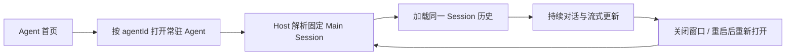
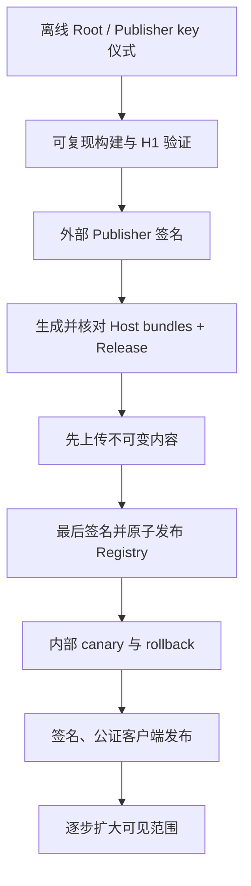

# AgentMesh360 Client 产品计划复核与生产发布安全门

状态：2026-07-27 自主审计与两轮本机 Kimi 独立交叉复核已完成；所有生产发布能力保持关闭

本文档是 H2d4 关闭后的计划复核结果。它回答两个问题：

1. 按既定产品蓝图，客户端下一项应开发什么；
2. 哪些条件全部满足后，才可以单独决定是否启用生产 Agent Package 与桌面分发。

本轮只审计和排定顺序，不生成生产 Root/Publisher key，不配置生产 endpoint，不上传
Artifact，不发布 Registry，不签名或公证桌面安装包，也不写用户真实宿主目录。

## 1. 结论

### 1.1 不直接启动新的 Package 生产切片

H0/H1 至 H2d4 已经建立了 Manifest、签名 Artifact、原子安装、权限批准、Trust
Bundle、Registry、Authoring、Host Skill、Release Manifest、双投影和消费前交叉核对。
这些能力证明本地信任链设计可工作，但不等于生产发布系统已经存在。

当前仍明确关闭：

```text
PRODUCTION_TRUST_BUNDLE_URL = None
PRODUCTION_REGISTRY_URL = None
TrustedRootStore::embedded() = empty
EMBEDDED_PUBLISHER_TRUST_BUNDLE = None
```

因此不能把 H2d4 后的下一步自动解释为“填入常量并上线”，也不自行命名 H2d5。

### 1.2 下一项回到产品主路径：固定 Main Session 对话入口

产品蓝图的核心流程是：



当前 Electron 页面已经显示“打开对话”，但该按钮仍只调用 Agent 激活接口：

- Renderer 没有对话视图；
- `IdentityController` 的公开 Agent 投影有意移除了 `mainSessionId` 与本机路径；
- Electron 主进程没有 Agent 对话 IPC；
- `AcpHostClient` 没有封装标准 `session/load`、`session/prompt` 与
  `session/update` 消费；
- 侧边栏“会话”仍是禁用的“后续”入口。

所以用户目前能激活常驻 Agent，却不能在客户端里真正进入它的固定主对话。按照最初
产品目标，这是比开启生产 Package 分发更靠前的缺口。

## 2. 当前能力核对

| 能力 | 当前事实 | 结论 |
| --- | --- | --- |
| 订阅准入 | Core、Host、桌面三层失败关闭，订阅无效不能进入工作区 | 已有产品基础 |
| 持久身份 | 账户隔离 Agent Registry、固定 Main Session、Leader detach/reconnect/恢复 | 开发链已验证 |
| BYOK | Provider Profile/Vault、Assignment、Binding、路由、设置页与 Probe 已实现 | 外部真实 Provider E2E 仍独立待验 |
| Agent Package | H0/H1 至 H2d4 的本地信任、发布描述与消费门已通过双方测试 | 生产 authority 仍为空 |
| Package Center | 发现、下载、批准、回滚、reconcile 的安全 UI/Host 接口已实现 | 因生产 Registry 关闭而无真实远端内容 |
| 固定主对话 | Harness 和 Host 已有 Session 能力，桌面没有对话通路 | 下一产品关键项 |
| 垂直工作区 | 活动、产物、审批、项目状态仍为目标 | 对话入口后分步实现 |
| 桌面正式分发 | 可构建本地 DMG/ZIP | 未签名、未公证、无自动更新发布链 |

## 3. 下一开发项的边界

下一项是“固定 Main Session 对话入口第一切片”，属于现有桌面产品外壳路线，不属于
新的 Agent Package 阶段。

### 必须包含

1. Renderer 仍只以 `agentId` 打开 Agent，不取得可伪造的 Session authority、本机
   cwd 或 Workspace 路径；
2. Electron 主进程和 Host 根据已验证账户、Agent Registry 与 `agentId` 解析唯一
   Main Session；
3. 复用标准 ACP `session/load`、`session/prompt` 和 `session/update`，不另造聊天
   数据库或第二套 Harness 协议；
4. 加载历史与发送 Prompt 前重复执行订阅和账户归属检查；
5. 页面关闭、Bridge detach 或 Leader 重连后，重新打开仍指向同一个 Main Session；
6. 只向 Renderer 投影对话所需的消息、流式状态和安全错误，不暴露 Token、Provider
   Key、路径、环境变量、原始 Host 错误或其他账户 Session；
7. 先覆盖 Job Agent，再用同一通用路径覆盖 LectureCast、Deploy 和动态 Agent。

### 本切片不包含

- 不启用生产 Package Registry；
- 不实现新的 Provider 协议或静默 Provider fallback；
- 不扩展为完整项目、活动、产物和垂直业务工作区；
- 不实现 OAuth；
- 不生成、导入或调用生产签名私钥；
- 不做 Apple 公证、自动更新或正式发布。

## 4. 生产发布安全门（Agent Package 与桌面分发）

两条发布链分别评审，不能用另一条链的完成状态代替：

- **Agent Package 生产启用**：R0、R1、R2、R3、R5、R6；
- **桌面客户端正式分发**：R0、R4、R5、R6；
- **两者一起向用户开放**：R0-R6 全部关闭。

任一适用门未满足，都不能只靠填入 endpoint、公钥常量或签名环境变量绕过。可以先做
不对用户开放的基础设施演练，但不能把它写成生产启用。

| 门 | 适用发布链 | 当前状态 | 启用前必须具备 |
| --- | --- | --- | --- |
| R0 产品可用性 | 共同 | 未满足 | 固定 Main Session 对话闭环可用；订阅失效、重启与账户切换均不泄漏或丢失历史 |
| R1 Root 与 Publisher authority | Agent Package | 未满足 | 独立审查的 Root key ceremony；生产私钥不进入仓库、客户端、日志或普通 CI；轮换、retire、revoke 流程演练 |
| R2 Release provenance | Agent Package | 未满足 | 可复现构建证据；H2d0 外部签名输入输出；Artifact/Envelope/Host bundles/Release/Registry 的发布者、摘要和版本可追溯 |
| R3 分发服务 | Agent Package | 未满足 | 固定 HTTPS origin；不可变 Artifact；bounded metadata；先上传内容、后原子发布 Registry；失败不产生半发布版本 |
| R4 桌面正式分发 | 桌面客户端 | 未满足 | Developer ID 签名与公证；签名安装包 Login Item 注册/批准/升级 E2E；自动更新、卸载和受控 Host shutdown |
| R5 灰度与恢复 | 共同 | 未满足 | 内部账户 canary；真实订阅与 BYOK；Package 安装/权限扩张/rollback；Root/Publisher 轮换与 Registry 回滚故障演练 |
| R6 可观测与响应 | 共同 | 未满足 | 不含秘密和用户内容的发布审计；版本撤回、密钥吊销、客户端最低版本与事故响应 Runbook |

## 5. 生产发布顺序约束

未来即使获得单独授权，也必须遵守：



- Registry 不得先于它引用的全部不可变内容发布；
- 生产签名不得由客户端或普通工作区直接完成；
- 客户端不得接受调用方注入 URL、digest、Root 或批准布尔值；
- 自动更新、自动批准和自动 rollback 仍需各自的产品策略，不因信任链存在而默认开启；
- 生产启用必须有独立变更、审查、canary 和回滚证据，不能与普通功能提交混在一起。

## 6. 按原产品计划的后续顺序

1. **固定 Main Session 对话入口第一切片**：完成 Agent 首页到真实固定对话的最小闭环；
2. **对话恢复与多 Agent 通用化**：重启、重连、账户切换、三个首方 Agent 和动态
   Agent 使用同一通路；
3. **工作区增量**：再按产品价值加入活动、产物、审批和垂直状态，不一次铺满；
4. **凭据依赖的真实 Provider E2E**：在用户明确提供测试凭据和费用授权时执行；
5. **桌面与 Package 生产发布计划**：只有 R0-R6 全部满足并获得单独授权后启动。

这一路线优先完成用户真正能持续使用的客户端，再进入不可逆、需要私钥和外部服务的
生产发布阶段。

## 7. 本轮验收

- 计划结论必须能由当前源码和既有文档直接支持；
- 不修改任何生产常量、信任根、endpoint、签名配置或上传逻辑；
- `git diff --check` 与 Markdown/Mermaid 基础检查通过；
- 桌面 57 项通过、2 项按既有真实 Host 环境门槛 skip，`npm run check` 通过；
- 本机 Kimi 独立复核结论、边界和下一步顺序；
- 更新 `PROJECT_PROGRESS.md`、`PRODUCT_BLUEPRINT.md`、桌面 README 与持久 Agent 文档，
  消除已经过时的实现状态描述。

Kimi session `session_82ff5b58-3839-4ea5-849a-acf563f07bb6` 首轮逐项核对生产
常量、Trust Store、Electron IPC/Preload/AcpHostClient、Provider/Package UI、
Session Binding、辅助 Provider 路由与 electron-builder 配置，确认计划主结论和
源码事实一致；唯一 Low 是 §4 把 Package 与桌面正式分发放在“Agent Package 门”
标题下，容易误解 R4 是否阻断独立 Package 评审。

修复后 §4 明确两条发布链及其适用集合，表格增加“适用发布链”列；进展文档与产品
蓝图同步相同集合。Kimi 第二轮重新检查完整修复 diff、表格、链接、Mermaid 与
`git diff --check`，最终 Blocker/High/Medium/Low 全部为零并给出无条件 PASS。
