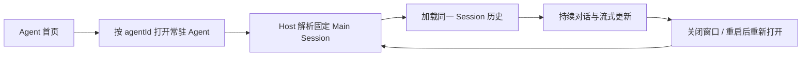
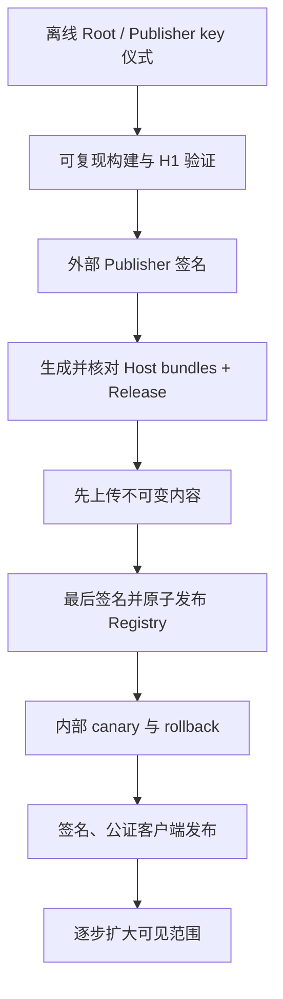

# AgentMesh360 Client 产品计划复核与生产发布安全门

状态：2026-07-27 固定 Main Session 对话、多 Agent 恢复、标准 ACP 单次权限审批与
安全只读工具活动投影已通过自主验证和本机 Kimi 最终独立交叉复核；所有生产发布能力
保持关闭

本文档是 H2d4 关闭后的计划复核结果。它回答两个问题：

1. 按既定产品蓝图，客户端下一项应开发什么；
2. 哪些条件全部满足后，才可以单独决定是否启用生产 Agent Package 与桌面分发。

本轮只审计和排定顺序，不生成生产 Root/Publisher key，不配置生产 endpoint，不上传
Artifact，不发布 Registry，不签名或公证桌面安装包，也不写用户真实宿主目录。

## 1. 结论

### 1.1 不直接启动新的 Package 生产切片

H0/H1 至 H2d4 已经建立了 Manifest、签名 Artifact、原子安装、权限批准、Trust
Bundle、Registry、Authoring、Host Skill、Release Manifest、双投影和消费前交叉核对。
这些能力证明本地信任链设计可工作，但不等于生产发布系统已经存在。

当前仍明确关闭：

```text
PRODUCTION_TRUST_BUNDLE_URL = None
PRODUCTION_REGISTRY_URL = None
TrustedRootStore::embedded() = empty
EMBEDDED_PUBLISHER_TRUST_BUNDLE = None
```

因此不能把 H2d4 后的下一步自动解释为“填入常量并上线”，也不自行命名 H2d5。

### 1.2 产品主路径已推进：文本对话、多 Agent 恢复与单次权限边界关闭

产品蓝图的核心流程是：



循环 43-46 已完成这一流程的文本对话、多 Agent 通用化、最小权限确认与只读活动：

- 用户从任意当前账号 Host Catalog Agent 卡片进入真实固定主对话；
- Renderer 仍看不到 `mainSessionId` 与本机路径，只提交 `agentId` 和文本；
- Electron 主进程通过独立 Controller 持有临时 Session authority；
- `AcpHostClient` 复用标准 `session/load`、`session/prompt` 与 `session/update`；
- 历史和 live update 只投影有界的用户/Agent 文本，订阅、账户、重连与超时均失败
  关闭；
- Renderer reload 可恢复安全 snapshot，三个首方 Agent 在真实 detach/Leader 替换
  后保持各自唯一 Main Session。
- 标准 ACP `session/request_permission` 只向 Renderer 投影安全标题、工具类型与本地
  生成的选项标识；原始 Request/Session/Tool/Option authority 留在主进程；
- 用户只能“仅本次允许”“仅本次拒绝”或取消，永久选项与未知上游选项失败关闭；
  订阅、账户、Agent、重连、Host 和超时生命周期都会撤销待处理权限。
- 标准 ACP `tool_call` / `tool_call_update` 只投影本地活动 ID、允许列表工具类别和
  四态状态；私有 Tool Call ID、标题、内容、原始输入输出、命令和路径不进入 Renderer；
  Host replay 是唯一历史来源，投影最多 50 项且终态冻结。

动态 `future-agent` 的本地 fixture 证明用户层不需要 Agent 专属代码，但生产 Registry
仍关闭，不能写成真实远端动态 Agent 已交付。下一项按原计划继续工作区增量，但只先
审计产物与垂直状态的 Host/Package authority 来源，不直接实现 UI；这仍比启用生产
Package 分发更靠前。

## 2. 当前能力核对

| 能力 | 当前事实 | 结论 |
| --- | --- | --- |
| 订阅准入 | Core、Host、桌面三层失败关闭，订阅无效不能进入工作区 | 已有产品基础 |
| 持久身份 | 账户隔离 Agent Registry、固定 Main Session、Leader detach/reconnect/恢复 | 开发链已验证 |
| BYOK | Provider Profile/Vault、Assignment、Binding、路由、设置页与 Probe 已实现 | 外部真实 Provider E2E 仍独立待验 |
| Agent Package | H0/H1 至 H2d4 的本地信任、发布描述与消费门已通过双方测试 | 生产 authority 仍为空 |
| Package Center | 发现、下载、批准、回滚、reconcile 的安全 UI/Host 接口已实现 | 因生产 Registry 关闭而无真实远端内容 |
| 固定主对话 | Host Catalog 全部当前账号 Agent 已复用桌面文本对话、历史 replay、live update、安全重开与 Renderer reload 恢复；三个首方 Agent 已通过真实 Host 恢复 | 文本通路已关闭 |
| Harness 单次权限 | 标准 ACP `session/request_permission` 已接入 Main-owned authority，只投影一次性允许/拒绝与取消，生命周期失败关闭 | 最小用户确认边界已关闭；不是完整 Harness |
| Harness 工具活动 | 标准 ACP ToolCall 只投影本地 ID、允许列表类别与四态状态；Host replay、50 项上限、终态冻结和生命周期清理已验证 | 安全只读可观察性已关闭；不含工具控制或产物 |
| 垂直工作区 | 产物、项目状态和 Agent 专属结构化界面仍为目标 | 下一轮先审计 authority 与恢复来源，不直接铺开 UI |
| 桌面正式分发 | 可构建本地 DMG/ZIP | 未签名、未公证、无自动更新发布链 |

## 3. 已关闭第一切片的边界

循环 43 的“固定 Main Session 对话入口第一切片”属于现有桌面产品外壳路线，不属于
新的 Agent Package 阶段；以下边界已经由源码、自主测试和 Kimi 交叉测试验证。

### 必须包含

1. Renderer 仍只以 `agentId` 打开 Agent，不取得可伪造的 Session authority、本机
   cwd 或 Workspace 路径；
2. Electron 主进程和 Host 根据已验证账户、Agent Registry 与 `agentId` 解析唯一
   Main Session；
3. 复用标准 ACP `session/load`、`session/prompt` 和 `session/update`，不另造聊天
   数据库或第二套 Harness 协议；
4. 加载历史与发送 Prompt 前重复执行订阅和账户归属检查；
5. 页面关闭、Bridge detach 或 Leader 重连后，重新打开仍指向同一个 Main Session；
6. 只向 Renderer 投影对话所需的消息、流式状态和安全错误，不暴露 Token、Provider
   Key、路径、环境变量、原始 Host 错误或其他账户 Session；
7. Job、LectureCast、Deploy 和 Host Catalog 后续动态 Agent 使用同一通用路径；
   动态 Agent 的生产远端交付仍受 Package 发布门约束。

### 本切片不包含

- 不启用生产 Package Registry；
- 不实现新的 Provider 协议或静默 Provider fallback；
- 不扩展为完整项目、活动、产物和垂直业务工作区；
- 不实现 OAuth；
- 不生成、导入或调用生产签名私钥；
- 不做 Apple 公证、自动更新或正式发布。

## 4. 生产发布安全门（Agent Package 与桌面分发）

两条发布链分别评审，不能用另一条链的完成状态代替：

- **Agent Package 生产启用**：R0、R1、R2、R3、R5、R6；
- **桌面客户端正式分发**：R0、R4、R5、R6；
- **两者一起向用户开放**：R0-R6 全部关闭。

任一适用门未满足，都不能只靠填入 endpoint、公钥常量或签名环境变量绕过。可以先做
不对用户开放的基础设施演练，但不能把它写成生产启用。

| 门 | 适用发布链 | 当前状态 | 启用前必须具备 |
| --- | --- | --- | --- |
| R0 产品可用性 | 共同 | 已满足（开发验证） | 文本对话、多 Agent、用户可见 reload/重连恢复、标准 ACP 单次权限边界，以及订阅失效、重启与账户切换隔离均已通过开发验证；此状态不替代 R1-R6 或生产验收 |
| R1 Root 与 Publisher authority | Agent Package | 未满足 | 独立审查的 Root key ceremony；生产私钥不进入仓库、客户端、日志或普通 CI；轮换、retire、revoke 流程演练 |
| R2 Release provenance | Agent Package | 未满足 | 可复现构建证据；H2d0 外部签名输入输出；Artifact/Envelope/Host bundles/Release/Registry 的发布者、摘要和版本可追溯 |
| R3 分发服务 | Agent Package | 未满足 | 固定 HTTPS origin；不可变 Artifact；bounded metadata；先上传内容、后原子发布 Registry；失败不产生半发布版本 |
| R4 桌面正式分发 | 桌面客户端 | 未满足 | Developer ID 签名与公证；签名安装包 Login Item 注册/批准/升级 E2E；自动更新、卸载和受控 Host shutdown |
| R5 灰度与恢复 | 共同 | 未满足 | 内部账户 canary；真实订阅与 BYOK；Package 安装/权限扩张/rollback；Root/Publisher 轮换与 Registry 回滚故障演练 |
| R6 可观测与响应 | 共同 | 未满足 | 不含秘密和用户内容的发布审计；版本撤回、密钥吊销、客户端最低版本与事故响应 Runbook |

## 5. 生产发布顺序约束

未来即使获得单独授权，也必须遵守：



- Registry 不得先于它引用的全部不可变内容发布；
- 生产签名不得由客户端或普通工作区直接完成；
- 客户端不得接受调用方注入 URL、digest、Root 或批准布尔值；
- 自动更新、自动批准和自动 rollback 仍需各自的产品策略，不因信任链存在而默认开启；
- 生产启用必须有独立变更、审查、canary 和回滚证据，不能与普通功能提交混在一起。

## 6. 按原产品计划的后续顺序

1. **固定 Main Session 对话入口第一切片（已完成）**：Job Agent 已完成首页到真实
   固定文本对话的最小闭环；
2. **对话恢复与多 Agent 通用化（已完成）**：重启、重连、账户切换、三个首方 Agent
   和动态 Agent 使用同一通路；
3. **最小 Harness 单次权限（已完成）**：接入标准 ACP 反向请求，由主进程持有
   authority，只允许一次性选择并在全部身份/生命周期变化时失败关闭；
4. **工作区增量（进行中）**：安全、只读的工具活动状态投影已完成；下一轮只审计
   产物与垂直状态的 Host/Package authority、恢复语义和脱敏边界，不一次铺满；
5. **凭据依赖的真实 Provider E2E**：在用户明确提供测试凭据和费用授权时执行；
6. **桌面与 Package 生产发布计划**：只有相应 R0-R6 全部满足并获得单独授权后启动。

这一路线优先完成用户真正能持续使用的客户端，再进入不可逆、需要私钥和外部服务的
生产发布阶段。

## 7. 循环 42 计划审计验收（历史）

- 计划结论必须能由当前源码和既有文档直接支持；
- 不修改任何生产常量、信任根、endpoint、签名配置或上传逻辑；
- `git diff --check` 与 Markdown/Mermaid 基础检查通过；
- 桌面 57 项通过、2 项按既有真实 Host 环境门槛 skip，`npm run check` 通过；
- 本机 Kimi 独立复核结论、边界和下一步顺序；
- 更新 `PROJECT_PROGRESS.md`、`PRODUCT_BLUEPRINT.md`、桌面 README 与持久 Agent 文档，
  消除已经过时的实现状态描述。

Kimi session `session_82ff5b58-3839-4ea5-849a-acf563f07bb6` 首轮逐项核对生产
常量、Trust Store、Electron IPC/Preload/AcpHostClient、Provider/Package UI、
Session Binding、辅助 Provider 路由与 electron-builder 配置，确认计划主结论和
源码事实一致；唯一 Low 是 §4 把 Package 与桌面正式分发放在“Agent Package 门”
标题下，容易误解 R4 是否阻断独立 Package 评审。

修复后 §4 明确两条发布链及其适用集合，表格增加“适用发布链”列；进展文档与产品
蓝图同步相同集合。Kimi 第二轮重新检查完整修复 diff、表格、链接、Mermaid 与
`git diff --check`，最终 Blocker/High/Medium/Low 全部为零并给出无条件 PASS。

## 8. 循环 43 实施检查点

- 功能提交：`818e98c feat: add persistent agent conversation entry`；
- 桌面 `npm test`：67 pass、0 fail、2 个真实 Host 环境门 skip；
- Conversation、Package、Provider、Visual 四组 Electron smoke 全部通过；
- 真实 Host `real-host.test.js` 与 `real-host-lifecycle.test.js`：2/2 通过；
- Kimi session `session_c6129f01-8b1a-4f0c-9f51-c7e8a203244c` 首轮发现 3 项 Low，
  修复后第二轮 Blocker/High/Medium/Low 全部为零并给出无条件 PASS；
- R0 继续保持未满足，下一轮只进入对话恢复与多 Agent 通用化，不启动生产发布。

## 9. 循环 44 实施检查点

- 功能提交：`271f99d feat: generalize persistent conversations across agents`；
- 桌面 `npm test`：69 pass、0 fail、2 个真实 Host 环境门 skip；
- Conversation、Package、Provider、Visual 四组 Electron smoke 全部通过；
- 真实 Host 2/2 通过，Job、LectureCast、Deploy 的 Main Session ID 唯一，并在
  Bridge detach 与 Leader 替换后保持原 ID 且可重新加载；
- Kimi CLI 可恢复 session `session_5f61347a-4131-4611-afc4-fb3f015e481e`
  （报告内部审查 ID `7d082017-4814-481c-891d-98bcd7d27a56`）首轮发现 1 项
  Medium、2 项 Low，全部修复后第二轮四级全零并无条件 PASS；
- R0 继续保持未满足，下一轮只进入最小 Harness 交互/权限审批边界。

## 10. 循环 45 实施检查点

- 功能提交：`cb5a8e9 feat: add one-time harness permission approval`；
- 切换 Agent 修复提交：`c4610ae fix: cancel permission when switching agents`；
- 桌面 `npm test`：81 pass、0 fail、2 个真实 Host 环境门 skip；
- Conversation、Package、Provider、Visual 四组 Electron smoke 全部通过；
- 真实 Host 2/2 回归通过，但没有触发真实工具权限请求，不能据此声称权限工具循环
  已完成真实 Host E2E；
- Main 独占原始请求、Session、Tool 与 Option authority；Renderer 只见本地生成的
  安全投影，且只接受上游当前一次性允许/拒绝的精确 ID + kind 组合；
- Kimi session `session_09709815-0885-4f57-acab-4896184226fa` 首轮发现 5 项 Low，
  全部修复后第二轮 Blocker/High/Medium/Low 全零并无条件 PASS；
- 文档收口复核发现切换 Agent 未立即取消旧 Host 请求的 1 项 Medium，以及 3 项文档
  精度 Low；代码、回归测试与措辞均已修复；最终复核独立运行 83 项 Node 测试、
  四组 Electron smoke 和 Agent A→B 对抗脚本，Blocker/High/Medium/Low 全零并
  无条件 PASS；
- R0 按既定判定项更新为“已满足（开发验证）”，但 R1-R6 和完整 Harness/垂直工作区
  不因此关闭；下一轮只进入安全、只读的 Harness 工具活动状态投影。

## 11. 循环 46 实施检查点

- 功能提交：`6d1dbf1 feat: add safe harness activity projection`；
- 桌面 `npm test`：83 pass、0 fail、2 个真实 Host 环境门 skip；
- Conversation、Package、Provider、Visual 四组 Electron smoke 全部通过；
- Main 只用私有 Tool Call ID 合并通知，Renderer 只见 `activity-N`、允许列表工具
  类别与 `pending/in_progress/completed/failed`；投影最多 50 项、终态冻结；
- 订阅、账户、Agent、重连、Host 退出、Prompt 超时和旧 Session 晚到边界全部有
  回归测试；Renderer 还有独立白名单，不读取上游标题、内容、路径或原始输入输出；
- Kimi session `session_818e5746-4cc2-48bc-b0da-9d89384e67cb` 独立审查完整 diff，
  运行 85 项 Node 测试、检查与四组 Electron smoke；核对真实测试职责后最终
  Blocker/High/Medium/Low 全零并 PASS；
- 两个真实 Host 环境 skip 验证的是 Leader/Agent 恢复与订阅/账户契约，不触发真实
  工具活动；本轮没有重建已清理的 Rust target，也不把源码审计写成真实工具 E2E；
- R0 仍是“已满足（开发验证）”，R1-R6 与生产门保持原状。下一轮只审计产物/垂直
  状态的 authority 和恢复来源，不启动 Package H2d5 或生产发布。
