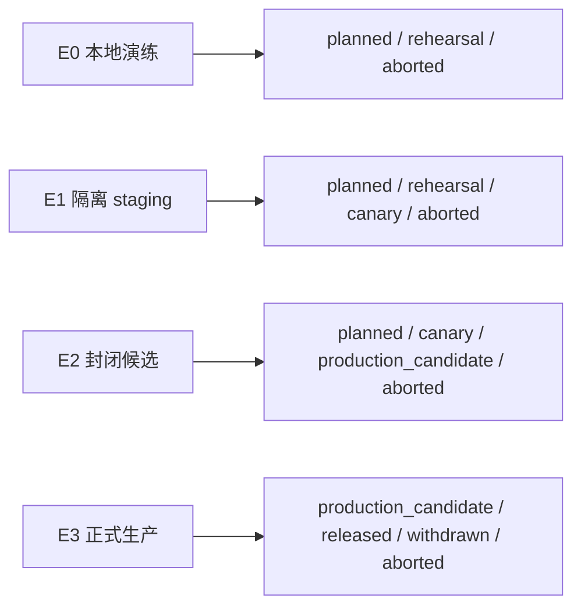

# AgentMesh360 Release Event v1

状态：P1 本地基线；Schema、验证器与模板已实现，尚未接入 E1/E2 观测系统

本文定义 AgentMesh360 Client、Agent Package 和内部 canary 共用的最小发布事件。
它只记录“哪个公开 Release 在哪个环境、阶段和安全门发生了什么结果”，不记录用户
行为、模型内容、网络原文、签名原文或本机执行细节。

机器可读 Schema：
[`../../schemas/agentmesh360-release-event-v1.schema.json`](../../schemas/agentmesh360-release-event-v1.schema.json)

本地验证器：
[`../../tools/release-evidence/validate-release-evidence.mjs`](../../tools/release-evidence/validate-release-evidence.mjs)

## 1. Authority 与非目标

Release Event 是经过脱敏的审计索引，不是以下对象的 authority：

- 订阅、credits、Provider Key 或用户身份；
- Root/Publisher key 状态；
- Artifact、Envelope、Trust Bundle 或 Registry 原文；
- Agent Main Session、项目状态或用户产物；
- 发布批准、签名 receipt 或 go/no-go 决策本身。

这些 authority 仍由 Core、离线 ceremony、外部 signer、受签 Registry 和人工批准
receipt 分别持有。Event 只能引用非秘密公开标识和 receipt ID，不能替代原始证据。

P1 不新增运行时遥测、不上传事件、不建立观测服务，也不把模板事件写入用户设备。
E1/E2 接入方式和技术演练保留给后续工作包。

## 2. 严格事件结构

事件使用一行一个 JSON object 的 `events.v1.jsonl`。未知字段一律拒绝。

### 2.1 必填字段

| 字段 | 约束 |
| --- | --- |
| `schemaVersion` | 必须为整数 `1` |
| `eventId` | 本地生成的非个人标识，`evt_` 前缀 |
| `releaseId` | 公开 Release 标识，`rel_` 前缀 |
| `publicVersion` | canonical SemVer |
| `environment` | `e0`、`e1`、`e2`、`e3` |
| `stage` | 计划中固定的发布状态 |
| `gate` | `r0`-`r6` 或 `go_no_go` |
| `eventType` | 固定枚举，不接受自由文本 |
| `outcome` | `started`、`succeeded`、`failed`、`blocked`、`aborted`、`withdrawn` |
| `occurredAt` | UTC 秒级时间，形如 `2026-07-28T00:00:00Z` |

### 2.2 可选字段

| 字段 | 约束 |
| --- | --- |
| `packageId` + `agentId` | 必须同时出现；Desktop-only 事件同时省略 |
| `registryRevision` | 正安全整数；Registry publish/freeze 事件必须提供 |
| `buildRevision` | 公开构建 revision；build 事件必须提供 |
| `deviceAlias` | 只允许 E1/E2 非个人化 `device-*` 别名 |
| `receiptId` | 非秘密 receipt 索引；批准/签名/canary 完成/go 决策必须提供 |
| `errorCode` | 固定大写错误码；失败、阻断、中止、撤回结果必须提供 |

事件没有 `message`、`details`、`metadata`、`notes` 或任意扩展 Map。需要解释时只在
受访问控制的原始系统中保存，并在仓库摘要中使用经过人工审查的固定错误码。

## 3. 环境与状态约束



- E0 不能产生 canary、production candidate 或 released 事件；
- E1 不能产生 production candidate、released 或 withdrawn 事件；
- E2 不能产生 released 或 withdrawn 事件；
- `released` / `withdrawn` 只属于 E3；
- `deviceAlias` 只属于内部 E1/E2；
- JSONL 中 `eventId` 必须唯一，事件时间必须非递减；
- JSON object 不允许重复 key；
- `events.v1.jsonl`、01-05 号 JSON，以及 00、06、07 号 Markdown 的固定身份字段
  必须绑定同一个 `releaseId`；所有包含版本的文件还必须绑定同一个
  `publicVersion`；每个 Markdown 身份字段必须且只能出现一次。

环境限制防止把本地演练或 staging 结果通过改一行文案冒充生产证据。

## 4. 固定事件类型

| 类别 | `eventType` |
| --- | --- |
| Scope / 演练 | `scope_approved`、`tabletop_started/completed`、`technical_drill_started/completed` |
| 构建 / 签名 | `build_started/completed`、`signing_requested/completed` |
| 分发 | `content_uploaded`、`registry_published/frozen`、`release_withdrawn` |
| 信任 | `publisher_revoked`、`root_revoked`、`minimum_version_changed` |
| Canary | `canary_authorized/started/scenario_completed/aborted/completed` |
| 恢复 | `rollback_started/completed` |
| 事故 | `incident_declared/updated/resolved` |
| 扩大范围 | `cohort_expansion_approved`、`go_decision_recorded` |

`eventType` 只说明事件类别；是否允许进入下一阶段仍由 Runbook、签名证据与人工批准
共同决定。

## 5. 禁止字段与内容

Event Schema 的 unknown-field 拒绝已经阻止任意内容进入 Event。完整证据目录还会
执行静态扫描，拒绝：

- API Key、Access/Refresh Token、Authorization、Cookie、Password、Private Key；
- Prompt、模型 Response、Tool Input/Output、用户内容；
- 电子邮件、真实账户 ID；
- 任意 scheme URL、Header、Registry/Trust 原文、原始 Signature；
- POSIX/Windows 绝对路径和 Vault credential reference；
- JWT、常见 Provider secret 与 PEM private key 文本；
- JSON key 中的上述禁止内容和任何层级的重复 object key；
- symlink、未知文件、超限文件、超限总量和不完整目录。

静态扫描只是最后一道本地门，不替代源系统最小采集、访问控制和人工审查。

## 6. 有界证据包

完整证据目录固定以下九个文件，最多 16 个文件、单文件 1 MiB、总量 8 MiB：

```text
00-scope-and-approval.md
01-source-and-build.json
02-signing-receipts.json
03-distribution-checks.json
04-canary-scenarios.json
05-rollback-and-recovery.json
06-kimi-independent-review.md
07-go-no-go.md
events.v1.jsonl
```

模板见
[`../templates/RELEASE_EVIDENCE_TEMPLATE_GUIDE.md`](../templates/RELEASE_EVIDENCE_TEMPLATE_GUIDE.md)。
仓库模板使用 `NO_GO` / `blocked`，不会伪装成真实发布证据。

验证事件：

```bash
node tools/release-evidence/validate-release-evidence.mjs \
  --events /path/to/events.v1.jsonl
```

验证完整证据目录：

```bash
node tools/release-evidence/validate-release-evidence.mjs \
  --evidence-dir /path/to/release-evidence
```

开发过程中可以用 `--allow-partial` 扫描尚未完成的目录，但 `canary_passed`、
`production_candidate`、`released` 和 go/no-go 审查必须使用完整模式。

CLI 只输出固定成功文案或相对文件名 + 固定错误，不输出绝对输入路径或文件内容。
文件不存在、不可读或目录枚举失败也使用固定错误，不透传操作系统错误和堆栈。

## 7. 失败策略

| 故障 | 处理 |
| --- | --- |
| 事件未知字段/非法枚举 | 拒绝整条事件 |
| JSONL 非法、重复 ID、跨 Release 或乱序 | 拒绝证据包 |
| 事件丢失或观测系统不可用 | 阻止 cohort 扩大；不能推断成功 |
| 重复投递 | 用 `eventId` 去重；异文不能覆盖旧事件 |
| 客户端/服务端时间异常 | 事件失败关闭；信任判断仍只使用已有可信 Core 时间 |
| 证据存储不可用 | 保持当前阶段，不继续发布 |
| 静态扫描命中秘密/用户内容 | 中止、隔离文件、按 SEV-0 评估泄漏 |

## 8. P1 验收边界

P1 可通过 Schema、模板、验证器、负面测试和 E0 tabletop 关闭“R6 本地基线”，但
R6 仍保持未满足，直到后续完成：

- E1/E2 真实技术演练；
- 实际观测存储的访问控制、可用性和重复事件处理；
- 版本撤回、吊销、最低版本和官方安装器恢复的真实链路；
- 经指定 Release Owner / Incident Owner 签署的 evidence。
