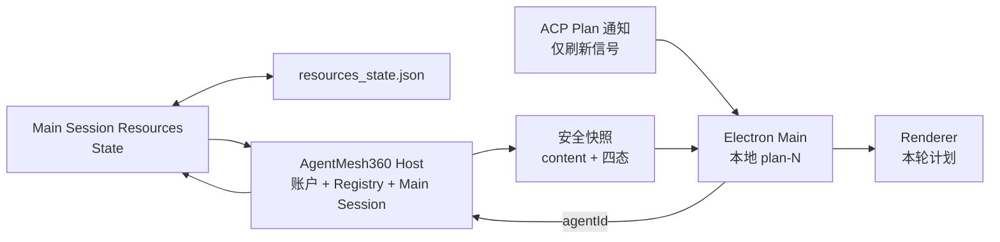

# Session 计划视图 authority 与安全投影 v1

状态：Cycle 53 authority 审计完成；Cycle 54 最小实现、自主验证与 Kimi 独立交叉
测试完成，最终 Blocker/High/Medium/Low 全部为零

## 1. 目的

AgentMesh360 客户端需要让用户看到持久产品 Agent 当前为本轮 Session 声明的工作
计划，但不能把模型 Todo 草稿冒充 Job round、LectureCast project、Deploy run 等
业务进度，也不能因为 Harness 的临时 UI 通知而把仍在进行的工作误报为完成。

本契约只定义当前固定 Main Session 中 Grok Build `TodoState` 的只读安全投影。它不
定义项目业务状态、Plan Mode、Goal、Scheduler、Subagent 或任务控制。

## 2. authority 审计

### 2.1 标准 ACP `Plan` 通知不是 authority

`todo_write` 成功后，Harness 会把完整 Todo 列表转换成标准 ACP
`SessionUpdate::Plan`。该通知适合提示客户端“计划发生变化”，但不能直接作为持久
产品状态：

- ACP `PlanEntry` 不保留 Todo ID；
- 原始内容还带 priority 与任意 `meta`，不能原样进入 Renderer；
- 真实通知会写入 `updates.jsonl` 并 replay，但 turn end 还会发送一条不持久化的
  cosmetic `Plan`；
- cosmetic 通知为了清除上游 UI spinner，会把所有 `in_progress` 临时显示为
  `completed`，却明确不修改真实 Todo 状态。

因此 v1 不能从最近一条 ACP Plan、聊天、ToolCall 或 replay 推断当前计划。Plan
通知只作为实时刷新信号；replay 通知不触发逐条刷新，`session/load` 完成后统一读取
一次 authority。

### 2.2 canonical authority

当前 Main Session 的 `ToolBridge Resources` 中
`State<TodoState>` 是运行时 authority：

- `todo_write` 对该资源执行 replace/merge；
- 每次工具完成后，Resources 自动保存到 Session 的 `resources_state.json`；
- Session 重建时 Tool Registry 会先注册 `TodoState`，再从该文件恢复；
- Todo 顺序由 `IndexMap` 保留，四态为
  `pending / in_progress / completed / cancelled`。

旧 `plan.json` / `PersistenceMsg::PlanState` 是迁移期兼容路径，普通 `todo_write`
不依赖它，不能成为本客户端的新 authority。`PlanModeTracker` 管理是否处于 Plan
Mode 和审批恢复，也不是 Todo 列表。

### 2.3 与业务状态的边界

Session 计划是模型为当前工作声明的协作草稿，可能遗漏步骤、长期停在
`in_progress`，也可能在后续 Prompt 中被替换。它不等于：

- Job Agent 的求职轮次、岗位与申请状态；
- LectureCast Agent 的课程项目与制作状态；
- Deploy Agent 的部署 run 与服务状态；
- Workspace Project State 的安全业务 read model。

Renderer 必须明确标注“模型工作计划，不等同于业务进度”。

## 3. v1 数据流



Host 新增：

```text
x.agentmesh360/agents/session-plan/get
```

请求只接受：

```json
{ "agentId": "job-agent" }
```

Host 必须从当前有效订阅账户的 Registry 解析已激活 Agent 与固定 Main Session。调用
方不能提交 Session ID、Workspace、资源路径、Todo ID 或状态文件路径。

## 4. 安全投影

Host 最多返回 50 项：

```json
{
  "entries": [
    {
      "content": "核对岗位要求",
      "status": "in_progress"
    }
  ]
}
```

规则：

- 不返回 Todo ID、priority、meta、Session、账户、Workspace 或文件路径；
- `content` 去除首尾空白后必须非空，最多 300 个 Unicode 字符和 1200 bytes；
- C0/C1 控制字符、未知状态、超过 50 项或非法内容全部失败关闭；
- Resource 尚未创建代表尚无计划，返回空列表；
- Main 再生成本地 `plan-N`；Renderer 执行独立同等白名单与 HTML escape；
- Renderer 只显示固定四态文案：待处理、进行中、已完成、已取消；
- Host、Main 与 Renderer 均不解析或渲染原始 ACP Plan 的 content/priority/meta。

## 5. 恢复与生命周期

1. 打开 Agent 时，`session/load` 完成后读取一次安全快照；
2. live 标准 ACP Plan 通知只触发一次合并刷新，不消费其内容；
3. replay Plan 不逐条刷新，避免历史通知覆盖当前 Resources；
4. 成功 Prompt 后再读取一次快照，覆盖通知丢失或合并窗口；
5. 并发刷新使用当前 authority 与刷新序号丢弃旧响应；
6. 订阅、账户、Agent、关闭、重连、Host 退出与 Prompt 超时全部清空计划；
7. 快照不可用或非法时只显示固定“本轮计划暂时不可用。”，文本对话继续可用。

## 6. 非目标

- 不允许用户新增、修改、完成、取消或排序 Todo；
- 不显示 Todo ID、priority 或 meta；
- 不从 ACP replay 或 ToolCall 重建第二套 Todo 数据库；
- 不把 Session 计划写入 Workspace Project State；
- 不展示或控制 Plan Mode、Goal、Scheduler、Subagent；
- 不加入 Agent 专属分支；
- 不修改 Provider、Agent Package、生产 Registry 或发布门。

## 7. 验收

1. 失败优先测试覆盖 authority 快照、live 信号、replay 忽略、并发合并、上限与生命周期；
2. Host/Controller/Renderer 均拒绝未知状态、控制字符、超长与超限数据；
3. Controller 快照与 Renderer DOM 不包含 Todo ID、priority、meta 或原始 Plan 字段；
4. 真实 Host 冷启动测试从 `resources_state.json` 恢复 canonical TodoState；
5. 全量 Node、Rust、真实 Host、四组 Electron smoke 与 Kimi 独立交叉测试通过；
6. Kimi 的 Blocker/High/Medium/Low 全部为零；
7. 仓库根目录不生成 `target/`，Rust 构建继续使用临时 `CARGO_TARGET_DIR`。
