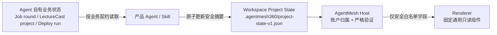

# Workspace Project State v1

状态：Cycle 49 authority 审计与 Cycle 50 通用只读投影均已完成  
建立日期：2026-07-27

## 1. 目的

持久对话、工具活动和产物索引已经可以恢复，但它们都不能回答“这个 Agent 当前在做
什么、进行到哪里、为什么停住”：

- Grok Session 是对话历史 authority，不是结构化业务状态；
- `state.db` 是账户、Agent 生命周期、Main Session 与 Workspace 映射 authority，
  不是 Job round、LectureCast project 或 Deploy run 的业务数据库；
- `artifacts-v1.json` 只索引已经形成的文件，不表达未完成阶段；
- ACP `content/locations/rawInput/rawOutput` 是 Harness 遥测，不能作为产品状态来源；
- Agent Package 描述产品身份、能力、权限与运行时契约，不保存某个账户的运行时状态。

因此 v1 定义一个位于账户隔离 Workspace 的、由产品 Agent 显式写入的安全只读
read model。Host 只负责验证和投影，不根据聊天、文件名或工具调用推断状态。

## 2. Authority 决策



权威顺序：

1. 每个产品 Agent 自己已有的业务存储仍是业务真相，例如 Job Agent round、
   LectureCast `.lecturecast/project.json` 或 Deploy run/status；
2. `.agentmesh360/project-state-v1.json` 是面向客户端的派生 read model，不得反向
   覆盖业务存储，也不能被描述成 Host 对内容真实性的背书；
3. Host 是账户、订阅、Workspace 归属和安全投影 authority；
4. Renderer 不是状态解释器，只渲染固定字段和固定枚举。

这个边界允许未来 Agent 使用自己的业务 Schema，同时复用同一个客户端公共状态面。
如果将来需要 Agent 专属字段或交互，必须由受签 Agent Package 声明版本化展示契约，
不能向 v1 塞入任意 JSON、HTML、Markdown、URL 或命令。

## 3. 文件与 Schema

固定文件：

```text
<account-scoped-agent-workspace>/
  .agentmesh360/
    project-state-v1.json
```

示例：

```json
{
  "schemaVersion": 1,
  "revision": 8,
  "project": {
    "title": "产品岗位第 3 轮",
    "status": "active",
    "summary": "正在按既定平台顺序核对岗位并保留投递证据。",
    "steps": [
      {
        "stepId": "confirm-target",
        "label": "确认目标岗位",
        "status": "completed"
      },
      {
        "stepId": "review-boss",
        "label": "审核 Boss 机会",
        "status": "in_progress"
      },
      {
        "stepId": "review-liepin",
        "label": "审核猎聘机会",
        "status": "pending"
      }
    ]
  }
}
```

顶层规则：

- UTF-8 JSON 普通文件，最大 32 KiB，禁止未知字段；
- `schemaVersion` 必须为 `1`；
- 文件存在时 `revision` 必须是正的 JavaScript 安全整数；生产方每次改变 read model
  都应单调增加，并通过同目录临时文件 + 原子替换写入；
- `project` 是一个当前焦点项目。v1 不尝试建立多项目数据库；
- Manifest 不存在时 Host 返回 `revision = 0, project = null`，表示当前没有公开
  状态，而不是错误；
- Manifest 存在但不合法时整个状态投影失败关闭，不能使用部分字段。

`project` 规则：

- `title` 为去除首尾空白后的 1-120 个 Unicode 字符；
- `summary` 为去除首尾空白后的 1-500 个 Unicode 字符；
- `status` 只允许 `active`、`waiting_for_user`、`blocked`、`completed`；
- `steps` 最多 20 项；
- 每个 `stepId` 使用小写字母、数字和连字符，最多 64 字节，且不能重复；
- `label` 为去除首尾空白后的 1-160 个 Unicode 字符；
- Step `status` 只允许 `pending`、`in_progress`、`blocked`、`completed`；
- 所有用户可见字符串拒绝 C0/C1 控制字符。

## 4. Host 与 Renderer 投影

Host 扩展只接受：

```json
{ "agentId": "job-agent" }
```

Host 必须从当前有效订阅和账户 Registry 解析已激活 Agent 的 Workspace。请求方不能
提交账户、Session、Workspace、Manifest 或业务状态路径。

Host 响应只包含：

```json
{
  "schemaVersion": 1,
  "revision": 8,
  "project": {
    "title": "产品岗位第 3 轮",
    "status": "active",
    "summary": "正在按既定平台顺序核对岗位并保留投递证据。",
    "steps": [
      {
        "stepId": "confirm-target",
        "label": "确认目标岗位",
        "status": "completed"
      }
    ]
  }
}
```

主进程再次验证并移除 `schemaVersion/revision`。Renderer 只获得 `project` 的固定字段，
不获得路径、业务对象 ID、命令、URL、摘要哈希、时间戳、账户或 Session 标识。页面
必须再次执行相同的数量、枚举、ID 与字符串白名单。

## 5. 恢复与失败语义

- 打开固定 Main Session 后读取一次；
- 一次 Prompt 成功结束后重新读取；
- 账户切换、订阅失效、切换 Agent、关闭对话、Leader 重连、Host 退出和 Prompt
  超时立即清空；
- 异步响应返回时必须重新核对同一内存 authority，旧账户或旧 Agent 响应不得进入 UI；
- 缺少 Manifest 时不显示状态卡；
- 无效或读取失败时只显示本地固定“项目状态暂时不可用。”，文本对话仍可用；
- `revision` 只用于 Host/Main 校验与未来刷新，不作为 Renderer authority。

## 6. 明确非目标

v1 不包含：

- 从对话、ToolCall、目录扫描或文件修改时间自动推断项目状态；
- 在 `state.db` 或桌面端复制 Agent 的业务数据库；
- 多项目列表、搜索、排序、历史、跨 Agent 聚合或文件 watcher；
- 任意 blocks、表单、Markdown、HTML、CSS、脚本、URL、路径或命令；
- “下一步”按钮、外部操作、审批或状态 mutation；
- Job、LectureCast、Deploy 的专属字段或专属 Renderer 分支；
- 把 read model 当成订阅、credits、发布、部署成功或业务事实的独立证明。

## 7. Cycle 50 最小实现验收

1. Rust Host 严格读取和投影同一通用 Manifest；
2. 未激活、跨账户和订阅无效全部失败关闭；
3. Controller 在打开与成功 Prompt 后刷新，并覆盖所有 authority 清理边界；
4. Renderer 只显示一个固定通用状态卡；
5. 当前三个 Agent 与动态 future Agent 不需要客户端分支；
6. 本地全量测试、真实 Host、四组 Electron smoke 和本机 Kimi 独立复核全部通过；
7. 不触碰 Provider 真实付费 E2E、生产 Package Registry、签名 Root 或正式桌面发布。
