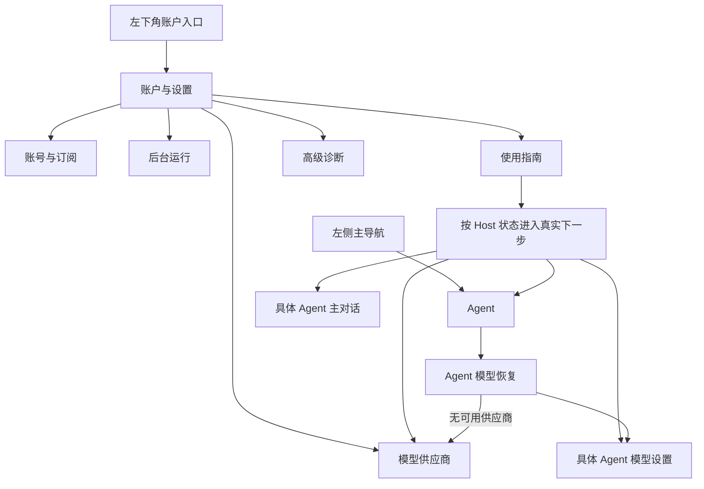

# 账户设置中心与主导航收敛计划

状态：源码、UI 回归与独立终审完成；等待内部包验收

日期：2026-08-05

## 1. 计划依据

- 首次使用主路径已经由“添加模型供应商 → 激活 Agent → 在 Agent 对话中开始工作”的状态化
  引导承担，模型供应商和普通客户端设置不需要长期占据一级导航；
- 当前左侧同时平铺 Agent、模型供应商和设置，会让用户把低频配置误解为与日常 Agent 工作
  同级的产品目的；
- 左下角账户区目前把账户信息与“退出登录”箭头并置，点击意图不清晰，也没有承担进入账户
  与客户端配置的常见桌面产品心智。

## 2. 本轮目标

1. 左侧一级导航只保留 Agent，登录后默认落点和 Agent 三栏工作区合同不变；
2. 左下角完整账户区域改为可访问的“账户与设置”入口，不再直接执行退出登录；
3. 新账户设置面板集中承载：模型供应商、账号与订阅、后台运行、使用指南和高级诊断；
4. 首页首次引导、Agent 模型缺失恢复和后台 Host 状态按钮仍可深链到正确的内部设置项；
5. Provider 表单草稿、Agent 会话草稿、静默订阅复验和账号隔离合同不变；
6. 1180×760 与窄窗口中设置面板可滚动、无水平溢出，键盘焦点和当前项语义明确。

## 3. 页面合同

## 4. 验收门槛

- `.nav-item` 只出现一个“Agent”，不存在公开的 `nav-providers` 或 `nav-settings`；
- 账户入口是 button，具有明确中文可访问名称、hover/focus/active 状态，点击进入设置中心；
- 设置中心五项均可点击，active 态唯一；模型供应商首次进入才读取 Provider Snapshot；
- Host 状态深链到“后台运行”；引导 CTA 按 Host 状态进入模型供应商、Agent 列表、具体
  Agent 模型设置或主对话；
- Provider 增删改查、弹窗、动态模型发现、测试连接及草稿恢复不回退；
- Agent、Provider、首次引导、对话、Package、四档紧凑布局与完整 Node 门禁通过；
- 计划、信息架构、设计系统、测试用例和项目进展同步更新；新包全绿后才删除上一包。

Provider 在设置中心内仍保持“已配置列表优先 → 显式打开编辑弹窗”的独立管理页面；具体
Agent 的模型、`agent.md` 与 `user.md` 继续只由 Agent 对话右上角齿轮管理。退出登录只在
“账号与订阅”中以明确按钮出现。

## 5. 非目标

- 不新增 Agent、Provider 或多会话能力；
- 不改变登录、订阅、Key Vault、模型发现、Agent 激活或 Harness authority；
- 不新增在线发布、签名、公证、P7/P8 或额外付费账号；
- 不修改用户真实账户、Provider Key、credits、持久会话或当前 `/Applications` 安装。

## 6. 当前执行结果

- 主导航、账户入口、五项设置中心、Provider 懒加载、Host/引导深链和账号切换隔离已经实现；
- Provider 列表、删除影响查询、Probe 与增删改操作统一受发起账号和请求代次约束，账号切换后
  迟到结果不会覆盖新账号；同账号静默复验会原位刷新账户、订阅、credits、时间和三处头像；
- Node `239 total / 234 passed / 0 failed / 5 skipped`；账户中心、Provider、首次引导、Agent、
  对话、紧凑布局、Package 和四态视觉 Electron 回归全部退出 0；
- 产品旅程结构验证器 `3/3`，共 `93` 条、`14` 个领域；其中本轮改动的导航、指南和设置三条
  在源码层通过，安装包/人工层保持待执行，因此最终 `--require-executed` 按设计阻断；
- 当前所有自动化均为本机 fixture，不读取真实账号/Key，不发送消息或 Provider 请求，不消耗
  credits 或产生费用；按 owner 要求未使用 Kimi；
- 独立只读终审结论为 `APPROVE`，无 P0/P1/P2；剩余门槛是 clean commit/push、新唯一内部包
  及包内真实 Host/安装 UI 验收。
- 打包前磁盘预检已阻止一次可能占满磁盘的 incremental 冷构建；内部构建器现固定关闭可丢弃的
  Cargo incremental，并保留旧包直到新包完整通过。
