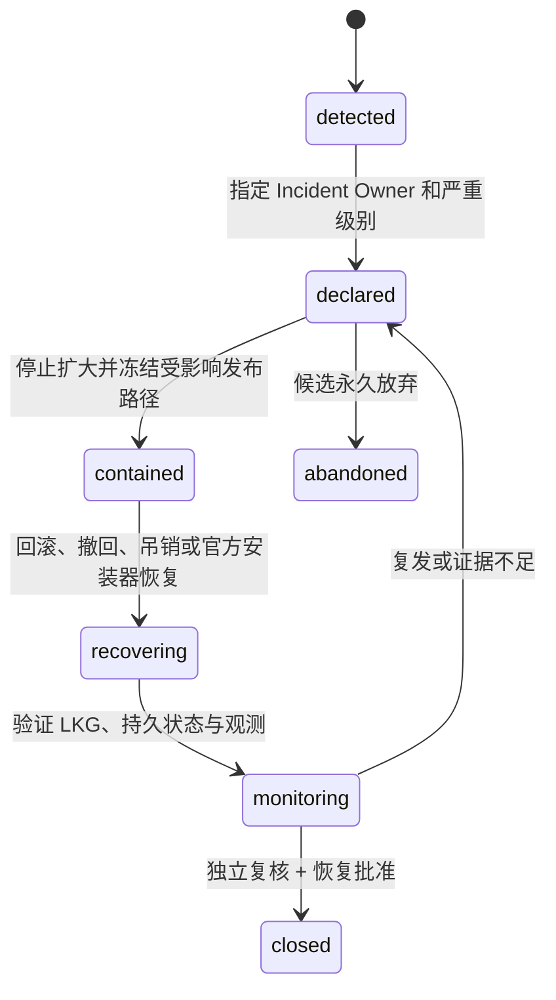

# AgentMesh360 发布事故响应 Runbook v1

状态：P1 E0 基线；已完成本地 tabletop，尚未完成 E1/E2 技术演练或指定生产负责人

本 Runbook 覆盖 Agent Package、AgentMesh360 Desktop 和两者 Combined release。
它固定停止条件、责任角色、证据边界、撤回/吊销/最低版本恢复顺序，不包含生产
endpoint、凭据、联系人、真实 cohort 或可直接执行的生产命令。

事件契约见
[`../architecture/RELEASE_EVENT_SCHEMA_V1.md`](../architecture/RELEASE_EVENT_SCHEMA_V1.md)。

## 1. 责任角色

进入 P2 或任何外部环境前，批准卡必须指定不同责任：

| 角色 | 职责 | 不能做什么 |
| --- | --- | --- |
| Release Owner | 固定范围、版本、窗口、费用和 go/no-go | 不能单独操作 Root ceremony |
| Independent Witness | 见证 ceremony、撤回与恢复演练 | 不能替代 Release Owner 批准扩大 cohort |
| Incident Owner | 宣告事故、冻结发布、协调恢复与关闭 | 不能静默修改证据或降低严重级别 |
| Build Operator | 从固定源码产生可复现候选和摘要 | 不能持有生产 Root/Publisher 私钥 |
| Signer Operator | 只签确定性 request | 不能修改 Artifact、版本、Manifest 或摘要 |
| Canary Operator | 执行批准矩阵并记录非秘密 receipt | 不能扩大 cohort、费用或请求上限 |

P1 文档中的角色仍是占位职责，不代表已有生产人员、轮值或联系方式。

## 2. 严重级别

| 级别 | 示例 | 初始动作 |
| --- | --- | --- |
| SEV-0 | 签名/Root/Publisher 绕过；跨账户访问；秘密或用户内容泄漏；未签名 Desktop 被接受 | 立即停止所有扩大、冻结候选发布、隔离证据、启动最高级调查 |
| SEV-1 | rollback 不可用；未知结果 mutation 被重复；费用超限；静默 Provider fallback；最后良好版本不可启动 | 停止受影响发布链，保留另一条链现状，不自动重试 |
| SEV-2 | 半发布、metadata/LKG/观测不可用、事件重复或时钟异常，但没有信任绕过 | 阻止进入下一阶段，恢复观测或回到已验证状态 |
| SEV-3 | 文档、模板、内部工具或非生产演练缺陷 | 保持当前阶段，修复并重新验证 |

严重级别只能保持或升高，降级必须由 Incident Owner 与 Independent Witness 共同留下
非秘密 receipt。

## 3. 事故状态



`closed` 只表示事故处理闭环，不自动把 Release 恢复为
`production_candidate` 或 `released`。

## 4. 首个十五分钟

1. 记录公开 `releaseId`、`publicVersion`、environment、stage 和已知 gate；
2. 指定 Incident Owner，先按最高合理级别处理；
3. 停止 cohort 扩大、自动更新发布、Registry 发布和新的 Package 安装入口；
4. 不删除或覆盖已发布内容，不修改相同 Registry revision；
5. 只保存 Release Event v1、摘要和 receipt ID；不得复制原始 Header、URL、日志、
   Prompt、用户文件或凭据；
6. 明确受影响链：Package、Desktop、Combined、订阅准入或 Provider 成本；
7. 确认是否存在可验证 LKG 和官方安装器恢复路径；
8. 选择下述 playbook；无法判断时继续保持冻结。

观测系统不可用时，不能把“没有新错误事件”解释为恢复成功。

## 5. Playbook A：Registry 异文、回退或半发布

触发：

- 同 revision 不同文档；
- Registry 引用的不可变对象缺失或摘要不符；
- Registry 先于全部对象可用；
- Trust Bundle 与 Registry sequence/Root 不一致。

动作：

1. 宣告至少 SEV-1；存在签名绕过或替换时升为 SEV-0；
2. 阻止新的 Registry 发布和 cohort 扩大；
3. 客户端只允许继续使用重新验签、未过期的 LKG；
4. LKG 不存在或已过期时失败关闭，不发布“临时无签名修复”；
5. 比较公开 revision、Trust sequence、Release/Artifact 摘要和 receipt ID；
6. 重新上传必须使用新不可变对象；Registry 必须使用更高 revision 最后原子发布；
7. 相同 revision 永远不能原地修补；
8. 完成 rollback/重新发布演练和 Kimi 独立复核后，才能申请解除冻结。

## 6. Playbook B：Publisher key 疑似泄漏或误签

动作：

1. 按 SEV-0 处理，停止该 Publisher 的新安装和更新；
2. Root authority 生成更高 sequence 的 Bundle，把 Publisher 标为 revoked；
3. 不删除旧 key 记录，不重用 key ID，不把 revoked 改回 active；
4. 审计所有由该 key 签名的候选 Release 与 Host bundles；
5. 为可信源码创建新 Publisher key 和全新签名 receipt；
6. 先验证客户端对 revoked key 的失败关闭，再考虑重新发布；
7. 已安装 Agent 的用户数据保持不变；是否允许运行旧版本由独立产品策略决定。

P1 不执行上述 Root 操作；真实流程必须等待 P2 ceremony 和明确批准卡。

## 7. Playbook C：Root key 疑似泄漏

Root compromise 不能只靠旧 Root 签一个“新 Root”解决。

动作：

1. 按 SEV-0 处理，冻结全部 Package Registry 与 cohort；
2. 停止接受旧 Root 下的新 Trust Bundle/Registry；
3. 走预先审核的客户端 Root replacement 与官方安装器恢复路径；
4. 新客户端必须固定新 Root，并明确拒绝旧 Root 的后续文档；
5. 若自动更新信任链也受影响，禁止强制最低版本把旧客户端锁死；
6. 先验证用户可以从官方安装器恢复，再考虑最低版本或重新开放 Package 更新；
7. 旧 Root 销毁、保留取证和公开说明分别记录 receipt。

没有经过 P2/P6 演练的 Root replacement 方案不能在事故中临时设计后直接上线。

## 8. Playbook D：Desktop 更新或最低版本锁死

触发：

- 更新候选未签名、摘要不符或公证失败；
- 更新失败后旧版本不能启动；
- 最低版本高于客户端可安全获得的版本；
- Login Item/Host 状态在升级后失控。

动作：

1. 停止更新和最低版本扩大；
2. 保留最后良好 Desktop 与用户状态，不清理 Session/Registry/Provider Binding；
3. 验证官方安装器可以覆盖修复且不破坏固定 Main Session；
4. 最低版本只能在“安全更新路径 + 官方安装器恢复”都成立后提升；
5. 回退最低版本不能让已知不安全客户端继续执行高风险 Package mutation；
6. 分别验证前台启动、无窗口启动、第二实例、受控 shutdown、强退恢复和卸载；
7. 重新开放前完成签名、公证、升级、rollback 和 Kimi 复核。

## 9. Playbook E：秘密或用户内容进入事件/证据

动作：

1. 按 SEV-0 评估，立即停止传播、上传和 cohort 扩大；
2. 隔离受影响 evidence，不把敏感原文复制到事故文档；
3. 只记录固定错误码、文件类别和非秘密 receipt ID；
4. 确认秘密类型和暴露范围；需要时在原 authority 中轮换/吊销；
5. 清理缓存、临时文件和访问副本必须保留合法取证边界；
6. 修复源采集和验证器，加入只含 synthetic sentinel 的回归测试；
7. 独立复核确认仓库、历史、日志、截图与制品不含真实秘密后再恢复。

## 10. Playbook F：订阅或 BYOK canary 失控

触发：

- 无效订阅仍可进入工作区；
- Provider 被静默切换；
- 请求、credits 或费用超过批准卡；
- 401/429/5xx 被未知结果自动重试。

动作：

1. 停止 canary 和新的模型请求；
2. 保留 Agent Registry/Main Session，不删除用户持久状态；
3. 撤销 canary 专用凭据并记录非秘密 receipt；
4. 核对批准的 Provider、模型、请求/credits/cost 上限与实际固定计数；
5. 未知结果不能自动重试，不用 AgentMesh360 credits 补偿 BYOK 费用；
6. 修复后必须使用新的精确批准卡重新开始。

## 11. 观测故障策略

| 故障 | 失败策略 |
| --- | --- |
| 事件缺失 | 当前阶段不前进；重新从 authority 生成非秘密 receipt |
| 重复 `eventId` | 拒绝证据包；原事件不可覆盖 |
| 同事件不同内容 | 视为 equivocation，至少 SEV-1 |
| 时间倒退/非法 UTC | 拒绝事件；不参与发布顺序判断 |
| 存储不可用 | 停止发布和 canary，不在本地随意暂存敏感日志 |
| 扫描器不可用 | 证据不得进入审查或发布决策 |
| Kimi/独立复核不可用 | 轮次保持未完成，不能用自主测试代替 |

## 12. 恢复与解除冻结

必须同时满足：

- 触发原因已通过可复现测试关闭；
- rollback、撤回或吊销路径实际执行；
- LKG/官方安装器恢复与用户持久状态已验证；
- 事件和证据通过完整验证，不含秘密/用户内容；
- 主 Agent 与 Kimi 的实际检查范围分别记录且四级全零；
- Release Owner 与 Incident Owner 使用新 receipt 批准恢复；
- 恢复只回到事故前一个已验证阶段，不自动进入下一阶段。

## 13. 对外状态模板

```text
AgentMesh360 已暂停受影响版本的扩大范围。
现有用户数据不会因本次暂停被主动删除。
我们正在验证恢复与回滚路径；在证据完成前不会重新开放。
下一次更新将在状态发生可验证变化后发布。
```

不得公开 key ID、内部设备、账户、Provider、请求内容、错误原文或可利用的时序细节。

## 14. 演练要求

P1 完成一个 E0 tabletop，验证 Runbook 能在无 production authority 情况下：

- 正确停止扩大范围；
- 区分 Publisher 与 Root compromise；
- 保留 LKG 和用户持久状态；
- 避免最低版本锁死；
- 只记录 Release Event v1；
- 明确哪些恢复步骤必须等待后续批准。

E1/E2 技术演练必须真实执行 Registry freeze/rollback、key rotation/revocation、
Desktop recovery 和观测故障，不得用 P1 tabletop 代替。
